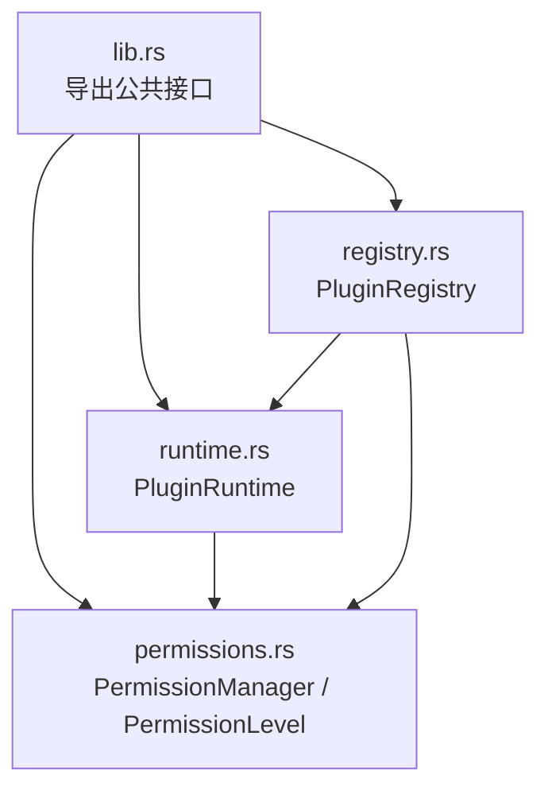
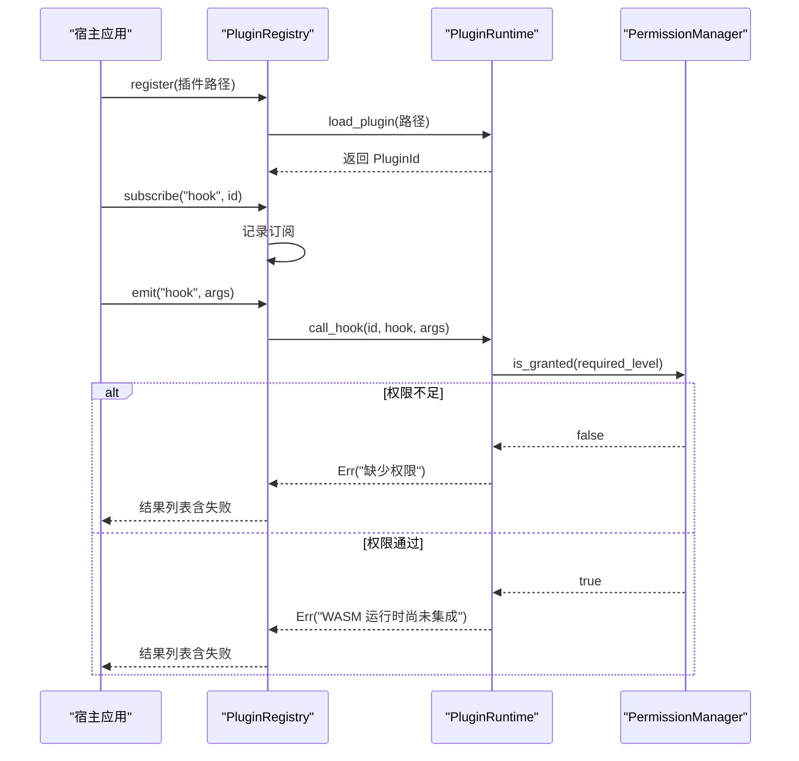
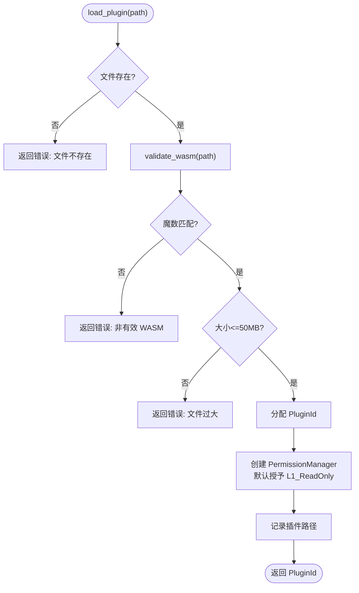
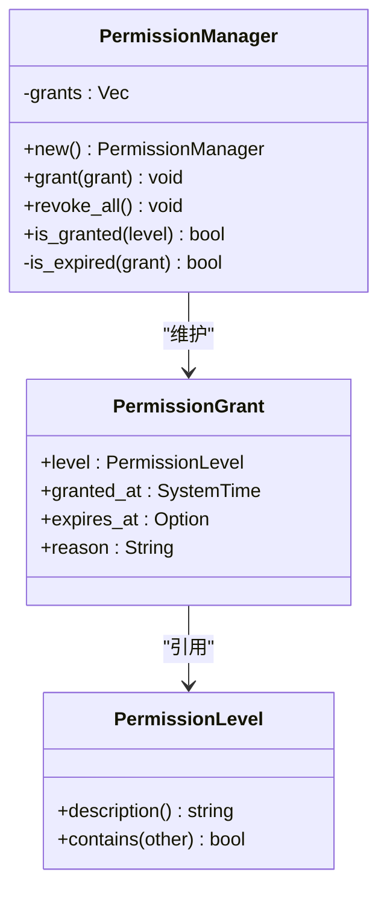
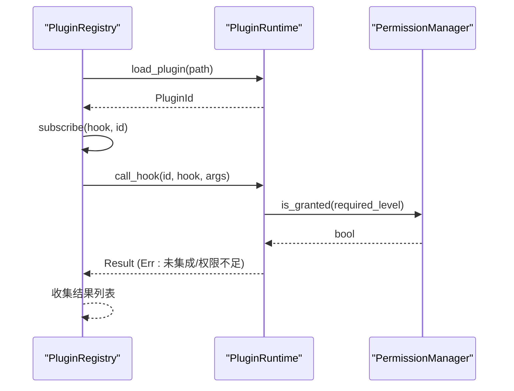
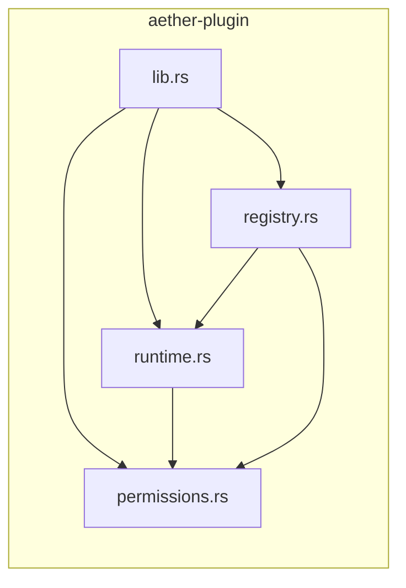
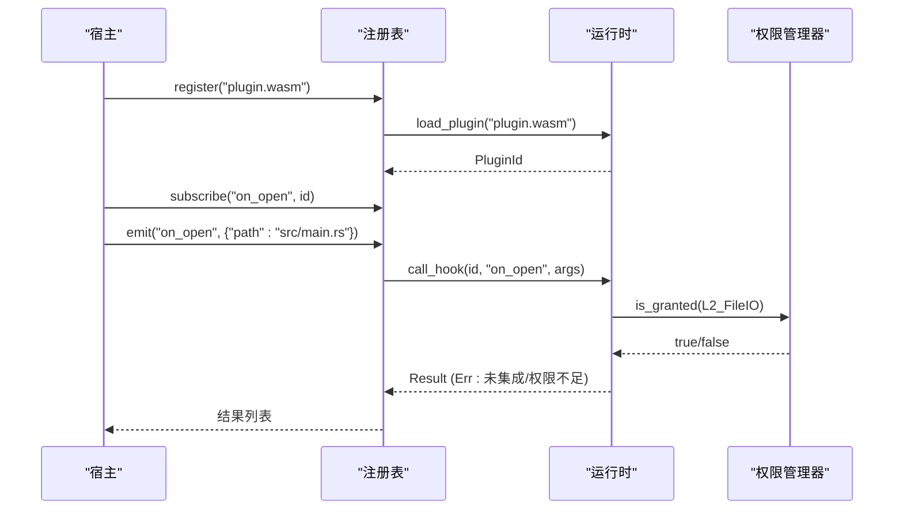

# 插件运行时环境

<cite>
**本文引用的文件**
- [crates/aether-plugin/src/lib.rs](file://crates/aether-plugin/src/lib.rs)
- [crates/aether-plugin/src/runtime.rs](file://crates/aether-plugin/src/runtime.rs)
- [crates/aether-plugin/src/permissions.rs](file://crates/aether-plugin/src/permissions.rs)
- [crates/aether-plugin/src/registry.rs](file://crates/aether-plugin/src/registry.rs)
- [crates/aether-plugin/Cargo.toml](file://crates/aether-plugin/Cargo.toml)
</cite>

## 目录
1. [简介](#简介)
2. [项目结构](#项目结构)
3. [核心组件](#核心组件)
4. [架构总览](#架构总览)
5. [详细组件分析](#详细组件分析)
6. [依赖关系分析](#依赖关系分析)
7. [性能与资源管理](#性能与资源管理)
8. [故障排查指南](#故障排查指南)
9. [结论](#结论)
10. [附录：宿主通信与数据交换示例](#附录宿主通信与数据交换示例)

## 简介
本文件面向“插件运行时环境”的完整说明，聚焦 WASM 插件的加载机制、沙箱安全模型、生命周期管理与运行时优化策略。当前实现为架构占位阶段：已完成插件文件的解析与校验、权限模型与最小权限默认授予、插件注册表与事件钩子分发；WASM 引擎（如 wasmtime）尚未集成，因此实际函数调用在权限通过后返回明确的“未集成”错误，避免误判执行成功。

## 项目结构
aether-plugin 模块由四个核心源文件组成：
- lib.rs：对外暴露公共类型与模块入口
- runtime.rs：插件运行时核心，负责 WASM 文件验证、加载、卸载、权限检查与钩子调用
- permissions.rs：权限级别定义、授权记录与权限管理器
- registry.rs：插件注册表，维护已加载插件元数据、订阅与事件发射

**图表来源**
- [crates/aether-plugin/src/lib.rs:1-8](file://crates/aether-plugin/src/lib.rs#L1-L8)
- [crates/aether-plugin/src/runtime.rs:16-21](file://crates/aether-plugin/src/runtime.rs#L16-L21)
- [crates/aether-plugin/src/permissions.rs:1-13](file://crates/aether-plugin/src/permissions.rs#L1-L13)
- [crates/aether-plugin/src/registry.rs:17-23](file://crates/aether-plugin/src/registry.rs#L17-L23)

**章节来源**
- [crates/aether-plugin/src/lib.rs:1-8](file://crates/aether-plugin/src/lib.rs#L1-L8)
- [crates/aether-plugin/src/runtime.rs:16-21](file://crates/aether-plugin/src/runtime.rs#L16-L21)
- [crates/aether-plugin/src/permissions.rs:1-13](file://crates/aether-plugin/src/permissions.rs#L1-L13)
- [crates/aether-plugin/src/registry.rs:17-23](file://crates/aether-plugin/src/registry.rs#L17-L23)

## 核心组件
- PluginId：唯一标识每个已加载插件
- PluginRuntime：插件运行时，负责：
  - WASM 文件存在性、魔数与大小校验
  - 分配并管理插件 ID
  - 为每个插件维护独立权限管理器
  - 根据钩子名称映射所需权限级别
  - 调用钩子（当前为占位，权限通过即返回“未集成”错误）
- PermissionLevel：四级权限模型（只读 UI、文件 IO、网络访问、系统命令）
- PermissionManager：维护授权记录，支持授予、撤销、过期检查与层级包含判断
- PluginRegistry：插件注册表，封装注册、注销、订阅与事件发射，统一调用运行时

**章节来源**
- [crates/aether-plugin/src/runtime.rs:9-21](file://crates/aether-plugin/src/runtime.rs#L9-L21)
- [crates/aether-plugin/src/runtime.rs:33-181](file://crates/aether-plugin/src/runtime.rs#L33-L181)
- [crates/aether-plugin/src/permissions.rs:1-94](file://crates/aether-plugin/src/permissions.rs#L1-L94)
- [crates/aether-plugin/src/registry.rs:6-23](file://crates/aether-plugin/src/registry.rs#L6-L23)

## 架构总览
下图展示了从宿主到插件运行时的调用路径，以及权限检查与事件分发流程。

**图表来源**
- [crates/aether-plugin/src/registry.rs:34-91](file://crates/aether-plugin/src/registry.rs#L34-L91)
- [crates/aether-plugin/src/runtime.rs:60-181](file://crates/aether-plugin/src/runtime.rs#L60-L181)
- [crates/aether-plugin/src/permissions.rs:67-94](file://crates/aether-plugin/src/permissions.rs#L67-L94)

## 详细组件分析

### 插件运行时（PluginRuntime）
- 文件解析与验证
  - 检查文件是否存在
  - 读取前 4 字节魔数并与 WASM 魔数对比
  - 限制最大文件大小（50MB），防止恶意大文件
- 加载与初始化
  - 分配递增的 PluginId，处理溢出保护
  - 为每个插件创建独立的 PermissionManager，并默认授予 L1_ReadOnly 基础权限
- 钩子调用与权限控制
  - 根据钩子名映射所需权限级别（例如 on_save → L2_FileIO，fetch → L3_Network，exec → L4_System）
  - 若权限不足则拒绝；若权限通过但 WASM 引擎未集成，返回明确错误
- 卸载与清理
  - 移除插件与对应权限管理器

**图表来源**
- [crates/aether-plugin/src/runtime.rs:33-87](file://crates/aether-plugin/src/runtime.rs#L33-L87)

**章节来源**
- [crates/aether-plugin/src/runtime.rs:33-181](file://crates/aether-plugin/src/runtime.rs#L33-L181)

### 权限模型（PermissionLevel & PermissionManager）
- 权限级别
  - L1_ReadOnly：只读 UI 访问
  - L2_FileIO：文件读写
  - L3_Network：网络访问
  - L4_System：系统命令执行
- 层级包含
  - L4 包含所有权限；L3 包含 L3/L2/L1；L2 包含 L2/L1；L1 仅包含自身
- 授权记录
  - 记录授予时间、可选过期时间与原因
  - 过期检查：若 expires_at 为过去或 granted_at 为未来，视为无效
- 管理器能力
  - grant：追加授权记录
  - revoke_all：清空所有授权
  - is_granted：按层级包含与过期状态判定是否具备某权限

**图表来源**
- [crates/aether-plugin/src/permissions.rs:1-94](file://crates/aether-plugin/src/permissions.rs#L1-L94)

**章节来源**
- [crates/aether-plugin/src/permissions.rs:1-94](file://crates/aether-plugin/src/permissions.rs#L1-L94)

### 插件注册表（PluginRegistry）
- 注册与元数据
  - 调用运行时加载插件，生成默认元数据（名称、版本、描述、作者、权限管理器）
- 订阅与事件
  - 维护 hook → plugin_id 列表
  - emit 时遍历订阅者，逐个调用运行时 call_hook，收集结果
- 注销与清理
  - 卸载插件并从所有钩子中移除订阅

**图表来源**
- [crates/aether-plugin/src/registry.rs:34-91](file://crates/aether-plugin/src/registry.rs#L34-L91)
- [crates/aether-plugin/src/runtime.rs:127-181](file://crates/aether-plugin/src/runtime.rs#L127-L181)
- [crates/aether-plugin/src/permissions.rs:67-94](file://crates/aether-plugin/src/permissions.rs#L67-L94)

**章节来源**
- [crates/aether-plugin/src/registry.rs:6-108](file://crates/aether-plugin/src/registry.rs#L6-L108)

## 依赖关系分析
- 内部依赖
  - runtime 依赖 permissions（权限模型与管理器）
  - registry 依赖 runtime 与 permissions（注册表组合运行时与权限）
- 外部依赖
  - serde、serde_json：用于序列化参数与返回值（JSON）
  - 标准库：文件系统、时间、集合等

**图表来源**
- [crates/aether-plugin/src/lib.rs:1-8](file://crates/aether-plugin/src/lib.rs#L1-L8)
- [crates/aether-plugin/src/runtime.rs:1-5](file://crates/aether-plugin/src/runtime.rs#L1-L5)
- [crates/aether-plugin/src/registry.rs:1-5](file://crates/aether-plugin/src/registry.rs#L1-L5)

**章节来源**
- [crates/aether-plugin/Cargo.toml:6-9](file://crates/aether-plugin/Cargo.toml#L6-L9)
- [crates/aether-plugin/src/runtime.rs:1-5](file://crates/aether-plugin/src/runtime.rs#L1-L5)
- [crates/aether-plugin/src/registry.rs:1-5](file://crates/aether-plugin/src/registry.rs#L1-L5)

## 性能与资源管理
- 插件文件大小限制
  - 最大 50MB，防止内存与 I/O 压力
- 插件 ID 管理
  - 使用 u32 自增 ID，提供溢出保护
- 权限检查开销
  - 每次钩子调用进行权限判定，复杂度 O(n) 授权记录扫描；可通过索引化或分桶优化
- 资源释放
  - 卸载插件时同时移除权限管理器，避免悬挂引用
- 扩展建议（待集成 WASM 引擎后）
  - 为每个插件分配独立内存空间与线程池配额
  - 引入超时与步进执行，避免长时间阻塞主循环
  - 对网络与文件 I/O 进行节流与白名单控制

[本节为通用指导，不直接分析具体文件]

## 故障排查指南
- 常见错误
  - 文件不存在：检查路径是否正确
  - 非有效 WASM：确认文件头魔数是否为 \0asm
  - 文件过大：压缩或拆分插件体积
  - 权限不足：为插件授予相应权限级别
  - WASM 未集成：当前阶段会返回“未集成”错误，需后续集成引擎
- 定位方法
  - 查看 emit/call_hook 返回的错误信息
  - 检查权限管理器中的授权记录与过期时间
  - 使用 list_plugins 与 plugin_count 监控状态

**章节来源**
- [crates/aether-plugin/src/runtime.rs:60-181](file://crates/aether-plugin/src/runtime.rs#L60-L181)
- [crates/aether-plugin/src/permissions.rs:67-94](file://crates/aether-plugin/src/permissions.rs#L67-L94)
- [crates/aether-plugin/src/registry.rs:76-101](file://crates/aether-plugin/src/registry.rs#L76-L101)

## 结论
当前 aether-plugin 实现了插件运行的基础骨架：安全的文件校验、严格的权限模型、清晰的注册表与事件分发。由于 WASM 引擎尚未集成，实际钩子调用处于“权限通过即返回未集成错误”的占位阶段。下一步应重点集成 Wasmtime 或其他 WASM 运行时，完善内存隔离、系统调用限制与网络访问控制，以实现完整的沙箱执行环境。

[本节为总结性内容，不直接分析具体文件]

## 附录：宿主通信与数据交换示例
以下示例展示如何通过注册表与运行时进行插件通信与数据交换（基于 JSON 参数）。

- 注册插件并获取 ID
  - 调用注册表的 register(path)，返回 PluginId
  - 参考路径：[crates/aether-plugin/src/registry.rs:34-54](file://crates/aether-plugin/src/registry.rs#L34-L54)

- 订阅钩子
  - 调用 subscribe("hook", id) 将插件订阅到指定事件
  - 参考路径：[crates/aether-plugin/src/registry.rs:67-73](file://crates/aether-plugin/src/registry.rs#L67-L73)

- 触发事件并接收结果
  - 调用 emit("hook", args) 向所有订阅者发送事件，返回每个插件的执行结果
  - 参考路径：[crates/aether-plugin/src/registry.rs:76-91](file://crates/aether-plugin/src/registry.rs#L76-L91)

- 权限授予
  - 根据钩子需求，调用运行时 grant_permission(id, level, reason, expires_at)
  - 参考路径：[crates/aether-plugin/src/runtime.rs:95-118](file://crates/aether-plugin/src/runtime.rs#L95-L118)

- 钩子调用与权限检查
  - 运行时根据钩子名确定所需权限级别，并进行检查
  - 参考路径：[crates/aether-plugin/src/runtime.rs:127-181](file://crates/aether-plugin/src/runtime.rs#L127-L181)

- 卸载插件
  - 调用 unregister(id) 完成清理
  - 参考路径：[crates/aether-plugin/src/registry.rs:56-65](file://crates/aether-plugin/src/registry.rs#L56-L65)

**图表来源**
- [crates/aether-plugin/src/registry.rs:34-91](file://crates/aether-plugin/src/registry.rs#L34-L91)
- [crates/aether-plugin/src/runtime.rs:95-181](file://crates/aether-plugin/src/runtime.rs#L95-L181)
- [crates/aether-plugin/src/permissions.rs:67-94](file://crates/aether-plugin/src/permissions.rs#L67-L94)