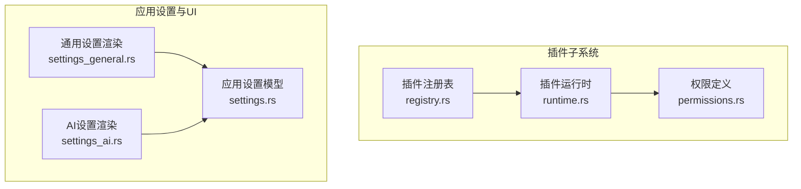
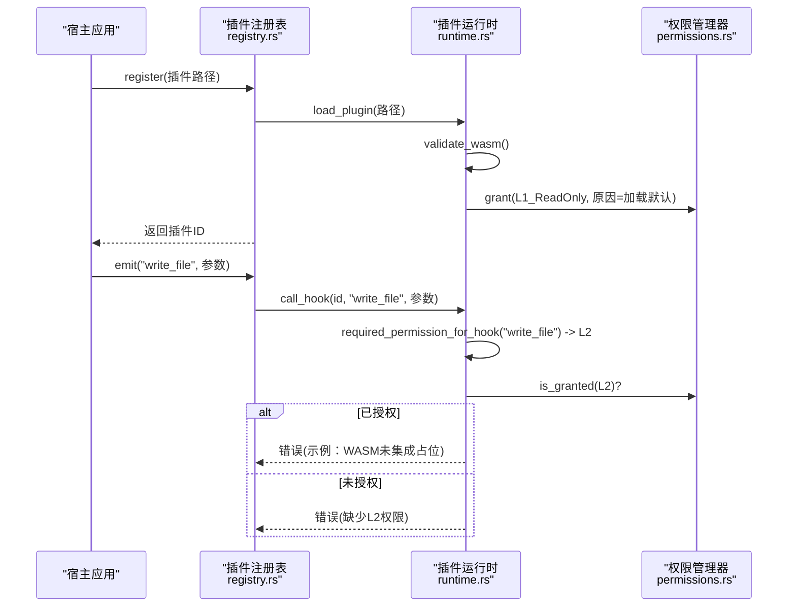
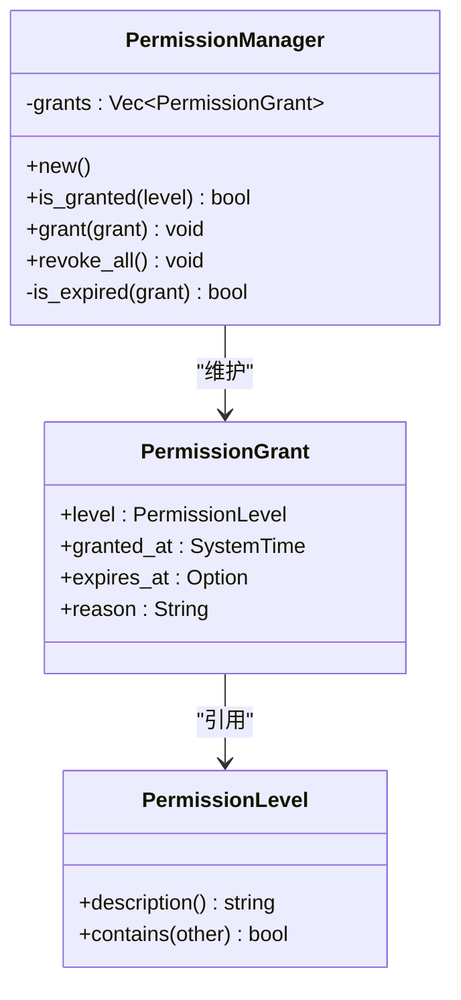
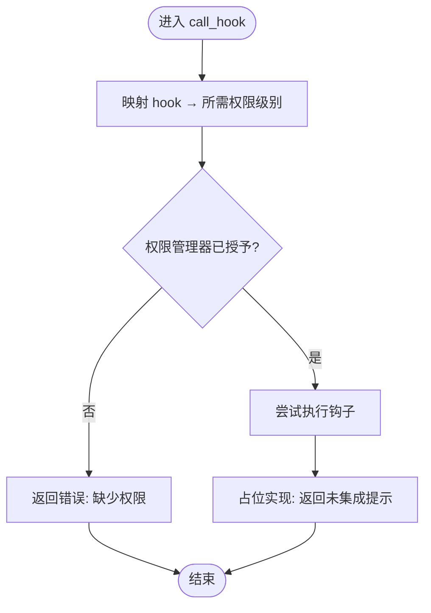
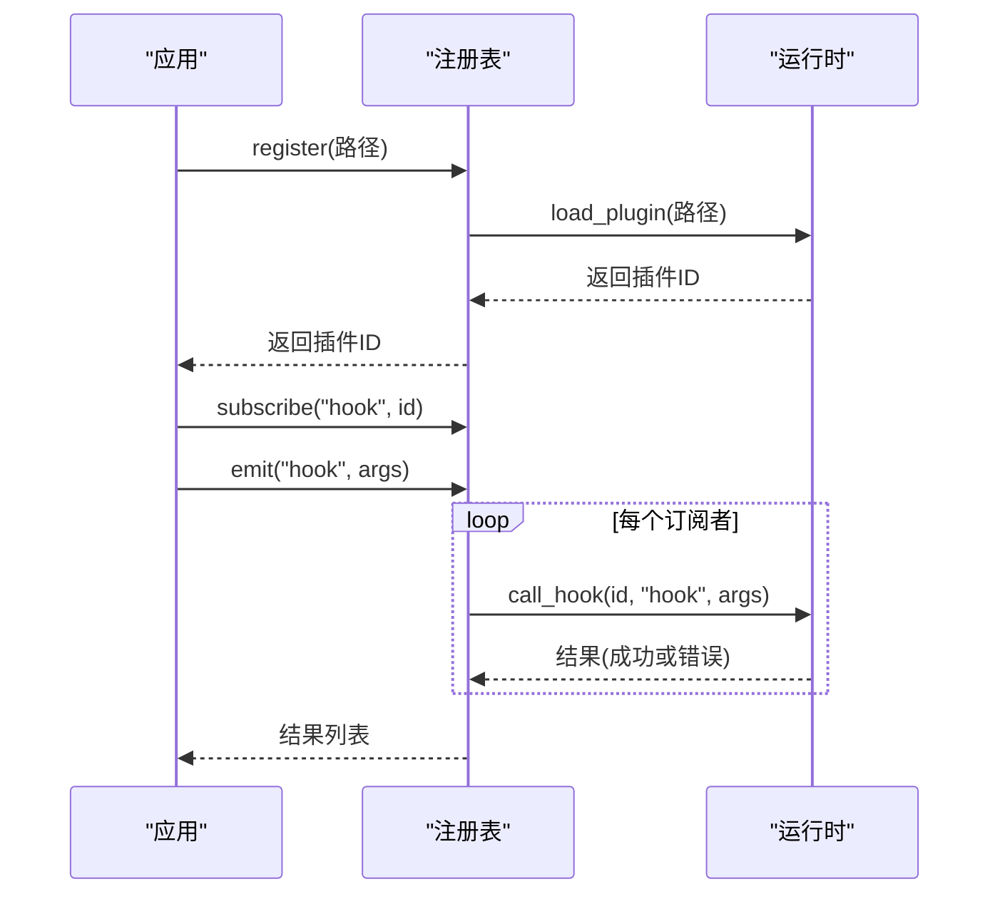
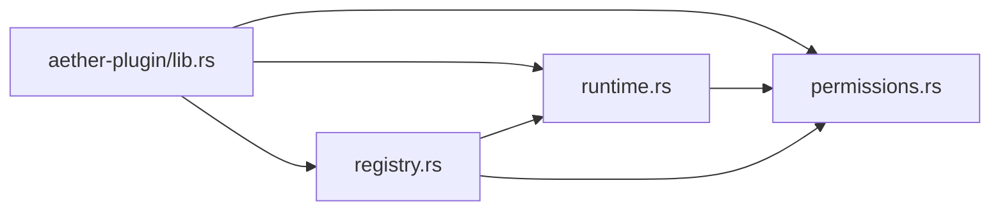

# 权限控制系统

<cite>
**本文引用的文件**
- [permissions.rs](file://crates/aether-plugin/src/permissions.rs)
- [runtime.rs](file://crates/aether-plugin/src/runtime.rs)
- [registry.rs](file://crates/aether-plugin/src/registry.rs)
- [lib.rs](file://crates/aether-plugin/src/lib.rs)
- [settings.rs](file://crates/aether-shared/src/settings.rs)
- [settings_general.rs](file://crates/aether-win32/src/render/settings_general.rs)
- [settings_ai.rs](file://crates/aether-win32/src/render/settings_ai.rs)
</cite>

## 目录
1. [简介](#简介)
2. [项目结构](#项目结构)
3. [核心组件](#核心组件)
4. [架构总览](#架构总览)
5. [详细组件分析](#详细组件分析)
6. [依赖关系分析](#依赖关系分析)
7. [性能与安全考量](#性能与安全考量)
8. [故障排查指南](#故障排查指南)
9. [结论](#结论)
10. [附录](#附录)

## 简介
本文件系统性地梳理并文档化插件权限控制体系，覆盖细粒度权限模型、权限声明与运行时检查、拒绝处理与错误恢复、以及配置与管理界面的设计要点。该权限系统围绕“最小权限”原则，为插件提供基于资源类型的分级访问控制：只读 UI、文件读写、网络访问、系统命令执行等。通过“加载即默认低权 + 按需授予 + 可过期撤销”的机制，确保插件在受限沙箱内安全运行。

## 项目结构
权限相关代码集中在 aether-plugin 子crate中，由三个核心模块组成：
- 权限定义与管理：permissions.rs
- 插件运行时与钩子调用：runtime.rs
- 插件注册与事件分发：registry.rs

此外，设置与界面层提供了配置入口（settings.rs）和渲染逻辑（settings_general.rs、settings_ai.rs），用于展示和管理插件权限策略。

**图表来源**
- [permissions.rs:1-100](file://crates/aether-plugin/src/permissions.rs#L1-L100)
- [runtime.rs:1-180](file://crates/aether-plugin/src/runtime.rs#L1-L180)
- [registry.rs:1-108](file://crates/aether-plugin/src/registry.rs#L1-L108)
- [settings.rs:329-560](file://crates/aether-shared/src/settings.rs#L329-L560)
- [settings_general.rs:379-800](file://crates/aether-win32/src/render/settings_general.rs#L379-L800)
- [settings_ai.rs:254-800](file://crates/aether-win32/src/render/settings_ai.rs#L254-L800)

**章节来源**
- [lib.rs:1-8](file://crates/aether-plugin/src/lib.rs#L1-L8)
- [permissions.rs:1-100](file://crates/aether-plugin/src/permissions.rs#L1-L100)
- [runtime.rs:1-180](file://crates/aether-plugin/src/runtime.rs#L1-L180)
- [registry.rs:1-108](file://crates/aether-plugin/src/registry.rs#L1-L108)

## 核心组件
- 权限级别与包含关系：定义 L1_ReadOnly、L2_FileIO、L3_Network、L4_System，并提供层级包含判断。
- 权限授予记录：记录授予级别、授予时间、可选过期时间与原因。
- 权限管理器：维护一组授予记录，支持授予、撤销、过期校验与查询。
- 插件运行时：负责插件加载、默认权限授予、按钩子类型进行权限检查、调用生命周期钩子。
- 插件注册表：管理插件元数据、订阅与事件分发，并在触发钩子时统一走运行时权限检查。

**章节来源**
- [permissions.rs:1-100](file://crates/aether-plugin/src/permissions.rs#L1-L100)
- [runtime.rs:23-180](file://crates/aether-plugin/src/runtime.rs#L23-L180)
- [registry.rs:6-108](file://crates/aether-plugin/src/registry.rs#L6-L108)

## 架构总览
权限控制贯穿插件生命周期：
- 加载阶段：验证 WASM 格式与大小，分配唯一 ID，并为新插件授予最低权限（L1_ReadOnly）。
- 运行时：根据钩子名称映射到所需权限级别，若未满足则拒绝执行并返回明确错误。
- 授权管理：支持动态授予更高权限（带过期时间）、撤销全部权限。
- 事件分发：注册表在 emit 时遍历订阅者，逐个调用运行时钩子，统一进行权限检查。

**图表来源**
- [runtime.rs:59-180](file://crates/aether-plugin/src/runtime.rs#L59-L180)
- [registry.rs:34-91](file://crates/aether-plugin/src/registry.rs#L34-L91)
- [permissions.rs:62-94](file://crates/aether-plugin/src/permissions.rs#L62-L94)

## 详细组件分析

### 权限级别与包含关系
- 级别定义：L1 只读 UI 访问；L2 文件读写；L3 网络访问；L4 系统命令执行。
- 包含规则：L4 包含所有；L3 包含 L3/L2/L1；L2 包含 L2/L1；L1 仅包含自身。采用显式匹配避免枚举重排导致静默破坏。
- 描述方法：提供人类可读的描述文本，便于界面显示与日志输出。

**图表来源**
- [permissions.rs:1-100](file://crates/aether-plugin/src/permissions.rs#L1-L100)

**章节来源**
- [permissions.rs:1-100](file://crates/aether-plugin/src/permissions.rs#L1-L100)

### 插件运行时与钩子权限检查
- 加载流程：校验 WASM 魔数与大小限制，分配唯一 ID，插入插件路径，创建权限管理器并授予 L1_ReadOnly。
- 钩子权限映射：根据 hook 名称确定所需权限级别（如 on_save/write_file → L2；fetch/http_request/websocket → L3；exec/spawn/shell/run_command → L4；未知默认 L1）。
- 调用流程：call_hook 先计算所需权限，再查询权限管理器是否已授予且未过期；未满足则返回错误；满足后继续执行（当前为占位实现，返回“WASM未集成”提示）。
- 授权与撤销：grant_permission 支持设置过期时间并拒绝过去时间；revoke_all_permissions 清空某插件的所有权限。

**图表来源**
- [runtime.rs:127-180](file://crates/aether-plugin/src/runtime.rs#L127-L180)

**章节来源**
- [runtime.rs:59-180](file://crates/aether-plugin/src/runtime.rs#L59-L180)

### 插件注册表与事件分发
- 注册：register 调用运行时加载插件，并创建默认元数据（名称、版本、描述、作者、权限管理器）。
- 卸载：unregister 从运行时移除插件，并从所有钩子订阅列表中清理该插件。
- 订阅与触发：subscribe 将插件加入指定钩子的订阅列表；emit 遍历订阅者，逐个调用运行时 call_hook，收集结果。

**图表来源**
- [registry.rs:34-91](file://crates/aether-plugin/src/registry.rs#L34-L91)
- [runtime.rs:127-180](file://crates/aether-plugin/src/runtime.rs#L127-L180)

**章节来源**
- [registry.rs:6-108](file://crates/aether-plugin/src/registry.rs#L6-L108)

### 权限配置与管理界面设计
- 设置模型：settings.rs 定义了应用级设置结构，包括 AI、UI、远程、自动保存、更新等模块，并提供持久化与加密存储（API Key）。
- 设置面板渲染：settings_general.rs 实现了设置侧边栏与内容区布局，支持分组卡片、行项、徽章状态显示与空态占位。
- AI 设置渲染：settings_ai.rs 提供滑块、开关、输入框、下拉选择等控件，用于配置模型与接口参数，具备焦点、有效性反馈与滚动裁剪。

虽然当前权限管理尚未直接暴露于设置界面，但上述 UI 框架可作为扩展点，未来可在“通用/高级”设置页增加“插件权限管理”标签，展示各插件已授予权限、过期时间、撤销按钮等。

**章节来源**
- [settings.rs:329-560](file://crates/aether-shared/src/settings.rs#L329-L560)
- [settings_general.rs:379-800](file://crates/aether-win32/src/render/settings_general.rs#L379-L800)
- [settings_ai.rs:254-800](file://crates/aether-win32/src/render/settings_ai.rs#L254-L800)

## 依赖关系分析
- 模块耦合：
  - runtime.rs 依赖 permissions.rs 的权限级别与管理器。
  - registry.rs 依赖 runtime.rs 与 permissions.rs，封装插件生命周期与事件分发。
  - lib.rs 作为 crate 对外导出权限类型、注册表与运行时类型。
- 外部依赖：
  - 当前运行时使用 serde_json 传递钩子参数（占位实现）。
  - 设置与 UI 层使用 Direct2D/DirectWrite 渲染。

**图表来源**
- [lib.rs:1-8](file://crates/aether-plugin/src/lib.rs#L1-L8)
- [runtime.rs:1-180](file://crates/aether-plugin/src/runtime.rs#L1-L180)
- [registry.rs:1-108](file://crates/aether-plugin/src/registry.rs#L1-L108)
- [permissions.rs:1-100](file://crates/aether-plugin/src/permissions.rs#L1-L100)

**章节来源**
- [lib.rs:1-8](file://crates/aether-plugin/src/lib.rs#L1-L8)
- [runtime.rs:1-180](file://crates/aether-plugin/src/runtime.rs#L1-L180)
- [registry.rs:1-108](file://crates/aether-plugin/src/registry.rs#L1-L108)
- [permissions.rs:1-100](file://crates/aether-plugin/src/permissions.rs#L1-L100)

## 性能与安全考量
- 性能：
  - 权限检查为 O(n) 遍历授予记录，n 通常为较小常数；可通过缓存最近检查结果进一步优化高频钩子。
  - 插件加载时对 WASM 文件进行头部读取与大小校验，避免大文件或非法文件带来的资源消耗。
- 安全：
  - 默认最小权限：新插件仅拥有 L1_ReadOnly，需显式提升。
  - 过期控制：支持 expires_at，防止“永久有效”的高危权限；同时拒绝过去时间的过期时间。
  - 拒绝与回退：未授权时返回明确错误，避免误判执行成功；未知钩子默认要求 L1，遵循最安全默认。
  - 撤销能力：支持一次性撤销某插件的全部权限，便于紧急处置。

[本节为通用指导，不直接分析具体文件]

## 故障排查指南
- 常见问题与定位：
  - “插件未加载”：调用 call_hook 前需确保插件已成功 register/load。
  - “缺少执行所需的权限”：检查对应钩子映射的权限级别，并通过 grant_permission 授予相应级别。
  - “WASM 运行时尚未集成”：当前为占位实现，实际钩子执行需接入 wasmtime；不影响权限检查逻辑。
  - “插件文件过大/无效格式”：load_plugin 会校验文件大小与 WASM 魔数，确保合规。
- 建议步骤：
  - 查看插件 ID 与权限管理器状态，确认是否已授予所需权限且未过期。
  - 对高危操作（L3/L4）启用短期过期与审计原因记录。
  - 在测试环境中逐步放开权限，观察行为与错误信息。

**章节来源**
- [runtime.rs:59-180](file://crates/aether-plugin/src/runtime.rs#L59-L180)
- [permissions.rs:62-94](file://crates/aether-plugin/src/permissions.rs#L62-L94)

## 结论
该权限控制系统以“最小权限、分层授权、可过期撤销”为核心，结合插件运行时与注册表的协作，实现了细粒度的资源访问控制。通过明确的权限级别与钩子映射，系统在保障安全的同时兼顾可扩展性。后续可在设置界面中集成权限管理功能，提供更直观的授权与监控体验。

[本节为总结性内容，不直接分析具体文件]

## 附录

### 权限级别与典型场景
- L1 只读 UI 访问：适用于主题、语言信息等只读钩子（on_activate/on_deactivate/get_theme/get_language）。
- L2 文件读写：适用于文件操作钩子（on_save/on_open/read_file/write_file）。
- L3 网络访问：适用于网络请求钩子（fetch/http_request/websocket）。
- L4 系统命令执行：适用于系统命令钩子（exec/spawn/shell/run_command）。

**章节来源**
- [runtime.rs:159-175](file://crates/aether-plugin/src/runtime.rs#L159-L175)

### 插件清单与权限声明（概念说明）
- 当前仓库未提供插件清单文件的解析逻辑；权限级别由运行时根据钩子名称映射决定。
- 建议在插件包中附带清单文件，声明所需权限级别与用途，供安装与审核流程参考。

[本节为概念性说明，不直接分析具体文件]

### 最佳实践与安全建议
- 始终从 L1 开始，按需提升权限；避免一开始就授予 L4。
- 为高敏感权限设置较短的过期时间，并在业务完成后及时撤销。
- 记录每次授权的 reason，便于审计与回溯。
- 在 UI 中清晰展示权限状态与过期时间，提供一键撤销能力。
- 对未知钩子保持默认 L1，降低风险面。

[本节为通用指导，不直接分析具体文件]