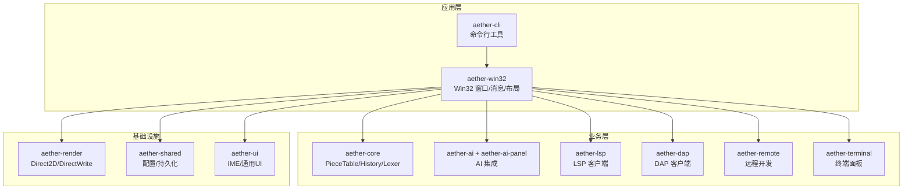
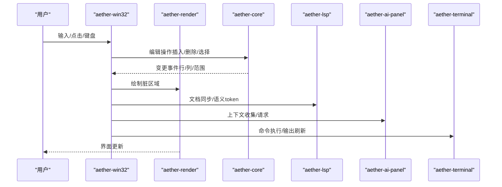
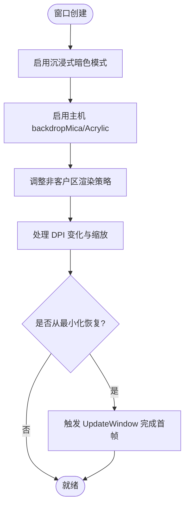
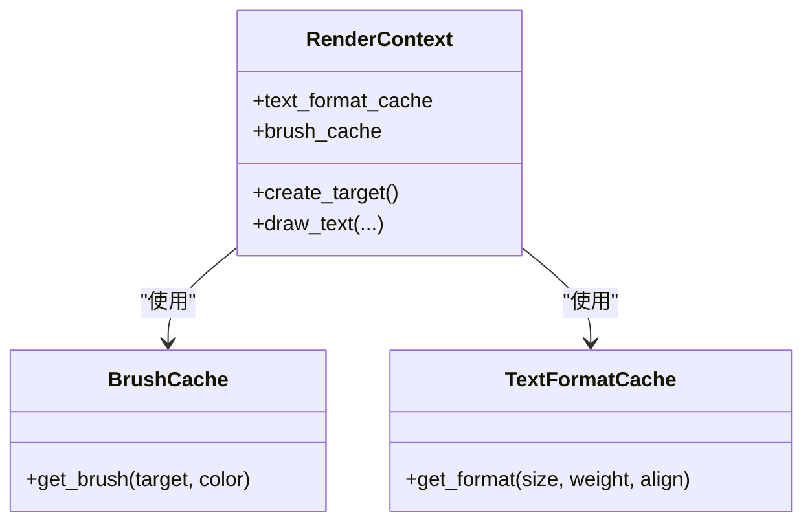
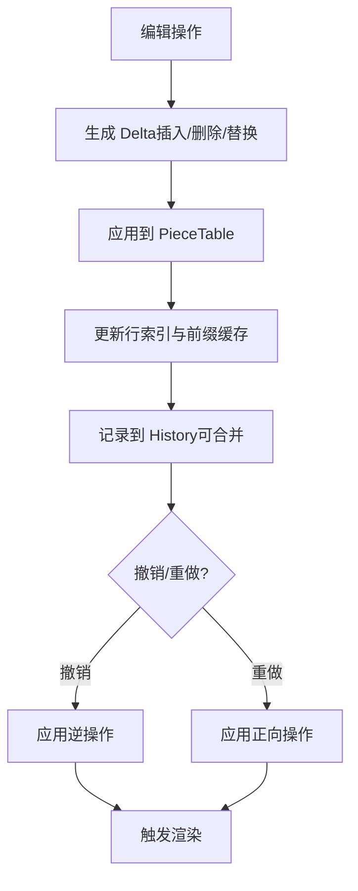
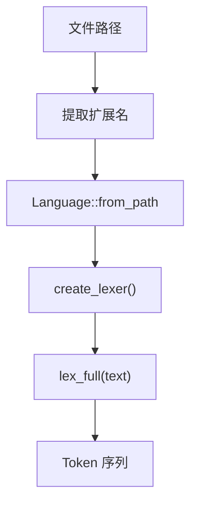
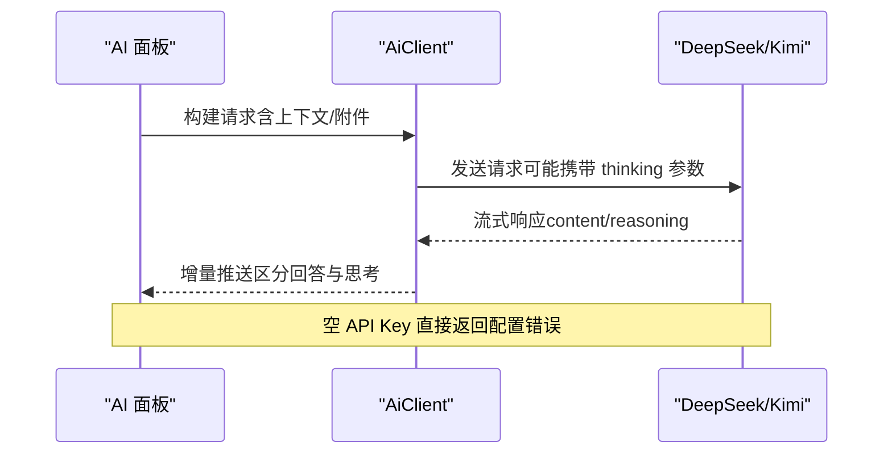
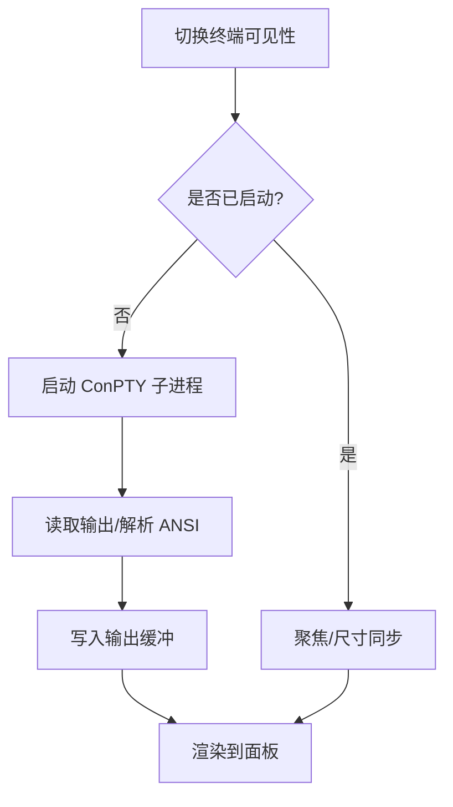
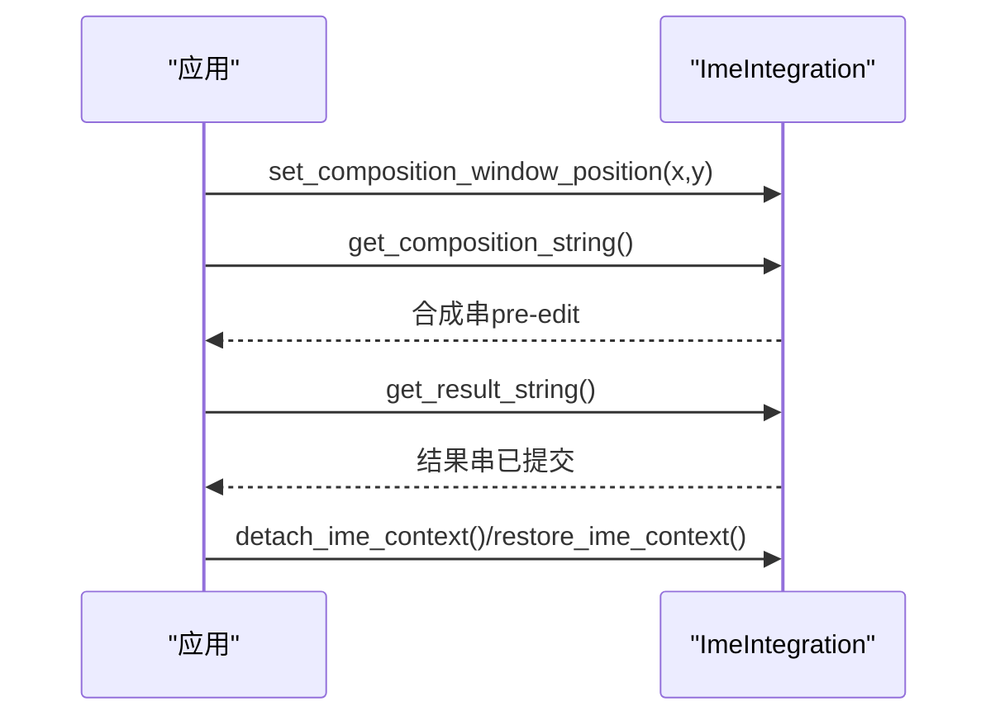
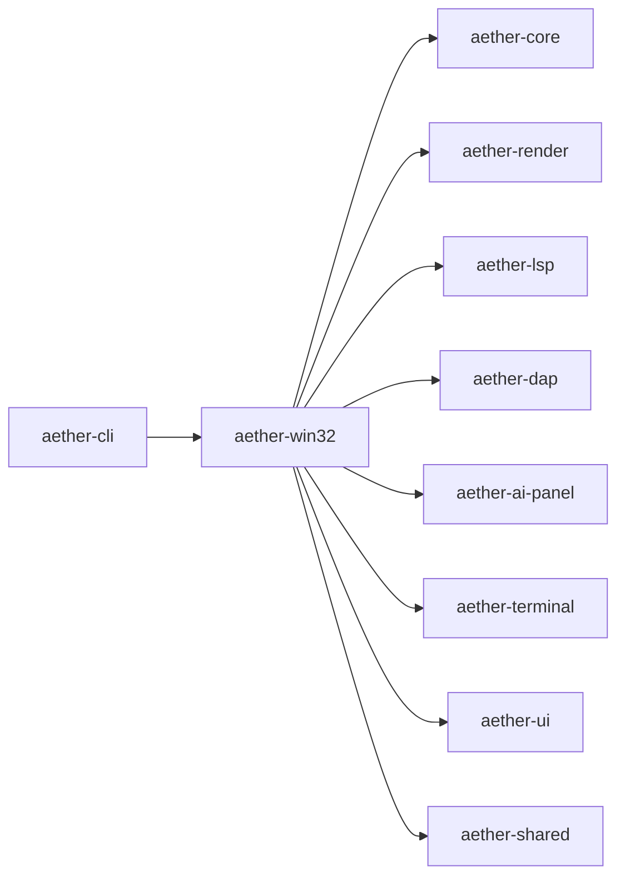

# 核心功能特性

<cite>
**本文引用的文件**
- [README.md](file://README.md)
- [Cargo.toml](file://Cargo.toml)
- [window_setup.rs](file://crates/aether-win32/src/window/window_setup.rs)
- [window_messages.rs](file://crates/aether-win32/src/window/window_messages.rs)
- [piece_table.rs](file://crates/aether-core/src/buffer/piece_table.rs)
- [history.rs](file://crates/aether-core/src/buffer/history.rs)
- [lexer/mod.rs](file://crates/aether-core/src/lexer/mod.rs)
- [render/lib.rs](file://crates/aether-render/src/lib.rs)
- [ai_panel.rs](file://crates/aether-ai-panel/src/ai_panel.rs)
- [aether-ai/lib.rs](file://crates/aether-ai/src/lib.rs)
- [terminal.rs](file://crates/aether-win32/src/terminal.rs)
- [ime.rs (win32)](file://crates/aether-win32/src/ime.rs)
- [ime.rs (ui)](file://crates/aether-ui/src/ime.rs)
- [lsp/lib.rs](file://crates/aether-lsp/src/lib.rs)
- [dap/lib.rs](file://crates/aether-dap/src/lib.rs)
</cite>

## 目录
1. [简介](#简介)
2. [项目结构](#项目结构)
3. [核心组件](#核心组件)
4. [架构总览](#架构总览)
5. [详细组件分析](#详细组件分析)
6. [依赖关系分析](#依赖关系分析)
7. [性能考量](#性能考量)
8. [故障排查指南](#故障排查指南)
9. [结论](#结论)

## 简介
本文件面向牧羊人编辑器（Aether Studio）的核心功能特性，覆盖原生 Windows 体验、自绘渲染引擎、高性能文本编辑、Markdown 与图片预览、多语言词法分析器、工作区与文件树、AI 集成（DeepSeek/Kimi）、LSP/DAP、Tree-sitter 集成、远程开发、终端面板、插件系统、国际化输入法支持与命令行工具。每个模块均说明技术实现、使用场景与性能特点，并给出关键源码路径以便深入查阅。

## 项目结构
仓库采用 Cargo Workspace 组织，按职责拆分为多个 crate：
- aether-core：文本缓冲、历史栈、词法分析器、工作区数据结构、搜索
- aether-render：Direct2D / DirectWrite 渲染抽象、主题系统、画笔缓存
- aether-win32：Windows 原生 UI 层：窗口、消息循环、菜单、布局、事件处理、应用入口
- aether-shared：共享配置与持久化设置
- aether-lsp：语言服务器协议客户端（同步、增量同步、语义 token）
- aether-dap：调试适配器协议客户端基础实现
- aether-remote：SSH/Git/容器远程操作抽象
- aether-ai：AI 服务接口与请求处理
- aether-ai-panel：AI 助手面板与流式交互
- aether-terminal：终端面板（ConPTY）
- aether-ui：通用 UI 能力（含 IME 等）
- aether-cli：命令行启动器

图表来源
- [Cargo.toml:1-19](file://Cargo.toml#L1-L19)

章节来源
- [Cargo.toml:1-19](file://Cargo.toml#L1-L19)
- [README.md:162-179](file://README.md#L162-L179)

## 核心组件
- 原生 Windows 体验：基于 Win32 窗口 + DWM 沉浸式深色模式，支持高 DPI、缩放与系统高对比度模式。
- 自绘渲染引擎：Direct2D / DirectWrite 渲染管线，主题、半透明背景、阴影、动画与脏矩形优化。
- 高性能文本编辑：Piece Table 文本缓冲、多光标、选择、撤销/重做历史栈、语法高亮、查找替换、自动缩进。
- Markdown 预览：内置阅读器，编辑/预览切换、实时渲染与同步滚动。
- 图片预览：缩放、平移、中键拖拽。
- 多语言词法分析器：C/Rust/JS/Python/JSON/TOML/HTML/Markdown 等分词与高亮。
- 文件树与工作区：异步扫描、Git 状态标记、最近项目、拖拽。
- AI 集成：HTTP 大模型交互，DeepSeek/Kimi 预设，代码解释/改写/内联建议、Agent 工具结果回喂、API 配置面板。
- LSP 支持：文档同步、语义 token、增量同步。
- DAP 支持：调试会话、传输、类型定义。
- Tree-sitter 集成：语法解析、语言检测、TextMate 主题映射、高亮渲染与缓存。
- 远程开发：SSH、远程文件系统、Git 克隆、远程目录浏览。
- 终端面板：ConPTY 子进程，PowerShell/CMD。
- 插件系统：注册、权限控制、运行时基础。
- 国际化输入法：CJK IME 候选窗口定位与合成事件。
- 命令行工具：aether CLI 启动 GUI、打开路径、定位行列、--wait/--new-window。

章节来源
- [README.md:48-66](file://README.md#L48-L66)
- [README.md:221-238](file://README.md#L221-L238)

## 架构总览
整体由 Win32 窗口层驱动，协调渲染、编辑、语言服务、AI、远程与终端等子系统；通过共享配置与持久化进行跨模块协作；CLI 作为外部入口统一调度。

图表来源
- [window_messages.rs:811-850](file://crates/aether-win32/src/window/window_messages.rs#L811-L850)
- [render/lib.rs:1-5](file://crates/aether-render/src/lib.rs#L1-L5)
- [lsp/lib.rs:1-16](file://crates/aether-lsp/src/lib.rs#L1-L16)
- [ai_panel.rs:1-200](file://crates/aether-ai-panel/src/ai_panel.rs#L1-L200)
- [terminal.rs:134-178](file://crates/aether-win32/src/terminal.rs#L134-L178)

## 详细组件分析

### 原生 Windows 体验（Win32 窗口 + DWM 沉浸式深色模式）
- 技术实现
  - 启用沉浸式暗色模式与主机 backdrop brush（Acrylic/Mica），并在 Windows 11 上尝试 Mica Alt 以获得标题栏与客户区一致的透效果。
  - 禁用非客户区渲染策略以允许透明区域透出 backdrop。
  - 处理 WM_DPICHANGED 与最小化恢复时的首帧渲染，避免 D2D 目标重建期间的空白闪烁。
- 使用场景
  - 提供与现代 Windows 桌面一致的外观与行为，适配高 DPI 与系统主题。
- 性能特点
  - 通过减少重绘与合理的首帧刷新降低卡顿；DWM 合成提升视觉流畅度。

图表来源
- [window_setup.rs:34-85](file://crates/aether-win32/src/window/window_setup.rs#L34-L85)
- [window_messages.rs:811-850](file://crates/aether-win32/src/window/window_messages.rs#L811-L850)

章节来源
- [window_setup.rs:34-85](file://crates/aether-win32/src/window/window_setup.rs#L34-L85)
- [window_messages.rs:811-850](file://crates/aether-win32/src/window/window_messages.rs#L811-L850)

### 自绘渲染引擎（Direct2D/DirectWrite 渲染管线）
- 技术实现
  - 通过 aether-render 暴露 d2d/gpu/theme 等模块，封装 D2D/DWrite 工厂、渲染目标、画笔与文本格式缓存。
  - 在欢迎页/对话框等场景中复用画刷与文本格式缓存，减少重复分配。
- 使用场景
  - 全量或脏矩形渲染 UI 元素（文本、图标、按钮、预览内容）。
- 性能特点
  - 缓存画刷与文本格式，降低 GPU 对象创建开销；结合脏矩形减少无效绘制。

图表来源
- [render/lib.rs:1-5](file://crates/aether-render/src/lib.rs#L1-L5)
- [sandbox_eval.rs:1047-1091](file://crates/aether-win32/src/render/sandbox_eval.rs#L1047-L1091)
- [dialogs.rs:571-614](file://crates/aether-win32/src/render/dialogs.rs#L571-L614)

章节来源
- [render/lib.rs:1-5](file://crates/aether-render/src/lib.rs#L1-L5)
- [sandbox_eval.rs:1047-1091](file://crates/aether-win32/src/render/sandbox_eval.rs#L1047-L1091)
- [dialogs.rs:571-614](file://crates/aether-win32/src/render/dialogs.rs#L571-L614)

### 高性能文本编辑（Piece Table 文本缓冲、多光标、撤销/重做）
- 技术实现
  - Piece Table：原始文件内存映射只读，新增内容追加到独立缓冲区；维护有序片段表、行索引分块与前缀和缓存，实现 O(1) 插入/删除与高效行定位。
  - History：记录插入/删除/替换的 delta，支持合并连续同位置操作，维护撤销/重做栈与分组。
- 使用场景
  - 大文件编辑、频繁修改、多光标编辑、撤销/重做流程。
- 性能特点
  - 零拷贝打开大文件；行索引分块降低平移成本；撤销/重做合并减少栈增长。

图表来源
- [piece_table.rs:11-35](file://crates/aether-core/src/buffer/piece_table.rs#L11-L35)
- [piece_table.rs:101-200](file://crates/aether-core/src/buffer/piece_table.rs#L101-L200)
- [history.rs:330-482](file://crates/aether-core/src/buffer/history.rs#L330-L482)

章节来源
- [piece_table.rs:11-35](file://crates/aether-core/src/buffer/piece_table.rs#L11-L35)
- [piece_table.rs:101-200](file://crates/aether-core/src/buffer/piece_table.rs#L101-L200)
- [history.rs:330-482](file://crates/aether-core/src/buffer/history.rs#L330-L482)

### Markdown 预览与图片预览
- 技术实现
  - 内置 Markdown 阅读器，支持编辑/预览模式切换、实时渲染与同步滚动。
  - 图片预览支持缩放、平移与中键拖拽；不支持格式时显示占位提示。
- 使用场景
  - 文档编写、快速查看图片资源。
- 性能特点
  - 按需渲染与视图裁剪，避免大图/长文档导致的卡顿。

章节来源
- [README.md:52-54](file://README.md#L52-L54)
- [README.md:225-227](file://README.md#L225-L227)

### 多语言词法分析器
- 技术实现
  - 通过 Language 枚举与 create_lexer/lex_full 静态分发，为 C/Rust/JS/Python/JSON/TOML/HTML/Markdown 等提供专用 lexer；未知扩展名回退为纯文本。
- 使用场景
  - 语法高亮、智能提示、错误检查的基础。
- 性能特点
  - 静态分发避免动态装箱；针对每种语言优化扫描路径。

图表来源
- [lexer/mod.rs:94-196](file://crates/aether-core/src/lexer/mod.rs#L94-L196)

章节来源
- [lexer/mod.rs:94-196](file://crates/aether-core/src/lexer/mod.rs#L94-L196)

### 文件树与工作区管理
- 技术实现
  - 异步文件扫描、Git 状态标记、最近项目、拖拽支持。
- 使用场景
  - 项目导航、批量操作、快速定位。
- 性能特点
  - 异步 IO 避免阻塞 UI；增量更新文件树。

章节来源
- [README.md:56-57](file://README.md#L56-L57)
- [README.md:228-229](file://README.md#L228-L229)

### AI 集成（DeepSeek/Kimi 支持）
- 技术实现
  - HTTP 大模型交互，支持 DeepSeek/Kimi 预设；对 DeepSeek 的 thinking 参数进行条件注入；空 API Key 时拒绝请求；流式响应与“深度思考”内容分离展示。
- 使用场景
  - 代码解释、改写、内联建议、Agent 工具结果回喂、对话式编程。
- 性能特点
  - 流式传输降低首字节延迟；错误脱敏保障安全。

图表来源
- [ai_panel.rs:1-200](file://crates/aether-ai-panel/src/ai_panel.rs#L1-L200)
- [aether-ai/lib.rs:1380-1475](file://crates/aether-ai/src/lib.rs#L1380-L1475)

章节来源
- [ai_panel.rs:1-200](file://crates/aether-ai-panel/src/ai_panel.rs#L1-L200)
- [aether-ai/lib.rs:1380-1475](file://crates/aether-ai/src/lib.rs#L1380-L1475)

### LSP 支持
- 技术实现
  - 提供 LspClient、增量同步、语义 token、传输与类型定义，复用 lsp-types。
- 使用场景
  - 跳转定义、查找引用、签名提示、诊断信息。
- 性能特点
  - 增量同步减少带宽与解析开销；语义 token 提升高亮精度。

章节来源
- [lsp/lib.rs:1-16](file://crates/aether-lsp/src/lib.rs#L1-L16)

### DAP 支持
- 技术实现
  - 提供 DapClient、会话管理、传输与类型定义，构成调试客户端基础。
- 使用场景
  - 启动/连接调试器、断点、变量查看、调用栈。
- 性能特点
  - 会话级复用连接，减少握手开销。

章节来源
- [dap/lib.rs:1-8](file://crates/aether-dap/src/lib.rs#L1-L8)

### Tree-sitter 集成
- 技术实现
  - 语法解析、语言检测、TextMate 主题映射、高亮渲染与文件切换高亮缓存。
- 使用场景
  - 精准语法高亮、错误定位、重构辅助。
- 性能特点
  - 增量解析与缓存命中降低 CPU 占用。

章节来源
- [README.md:60-61](file://README.md#L60-L61)
- [README.md:233-234](file://README.md#L233-L234)

### 远程开发能力
- 技术实现
  - SSH 连接、远程文件系统、Git 克隆、远程目录浏览。
- 使用场景
  - 在本地编辑远端代码，保持无缝体验。
- 性能特点
  - 异步 I/O 与增量同步，降低网络抖动影响。

章节来源
- [README.md:61-62](file://README.md#L61-L62)
- [README.md:234-235](file://README.md#L234-L235)

### 终端面板
- 技术实现
  - ConPTY 子进程（PowerShell/CMD），ANSI 解析，输出行缓冲与滚动，尺寸同步。
- 使用场景
  - 构建、运行、调试、脚本执行。
- 性能特点
  - 行缓冲与增量渲染避免全屏重绘；ANSI 解析轻量高效。

图表来源
- [terminal.rs:134-178](file://crates/aether-win32/src/terminal.rs#L134-L178)

章节来源
- [terminal.rs:134-178](file://crates/aether-win32/src/terminal.rs#L134-L178)

### 插件系统
- 技术实现
  - 插件注册、权限控制、运行时基础。
- 使用场景
  - 扩展编辑器能力（自定义命令、视图、语言服务等）。
- 性能特点
  - 沙箱隔离与权限约束，限制插件对系统资源的访问。

章节来源
- [README.md:63-64](file://README.md#L63-L64)
- [README.md:236-237](file://README.md#L236-L237)

### 国际化输入法支持（IME）
- 技术实现
  - TSF/IMM32 集成，CJK 输入法候选窗口定位与合成事件处理；支持获取合成串与结果串；可在终端聚焦时临时解除 IME 关联以避免按键冲突。
- 使用场景
  - 中文/日文/韩文输入体验，候选窗跟随光标。
- 性能特点
  - 仅在需要时查询 IME 状态，避免频繁系统调用。

图表来源
- [ime.rs (win32):1-254](file://crates/aether-win32/src/ime.rs#L1-L254)
- [ime.rs (ui):1-254](file://crates/aether-ui/src/ime.rs#L1-L254)

章节来源
- [ime.rs (win32):1-254](file://crates/aether-win32/src/ime.rs#L1-L254)
- [ime.rs (ui):1-254](file://crates/aether-ui/src/ime.rs#L1-L254)

### 命令行工具
- 技术实现
  - aether CLI 启动 GUI、打开路径、定位行列，支持 --wait / --new-window。
- 使用场景
  - 从终端快速打开文件或项目，配合工作流自动化。
- 性能特点
  - 轻量进程，仅负责参数解析与启动。

章节来源
- [README.md:65-66](file://README.md#L65-L66)
- [README.md:238-239](file://README.md#L238-L239)

## 依赖关系分析
- aether-win32 依赖 aether-core（编辑）、aether-render（渲染）、aether-lsp（语言服务）、aether-dap（调试）、aether-ai-panel（AI）、aether-terminal（终端）、aether-ui（IME/UI）、aether-shared（配置）。
- aether-core 被多个上层模块消费，承担数据与算法核心。
- aether-render 提供跨平台渲染抽象，屏蔽 D2D/DWrite 细节。
- aether-lsp/dap 通过 transport/session/client 分层解耦协议与业务。

图表来源
- [Cargo.toml:1-19](file://Cargo.toml#L1-L19)

章节来源
- [Cargo.toml:1-19](file://Cargo.toml#L1-L19)

## 性能考量
- 文本编辑
  - Piece Table 的 O(1) 插入/删除与行索引分块显著降低大文件编辑成本；撤销/重做合并减少历史栈膨胀。
- 渲染
  - 画刷与文本格式缓存减少 GPU 对象创建；脏矩形与首帧优化降低闪烁与卡顿。
- 词法分析
  - 静态分发与语言专用扫描路径提升吞吐；基准可达数百 MiB/s。
- 网络与 AI
  - 流式响应降低首字节延迟；错误脱敏避免敏感信息泄露。
- 终端
  - ANSI 解析与行缓冲减少重绘；ConPTY 子进程复用提升稳定性。

章节来源
- [README.md:148-159](file://README.md#L148-L159)
- [piece_table.rs:11-35](file://crates/aether-core/src/buffer/piece_table.rs#L11-L35)
- [history.rs:330-482](file://crates/aether-core/src/buffer/history.rs#L330-L482)
- [sandbox_eval.rs:1047-1091](file://crates/aether-win32/src/render/sandbox_eval.rs#L1047-L1091)

## 故障排查指南
- 窗口首次渲染空白
  - 检查 WM_DPICHANGED 与最小化恢复后的 UpdateWindow 调用，确保 D2D 目标重建后触发首帧渲染。
- 输入法异常
  - 确认 IME 上下文正确关联；在终端聚焦时临时解除 IME 以避免按键冲突；提交完成后关闭 IME 以便立即删除汉字。
- AI 请求失败
  - 校验 API Key 是否设置；检查 Base URL 与模型名称；关注 thinking 参数仅在 DeepSeek 生效。
- 终端无输出
  - 确认 ConPTY 子进程启动成功；检查 ANSI 解析与输出缓冲上限；验证行列尺寸同步。
- 大文件卡顿
  - 确认 Piece Table 行索引前缀缓存有效；避免全量重绘；利用脏矩形与增量更新。

章节来源
- [window_messages.rs:811-850](file://crates/aether-win32/src/window/window_messages.rs#L811-L850)
- [ime.rs (win32):1-254](file://crates/aether-win32/src/ime.rs#L1-L254)
- [aether-ai/lib.rs:1380-1475](file://crates/aether-ai/src/lib.rs#L1380-L1475)
- [terminal.rs:134-178](file://crates/aether-win32/src/terminal.rs#L134-L178)

## 结论
牧羊人编辑器以 Rust 与 Win32 为核心，构建了高性能、可扩展且原生体验优秀的现代代码编辑器。其 Piece Table 文本缓冲、自绘渲染、多语言词法分析、AI 集成、LSP/DAP、远程开发与终端面板等功能协同工作，兼顾易用性与性能。通过模块化 crate 设计与清晰的依赖边界，项目具备良好的可维护性与扩展性。