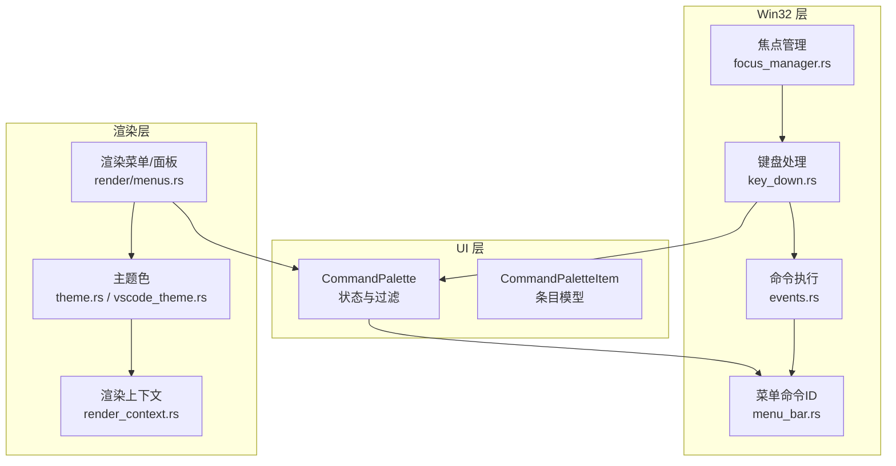
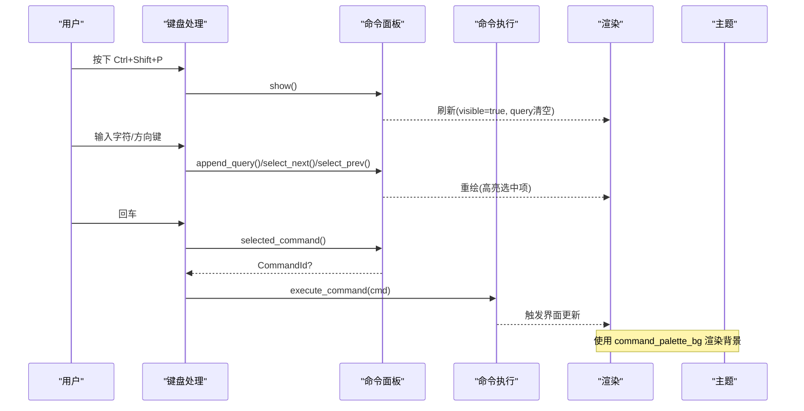
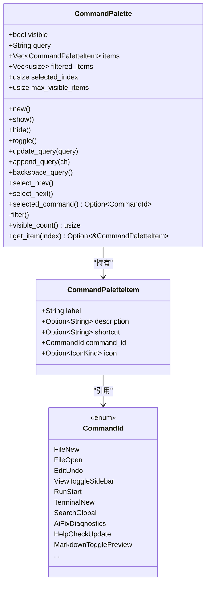
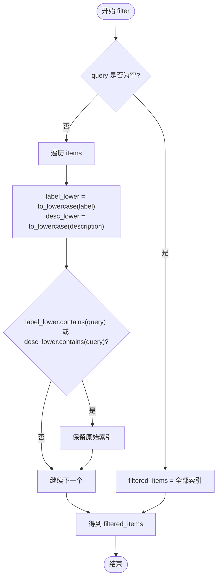
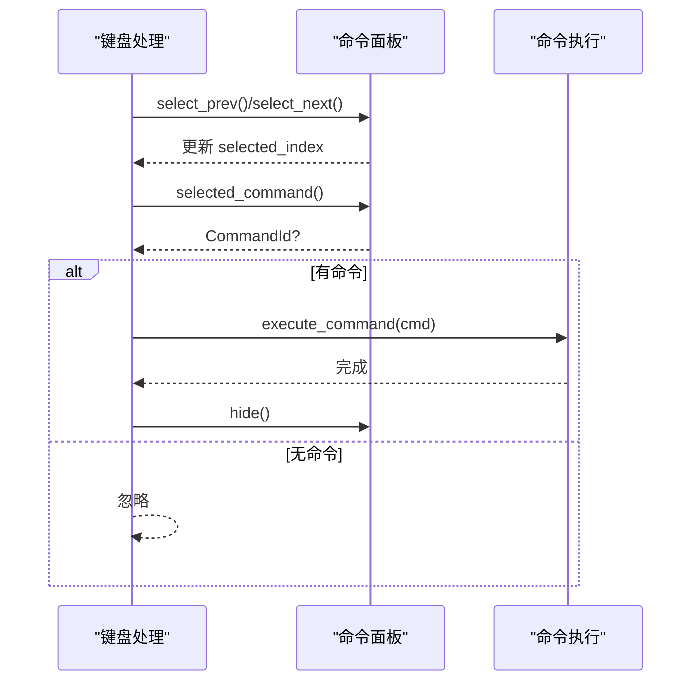
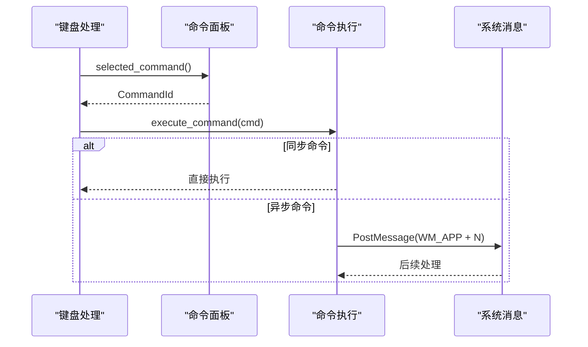
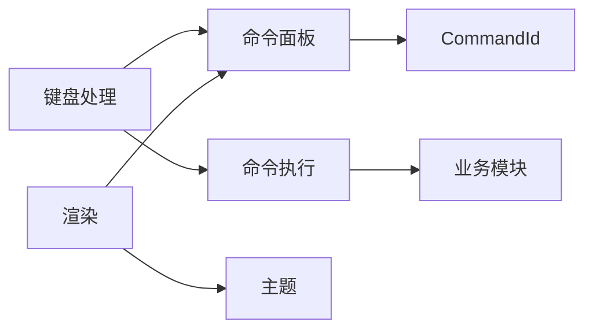

# 命令面板组件

<cite>
**本文引用的文件**
- [crates/aether-ui/src/command_palette.rs](file://crates/aether-ui/src/command_palette.rs)
- [crates/aether-win32/src/command_palette.rs](file://crates/aether-win32/src/command_palette.rs)
- [crates/aether-win32/src/menu_bar.rs](file://crates/aether-win32/src/menu_bar.rs)
- [crates/aether-win32/src/editor/events.rs](file://crates/aether-win32/src/editor/events.rs)
- [crates/aether-win32/src/window/keyboard_handler/key_down.rs](file://crates/aether-win32/src/window/keyboard_handler/key_down.rs)
- [crates/aether-render/src/theme.rs](file://crates/aether-render/src/theme.rs)
- [crates/aether-render/src/vscode_theme.rs](file://crates/aether-render/src/vscode_theme.rs)
- [crates/aether-render-win/src/render_context.rs](file://crates/aether-render-win/src/render_context.rs)
- [crates/aether-win32/src/render/menus.rs](file://crates/aether-win32/src/render/menus.rs)
- [crates/aether-editor/src/focus_manager.rs](file://crates/aether-editor/src/focus_manager.rs)
</cite>

## 目录
1. [简介](#简介)
2. [项目结构](#项目结构)
3. [核心组件](#核心组件)
4. [架构总览](#架构总览)
5. [详细组件分析](#详细组件分析)
6. [依赖关系分析](#依赖关系分析)
7. [性能考虑](#性能考虑)
8. [故障排查指南](#故障排查指南)
9. [结论](#结论)
10. [附录](#附录)

## 简介
本文件为牧羊人编辑器的“命令面板”组件提供系统化、可操作的文档。内容覆盖：
- 命令注册机制与分类分组
- 搜索过滤算法与结果排序
- 显示/隐藏控制与键盘导航
- 模糊匹配搜索能力
- 命令执行流程（选择、参数传递、异步处理）
- 与编辑器其他模块的集成方式（文件操作、查找替换、设置修改等）
- 扩展点与实践示例（如何注册新命令、实现复杂逻辑、优化搜索性能）

## 项目结构
命令面板由 UI 层状态与渲染、Win32 窗口事件与命令分发、主题样式共同组成：
- UI 层：定义命令条目结构与命令面板状态，维护命令列表、查询、过滤结果与选中项
- Win32 层：负责键盘输入路由、命令执行、焦点管理、渲染调用
- 渲染层：绘制命令面板条目、高亮选中项、应用主题色
- 主题层：提供命令面板背景色等视觉配置

图表来源
- [crates/aether-ui/src/command_palette.rs:1-442](file://crates/aether-ui/src/command_palette.rs#L1-L442)
- [crates/aether-win32/src/command_palette.rs:1-442](file://crates/aether-win32/src/command_palette.rs#L1-L442)
- [crates/aether-win32/src/menu_bar.rs:35-123](file://crates/aether-win32/src/menu_bar.rs#L35-L123)
- [crates/aether-win32/src/editor/events.rs:230-400](file://crates/aether-win32/src/editor/events.rs#L230-L400)
- [crates/aether-win32/src/window/keyboard_handler/key_down.rs:1062-1099](file://crates/aether-win32/src/window/keyboard_handler/key_down.rs#L1062-L1099)
- [crates/aether-render/src/theme.rs:27-206](file://crates/aether-render/src/theme.rs#L27-L206)
- [crates/aether-render/src/vscode_theme.rs:165-165](file://crates/aether-render/src/vscode_theme.rs#L165-L165)
- [crates/aether-render-win/src/render_context.rs:210-210](file://crates/aether-render-win/src/render_context.rs#L210-L210)
- [crates/aether-win32/src/render/menus.rs:1332-1365](file://crates/aether-win32/src/render/menus.rs#L1332-L1365)
- [crates/aether-editor/src/focus_manager.rs:18-38](file://crates/aether-editor/src/focus_manager.rs#L18-L38)

章节来源
- [crates/aether-ui/src/command_palette.rs:1-442](file://crates/aether-ui/src/command_palette.rs#L1-L442)
- [crates/aether-win32/src/command_palette.rs:1-442](file://crates/aether-win32/src/command_palette.rs#L1-L442)
- [crates/aether-win32/src/menu_bar.rs:35-123](file://crates/aether-win32/src/menu_bar.rs#L35-L123)
- [crates/aether-win32/src/editor/events.rs:230-400](file://crates/aether-win32/src/editor/events.rs#L230-L400)
- [crates/aether-win32/src/window/keyboard_handler/key_down.rs:1062-1099](file://crates/aether-win32/src/window/keyboard_handler/key_down.rs#L1062-L1099)
- [crates/aether-render/src/theme.rs:27-206](file://crates/aether-render/src/theme.rs#L27-L206)
- [crates/aether-render/src/vscode_theme.rs:165-165](file://crates/aether-render/src/vscode_theme.rs#L165-L165)
- [crates/aether-render-win/src/render_context.rs:210-210](file://crates/aether-render-win/src/render_context.rs#L210-L210)
- [crates/aether-win32/src/render/menus.rs:1332-1365](file://crates/aether-win32/src/render/menus.rs#L1332-L1365)
- [crates/aether-editor/src/focus_manager.rs:18-38](file://crates/aether-editor/src/focus_manager.rs#L18-L38)

## 核心组件
- 命令条目 CommandPaletteItem：包含标签、描述、快捷键、命令 ID、图标
- 命令面板 CommandPalette：维护可见性、查询、原始命令列表、过滤后索引、选中项、最大可见数
- 命令 ID 枚举 CommandId：统一标识所有命令，供菜单与命令面板共享
- 命令执行器 execute_command：根据 CommandId 分派到具体业务逻辑
- 键盘处理器 key_down：在命令面板激活时拦截方向键、回车、退格等按键
- 渲染器 render/menus：绘制命令面板条目、高亮选中项、绘制图标
- 主题 theme：提供命令面板背景色等样式

章节来源
- [crates/aether-ui/src/command_palette.rs:1-442](file://crates/aether-ui/src/command_palette.rs#L1-L442)
- [crates/aether-win32/src/menu_bar.rs:35-123](file://crates/aether-win32/src/menu_bar.rs#L35-L123)
- [crates/aether-win32/src/editor/events.rs:230-400](file://crates/aether-win32/src/editor/events.rs#L230-L400)
- [crates/aether-win32/src/window/keyboard_handler/key_down.rs:1062-1099](file://crates/aether-win32/src/window/keyboard_handler/key_down.rs#L1062-L1099)
- [crates/aether-win32/src/render/menus.rs:1332-1365](file://crates/aether-win32/src/render/menus.rs#L1332-L1365)
- [crates/aether-render/src/theme.rs:27-206](file://crates/aether-render/src/theme.rs#L27-L206)

## 架构总览
命令面板的工作流包括：
- 打开/关闭：通过 UI 层的 show/hide/toggle 控制可见性与查询重置
- 搜索过滤：基于查询字符串对命令标签与描述进行包含匹配，生成 filtered_items
- 键盘导航：方向键移动选中项，回车执行当前命令，Esc 关闭面板
- 命令执行：将选中的 CommandId 交给 execute_command 分派到具体功能
- 渲染：按 visible_count 渲染条目，高亮 selected_index 对应项，并绘制图标
- 主题：使用 command_palette_bg 作为面板背景色

图表来源
- [crates/aether-win32/src/window/keyboard_handler/key_down.rs:1062-1099](file://crates/aether-win32/src/window/keyboard_handler/key_down.rs#L1062-L1099)
- [crates/aether-ui/src/command_palette.rs:241-341](file://crates/aether-ui/src/command_palette.rs#L241-L341)
- [crates/aether-win32/src/editor/events.rs:230-400](file://crates/aether-win32/src/editor/events.rs#L230-L400)
- [crates/aether-win32/src/render/menus.rs:1332-1365](file://crates/aether-win32/src/render/menus.rs#L1332-L1365)
- [crates/aether-render/src/theme.rs:27-206](file://crates/aether-render/src/theme.rs#L27-L206)

## 详细组件分析

### 命令注册机制与分类分组
- 命令注册：在命令面板初始化时构建命令列表，每个条目绑定一个 CommandId，并附带标签、描述、快捷键、图标
- 分类分组：通过标签前缀（如“文件:”“编辑:”“视图:”“运行:”“终端:”“搜索:”“AI:”“帮助:”“Markdown:”）实现视觉分组；实际分组由标签文本约定，非数据结构化分组
- 动态加载：当前实现为静态列表；如需动态加载，可在 build_command_list 中按需追加条目或从外部源合并

图表来源
- [crates/aether-ui/src/command_palette.rs:1-442](file://crates/aether-ui/src/command_palette.rs#L1-L442)
- [crates/aether-win32/src/menu_bar.rs:35-123](file://crates/aether-win32/src/menu_bar.rs#L35-L123)

章节来源
- [crates/aether-ui/src/command_palette.rs:36-239](file://crates/aether-ui/src/command_palette.rs#L36-L239)
- [crates/aether-win32/src/menu_bar.rs:35-123](file://crates/aether-win32/src/menu_bar.rs#L35-L123)

### 搜索过滤算法与结果排序
- 过滤算法：当 query 为空时，返回全部条目索引；否则遍历 items，将 label 与 description 转为小写后进行子串包含匹配，命中则保留其原始索引
- 结果排序：保持原始插入顺序，未实现评分排序；可通过引入分数计算（如前缀匹配权重更高）来改进
- 复杂度：O(N·M)，N 为命令数量，M 为查询长度；对于当前规模足够高效

图表来源
- [crates/aether-ui/src/command_palette.rs:307-328](file://crates/aether-ui/src/command_palette.rs#L307-L328)
- [crates/aether-win32/src/command_palette.rs:307-328](file://crates/aether-win32/src/command_palette.rs#L307-L328)

章节来源
- [crates/aether-ui/src/command_palette.rs:307-328](file://crates/aether-ui/src/command_palette.rs#L307-L328)
- [crates/aether-win32/src/command_palette.rs:307-328](file://crates/aether-win32/src/command_palette.rs#L307-L328)

### 显示隐藏控制与键盘导航
- 显示/隐藏：show 设置 visible=true 并清空查询与选中项；hide 设置 visible=false 并清空查询；toggle 切换二者
- 键盘导航：
  - 上/下箭头：select_prev/select_next 调整 selected_index
  - 回车：获取 selected_command 并执行，然后隐藏面板
  - 退格：删除查询最后一个字符并重新过滤
- 焦点管理：命令面板作为独立焦点目标，支持窗口失焦/恢复时保持状态

图表来源
- [crates/aether-win32/src/window/keyboard_handler/key_down.rs:1062-1099](file://crates/aether-win32/src/window/keyboard_handler/key_down.rs#L1062-L1099)
- [crates/aether-ui/src/command_palette.rs:241-341](file://crates/aether-ui/src/command_palette.rs#L241-L341)
- [crates/aether-win32/src/editor/events.rs:230-400](file://crates/aether-win32/src/editor/events.rs#L230-L400)
- [crates/aether-editor/src/focus_manager.rs:18-38](file://crates/aether-editor/src/focus_manager.rs#L18-L38)

章节来源
- [crates/aether-ui/src/command_palette.rs:241-341](file://crates/aether-ui/src/command_palette.rs#L241-L341)
- [crates/aether-win32/src/window/keyboard_handler/key_down.rs:1062-1099](file://crates/aether-win32/src/window/keyboard_handler/key_down.rs#L1062-L1099)
- [crates/aether-editor/src/focus_manager.rs:18-38](file://crates/aether-editor/src/focus_manager.rs#L18-L38)

### 模糊匹配搜索功能
- 当前实现为简单包含匹配（大小写不敏感），适合中文与英文混合场景
- 可扩展为更智能的模糊匹配（如首字母匹配、词边界匹配、得分排序），以提升长列表下的命中率与体验
- 建议：引入轻量模糊匹配库或自定义打分函数，结合前缀匹配优先策略

章节来源
- [crates/aether-ui/src/command_palette.rs:307-328](file://crates/aether-ui/src/command_palette.rs#L307-L328)
- [crates/aether-win32/src/command_palette.rs:307-328](file://crates/aether-win32/src/command_palette.rs#L307-L328)

### 命令执行流程（选择、参数传递、异步处理）
- 选择：通过 selected_command 获取当前选中命令的 CommandId
- 参数传递：当前命令以 CommandId 为唯一标识，不携带额外参数；若需参数，可在 CommandId 基础上扩展参数结构或通过全局状态传递
- 异步处理：部分命令通过 PostMessage 异步触发（如打开文件、另存为），避免在借用期间弹出模态对话框导致重入问题
- 分派：execute_command 根据 CommandId 调用具体业务方法（保存、撤销、打开搜索面板、终端开关等）

图表来源
- [crates/aether-win32/src/editor/events.rs:230-400](file://crates/aether-win32/src/editor/events.rs#L230-L400)
- [crates/aether-win32/src/window/keyboard_handler/key_down.rs:1062-1099](file://crates/aether-win32/src/window/keyboard_handler/key_down.rs#L1062-L1099)

章节来源
- [crates/aether-win32/src/editor/events.rs:230-400](file://crates/aether-win32/src/editor/events.rs#L230-L400)
- [crates/aether-win32/src/window/keyboard_handler/key_down.rs:1062-1099](file://crates/aether-win32/src/window/keyboard_handler/key_down.rs#L1062-L1099)

### 与编辑器其他模块的集成方式
- 文件操作：FileNew、FileOpen、FileSave、FileSaveAs、FileExit 等通过 execute_command 调用对应方法
- 查找替换：EditFind/EditReplace 切换查找/替换面板的可见性
- 视图控制：ViewToggleSidebar/ActivityBar/StatusBar 切换 UI 区域可见性
- 终端：TerminalNew 切换底部终端面板并启动/停止终端进程
- 搜索：SearchGlobal 切换全局搜索面板并触发搜索
- AI：AiFixDiagnostics 调用 AI 修复诊断流程
- 帮助：HelpCheckUpdate/HelpAbout 检查更新或显示版本信息
- Markdown：MarkdownTogglePreview 切换预览模式

章节来源
- [crates/aether-win32/src/editor/events.rs:230-400](file://crates/aether-win32/src/editor/events.rs#L230-L400)

### 渲染与主题
- 渲染：按 visible_count 渲染条目，高亮 selected_index 对应行，绘制图标与文本
- 主题：使用 command_palette_bg 作为面板背景色，支持 VSCode 主题注入

章节来源
- [crates/aether-win32/src/render/menus.rs:1332-1365](file://crates/aether-win32/src/render/menus.rs#L1332-L1365)
- [crates/aether-render/src/theme.rs:27-206](file://crates/aether-render/src/theme.rs#L27-L206)
- [crates/aether-render/src/vscode_theme.rs:165-165](file://crates/aether-render/src/vscode_theme.rs#L165-L165)
- [crates/aether-render-win/src/render_context.rs:210-210](file://crates/aether-render-win/src/render_context.rs#L210-L210)

## 依赖关系分析
- 命令面板依赖 CommandId 枚举，确保与菜单、命令执行一致
- 键盘处理依赖命令面板的状态接口（显示/隐藏、查询更新、导航）
- 命令执行依赖各业务模块（文件、编辑、视图、终端、搜索、AI、帮助）
- 渲染依赖命令面板的可见状态与选中项，以及主题背景色

图表来源
- [crates/aether-ui/src/command_palette.rs:1-442](file://crates/aether-ui/src/command_palette.rs#L1-L442)
- [crates/aether-win32/src/menu_bar.rs:35-123](file://crates/aether-win32/src/menu_bar.rs#L35-L123)
- [crates/aether-win32/src/editor/events.rs:230-400](file://crates/aether-win32/src/editor/events.rs#L230-L400)
- [crates/aether-win32/src/render/menus.rs:1332-1365](file://crates/aether-win32/src/render/menus.rs#L1332-L1365)
- [crates/aether-render/src/theme.rs:27-206](file://crates/aether-render/src/theme.rs#L27-L206)

章节来源
- [crates/aether-ui/src/command_palette.rs:1-442](file://crates/aether-ui/src/command_palette.rs#L1-L442)
- [crates/aether-win32/src/menu_bar.rs:35-123](file://crates/aether-win32/src/menu_bar.rs#L35-L123)
- [crates/aether-win32/src/editor/events.rs:230-400](file://crates/aether-win32/src/editor/events.rs#L230-L400)
- [crates/aether-win32/src/render/menus.rs:1332-1365](file://crates/aether-win32/src/render/menus.rs#L1332-L1365)
- [crates/aether-render/src/theme.rs:27-206](file://crates/aether-render/src/theme.rs#L27-L206)

## 性能考虑
- 过滤复杂度 O(N·M)，在当前命令数量下表现良好；若命令量增长，建议：
  - 引入前缀匹配优先与得分排序
  - 使用增量过滤与防抖，减少频繁重建
  - 缓存小写化后的 label/description，避免重复转换
- 渲染仅绘制 visible_count 条，已限制最大可见数，避免过多 DOM/D2D 对象
- 异步命令通过 PostMessage 避免阻塞主线程与重入风险

[本节为通用指导，无需特定文件来源]

## 故障排查指南
- 命令无响应：检查 selected_command 是否返回有效 CommandId，确认 execute_command 分支是否覆盖该命令
- 搜索无结果：确认 query 是否正确更新，过滤逻辑是否匹配 label/description；必要时增加调试日志
- 键盘导航异常：验证方向键是否被正确拦截，selected_index 是否越界
- 面板不显示：检查 visible 状态与渲染调用；确认主题背景色是否生效
- 焦点丢失：确认焦点管理器是否正确 push/pop，窗口失焦/恢复时状态是否保持

章节来源
- [crates/aether-win32/src/window/keyboard_handler/key_down.rs:1062-1099](file://crates/aether-win32/src/window/keyboard_handler/key_down.rs#L1062-L1099)
- [crates/aether-ui/src/command_palette.rs:241-341](file://crates/aether-ui/src/command_palette.rs#L241-L341)
- [crates/aether-editor/src/focus_manager.rs:18-38](file://crates/aether-editor/src/focus_manager.rs#L18-L38)

## 结论
命令面板以简洁的数据结构与清晰的职责划分实现了高效的命令发现与执行。通过统一的 CommandId、稳定的过滤算法与健壮的键盘导航，用户能够快速定位并执行所需功能。未来可通过增强模糊匹配、动态命令加载与参数化命令进一步提升扩展性与用户体验。

[本节为总结，无需特定文件来源]

## 附录

### 实践示例指引
- 注册新命令：在命令面板的构建列表中新增条目，绑定新的 CommandId，并在菜单与命令执行中添加对应分支
- 实现复杂命令逻辑：在 execute_command 中为新 CommandId 添加分支，调用相应业务方法；如需异步，使用 PostMessage 避免重入
- 优化搜索性能：对小写化字段进行缓存、引入前缀匹配与得分排序、使用防抖减少频繁过滤

[本节为操作指引，无需特定文件来源]