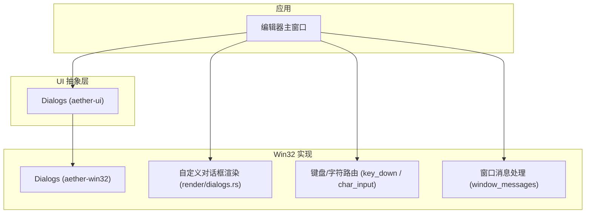
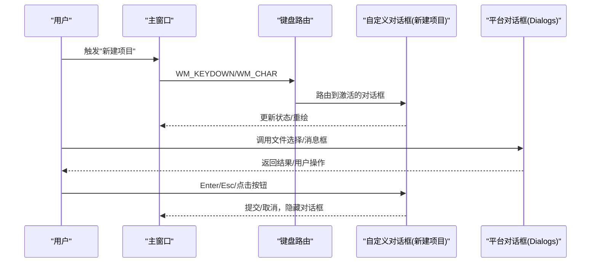
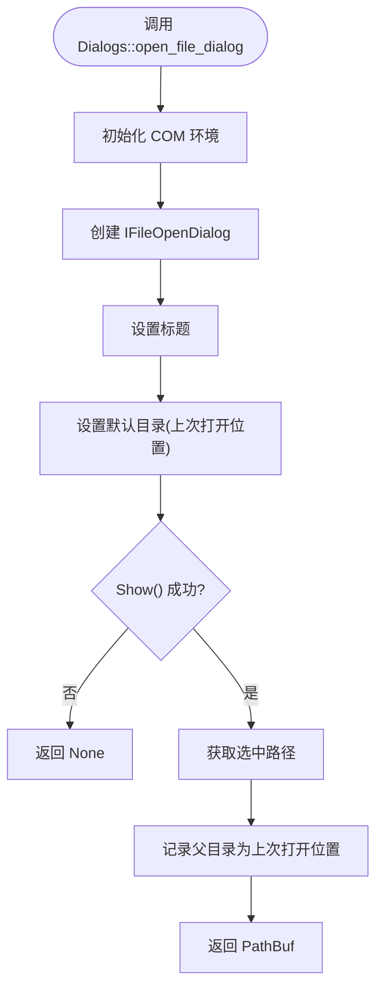
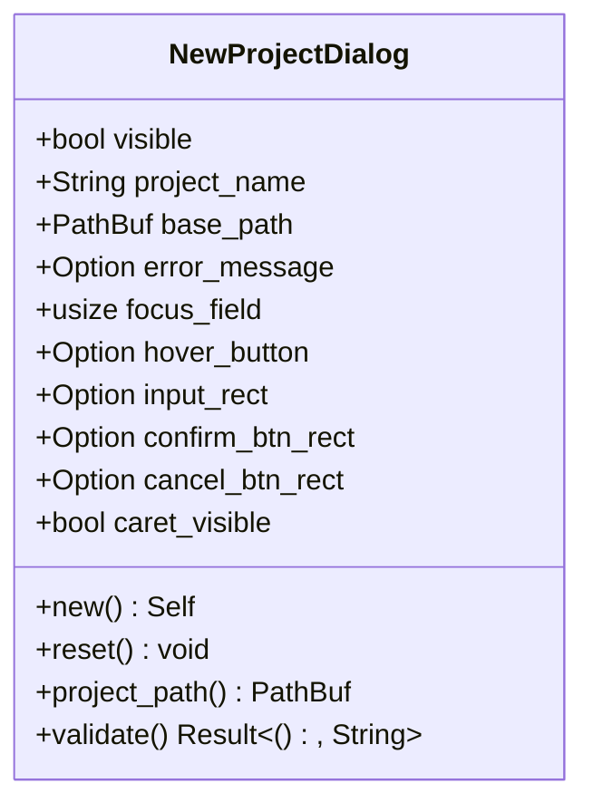
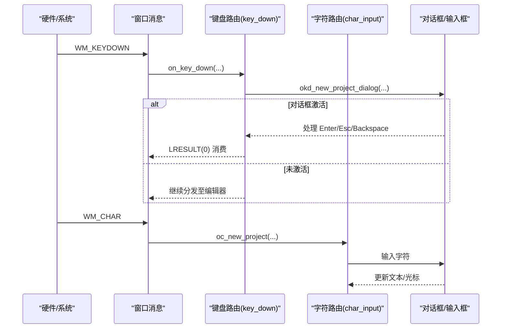
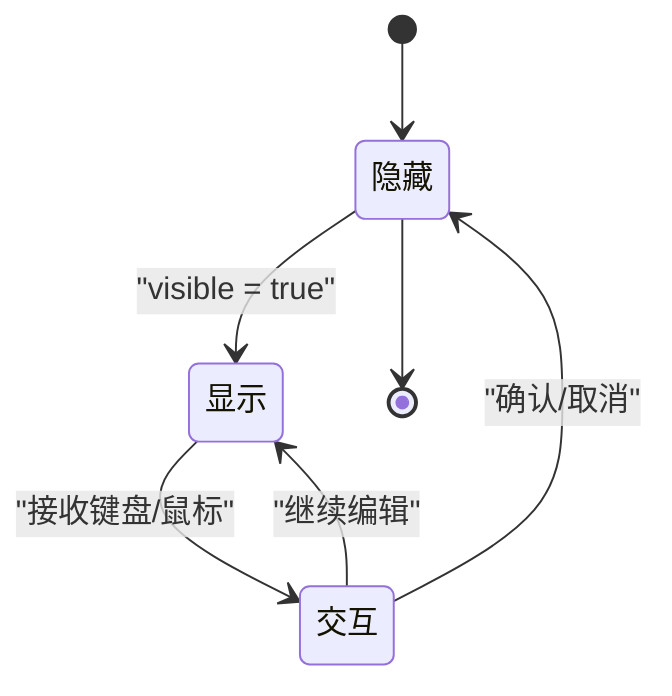
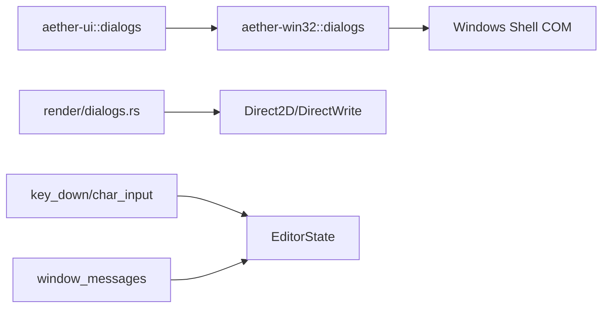

# 对话框系统

<cite>
**本文引用的文件**
- [crates/aether-ui/src/dialogs.rs](file://crates/aether-ui/src/dialogs.rs)
- [crates/aether-win32/src/dialogs.rs](file://crates/aether-win32/src/dialogs.rs)
- [crates/aether-win32/src/render/dialogs.rs](file://crates/aether-win32/src/render/dialogs.rs)
- [crates/aether-win32/src/new_project_dialog.rs](file://crates/aether-win32/src/new_project_dialog.rs)
- [crates/aether-win32/src/window/keyboard_handler/key_down.rs](file://crates/aether-win32/src/window/keyboard_handler/key_down.rs)
- [crates/aether-win32/src/window/keyboard_handler/char_input.rs](file://crates/aether-win32/src/window/keyboard_handler/char_input.rs)
- [crates/aether-win32/src/window/window_messages.rs](file://crates/aether-win32/src/window/window_messages.rs)
- [crates/aether-win32/src/editor/events.rs](file://crates/aether-win32/src/editor/events.rs)
- [crates/aether-win32/src/render/remote_dialogs.rs](file://crates/aether-win32/src/render/remote_dialogs.rs)
</cite>

## 目录
1. [简介](#简介)
2. [项目结构](#项目结构)
3. [核心组件](#核心组件)
4. [架构总览](#架构总览)
5. [详细组件分析](#详细组件分析)
6. [依赖关系分析](#依赖关系分析)
7. [性能考量](#性能考量)
8. [故障排查指南](#故障排查指南)
9. [结论](#结论)
10. [附录：使用示例与最佳实践](#附录使用示例与最佳实践)

## 简介
本文件系统性梳理牧羊人编辑器的对话框系统，覆盖以下方面：
- 对话框框架设计模式：模态与非模态对话框的管理机制
- 内置对话框类型：确认、输入、文件选择、错误提示等
- 生命周期管理：创建、显示、交互、销毁
- 与主窗口的通信：事件传递、数据绑定
- 自定义对话框开发：布局定义、样式定制、交互逻辑实现
- 实际应用场景：创建不同类型对话框、处理用户输入、复杂交互流程

## 项目结构
对话框系统由三层构成：
- 平台层（Win32）：封装系统级对话框能力（文件选择、消息框等），提供统一的 Dialogs API
- UI 层（aether-ui）：跨平台抽象的对话框接口（当前以 Win32 实现为主）
- 渲染与状态层（aether-win32）：自定义对话框的渲染与状态机（如“新建项目”对话框），以及键盘/鼠标事件路由

图表来源
- [crates/aether-ui/src/dialogs.rs:41-245](file://crates/aether-ui/src/dialogs.rs#L41-L245)
- [crates/aether-win32/src/dialogs.rs:41-245](file://crates/aether-win32/src/dialogs.rs#L41-L245)
- [crates/aether-win32/src/render/dialogs.rs:3-405](file://crates/aether-win32/src/render/dialogs.rs#L3-L405)
- [crates/aether-win32/src/window/keyboard_handler/key_down.rs:17-182](file://crates/aether-win32/src/window/keyboard_handler/key_down.rs#L17-L182)
- [crates/aether-win32/src/window/keyboard_handler/char_input.rs:48-86](file://crates/aether-win32/src/window/keyboard_handler/char_input.rs#L48-L86)
- [crates/aether-win32/src/window/window_messages.rs:1051-1104](file://crates/aether-win32/src/window/window_messages.rs#L1051-L1104)

章节来源
- [crates/aether-ui/src/dialogs.rs:41-245](file://crates/aether-ui/src/dialogs.rs#L41-L245)
- [crates/aether-win32/src/dialogs.rs:41-245](file://crates/aether-win32/src/dialogs.rs#L41-L245)
- [crates/aether-win32/src/render/dialogs.rs:3-405](file://crates/aether-win32/src/render/dialogs.rs#L3-L405)
- [crates/aether-win32/src/window/keyboard_handler/key_down.rs:17-182](file://crates/aether-win32/src/window/keyboard_handler/key_down.rs#L17-L182)
- [crates/aether-win32/src/window/keyboard_handler/char_input.rs:48-86](file://crates/aether-win32/src/window/keyboard_handler/char_input.rs#L48-L86)
- [crates/aether-win32/src/window/window_messages.rs:1051-1104](file://crates/aether-win32/src/window/window_messages.rs#L1051-L1104)

## 核心组件
- 平台对话框 API（Dialogs）
  - 文件选择：打开文件夹、打开文件、保存文件
  - 消息框：错误、信息、是/否确认
  - 特性：COM 初始化守卫、上次打开目录记忆、信任目录持久化
- 自定义对话框（新建项目）
  - 状态模型：可见性、输入、焦点、悬停、校验错误、区域命中
  - 渲染：遮罩、背景、标题、输入框、按钮、错误提示
  - 交互：键盘（Enter/Esc）、鼠标点击、光标闪烁
- 事件路由
  - 键盘：优先路由到激活的对话框/输入框
  - 字符：按优先级分发到各输入目标
  - 焦点：避免模态对话框导致的重入 panic

章节来源
- [crates/aether-win32/src/new_project_dialog.rs:1-175](file://crates/aether-win32/src/new_project_dialog.rs#L1-L175)
- [crates/aether-win32/src/render/dialogs.rs:3-405](file://crates/aether-win32/src/render/dialogs.rs#L3-L405)
- [crates/aether-win32/src/window/keyboard_handler/key_down.rs:17-182](file://crates/aether-win32/src/window/keyboard_handler/key_down.rs#L17-L182)
- [crates/aether-win32/src/window/keyboard_handler/char_input.rs:48-86](file://crates/aether-win32/src/window/keyboard_handler/char_input.rs#L48-L86)

## 架构总览
对话框系统采用“平台能力 + 自定义渲染 + 统一事件路由”的分层架构：
- 平台能力：通过 Windows Shell COM 接口提供标准文件对话框；通过 MessageBoxW 提供消息框
- 自定义渲染：基于 Direct2D/DirectWrite 绘制非模态对话框（如新建项目）
- 事件路由：键盘/字符/焦点消息在进入主循环前被拦截并分派到当前激活的对话框或输入框

图表来源
- [crates/aether-win32/src/window/keyboard_handler/key_down.rs:17-182](file://crates/aether-win32/src/window/keyboard_handler/key_down.rs#L17-L182)
- [crates/aether-win32/src/render/dialogs.rs:3-405](file://crates/aether-win32/src/render/dialogs.rs#L3-L405)
- [crates/aether-win32/src/dialogs.rs:41-245](file://crates/aether-win32/src/dialogs.rs#L41-L245)

## 详细组件分析

### 平台对话框 API（Dialogs）
- 文件对话框
  - 打开文件夹：设置选项为“仅选文件夹”，默认起始目录为上次打开位置，支持路径记忆
  - 打开文件：设置标题与默认目录，返回所选文件路径
  - 保存文件：设置标题与默认文件名，返回目标路径
- 消息框
  - 错误/信息：阻塞式消息框，用于错误提示与信息展示
  - 确认：是/否选择，返回布尔值
- 可靠性
  - COM 初始化守卫：确保 CoInitializeEx/CoUninitialize 成对调用
  - 信任目录：持久化已信任工作区，避免重复弹窗

图表来源
- [crates/aether-win32/src/dialogs.rs:100-149](file://crates/aether-win32/src/dialogs.rs#L100-L149)
- [crates/aether-win32/src/dialogs.rs:313-353](file://crates/aether-win32/src/dialogs.rs#L313-L353)

章节来源
- [crates/aether-win32/src/dialogs.rs:41-245](file://crates/aether-win32/src/dialogs.rs#L41-L245)
- [crates/aether-win32/src/dialogs.rs:313-413](file://crates/aether-win32/src/dialogs.rs#L313-L413)

### 自定义对话框：新建项目
- 状态模型
  - visible：是否显示
  - project_name/base_path：输入与默认根目录
  - focus_field/hover_button：焦点字段与按钮悬停
  - error_message：校验错误提示
  - input_rect/confirm_btn_rect/cancel_btn_rect：命中区域
  - caret_visible：光标闪烁控制
- 渲染
  - 遮罩层与对话框背景
  - 标题、基础路径显示、项目名称输入框
  - 确认/取消按钮，悬停高亮
  - 错误消息显示
- 交互
  - 键盘：Enter 提交、Esc 取消、Backspace/Delete 编辑
  - 鼠标：点击输入框聚焦、点击按钮执行动作
  - 验证：名称非空、非法字符检查、路径存在性检查

图表来源
- [crates/aether-win32/src/new_project_dialog.rs:1-175](file://crates/aether-win32/src/new_project_dialog.rs#L1-L175)

章节来源
- [crates/aether-win32/src/new_project_dialog.rs:1-175](file://crates/aether-win32/src/new_project_dialog.rs#L1-L175)
- [crates/aether-win32/src/render/dialogs.rs:3-405](file://crates/aether-win32/src/render/dialogs.rs#L3-L405)

### 键盘与字符路由
- 键盘路由（key_down）
  - 在 WM_KEYDOWN 中按优先级尝试各输入目标（浏览器地址栏、搜索面板、SSH/克隆对话框、新建项目对话框等）
  - 若对话框处于激活状态，则拦截相关按键（Enter/Esc/方向键等）
- 字符路由（char_input）
  - 在 WM_CHAR 中按优先级尝试各输入目标，首个匹配者消费字符
- 焦点处理（window_messages）
  - 使用 try_borrow_mut 避免模态对话框消息循环导致的 RefCell 重入 panic

图表来源
- [crates/aether-win32/src/window/keyboard_handler/key_down.rs:17-182](file://crates/aether-win32/src/window/keyboard_handler/key_down.rs#L17-L182)
- [crates/aether-win32/src/window/keyboard_handler/char_input.rs:48-86](file://crates/aether-win32/src/window/keyboard_handler/char_input.rs#L48-L86)
- [crates/aether-win32/src/window/window_messages.rs:1051-1104](file://crates/aether-win32/src/window/window_messages.rs#L1051-L1104)

章节来源
- [crates/aether-win32/src/window/keyboard_handler/key_down.rs:17-182](file://crates/aether-win32/src/window/keyboard_handler/key_down.rs#L17-L182)
- [crates/aether-win32/src/window/keyboard_handler/char_input.rs:48-86](file://crates/aether-win32/src/window/keyboard_handler/char_input.rs#L48-L86)
- [crates/aether-win32/src/window/window_messages.rs:1051-1104](file://crates/aether-win32/src/window/window_messages.rs#L1051-L1104)

### 非模态对话框与异步交互
- 非模态对话框（如新建项目）通过状态机驱动：visible 控制显示/隐藏，渲染与输入独立于主线程阻塞
- 模态对话框（文件选择、消息框）通过平台 API 阻塞当前调用栈，但内部会泵送消息以避免界面卡死
- 在需要弹出模态对话框的场景，优先将可能触发重入的操作通过 PostMessage 延后处理，避免 RefCell 借用冲突

图表来源
- [crates/aether-win32/src/new_project_dialog.rs:12-63](file://crates/aether-win32/src/new_project_dialog.rs#L12-L63)
- [crates/aether-win32/src/editor/events.rs:258-285](file://crates/aether-win32/src/editor/events.rs#L258-L285)

章节来源
- [crates/aether-win32/src/editor/events.rs:258-285](file://crates/aether-win32/src/editor/events.rs#L258-L285)

## 依赖关系分析
- aether-ui::dialogs 依赖 Windows Shell COM 接口（IFileOpenDialog/IFileSaveDialog）
- aether-win32::dialogs 提供具体实现，包含 COM 初始化守卫与路径记忆
- 自定义对话框渲染依赖 Direct2D/DirectWrite，状态与输入路由依赖窗口消息处理器
- 键盘/字符路由与焦点处理相互协作，确保对话框优先响应

图表来源
- [crates/aether-ui/src/dialogs.rs:41-245](file://crates/aether-ui/src/dialogs.rs#L41-L245)
- [crates/aether-win32/src/dialogs.rs:41-245](file://crates/aether-win32/src/dialogs.rs#L41-L245)
- [crates/aether-win32/src/render/dialogs.rs:3-405](file://crates/aether-win32/src/render/dialogs.rs#L3-L405)
- [crates/aether-win32/src/window/keyboard_handler/key_down.rs:17-182](file://crates/aether-win32/src/window/keyboard_handler/key_down.rs#L17-L182)
- [crates/aether-win32/src/window/keyboard_handler/char_input.rs:48-86](file://crates/aether-win32/src/window/keyboard_handler/char_input.rs#L48-L86)
- [crates/aether-win32/src/window/window_messages.rs:1051-1104](file://crates/aether-win32/src/window/window_messages.rs#L1051-L1104)

章节来源
- [crates/aether-ui/src/dialogs.rs:41-245](file://crates/aether-ui/src/dialogs.rs#L41-L245)
- [crates/aether-win32/src/dialogs.rs:41-245](file://crates/aether-win32/src/dialogs.rs#L41-L245)
- [crates/aether-win32/src/render/dialogs.rs:3-405](file://crates/aether-win32/src/render/dialogs.rs#L3-L405)
- [crates/aether-win32/src/window/keyboard_handler/key_down.rs:17-182](file://crates/aether-win32/src/window/keyboard_handler/key_down.rs#L17-L182)
- [crates/aether-win32/src/window/keyboard_handler/char_input.rs:48-86](file://crates/aether-win32/src/window/keyboard_handler/char_input.rs#L48-L86)
- [crates/aether-win32/src/window/window_messages.rs:1051-1104](file://crates/aether-win32/src/window/window_messages.rs#L1051-L1104)

## 性能考量
- 文件对话框：COM 初始化开销较小，路径记忆减少用户选择成本
- 自定义对话框渲染：使用 brush/text format 缓存，避免重复创建资源
- 事件路由：按优先级快速命中，减少不必要的遍历
- 异步处理：通过 PostMessage 避免在 RefCell 借用期间弹模态对话框，降低重入风险

[本节为通用指导，不直接分析具体文件]

## 故障排查指南
- 模态对话框导致界面卡顿
  - 现象：调用文件对话框时界面无响应
  - 原因：平台对话框内部泵消息，属于正常行为；若长时间无响应，检查 COM 初始化与权限
  - 参考：[crates/aether-win32/src/dialogs.rs:41-245](file://crates/aether-win32/src/dialogs.rs#L41-L245)
- 键盘输入未进入对话框
  - 现象：在新建项目对话框中输入无效
  - 原因：键盘路由优先级未命中或对话框未激活
  - 参考：[crates/aether-win32/src/window/keyboard_handler/key_down.rs:17-182](file://crates/aether-win32/src/window/keyboard_handler/key_down.rs#L17-L182)
- 焦点切换导致 panic
  - 现象：关闭标签页时弹出确认对话框，随后失去焦点引发 panic
  - 原因：RefCell 重入；使用 try_borrow_mut 避免
  - 参考：[crates/aether-win32/src/window/window_messages.rs:1051-1104](file://crates/aether-win32/src/window/window_messages.rs#L1051-L1104)
- 路径记忆失效
  - 现象：下次打开文件对话框未回到上次目录
  - 原因：last_folder.txt 写入失败或路径无效
  - 参考：[crates/aether-win32/src/dialogs.rs:313-353](file://crates/aether-win32/src/dialogs.rs#L313-L353)

章节来源
- [crates/aether-win32/src/dialogs.rs:41-245](file://crates/aether-win32/src/dialogs.rs#L41-L245)
- [crates/aether-win32/src/window/keyboard_handler/key_down.rs:17-182](file://crates/aether-win32/src/window/keyboard_handler/key_down.rs#L17-L182)
- [crates/aether-win32/src/window/window_messages.rs:1051-1104](file://crates/aether-win32/src/window/window_messages.rs#L1051-L1104)
- [crates/aether-win32/src/dialogs.rs:313-353](file://crates/aether-win32/src/dialogs.rs#L313-L353)

## 结论
牧羊人编辑器的对话框系统通过分层设计与严格的事件路由，实现了：
- 稳定的平台对话框能力（文件选择、消息框）
- 灵活的自定义非模态对话框（新建项目）
- 健壮的交互体验（键盘/鼠标/焦点）
- 可维护的扩展点（新增对话框只需遵循状态+渲染+路由模式）

[本节为总结，不直接分析具体文件]

## 附录：使用示例与最佳实践

### 创建不同类型的对话框
- 打开文件夹
  - 调用：Dialogs::open_folder_dialog(hwnd, title)
  - 返回：Option<PathBuf>
  - 参考：[crates/aether-win32/src/dialogs.rs:45-98](file://crates/aether-win32/src/dialogs.rs#L45-L98)
- 打开文件
  - 调用：Dialogs::open_file_dialog(hwnd, title, filters)
  - 返回：Option<PathBuf>
  - 参考：[crates/aether-win32/src/dialogs.rs:100-149](file://crates/aether-win32/src/dialogs.rs#L100-L149)
- 保存文件
  - 调用：Dialogs::save_file_dialog(hwnd, title, default_name)
  - 返回：Option<PathBuf>
  - 参考：[crates/aether-win32/src/dialogs.rs:151-187](file://crates/aether-win32/src/dialogs.rs#L151-L187)
- 错误/信息/确认
  - 调用：show_error/show_info/confirm_yes_no
  - 参考：[crates/aether-win32/src/dialogs.rs:198-244](file://crates/aether-win32/src/dialogs.rs#L198-L244)

### 处理用户输入与交互
- 新建项目对话框
  - 输入：项目名称、基础路径
  - 验证：名称合法性、路径存在性
  - 交互：Enter 提交、Esc 取消、点击按钮
  - 参考：[crates/aether-win32/src/new_project_dialog.rs:76-98](file://crates/aether-win32/src/new_project_dialog.rs#L76-L98)
  - 渲染：[crates/aether-win32/src/render/dialogs.rs:106-405](file://crates/aether-win32/src/render/dialogs.rs#L106-L405)

### 实现复杂的对话框交互流程
- 欢迎页打开文件夹
  - 调用 Dialogs::open_folder_dialog，进行信任检查，再打开工作区
  - 参考：[crates/aether-win32/src/window/keyboard_handler/key_down.rs:511-575](file://crates/aether-win32/src/window/keyboard_handler/key_down.rs#L511-L575)
- 异步处理避免重入
  - 通过 PostMessage 延迟弹出模态对话框
  - 参考：[crates/aether-win32/src/editor/events.rs:258-285](file://crates/aether-win32/src/editor/events.rs#L258-L285)

### 自定义对话框开发方法
- 布局定义
  - 计算尺寸与位置（考虑 DPI 缩放）
  - 绘制遮罩、背景、标题、输入框、按钮
  - 参考：[crates/aether-win32/src/render/dialogs.rs:9-405](file://crates/aether-win32/src/render/dialogs.rs#L9-L405)
- 样式定制
  - 使用主题色与笔刷缓存
  - 参考：[crates/aether-win32/src/render/dialogs.rs:15-70](file://crates/aether-win32/src/render/dialogs.rs#L15-L70)
- 交互逻辑实现
  - 键盘：Enter/Esc/Backspace/Delete
  - 鼠标：点击输入框与按钮
  - 参考：[crates/aether-win32/src/window/keyboard_handler/key_down.rs:764-800](file://crates/aether-win32/src/window/keyboard_handler/key_down.rs#L764-L800)
  - 参考：[crates/aether-win32/src/render/remote_dialogs.rs:701-743](file://crates/aether-win32/src/render/remote_dialogs.rs#L701-L743)

章节来源
- [crates/aether-win32/src/dialogs.rs:45-244](file://crates/aether-win32/src/dialogs.rs#L45-L244)
- [crates/aether-win32/src/new_project_dialog.rs:76-98](file://crates/aether-win32/src/new_project_dialog.rs#L76-L98)
- [crates/aether-win32/src/render/dialogs.rs:9-405](file://crates/aether-win32/src/render/dialogs.rs#L9-L405)
- [crates/aether-win32/src/window/keyboard_handler/key_down.rs:511-575](file://crates/aether-win32/src/window/keyboard_handler/key_down.rs#L511-L575)
- [crates/aether-win32/src/editor/events.rs:258-285](file://crates/aether-win32/src/editor/events.rs#L258-L285)
- [crates/aether-win32/src/render/remote_dialogs.rs:701-743](file://crates/aether-win32/src/render/remote_dialogs.rs#L701-L743)