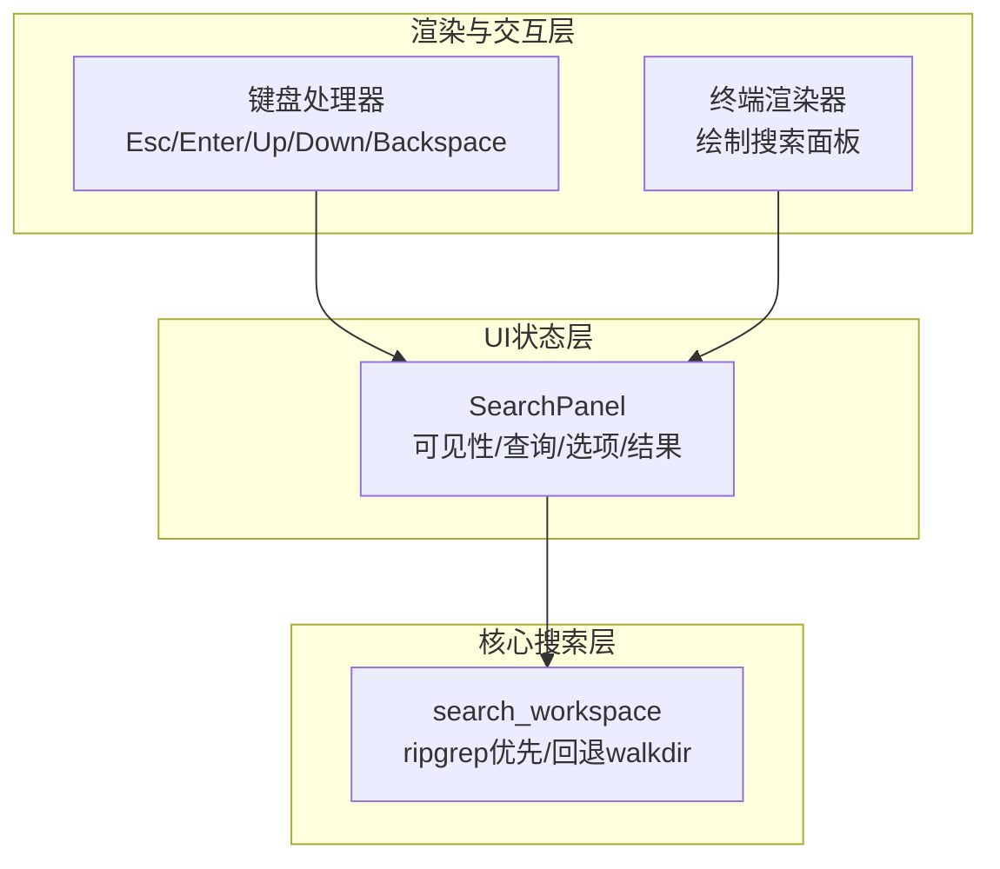
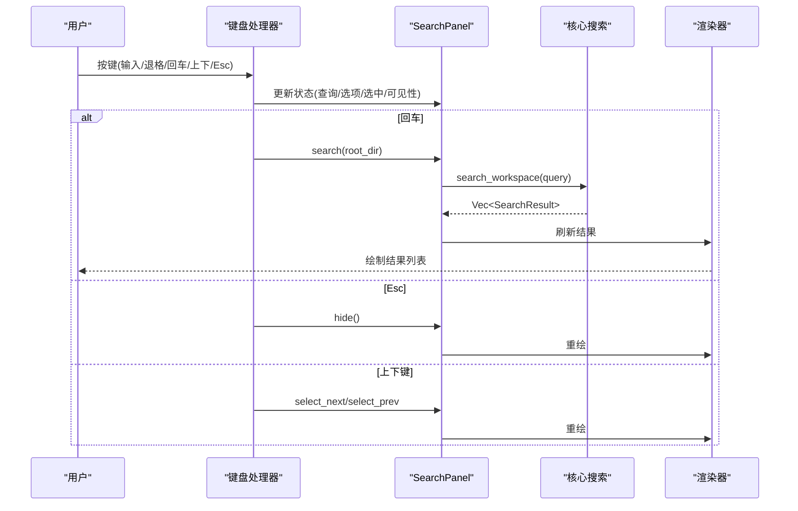
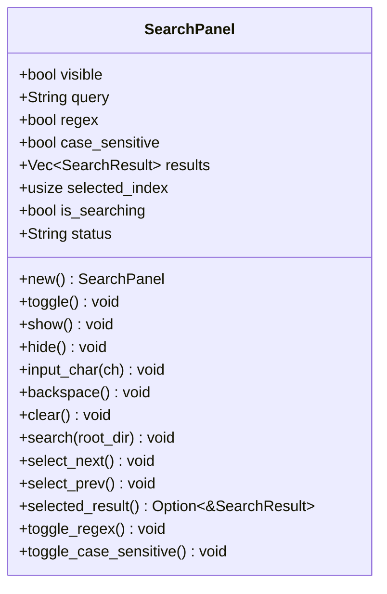
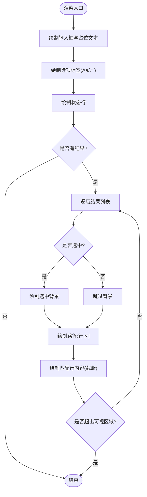
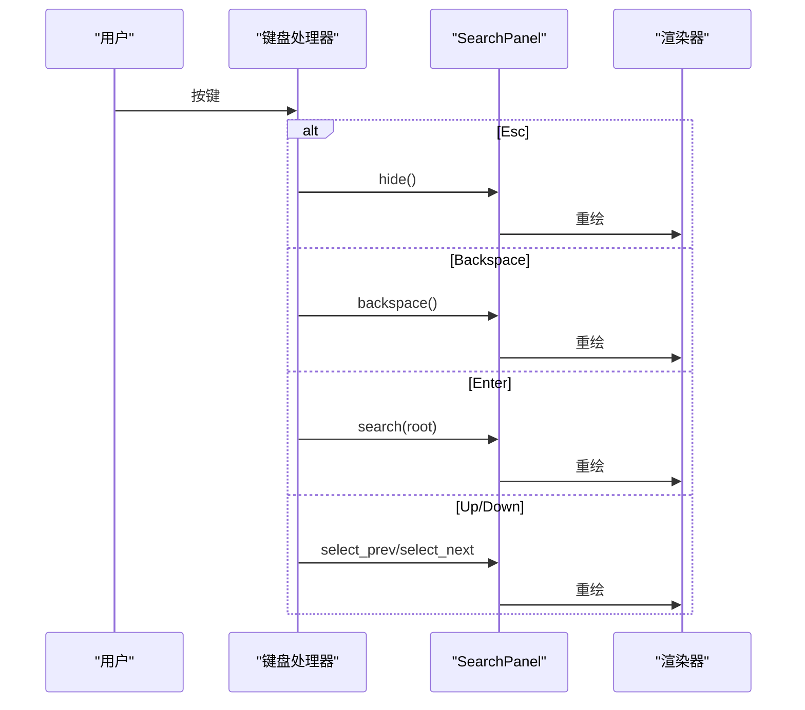
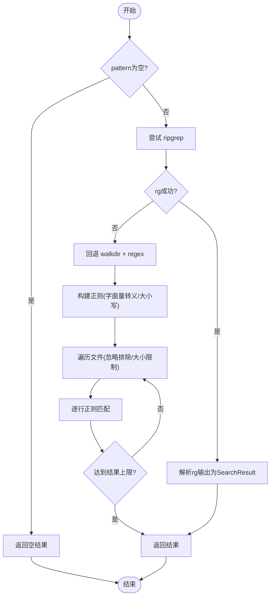
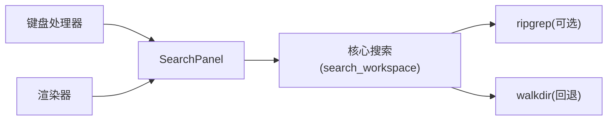

# 搜索面板组件

<cite>
**本文引用的文件**
- [crates/aether-ui/src/search_panel.rs](file://crates/aether-ui/src/search_panel.rs)
- [crates/aether-win32/src/search_panel.rs](file://crates/aether-win32/src/search_panel.rs)
- [crates/aether-core/src/search.rs](file://crates/aether-core/src/search.rs)
- [crates/aether-win32/src/render/terminal.rs](file://crates/aether-win32/src/render/terminal.rs)
- [crates/aether-win32/src/window/keyboard_handler/key_down.rs](file://crates/aether-win32/src/window/keyboard_handler/key_down.rs)
</cite>

## 目录
1. [简介](#简介)
2. [项目结构](#项目结构)
3. [核心组件](#核心组件)
4. [架构总览](#架构总览)
5. [详细组件分析](#详细组件分析)
6. [依赖关系分析](#依赖关系分析)
7. [性能考量](#性能考量)
8. [故障排查指南](#故障排查指南)
9. [结论](#结论)
10. [附录](#附录)

## 简介
本文件为“牧羊人编辑器”的搜索面板组件提供系统化文档。内容覆盖界面元素（搜索框、结果列表、过滤选项）、搜索算法与实现（全文搜索、正则/字面量模式、大小写敏感）、结果展示（文件路径、行号列号、上下文预览）、键盘交互与渲染流程，以及与编辑器核心搜索系统的集成方式。同时给出扩展与优化建议，帮助读者在现有基础上进行二次开发。

## 项目结构
搜索面板由三层组成：
- UI状态层：定义搜索面板的数据结构与基本操作（显示/隐藏、输入、清空、选择结果等）。
- 渲染与交互层：负责绘制搜索面板（输入框、选项按钮、状态行、结果列表）以及处理键盘事件（Esc、回车、上下键、退格）。
- 核心搜索层：封装工作区全文搜索能力，优先调用外部工具 ripgrep，失败时回退到 walkdir + regex 扫描。

图表来源
- [crates/aether-win32/src/render/terminal.rs:190-400](file://crates/aether-win32/src/render/terminal.rs#L190-L400)
- [crates/aether-win32/src/window/keyboard_handler/key_down.rs:400-462](file://crates/aether-win32/src/window/keyboard_handler/key_down.rs#L400-L462)
- [crates/aether-core/src/search.rs:45-171](file://crates/aether-core/src/search.rs#L45-L171)

章节来源
- [crates/aether-ui/src/search_panel.rs:1-108](file://crates/aether-ui/src/search_panel.rs#L1-L108)
- [crates/aether-win32/src/search_panel.rs:1-108](file://crates/aether-win32/src/search_panel.rs#L1-L108)
- [crates/aether-core/src/search.rs:1-342](file://crates/aether-core/src/search.rs#L1-L342)
- [crates/aether-win32/src/render/terminal.rs:190-400](file://crates/aether-win32/src/render/terminal.rs#L190-L400)
- [crates/aether-win32/src/window/keyboard_handler/key_down.rs:400-462](file://crates/aether-win32/src/window/keyboard_handler/key_down.rs#L400-L462)

## 核心组件
- SearchPanel（UI状态）
  - 字段：可见性、查询字符串、正则开关、大小写敏感开关、搜索结果列表、选中项索引、是否正在搜索、状态提示。
  - 方法：显示/隐藏、输入字符、退格、清空、执行搜索、上下选择、获取选中结果、切换正则/大小写。
- 渲染器（终端区域）
  - 绘制搜索输入框、选项标签（Aa、.*）、状态行、结果列表（相对路径+行号+列号、匹配行内容截断）。
- 键盘处理器
  - 拦截全局搜索面板的键盘事件：Esc关闭、退格删除、回车触发搜索、上下键移动选中项。
- 核心搜索（aether-core）
  - search_workspace：优先尝试 ripgrep；失败回退 walkdir + regex。
  - SearchQuery/SearchResult：查询参数与结果数据结构。
  - 构建正则、包含/排除过滤、文件大小限制、结果上限控制。

章节来源
- [crates/aether-ui/src/search_panel.rs:1-108](file://crates/aether-ui/src/search_panel.rs#L1-L108)
- [crates/aether-win32/src/render/terminal.rs:190-400](file://crates/aether-win32/src/render/terminal.rs#L190-L400)
- [crates/aether-win32/src/window/keyboard_handler/key_down.rs:400-462](file://crates/aether-win32/src/window/keyboard_handler/key_down.rs#L400-L462)
- [crates/aether-core/src/search.rs:1-342](file://crates/aether-core/src/search.rs#L1-L342)

## 架构总览
搜索面板的工作流如下：
- 用户输入与选项变更通过键盘处理器更新 SearchPanel 状态。
- 回车触发搜索：构造 SearchQuery，调用核心搜索 search_workspace。
- 核心搜索优先调用 ripgrep，解析输出为 SearchResult；若不可用则回退到 walkdir + regex。
- 渲染器读取 SearchPanel.results 并绘制结果列表，支持选中高亮与上下文预览。

图表来源
- [crates/aether-win32/src/window/keyboard_handler/key_down.rs:400-462](file://crates/aether-win32/src/window/keyboard_handler/key_down.rs#L400-L462)
- [crates/aether-win32/src/render/terminal.rs:190-400](file://crates/aether-win32/src/render/terminal.rs#L190-L400)
- [crates/aether-core/src/search.rs:45-171](file://crates/aether-core/src/search.rs#L45-L171)

## 详细组件分析

### 搜索面板状态（SearchPanel）
- 职责：维护搜索面板的视图状态与基础行为。
- 关键行为：
  - 输入与编辑：input_char/backspace/clear。
  - 搜索执行：search(root_dir) 构造 SearchQuery 并调用核心搜索。
  - 导航：select_next/select_prev/selected_result。
  - 选项切换：toggle_regex/toggle_case_sensitive。
- 复杂度：
  - 搜索执行时间取决于核心搜索实现（ripgrep或walkdir），UI层仅做状态更新与结果赋值。
- 错误处理：
  - 无查询或未打开工作区时设置状态提示，不执行搜索。

图表来源
- [crates/aether-ui/src/search_panel.rs:1-108](file://crates/aether-ui/src/search_panel.rs#L1-L108)
- [crates/aether-win32/src/search_panel.rs:1-108](file://crates/aether-win32/src/search_panel.rs#L1-L108)

章节来源
- [crates/aether-ui/src/search_panel.rs:1-108](file://crates/aether-ui/src/search_panel.rs#L1-L108)
- [crates/aether-win32/src/search_panel.rs:1-108](file://crates/aether-win32/src/search_panel.rs#L1-L108)

### 渲染与结果展示
- 输入框：显示占位符或当前查询，支持焦点样式。
- 选项标签：Aa（大小写敏感）、.*（正则），以视觉标记当前状态。
- 状态行：显示“搜索中...”、“按 Enter 搜索 · Esc 关闭”或搜索结果统计。
- 结果列表：
  - 每行显示“相对路径:行:列”，并附带匹配行内容（超过长度截断）。
  - 选中项高亮背景色。
- 分页加载：当前实现为一次性返回最多固定数量的结果（例如500条），未实现滚动分页。

图表来源
- [crates/aether-win32/src/render/terminal.rs:190-400](file://crates/aether-win32/src/render/terminal.rs#L190-L400)

章节来源
- [crates/aether-win32/src/render/terminal.rs:190-400](file://crates/aether-win32/src/render/terminal.rs#L190-L400)

### 键盘交互与事件处理
- Esc：隐藏搜索面板并重绘。
- Backspace：删除查询字符并重绘。
- Enter：在当前工作区根目录下执行搜索并重绘。
- Up/Down：在结果列表中上/下移动选中项并重绘。
- 注意：仅在搜索面板可见且非 Ctrl 修饰时生效。

图表来源
- [crates/aether-win32/src/window/keyboard_handler/key_down.rs:400-462](file://crates/aether-win32/src/window/keyboard_handler/key_down.rs#L400-L462)

章节来源
- [crates/aether-win32/src/window/keyboard_handler/key_down.rs:400-462](file://crates/aether-win32/src/window/keyboard_handler/key_down.rs#L400-L462)

### 核心搜索算法与数据模型
- SearchQuery：
  - pattern：搜索模式（字面量或正则）。
  - regex：是否使用正则表达式。
  - case_sensitive：是否区分大小写。
  - include/exclude：包含/排除的文件 glob 模式（默认排除 target/.git/node_modules）。
- SearchResult：
  - path：匹配文件的绝对路径。
  - line/col：行号与列号。
  - text：匹配行的内容。
- 搜索策略：
  - 优先调用 ripgrep（rg），参数包括 --line-number、--column、--max-count、--max-filesize、--ignore-case、--regexp/--fixed-strings、--glob。
  - 解析 rg 输出为 SearchResult，限制最大结果数（如500）。
  - 回退方案：walkdir 遍历文件，逐行正则匹配，同样限制结果数量与文件大小。
- 正则构建：
  - 字面量模式会进行转义；正则模式直接编译，支持大小写敏感配置。

图表来源
- [crates/aether-core/src/search.rs:45-171](file://crates/aether-core/src/search.rs#L45-L171)
- [crates/aether-core/src/search.rs:173-201](file://crates/aether-core/src/search.rs#L173-L201)

章节来源
- [crates/aether-core/src/search.rs:1-342](file://crates/aether-core/src/search.rs#L1-L342)

## 依赖关系分析
- UI状态层（SearchPanel）依赖核心搜索层（search_workspace）完成实际搜索。
- 渲染层依赖 UI状态层的结果与状态进行绘制。
- 键盘处理器依赖 UI状态层的方法更新状态，并触发渲染重绘。
- 核心搜索层对外部工具 ripgrep 存在可选依赖；不可用时自动回退。

图表来源
- [crates/aether-win32/src/window/keyboard_handler/key_down.rs:400-462](file://crates/aether-win32/src/window/keyboard_handler/key_down.rs#L400-L462)
- [crates/aether-win32/src/render/terminal.rs:190-400](file://crates/aether-win32/src/render/terminal.rs#L190-L400)
- [crates/aether-core/src/search.rs:45-171](file://crates/aether-core/src/search.rs#L45-L171)

章节来源
- [crates/aether-win32/src/window/keyboard_handler/key_down.rs:400-462](file://crates/aether-win32/src/window/keyboard_handler/key_down.rs#L400-L462)
- [crates/aether-win32/src/render/terminal.rs:190-400](file://crates/aether-win32/src/render/terminal.rs#L190-L400)
- [crates/aether-core/src/search.rs:45-171](file://crates/aether-core/src/search.rs#L45-L171)

## 性能考量
- 外部工具优先：ripgrep 具备高性能与并行扫描能力，显著降低大仓库搜索耗时。
- 结果上限：限制单次搜索返回的最大结果数，避免内存与渲染压力。
- 文件大小限制：跳过过大文件以减少 I/O 与解析成本。
- 正则构建缓存：当前实现每次搜索构建正则，可在高频增量场景引入查询缓存以提升性能。
- 渲染裁剪：结果列表仅绘制可视区域内的条目，减少绘制开销。
- 回退机制：当 ripgrep 不可用时，walkdir + regex 保证功能可用，但性能较低，建议在大型项目中确保安装 rg。

[本节为通用性能讨论，无需具体文件引用]

## 故障排查指南
- 未打开工作区：
  - 现象：状态提示“未打开工作区”。
  - 原因：search(root_dir) 接收不到有效根目录。
  - 处理：先打开工作区再执行搜索。
- 搜索内容为空：
  - 现象：状态提示“请输入搜索内容”，结果为空。
  - 原因：query 为空时直接返回。
  - 处理：输入有效查询后回车。
- ripgrep 不可用：
  - 现象：搜索仍可进行但速度较慢。
  - 原因：rg 命令失败，回退到 walkdir。
  - 处理：安装 ripgrep 或检查 PATH。
- 正则表达式无效：
  - 现象：搜索失败或无结果。
  - 原因：build_regex 编译失败。
  - 处理：修正正则语法或切换字面量模式。
- 结果过多导致卡顿：
  - 现象：结果列表渲染缓慢。
  - 原因：大量结果一次性绘制。
  - 处理：增加过滤条件（include/exclude）、缩小范围或实现分页。

章节来源
- [crates/aether-win32/src/render/terminal.rs:190-400](file://crates/aether-win32/src/render/terminal.rs#L190-L400)
- [crates/aether-core/src/search.rs:45-171](file://crates/aether-core/src/search.rs#L45-L171)
- [crates/aether-core/src/search.rs:173-201](file://crates/aether-core/src/search.rs#L173-L201)

## 结论
搜索面板组件通过清晰的三层架构实现了高效的全文搜索与直观的结果展示。核心搜索优先使用 ripgrep 保障性能，并在不可用时回退到 walkdir。渲染层对结果进行可视化呈现，键盘处理器提供便捷的交互体验。当前版本已满足大多数使用场景，未来可考虑引入增量搜索、结果分页、历史管理与持久化等增强功能。

[本节为总结性内容，无需具体文件引用]

## 附录

### 自定义搜索过滤器
- 目标：在工作区搜索时仅包含特定目录或文件类型。
- 步骤：
  - 在 SearchQuery.include 中添加 glob 模式（如 "src/**"、"*.rs"）。
  - 在 SearchQuery.exclude 中添加需要排除的模式（如 "target"、".git"）。
  - 调用 search(root_dir) 执行搜索。
- 参考路径：
  - [crates/aether-core/src/search.rs:6-34](file://crates/aether-core/src/search.rs#L6-L34)
  - [crates/aether-core/src/search.rs:184-201](file://crates/aether-core/src/search.rs#L184-L201)

### 优化搜索性能
- 目标：提升大仓库搜索速度与稳定性。
- 建议：
  - 确保安装 ripgrep，利用其并行与增量能力。
  - 合理设置 include/exclude，缩小搜索范围。
  - 限制文件大小与结果数量，避免过载。
  - 在高频率输入场景引入查询缓存（基于 query + buffer_version）。
- 参考路径：
  - [crates/aether-core/src/search.rs:45-171](file://crates/aether-core/src/search.rs#L45-L171)

### 扩展搜索功能
- 目标：为搜索面板添加更多能力（如多词搜索、模糊匹配、结果排序）。
- 思路：
  - 扩展 SearchQuery 字段以支持更复杂的查询语义。
  - 在核心搜索层实现新的匹配算法或接入其他搜索引擎。
  - 在渲染层增加排序与筛选控件。
- 参考路径：
  - [crates/aether-core/src/search.rs:6-34](file://crates/aether-core/src/search.rs#L6-L34)
  - [crates/aether-win32/src/render/terminal.rs:190-400](file://crates/aether-win32/src/render/terminal.rs#L190-L400)