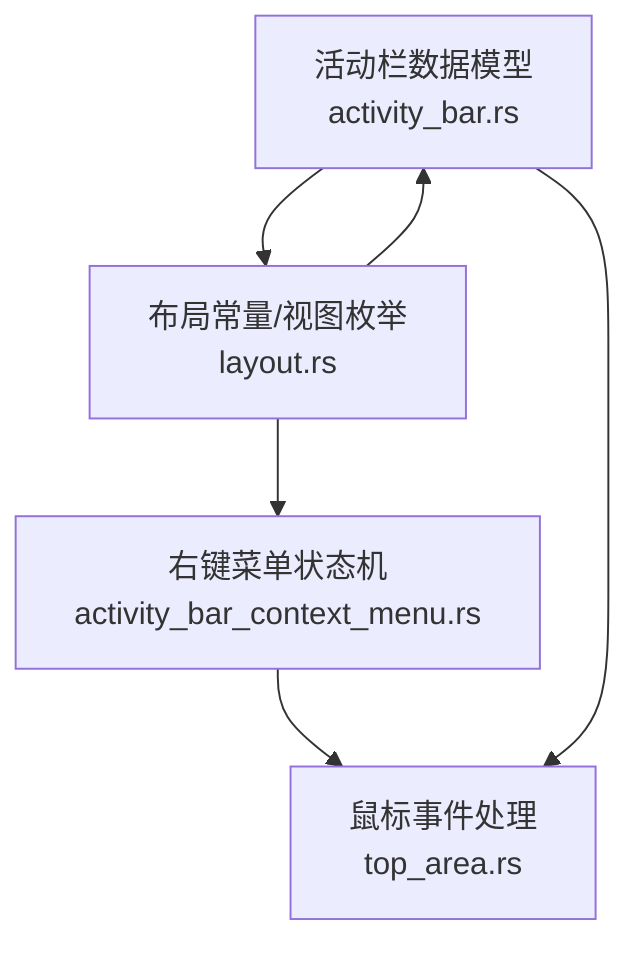
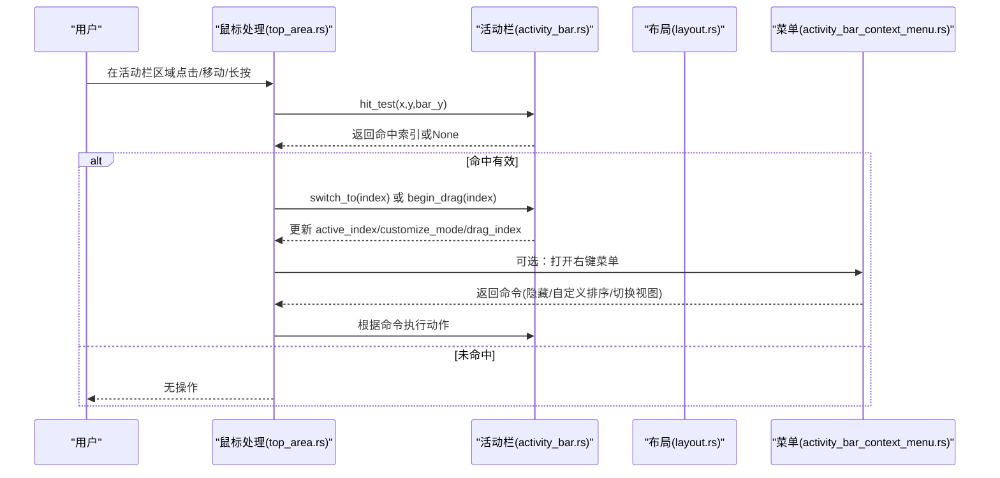
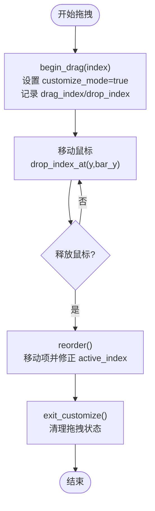
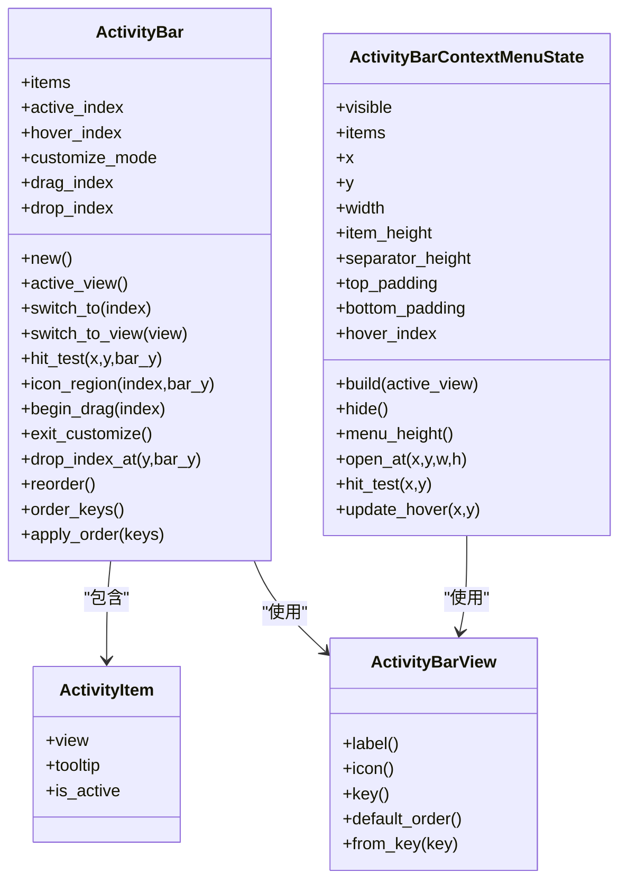

# 活动栏组件

<cite>
**本文引用的文件**
- [activity_bar.rs](file://crates/aether-win32/src/activity_bar.rs)
- [activity_bar_context_menu.rs](file://crates/aether-win32/src/activity_bar_context_menu.rs)
- [layout.rs](file://crates/aether-win32/src/layout.rs)
- [top_area.rs](file://crates/aether-win32/src/window/mouse_handler/l_button_down/top_area.rs)
</cite>

## 目录
1. [简介](#简介)
2. [项目结构](#项目结构)
3. [核心组件](#核心组件)
4. [架构总览](#架构总览)
5. [详细组件分析](#详细组件分析)
6. [依赖关系分析](#依赖关系分析)
7. [性能考量](#性能考量)
8. [故障排查指南](#故障排查指南)
9. [结论](#结论)
10. [附录：使用示例与最佳实践](#附录使用示例与最佳实践)

## 简介
本文件为牧羊人编辑器的“活动栏”组件提供系统化、可操作的文档。内容覆盖数据结构设计（ActivityItem、ActivityBar）、初始化流程、视图切换机制、拖拽重排序、状态管理（active_index、hover_index、customize_mode 等）、点击检测算法 hit_test 与图标区域计算 icon_region，以及自定义模式的工作流（begin_drag、exit_customize、reorder）。文末提供添加新活动项、处理用户交互、实现持久化配置的具体步骤指引。

## 项目结构
活动栏相关代码主要分布在以下模块：
- 数据模型与行为：aether-win32 的 activity_bar.rs
- 布局常量与视图类型：aether-win32 的 layout.rs
- 右键上下文菜单：aether-win32 的 activity_bar_context_menu.rs
- 鼠标事件处理入口：aether-win32 的 top_area.rs（活动栏按钮命中与菜单触发）

图表来源
- [activity_bar.rs:1-186](file://crates/aether-win32/src/activity_bar.rs#L1-L186)
- [layout.rs:33-96](file://crates/aether-win32/src/layout.rs#L33-L96)
- [activity_bar_context_menu.rs:13-245](file://crates/aether-win32/src/activity_bar_context_menu.rs#L13-L245)
- [top_area.rs:593-626](file://crates/aether-win32/src/window/mouse_handler/l_button_down/top_area.rs#L593-L626)

章节来源
- [activity_bar.rs:1-186](file://crates/aether-win32/src/activity_bar.rs#L1-L186)
- [layout.rs:33-96](file://crates/aether-win32/src/layout.rs#L33-L96)
- [activity_bar_context_menu.rs:13-245](file://crates/aether-win32/src/activity_bar_context_menu.rs#L13-L245)
- [top_area.rs:593-626](file://crates/aether-win32/src/window/mouse_handler/l_button_down/top_area.rs#L593-L626)

## 核心组件
- ActivityItem：表示活动栏中的一个图标项，包含视图类型、提示文本、是否激活标志。
- ActivityBar：活动栏容器，维护图标列表、当前激活索引、悬停索引、自定义模式开关、拖拽源与目标索引，并提供切换、命中测试、重排、顺序持久化等方法。
- ActivityBarView：活动栏视图枚举，定义各面板标识、标签、图标、默认顺序及键映射。
- ActivityBarContextMenuState：活动栏右键菜单的状态机，负责构建菜单项、命中测试、位置校正与显示控制。

章节来源
- [activity_bar.rs:1-186](file://crates/aether-win32/src/activity_bar.rs#L1-L186)
- [layout.rs:33-96](file://crates/aether-win32/src/layout.rs#L33-L96)
- [activity_bar_context_menu.rs:13-245](file://crates/aether-win32/src/activity_bar_context_menu.rs#L13-L245)

## 架构总览
活动栏由“数据模型 + 布局常量 + 交互处理 + 菜单子系统”组成。数据模型负责状态与业务逻辑；布局常量提供尺寸与视图类型；交互处理将鼠标事件转化为对数据模型的调用；菜单子系统提供快捷操作与可视化反馈。

图表来源
- [activity_bar.rs:52-137](file://crates/aether-win32/src/activity_bar.rs#L52-L137)
- [layout.rs:125-224](file://crates/aether-win32/src/layout.rs#L125-L224)
- [activity_bar_context_menu.rs:121-245](file://crates/aether-win32/src/activity_bar_context_menu.rs#L121-L245)
- [top_area.rs:593-626](file://crates/aether-win32/src/window/mouse_handler/l_button_down/top_area.rs#L593-L626)

## 详细组件分析

### 数据结构与职责
- ActivityItem
  - 字段：view（视图类型）、tooltip（提示文本）、is_active（是否激活）
  - 职责：承载单个活动项的展示与状态
- ActivityBar
  - 字段：items（活动项列表）、active_index（当前激活项索引）、hover_index（悬停项索引）、customize_mode（自定义模式开关）、drag_index（拖拽源索引）、drop_index（放置目标索引）
  - 职责：维护活动栏整体状态，提供切换、命中测试、重排、顺序持久化等能力
- ActivityBarView
  - 字段与方法：label、icon、key、default_order、from_key
  - 职责：定义活动栏支持的面板类型及其元信息、默认顺序、序列化键
- ActivityBarContextMenuState
  - 字段：visible、items、x/y、width、item_height、separator_height、top/bottom_padding、hover_index
  - 职责：构建菜单、命中测试、位置校正、悬停更新、隐藏

章节来源
- [activity_bar.rs:1-186](file://crates/aether-win32/src/activity_bar.rs#L1-L186)
- [layout.rs:33-96](file://crates/aether-win32/src/layout.rs#L33-L96)
- [activity_bar_context_menu.rs:13-245](file://crates/aether-win32/src/activity_bar_context_menu.rs#L13-L245)

### 初始化过程
- 构造 ActivityBar 时，默认创建三个活动项：资源管理器、源代码管理、远程管理。
- 设置初始 active_index=0，hover_index=None，customize_mode=false，drag_index=None，drop_index=None。
- 每个 ActivityItem 通过 ActivityBarView::label 生成 tooltip。

章节来源
- [activity_bar.rs:35-50](file://crates/aether-win32/src/activity_bar.rs#L35-L50)
- [layout.rs:33-96](file://crates/aether-win32/src/layout.rs#L33-L96)

### 视图切换机制
- switch_to(index)：将旧激活项 is_active 置为 false，更新 active_index，并将新项 is_active 置为 true。
- switch_to_view(view)：在 items 中查找对应 view 的索引并调用 switch_to。
- active_view()：返回当前激活项的视图类型。

章节来源
- [activity_bar.rs:52-71](file://crates/aether-win32/src/activity_bar.rs#L52-L71)

### 拖拽重排序功能
- begin_drag(index)：进入自定义模式，记录 drag_index 与 drop_index 为同一值。
- reorder()：将 drag_index 处的项移动到 drop_index 处，同时修正 active_index 以保持高亮跟随。
- exit_customize()：退出自定义模式，清空拖拽状态。
- drop_index_at(y, bar_y)：根据鼠标 y 坐标与 bar_y 计算放置目标索引（0..=items.len()），用于拖拽过程中的实时预览。

图表来源
- [activity_bar.rs:98-137](file://crates/aether-win32/src/activity_bar.rs#L98-L137)

章节来源
- [activity_bar.rs:98-137](file://crates/aether-win32/src/activity_bar.rs#L98-L137)

### 状态管理
- active_index：当前激活的活动项索引，决定哪个视图处于活跃状态。
- hover_index：鼠标悬停的活动项索引，用于渲染高亮与交互反馈。
- customize_mode：自定义模式开关，启用后允许拖拽重排序。
- drag_index：拖拽起始项索引。
- drop_index：拖拽目标项索引。

这些字段共同驱动活动栏的交互状态机，确保点击、悬停、拖拽等行为一致且可预测。

章节来源
- [activity_bar.rs:21-33](file://crates/aether-win32/src/activity_bar.rs#L21-L33)

### 点击检测算法 hit_test
- 输入：x、y、bar_y（活动栏顶部 Y 坐标）
- 逻辑：
  - 检查 x 是否在活动栏宽度范围内（ACTIVITY_BAR_WIDTH）。
  - 计算相对 y = y - bar_y，除以图标高度（ACTIVITY_BAR_BUTTON_SIZE）得到候选索引。
  - 若索引小于 items 长度，则返回该索引；否则返回 None。
- 复杂度：O(1)。

章节来源
- [activity_bar.rs:73-86](file://crates/aether-win32/src/activity_bar.rs#L73-L86)
- [layout.rs:125-224](file://crates/aether-win32/src/layout.rs#L125-L224)

### 图标区域计算 icon_region
- 输入：index、bar_y
- 输出：矩形 (left, top, width, height)
- 逻辑：
  - 校验 index 有效性。
  - 计算 top = bar_y + index * ACTIVITY_BAR_BUTTON_SIZE。
  - 返回矩形：左=0，宽=ACTIVITY_BAR_WIDTH，高=ACTIVITY_BAR_BUTTON_SIZE。
- 用途：用于渲染背景、边框、悬停效果与命中测试。

章节来源
- [activity_bar.rs:88-96](file://crates/aether-win32/src/activity_bar.rs#L88-L96)
- [layout.rs:125-224](file://crates/aether-win32/src/layout.rs#L125-L224)

### 自定义模式工作流
- 进入：begin_drag(index) 设置 customize_mode=true，并初始化拖拽源与目标。
- 移动：drop_index_at(y, bar_y) 实时更新放置目标。
- 提交：reorder() 执行重排并修正 active_index。
- 退出：exit_customize() 重置 customize_mode 与拖拽状态。

章节来源
- [activity_bar.rs:98-137](file://crates/aether-win32/src/activity_bar.rs#L98-L137)

### 右键上下文菜单
- 构建：build(active_view) 根据当前活动视图生成菜单项，并为当前活动项打勾。
- 命中：hit_test(x, y) 判断点击是否落在可见菜单区域内，跳过分隔符。
- 定位：open_at(x, y, window_width, window_height) 进行窗口边界校正。
- 悬停：update_hover(x, y) 更新 hover_index 并返回是否有变化。
- 命令：HideActivityBar、CustomizeSort、SwitchTo* 等。

章节来源
- [activity_bar_context_menu.rs:121-245](file://crates/aether-win32/src/activity_bar_context_menu.rs#L121-L245)
- [top_area.rs:593-626](file://crates/aether-win32/src/window/mouse_handler/l_button_down/top_area.rs#L593-L626)

## 依赖关系分析
- ActivityBar 依赖 layout.ActivityBarView 获取视图元信息与默认顺序。
- ActivityBar 依赖 layout 中的 ACTIVITY_BAR_WIDTH 与 ACTIVITY_BAR_BUTTON_SIZE 进行命中测试与区域计算。
- 鼠标处理 top_area.rs 调用 ActivityBar.hit_test 与 ActivityBar.switch_to，或通过菜单命令间接影响活动栏状态。
- 菜单子系统独立于活动栏数据模型，但共享 ActivityBarView 以保持一致性。

图表来源
- [activity_bar.rs:1-186](file://crates/aether-win32/src/activity_bar.rs#L1-L186)
- [layout.rs:33-96](file://crates/aether-win32/src/layout.rs#L33-L96)
- [activity_bar_context_menu.rs:13-245](file://crates/aether-win32/src/activity_bar_context_menu.rs#L13-L245)

章节来源
- [activity_bar.rs:1-186](file://crates/aether-win32/src/activity_bar.rs#L1-L186)
- [layout.rs:33-96](file://crates/aether-win32/src/layout.rs#L33-L96)
- [activity_bar_context_menu.rs:13-245](file://crates/aether-win32/src/activity_bar_context_menu.rs#L13-L245)

## 性能考量
- hit_test 与 icon_region 均为 O(1) 计算，适合高频调用（每帧鼠标移动/绘制）。
- reorder 涉及 Vec 的 remove/insert，时间复杂度 O(n)，n 为活动项数量；由于活动项数量有限，开销可接受。
- 建议：
  - 保持活动项数量较小，避免过多重排导致的性能抖动。
  - 在 UI 层合并多次状态变更后再批量刷新，减少重复绘制。

[本节为通用性能指导，不直接分析具体文件]

## 故障排查指南
- 点击无效：
  - 检查 hit_test 的 x 是否超出 ACTIVITY_BAR_WIDTH。
  - 确认 bar_y 传入正确，确保 y 相对坐标计算无误。
- 悬停异常：
  - 检查 hover_index 是否正确更新，避免与渲染不同步。
- 拖拽错位：
  - 核对 drop_index_at 使用的图标高度是否与渲染一致。
  - 确认 reorder 后 active_index 修正逻辑是否覆盖所有边界情况。
- 菜单不显示或位置错误：
  - 检查 open_at 的窗口宽高参数，确保边界校正生效。
  - 验证 visible 与 hit_test 的逻辑分支。

章节来源
- [activity_bar.rs:73-137](file://crates/aether-win32/src/activity_bar.rs#L73-L137)
- [activity_bar_context_menu.rs:195-245](file://crates/aether-win32/src/activity_bar_context_menu.rs#L195-L245)
- [top_area.rs:593-626](file://crates/aether-win32/src/window/mouse_handler/l_button_down/top_area.rs#L593-L626)

## 结论
活动栏组件通过清晰的数据结构与状态机，实现了视图切换、拖拽重排序与右键菜单等核心交互。hit_test 与 icon_region 提供了高效的命中测试与区域计算，配合布局常量保证渲染与交互一致性。自定义模式通过 begin_drag、reorder、exit_customize 形成完整闭环，便于用户个性化排列活动项。结合 order_keys 与 apply_order，可实现配置的持久化与恢复。

[本节为总结性内容，不直接分析具体文件]

## 附录：使用示例与最佳实践

### 添加新的活动项
- 在 ActivityBarView 中添加新的枚举变体，并实现 label、icon、key。
- 在 ActivityBar::new 中向 items 追加新的 ActivityItem。
- 如需纳入默认顺序，可在 default_order 中调整。

章节来源
- [layout.rs:33-96](file://crates/aether-win32/src/layout.rs#L33-L96)
- [activity_bar.rs:35-50](file://crates/aether-win32/src/activity_bar.rs#L35-L50)

### 处理用户交互
- 点击：调用 ActivityBar::hit_test 判定命中，再调用 switch_to 或 switch_to_view 切换视图。
- 悬停：维护 hover_index，并在渲染时应用高亮样式。
- 长按进入自定义模式：调用 begin_drag，随后在鼠标移动时更新 drop_index_at，释放时调用 reorder。
- 右键菜单：构建菜单项，使用 open_at 定位，hit_test 处理点击，执行对应命令。

章节来源
- [activity_bar.rs:52-137](file://crates/aether-win32/src/activity_bar.rs#L52-L137)
- [activity_bar_context_menu.rs:121-245](file://crates/aether-win32/src/activity_bar_context_menu.rs#L121-L245)
- [top_area.rs:593-626](file://crates/aether-win32/src/window/mouse_handler/l_button_down/top_area.rs#L593-L626)

### 实现持久化配置
- 导出顺序：调用 order_keys 获取当前顺序的键列表，写入配置文件。
- 恢复顺序：读取配置后调用 apply_order，自动补充缺失的默认项并修正 active_index。

章节来源
- [activity_bar.rs:139-185](file://crates/aether-win32/src/activity_bar.rs#L139-L185)