# 用户界面组件

<cite>
**本文引用的文件**
- [aether-ui/src/lib.rs](file://crates/aether-ui/src/lib.rs)
- [aether-ui/src/activity_bar.rs](file://crates/aether-ui/src/activity_bar.rs)
- [aether-ui/src/command_palette.rs](file://crates/aether-ui/src/command_palette.rs)
- [aether-ui/src/dialogs.rs](file://crates/aether-ui/src/dialogs.rs)
- [aether-ui/src/search_panel.rs](file://crates/aether-ui/src/search_panel.rs)
- [aether-ui/src/menu_bar.rs](file://crates/aether-ui/src/menu_bar.rs)
- [aether-ui/src/status_bar.rs](file://crates/aether-ui/src/status_bar.rs)
- [aether-ui/src/theme.rs](file://crates/aether-ui/src/theme.rs)
- [aether-ui/src/layout.rs](file://crates/aether-ui/src/layout.rs)
- [aether-win32/src/activity_bar.rs](file://crates/aether-win32/src/activity_bar.rs)
- [aether-win32/src/command_palette.rs](file://crates/aether-win32/src/command_palette.rs)
- [aether-win32/src/search_panel.rs](file://crates/aether-win32/src/search_panel.rs)
- [aether-render/src/theme.rs](file://crates/aether-render/src/theme.rs)
- [aether-win32/src/render/mod.rs](file://crates/aether-win32/src/render/mod.rs)
</cite>

## 目录
1. [简介](#简介)
2. [项目结构](#项目结构)
3. [核心组件](#核心组件)
4. [架构总览](#架构总览)
5. [详细组件分析](#详细组件分析)
6. [依赖关系分析](#依赖关系分析)
7. [性能考量](#性能考量)
8. [故障排查指南](#故障排查指南)
9. [结论](#结论)
10. [附录：自定义控件与主题定制实践](#附录自定义控件与主题定制实践)

## 简介
本章节面向牧羊人编辑器的用户界面组件，系统性说明活动栏、命令面板、对话框、搜索面板等核心 UI 的设计与实现。文档覆盖交互逻辑、状态管理、事件处理机制，并给出自定义控件开发方式（绘制、输入、动画）以及主题系统（颜色方案、字体配置、样式定制）的落地方法。同时提供具体代码片段路径，便于快速定位实现细节。

## 项目结构
UI 相关能力分布在多个 crate：
- aether-ui：通用 UI 组件与布局常量、主题设置入口
- aether-win32：Windows 平台窗口集成、渲染管线、各组件的具体实现与绘制
- aether-render：渲染主题、语法着色、D2D/DirectWrite 抽象
- aether-core：工作区搜索、词法分析等底层能力

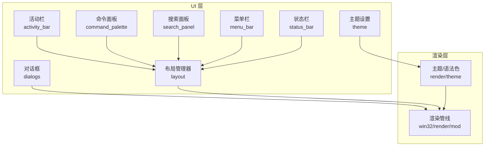

图表来源
- [aether-ui/src/layout.rs:125-218](file://crates/aether-ui/src/layout.rs#L125-L218)
- [aether-render/src/theme.rs:8-31](file://crates/aether-render/src/theme.rs#L8-L31)
- [aether-win32/src/render/mod.rs:146-232](file://crates/aether-win32/src/render/mod.rs#L146-L232)

章节来源
- [aether-ui/src/lib.rs:1-34](file://crates/aether-ui/src/lib.rs#L1-L34)

## 核心组件
- 活动栏：图标项集合、当前激活项、拖拽重排、点击命中、持久化顺序
- 命令面板：命令清单构建、查询过滤、选择导航、显示/隐藏切换
- 对话框：基于 Windows COM 的文件/文件夹/保存对话框与消息框封装
- 搜索面板：全局搜索状态、正则/大小写选项、结果列表与选中项
- 菜单栏：菜单项定义、子菜单展开、命中测试、拖拽重排与持久化
- 状态栏：分区布局、宽度自适应、Git 分支/语言/编码/错误计数展示
- 布局管理器：区域计算、可见性控制、侧边栏/底部面板/右侧面板尺寸与动画
- 主题系统：深色与毛玻璃主题、语法着色、UI 背景与边框、透明度控制

章节来源
- [aether-ui/src/activity_bar.rs:1-186](file://crates/aether-ui/src/activity_bar.rs#L1-L186)
- [aether-ui/src/command_palette.rs:1-341](file://crates/aether-ui/src/command_palette.rs#L1-L341)
- [aether-ui/src/dialogs.rs:1-245](file://crates/aether-ui/src/dialogs.rs#L1-L245)
- [aether-ui/src/search_panel.rs:1-108](file://crates/aether-ui/src/search_panel.rs#L1-L108)
- [aether-ui/src/menu_bar.rs:1-464](file://crates/aether-ui/src/menu_bar.rs#L1-L464)
- [aether-ui/src/status_bar.rs:1-192](file://crates/aether-ui/src/status_bar.rs#L1-L192)
- [aether-ui/src/layout.rs:222-648](file://crates/aether-ui/src/layout.rs#L222-L648)
- [aether-ui/src/theme.rs:1-26](file://crates/aether-ui/src/theme.rs#L1-L26)

## 架构总览
UI 组件通过布局管理器统一计算区域几何，渲染管线根据脏矩形增量更新；主题系统提供颜色与语法着色；对话框与搜索面板分别调用系统 API 与核心搜索能力。

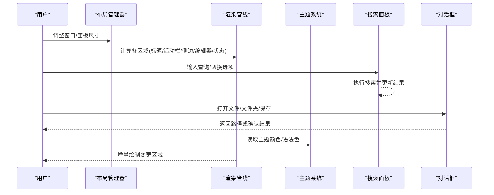

图表来源
- [aether-ui/src/layout.rs:337-509](file://crates/aether-ui/src/layout.rs#L337-L509)
- [aether-win32/src/render/mod.rs:223-232](file://crates/aether-win32/src/render/mod.rs#L223-L232)
- [aether-render/src/theme.rs:148-211](file://crates/aether-render/src/theme.rs#L148-L211)
- [aether-ui/src/search_panel.rs:57-79](file://crates/aether-ui/src/search_panel.rs#L57-L79)
- [aether-ui/src/dialogs.rs:45-187](file://crates/aether-ui/src/dialogs.rs#L45-L187)

## 详细组件分析

### 活动栏（ActivityBar）
- 数据结构：ActivityItem（视图、提示、是否激活）、ActivityBar（项列表、活动索引、悬停、自定义模式、拖拽/放置索引）
- 交互逻辑：
  - 点击检测：按按钮尺寸与 y 坐标计算命中项
  - 切换视图：维护 active_index 与 is_active 标志
  - 自定义模式：长按进入，支持拖拽重排，drop_index_at 计算目标位置，reorder 执行插入并保持高亮跟随
  - 持久化：order_keys 输出键序列，apply_order 恢复顺序并补全默认项
- 事件处理：hit_test、icon_region 用于命中与绘制区域；begin_drag/exit_customize 管理自定义模式生命周期
- 性能：重排为 O(n) 插入删除，项数少可接受；保持 active_index 同步避免额外遍历

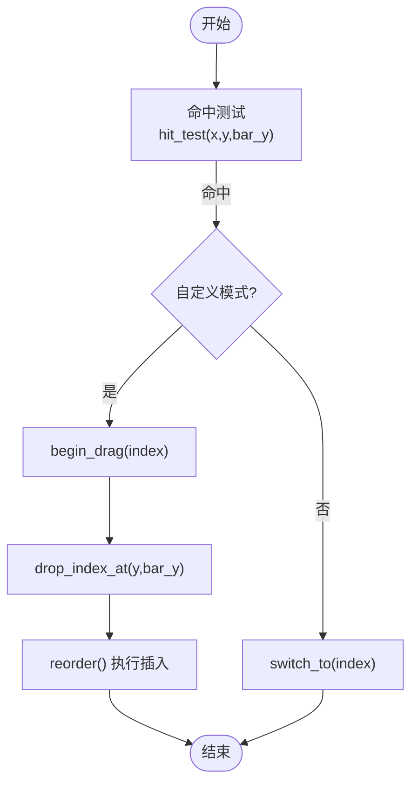

图表来源
- [aether-ui/src/activity_bar.rs:73-137](file://crates/aether-ui/src/activity_bar.rs#L73-L137)

章节来源
- [aether-ui/src/activity_bar.rs:1-186](file://crates/aether-ui/src/activity_bar.rs#L1-L186)
- [aether-win32/src/activity_bar.rs:1-186](file://crates/aether-win32/src/activity_bar.rs#L1-L186)

### 命令面板（CommandPalette）
- 数据结构：CommandPaletteItem（标签、描述、快捷键、命令ID、图标）、CommandPalette（可见性、查询、项列表、过滤索引、选中项、最大可见条目）
- 交互逻辑：
  - 构建命令清单：集中注册常用命令（文件/编辑/视图/运行/终端/搜索/AI/帮助/Markdown）
  - 查询过滤：update_query/append_query/backspace_query 触发 filter，按标签与描述包含匹配
  - 选择导航：select_prev/select_next 在 filtered_items 中移动 selected_index
  - 显示控制：show/hide/toggle 管理可见性与清空查询
- 事件处理：selected_command 获取当前命令 ID，供上层执行
- 性能：filter 为 O(n) 扫描，n 较小；可选替换为模糊匹配库提升体验

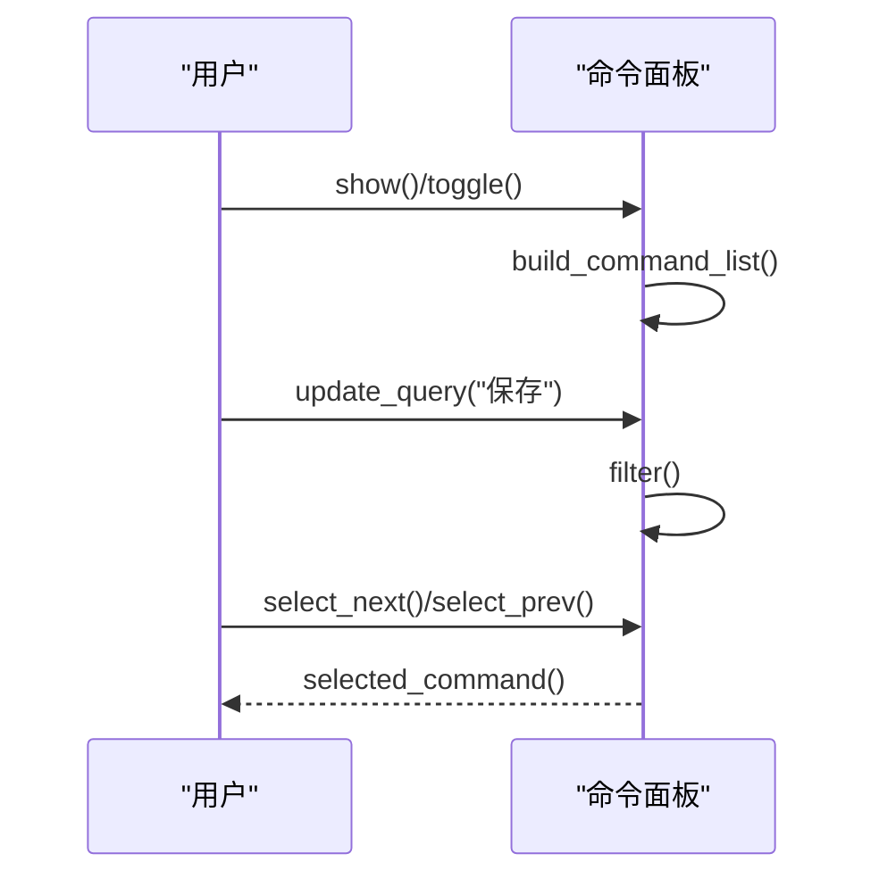

图表来源
- [aether-ui/src/command_palette.rs:22-341](file://crates/aether-ui/src/command_palette.rs#L22-L341)

章节来源
- [aether-ui/src/command_palette.rs:1-341](file://crates/aether-ui/src/command_palette.rs#L1-L341)
- [aether-win32/src/command_palette.rs:1-341](file://crates/aether-win32/src/command_palette.rs#L1-L341)

### 对话框（Dialogs）
- 功能：打开文件夹、打开文件、保存文件、C 文件快捷打开、错误/信息/确认消息框
- 实现要点：
  - COM 初始化守卫：ComGuard RAII 确保 CoInitializeEx/CoUninitialize 配对
  - 使用 IFileOpenDialog/IFileSaveDialog 设置选项、标题、默认目录
  - 记忆上次打开目录：last_folder 模块持久化到 APPDATA/Aether
  - 信任目录：trusted_folders 模块防止重复弹窗
- 事件处理：Show 失败返回 None；成功则解析路径并持久化

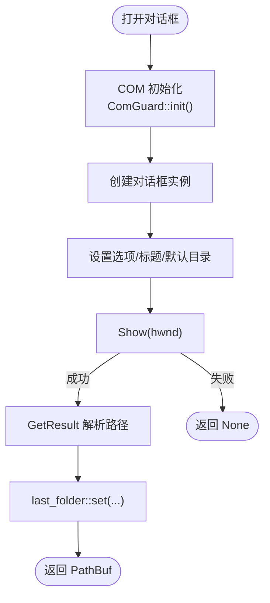

图表来源
- [aether-ui/src/dialogs.rs:11-187](file://crates/aether-ui/src/dialogs.rs#L11-L187)
- [aether-ui/src/dialogs.rs:313-353](file://crates/aether-ui/src/dialogs.rs#L313-L353)

章节来源
- [aether-ui/src/dialogs.rs:1-245](file://crates/aether-ui/src/dialogs.rs#L1-L245)

### 搜索面板（SearchPanel）
- 数据结构：visible、query、regex、case_sensitive、results、selected_index、is_searching、status
- 交互逻辑：
  - 输入：input_char/backspace/clear 管理查询
  - 搜索：search(root_dir) 构造 SearchQuery 并调用 search_workspace，更新 results 与 status
  - 导航：select_next/select_prev 循环选择结果
  - 选项：toggle_regex/toggle_case_sensitive 切换搜索行为
- 事件处理：selected_result 获取当前选中结果

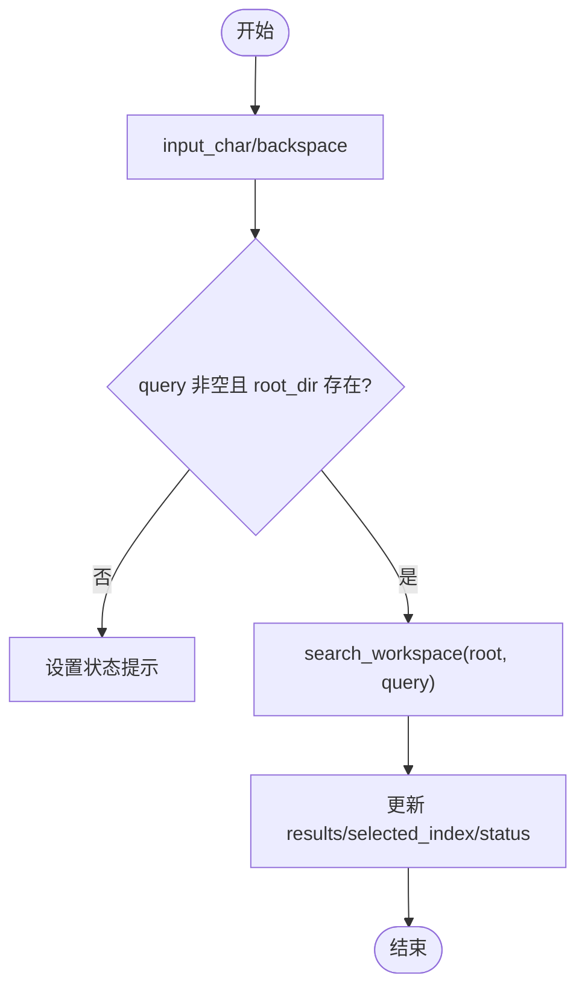

图表来源
- [aether-ui/src/search_panel.rs:16-108](file://crates/aether-ui/src/search_panel.rs#L16-L108)

章节来源
- [aether-ui/src/search_panel.rs:1-108](file://crates/aether-ui/src/search_panel.rs#L1-L108)
- [aether-win32/src/search_panel.rs:1-108](file://crates/aether-win32/src/search_panel.rs#L1-L108)

### 菜单栏（MenuBar）
- 数据结构：MenuItem、MenuBarItem、MenuBar（items、active_index、hover、submenu_hover、item_widths、item_x_positions、layout_dirty、customize_mode、drag/drop）
- 交互逻辑：
  - 展开/关闭：expand/close_all 管理子菜单状态
  - 命中测试：hit_test 优先使用 item_x_positions 保证命中与绘制一致
  - 子菜单区域：submenu_region 生成可点击区域
  - 拖拽重排：begin_drag/drop_index_at/reorder 支持自定义模式下的菜单项排序
  - 持久化：order_keys/apply_order 保留用户自定义顺序
- 事件处理：hit_test_submenu 用于子菜单项命中

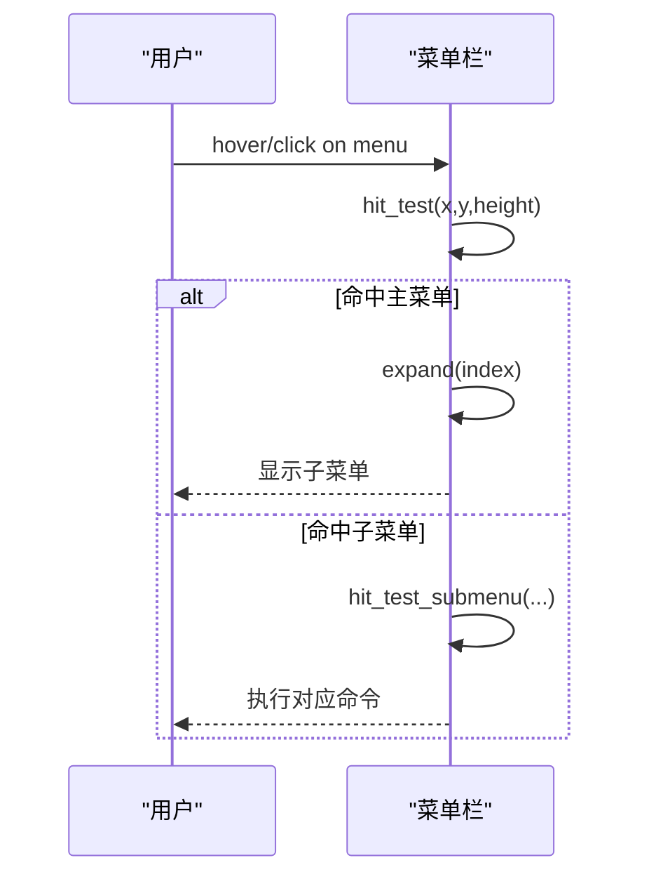

图表来源
- [aether-ui/src/menu_bar.rs:178-464](file://crates/aether-ui/src/menu_bar.rs#L178-L464)

章节来源
- [aether-ui/src/menu_bar.rs:1-464](file://crates/aether-ui/src/menu_bar.rs#L1-L464)

### 状态栏（StatusBar）
- 数据结构：StatusBarSection（label、width、clickable、icon）、StatusBar（sections、hover_index）
- 交互逻辑：
  - 分区布局：section_regions 计算左右分区 x 坐标，跳过 width<=0 的分区
  - 点击检测：hit_test 返回原始 section 索引
  - 宽度自适应：update_widths 测量文本宽度+图标+内边距，clamp 到 [40,200]
  - 动态更新：update_git_branch/update_cursor_position/update_language/update_status
- 事件处理：hover_index 记录悬停分区

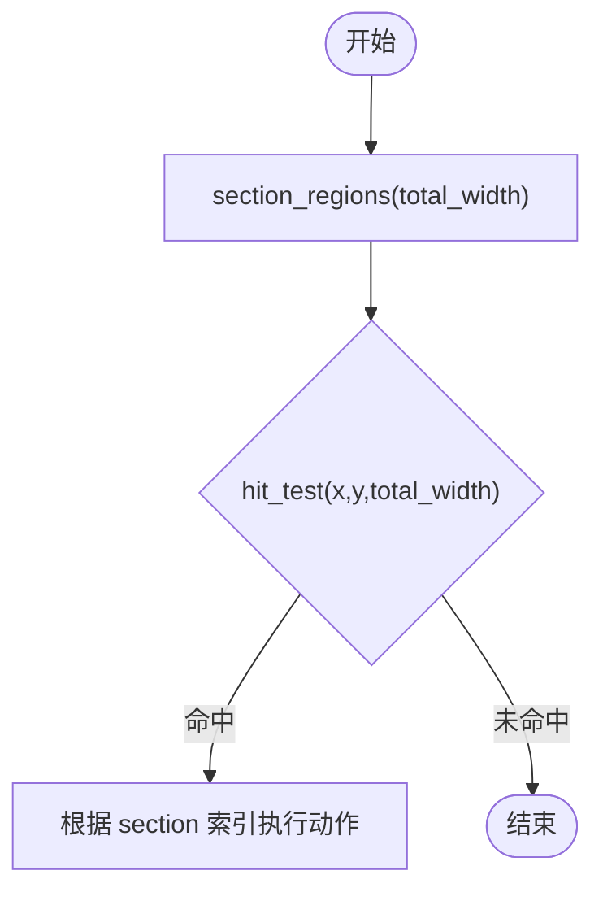

图表来源
- [aether-ui/src/status_bar.rs:119-192](file://crates/aether-ui/src/status_bar.rs#L119-L192)

章节来源
- [aether-ui/src/status_bar.rs:1-192](file://crates/aether-ui/src/status_bar.rs#L1-L192)

### 布局管理器（LayoutManager）
- 职责：计算标题栏、菜单栏、活动栏、侧边栏、编辑器、标签栏、右侧面板、底部面板、状态栏的区域；管理可见性与尺寸；提供侧边栏动画
- 关键方法：
  - 区域计算：title_bar_region、sidebar_region、editor_region、tab_bar_region、editor_content_region、right_panel_region、bottom_panel_region、status_bar_region
  - 尺寸调整：resize_sidebar、resize_right_panel、resize_bottom_panel
  - 可见性切换：toggle_sidebar、toggle_activity_bar、toggle_status_bar、toggle_bottom_panel、toggle_right_panel
  - DPI 适配：apply_dpi_scale 按比例换算用户可调尺寸
  - 动画：SidebarAnim 线性插值 200ms 完成收起/展开

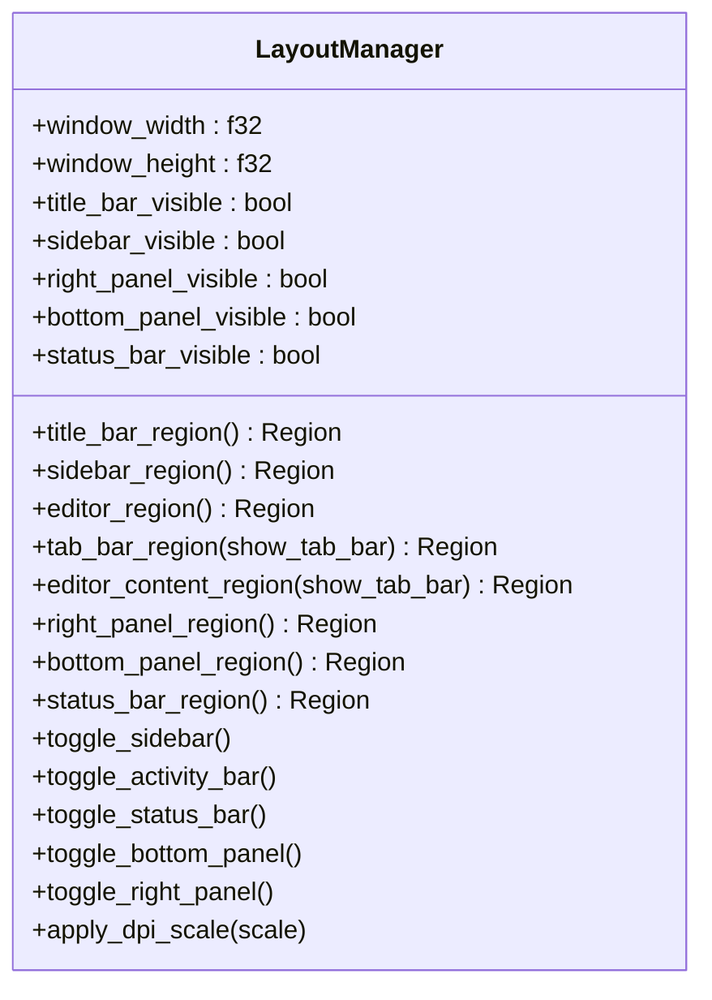

图表来源
- [aether-ui/src/layout.rs:222-648](file://crates/aether-ui/src/layout.rs#L222-L648)

章节来源
- [aether-ui/src/layout.rs:125-218](file://crates/aether-ui/src/layout.rs#L125-L218)
- [aether-ui/src/layout.rs:222-648](file://crates/aether-ui/src/layout.rs#L222-L648)

### 主题系统（Theme）
- 主题类型：深色（不透明回退）与毛玻璃（半透明面板、柔和边框、光晕选择效果）
- 颜色体系：编辑器背景、行号、选择高亮、光标、侧边栏、状态栏、标签栏、标题栏、活动栏、面板边框、阴影、命令面板/子菜单背景
- 语法着色：SyntaxColors 共享构造，映射 TokenKind 与语义令牌索引到颜色
- UI 设置：UiSettings 控制玻璃效果开关；glass_theme/dark_theme 提供主题入口

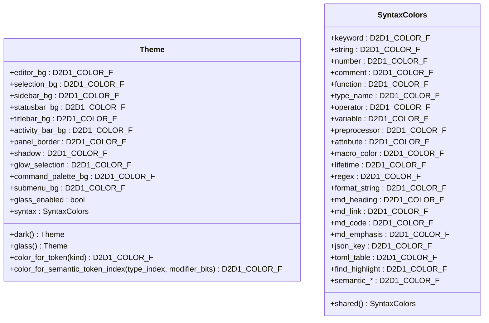

图表来源
- [aether-render/src/theme.rs:8-86](file://crates/aether-render/src/theme.rs#L8-L86)
- [aether-render/src/theme.rs:148-211](file://crates/aether-render/src/theme.rs#L148-L211)
- [aether-render/src/theme.rs:213-279](file://crates/aether-render/src/theme.rs#L213-L279)

章节来源
- [aether-ui/src/theme.rs:1-26](file://crates/aether-ui/src/theme.rs#L1-L26)
- [aether-render/src/theme.rs:8-279](file://crates/aether-render/src/theme.rs#L8-L279)

## 依赖关系分析
- 组件耦合：
  - 活动栏/菜单栏/状态栏依赖布局管理器计算区域与尺寸
  - 命令面板依赖菜单栏的命令 ID 枚举
  - 搜索面板依赖核心搜索能力
  - 对话框依赖 Windows COM API
  - 渲染管线依赖主题系统与布局管理器
- 外部依赖：
  - Windows 平台：Direct2D/DirectWrite、COM 对话框
  - 核心库：词法分析、工作区搜索

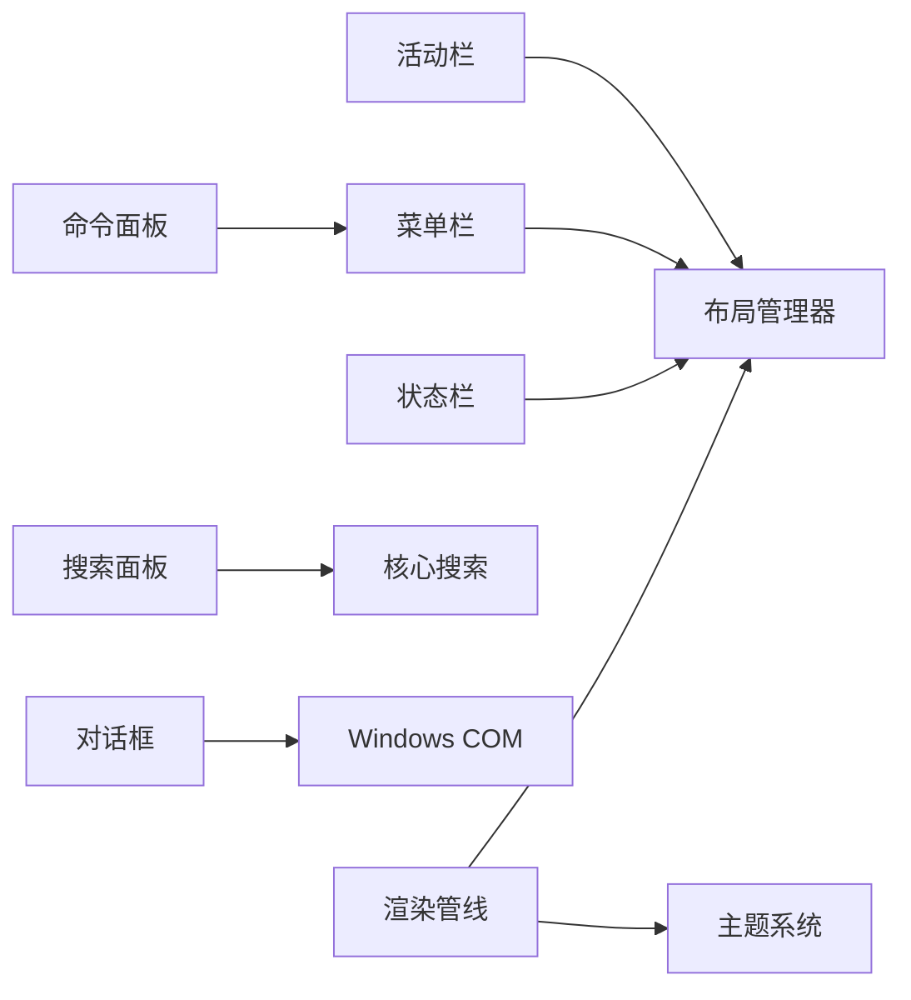

图表来源
- [aether-ui/src/layout.rs:222-648](file://crates/aether-ui/src/layout.rs#L222-L648)
- [aether-ui/src/menu_bar.rs:1-464](file://crates/aether-ui/src/menu_bar.rs#L1-L464)
- [aether-ui/src/search_panel.rs:1-108](file://crates/aether-ui/src/search_panel.rs#L1-L108)
- [aether-ui/src/dialogs.rs:1-245](file://crates/aether-ui/src/dialogs.rs#L1-L245)
- [aether-render/src/theme.rs:8-279](file://crates/aether-render/src/theme.rs#L8-L279)
- [aether-win32/src/render/mod.rs:146-232](file://crates/aether-win32/src/render/mod.rs#L146-L232)

章节来源
- [aether-ui/src/layout.rs:222-648](file://crates/aether-ui/src/layout.rs#L222-L648)
- [aether-win32/src/render/mod.rs:146-232](file://crates/aether-win32/src/render/mod.rs#L146-L232)

## 性能考量
- 增量渲染：渲染管线基于脏矩形推断最优命令，避免全窗口重绘；菜单 hover 快速路径仅重绘不透明菜单本体
- 布局动画：侧边栏收起/展开使用 200ms 线性插值，终态帧强制全窗口重绘避免残影
- 命中测试优化：菜单栏优先使用预计算的 item_x_positions，减少每帧分配与计算
- 搜索性能：search_workspace 在工作区目录执行，建议结合缓存或异步策略应对大项目
- 主题资源：预构建 SVG 图标几何与常用画笔/文本格式，减少首次渲染卡顿

章节来源
- [aether-win32/src/render/mod.rs:282-535](file://crates/aether-win32/src/render/mod.rs#L282-L535)
- [aether-win32/src/render/mod.rs:544-637](file://crates/aether-win32/src/render/mod.rs#L544-L637)
- [aether-ui/src/layout.rs:256-285](file://crates/aether-ui/src/layout.rs#L256-L285)

## 故障排查指南
- 对话框无响应：检查 COM 初始化是否成功（ComGuard），确认 hwnd 有效；查看 last_folder 持久化文件权限
- 搜索结果为空：确认 query 非空且 root_dir 存在；检查 regex/case_sensitive 选项；验证 search_workspace 返回
- 菜单命中错位：确保 item_x_positions 与 item_widths 同步更新；layout_dirty 时重建布局
- 状态栏分区重叠：检查 width<=0 的分区是否被正确跳过；update_widths 后 clamp 范围是否符合预期
- 主题颜色异常：确认 Theme::dark/glass 选择正确；语法着色映射是否覆盖所有 TokenKind

章节来源
- [aether-ui/src/dialogs.rs:11-36](file://crates/aether-ui/src/dialogs.rs#L11-L36)
- [aether-ui/src/search_panel.rs:57-79](file://crates/aether-ui/src/search_panel.rs#L57-L79)
- [aether-ui/src/menu_bar.rs:277-314](file://crates/aether-ui/src/menu_bar.rs#L277-L314)
- [aether-ui/src/status_bar.rs:119-192](file://crates/aether-ui/src/status_bar.rs#L119-L192)
- [aether-render/src/theme.rs:246-279](file://crates/aether-render/src/theme.rs#L246-L279)

## 结论
牧羊人编辑器的 UI 组件以布局管理器为核心，结合主题系统与渲染管线，实现了高度可定制、高性能的用户界面。活动栏、命令面板、对话框、搜索面板等组件具备清晰的交互逻辑与状态管理，支持拖拽重排、动画过渡与持久化配置。通过主题系统可灵活切换视觉风格与语法着色，满足多场景需求。

## 附录：自定义控件与主题定制实践
- 创建自定义控件
  - 参考活动栏/菜单栏的数据结构与交互模式，定义新控件的状态与事件处理方法
  - 使用布局管理器计算区域，并在渲染管线中按需绘制
  - 示例路径：[活动栏实现:1-186](file://crates/aether-ui/src/activity_bar.rs#L1-L186)、[菜单栏实现:178-464](file://crates/aether-ui/src/menu_bar.rs#L178-L464)
- 集成现有组件
  - 命令面板：通过 CommandId 注册新命令，并在 build_command_list 中添加条目
  - 搜索面板：扩展 SearchQuery 选项，调用 search_workspace 获取结果
  - 示例路径：[命令面板:36-239](file://crates/aether-ui/src/command_palette.rs#L36-L239)、[搜索面板:57-79](file://crates/aether-ui/src/search_panel.rs#L57-L79)
- 实现特定交互效果
  - 拖拽重排：参考 begin_drag/drop_index_at/reorder 模式
  - 动画过渡：使用 SidebarAnim 线性插值，或在渲染循环中自行实现 tick
  - 示例路径：[活动栏重排:98-137](file://crates/aether-ui/src/activity_bar.rs#L98-L137)、[侧边栏动画](file://crates/aether-ui/src/layout.rs:256-285)
- 主题定制
  - 选择主题：glass_theme/dark_theme 切换毛玻璃与深色主题
  - 修改颜色：调整 Theme 中的背景、边框、选择高亮等颜色字段
  - 语法着色：通过 SyntaxColors 映射 TokenKind 与语义令牌到颜色
  - 示例路径：[主题设置:17-25](file://crates/aether-ui/src/theme.rs#L17-L25)、[主题实现:148-211](file://crates/aether-render/src/theme.rs#L148-L211)