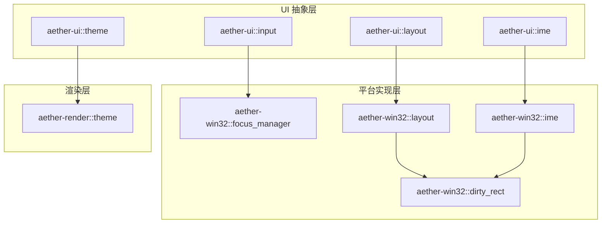
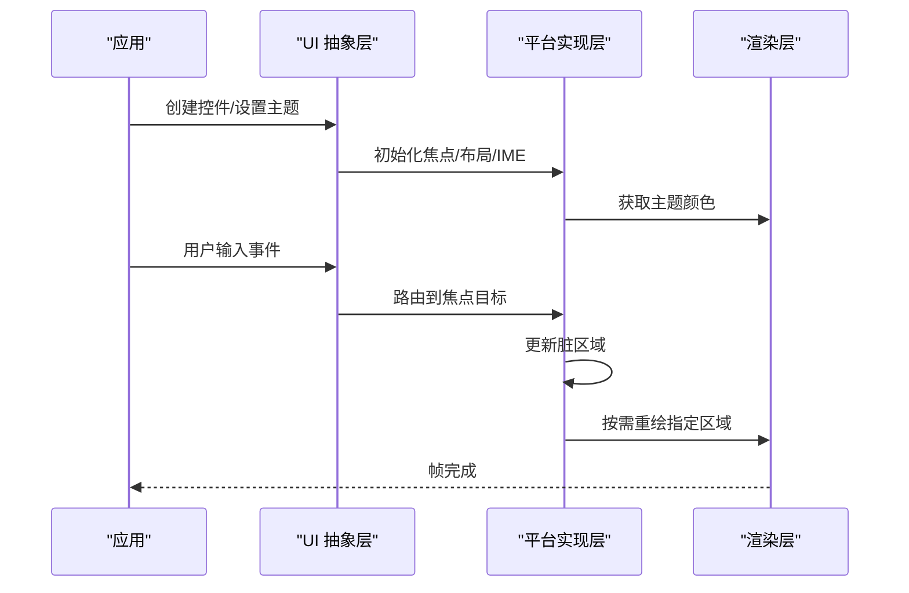
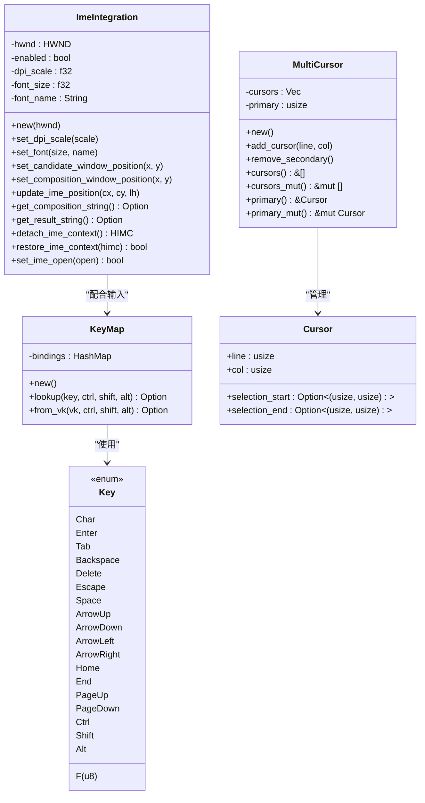
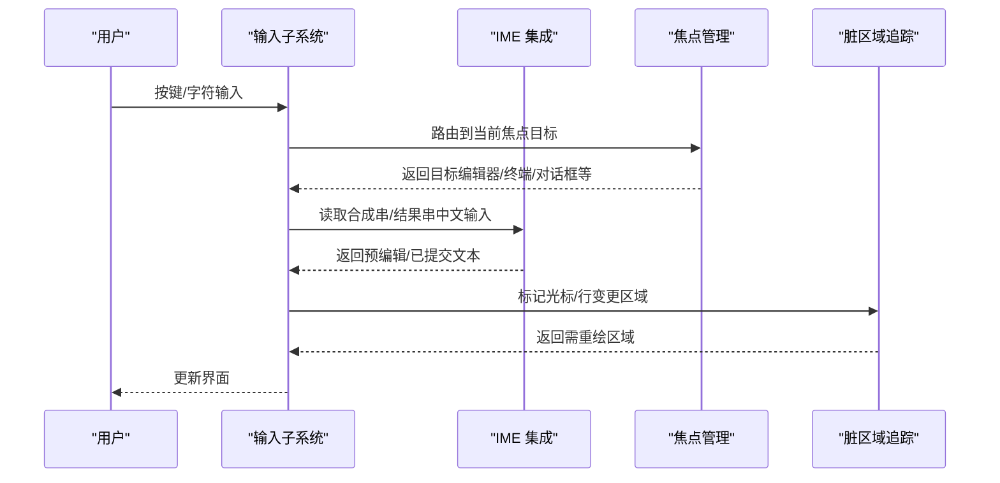
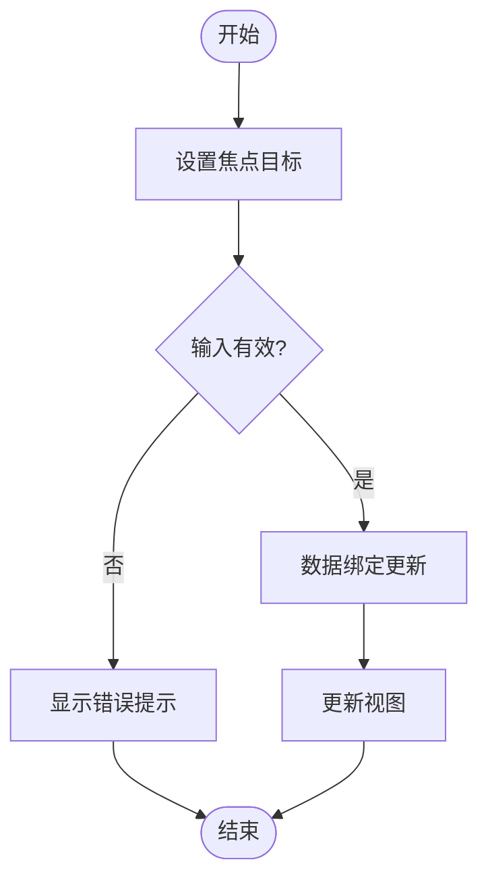
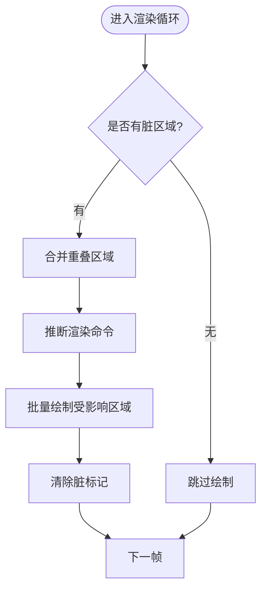
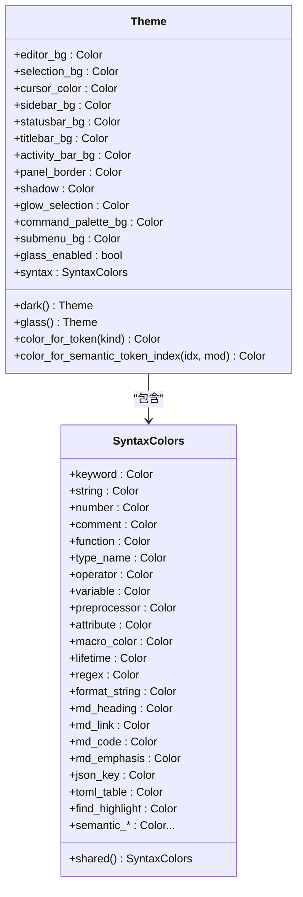
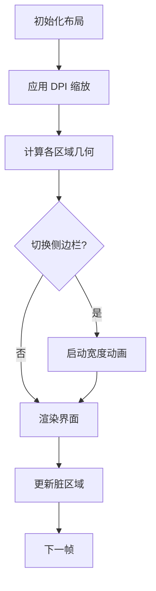
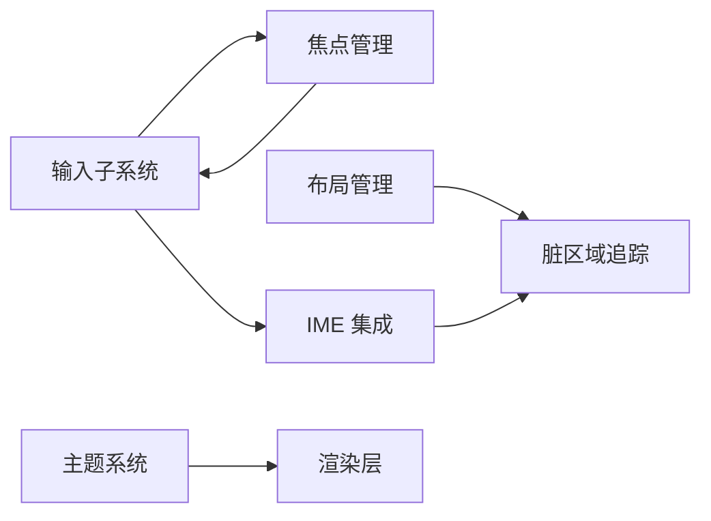

# 自定义控件

<cite>
**本文引用的文件**
- [crates/aether-ui/src/lib.rs](file://crates/aether-ui/src/lib.rs)
- [crates/aether-win32/src/lib.rs](file://crates/aether-win32/src/lib.rs)
- [crates/aether-ui/src/input.rs](file://crates/aether-ui/src/input.rs)
- [crates/aether-win32/src/input.rs](file://crates/aether-win32/src/input.rs)
- [crates/aether-ui/src/ime.rs](file://crates/aether-ui/src/ime.rs)
- [crates/aether-win32/src/ime.rs](file://crates/aether-win32/src/ime.rs)
- [crates/aether-win32/src/dirty_rect.rs](file://crates/aether-win32/src/dirty_rect.rs)
- [crates/aether-win32/src/focus_manager.rs](file://crates/aether-win32/src/focus_manager.rs)
- [crates/aether-ui/src/theme.rs](file://crates/aether-ui/src/theme.rs)
- [crates/aether-render/src/theme.rs](file://crates/aether-render/src/theme.rs)
- [crates/aether-ui/src/layout.rs](file://crates/aether-ui/src/layout.rs)
- [crates/aether-win32/src/layout.rs](file://crates/aether-win32/src/layout.rs)
</cite>

## 目录
1. [简介](#简介)
2. [项目结构](#项目结构)
3. [核心组件](#核心组件)
4. [架构总览](#架构总览)
5. [详细组件分析](#详细组件分析)
6. [依赖关系分析](#依赖关系分析)
7. [性能考量](#性能考量)
8. [故障排查指南](#故障排查指南)
9. [结论](#结论)
10. [附录](#附录)

## 简介
本文件为牧羊人编辑器的“自定义控件系统”提供系统化文档。围绕控件基类与绘制接口、输入控件（文本输入、光标管理、IME 输入法支持）、状态管理（焦点、验证、数据绑定）、渲染流程（脏区域计算、批量绘制、硬件加速优化）以及样式系统（主题适配、CSS 风格定义、动画效果），给出从架构到实现细节的完整说明，并附带可操作的实践指引与示例路径，帮助读者快速创建自定义控件、实现复杂交互并优化渲染性能。

## 项目结构
本项目将 UI 抽象与平台相关实现分层组织：
- aether-ui：跨平台的 UI 抽象层，包含输入、IME、布局、主题等通用能力。
- aether-win32：Windows 平台的具体实现，包含脏矩形追踪、焦点管理、布局管理器、Win32 IME 集成等。
- aether-render：渲染与主题系统，提供 D2D/GPU 渲染与主题颜色映射。
- 其他模块：编辑器核心、LSP、终端、AI 面板等上层功能。

图表来源
- [crates/aether-ui/src/lib.rs:1-34](file://crates/aether-ui/src/lib.rs#L1-L34)
- [crates/aether-win32/src/lib.rs:1-58](file://crates/aether-win32/src/lib.rs#L1-L58)
- [crates/aether-render/src/lib.rs:1-5](file://crates/aether-render/src/lib.rs#L1-L5)

章节来源
- [crates/aether-ui/src/lib.rs:1-34](file://crates/aether-ui/src/lib.rs#L1-L34)
- [crates/aether-win32/src/lib.rs:1-58](file://crates/aether-win32/src/lib.rs#L1-L58)

## 核心组件
- 输入子系统：统一按键类型、快捷键映射、多光标管理，屏蔽 Win32 键盘差异。
- IME 集成：基于 IMM32 的候选窗口与合成窗口定位、字符串读取、开关控制与 DPI 缩放。
- 焦点管理：集中管理各面板焦点目标与历史栈，处理窗口级焦点消息。
- 脏区域追踪：记录需要重绘的区域，合并重叠区域，按区域类型判断是否需要重绘，推断最优渲染命令。
- 布局管理：计算标题栏、活动栏、侧边栏、编辑器、右侧/底部面板、状态栏等区域几何，支持 DPI 缩放与动画。
- 主题系统：提供深色与毛玻璃主题，语法高亮颜色映射，供渲染层使用。

章节来源
- [crates/aether-ui/src/input.rs:1-355](file://crates/aether-ui/src/input.rs#L1-L355)
- [crates/aether-win32/src/input.rs:1-355](file://crates/aether-win32/src/input.rs#L1-L355)
- [crates/aether-ui/src/ime.rs:1-255](file://crates/aether-ui/src/ime.rs#L1-L255)
- [crates/aether-win32/src/ime.rs:1-255](file://crates/aether-win32/src/ime.rs#L1-L255)
- [crates/aether-win32/src/focus_manager.rs:1-193](file://crates/aether-win32/src/focus_manager.rs#L1-L193)
- [crates/aether-win32/src/dirty_rect.rs:1-707](file://crates/aether-win32/src/dirty_rect.rs#L1-L707)
- [crates/aether-ui/src/layout.rs:1-800](file://crates/aether-ui/src/layout.rs#L1-L800)
- [crates/aether-win32/src/layout.rs:1-800](file://crates/aether-win32/src/layout.rs#L1-L800)
- [crates/aether-ui/src/theme.rs:1-26](file://crates/aether-ui/src/theme.rs#L1-L26)
- [crates/aether-render/src/theme.rs:1-487](file://crates/aether-render/src/theme.rs#L1-L487)

## 架构总览
自定义控件系统的整体架构遵循“抽象 + 平台实现 + 渲染”的分层模式：
- 抽象层（aether-ui）定义输入、IME、布局、主题的通用接口与数据结构。
- 平台层（aether-win32）实现具体平台的能力：焦点管理、脏区域追踪、Win32 IME、布局计算。
- 渲染层（aether-render）提供主题颜色与 GPU/D2D 渲染能力。

图表来源
- [crates/aether-ui/src/lib.rs:1-34](file://crates/aether-ui/src/lib.rs#L1-L34)
- [crates/aether-win32/src/lib.rs:1-58](file://crates/aether-win32/src/lib.rs#L1-L58)
- [crates/aether-render/src/lib.rs:1-5](file://crates/aether-render/src/lib.rs#L1-L5)

## 详细组件分析

### 输入子系统（文本输入、光标管理、IME 支持）
- 按键类型与快捷键映射：统一 Key、KeyBinding、EditorAction，并提供从 Win32 虚拟键码转换与 ToUnicode 多键盘布局支持。
- 多光标管理：维护多个光标位置与选择范围，支持添加/移除次光标、主光标访问。
- IME 集成：通过 IMM32 管理候选窗口与合成窗口位置，支持 DPI 缩放、字体匹配、字符串读取、开关控制与上下文分离/恢复。

图表来源
- [crates/aether-ui/src/input.rs:1-355](file://crates/aether-ui/src/input.rs#L1-L355)
- [crates/aether-win32/src/input.rs:1-355](file://crates/aether-win32/src/input.rs#L1-L355)
- [crates/aether-ui/src/ime.rs:1-255](file://crates/aether-ui/src/ime.rs#L1-L255)
- [crates/aether-win32/src/ime.rs:1-255](file://crates/aether-win32/src/ime.rs#L1-L255)

图表来源
- [crates/aether-ui/src/input.rs:1-355](file://crates/aether-ui/src/input.rs#L1-L355)
- [crates/aether-win32/src/ime.rs:1-255](file://crates/aether-win32/src/ime.rs#L1-L255)
- [crates/aether-win32/src/focus_manager.rs:1-193](file://crates/aether-win32/src/focus_manager.rs#L1-L193)
- [crates/aether-win32/src/dirty_rect.rs:1-707](file://crates/aether-win32/src/dirty_rect.rs#L1-L707)

章节来源
- [crates/aether-ui/src/input.rs:1-355](file://crates/aether-ui/src/input.rs#L1-L355)
- [crates/aether-win32/src/input.rs:1-355](file://crates/aether-win32/src/input.rs#L1-L355)
- [crates/aether-ui/src/ime.rs:1-255](file://crates/aether-ui/src/ime.rs#L1-L255)
- [crates/aether-win32/src/ime.rs:1-255](file://crates/aether-win32/src/ime.rs#L1-L255)
- [crates/aether-win32/src/focus_manager.rs:1-193](file://crates/aether-win32/src/focus_manager.rs#L1-L193)

### 状态管理（焦点管理、验证规则、数据绑定）
- 焦点管理：维护当前焦点目标与历史栈，支持 push/pop 回退；窗口失焦时返回 None，避免误操作。
- 验证规则：在输入子系统与 IME 中结合业务逻辑进行输入校验（如长度限制、格式检查），可在焦点切换或提交时触发。
- 数据绑定：将控件状态（如文本、选择范围、光标位置）与模型数据双向绑定，确保视图与模型一致。

章节来源
- [crates/aether-win32/src/focus_manager.rs:1-193](file://crates/aether-win32/src/focus_manager.rs#L1-L193)
- [crates/aether-ui/src/input.rs:1-355](file://crates/aether-ui/src/input.rs#L1-L355)

### 渲染流程（脏区域计算、批量绘制、硬件加速优化）
- 脏区域计算：记录需要重绘的区域，合并重叠区域，按区域类型判断是否需要重绘；当区域过多时降级为全窗口重绘。
- 批量绘制：根据脏区域列表，仅对受影响区域执行绘制，减少不必要的清屏与重绘。
- 硬件加速优化：通过 GPU/D2D 渲染与主题颜色缓存，提升绘制性能；IME 与布局变化时最小化重绘范围。

图表来源
- [crates/aether-win32/src/dirty_rect.rs:1-707](file://crates/aether-win32/src/dirty_rect.rs#L1-L707)

章节来源
- [crates/aether-win32/src/dirty_rect.rs:1-707](file://crates/aether-win32/src/dirty_rect.rs#L1-L707)

### 样式系统（主题适配、CSS 风格定义、动画效果）
- 主题适配：提供深色与毛玻璃主题，支持透明度、边框、阴影、选择光晕等；语法高亮颜色映射覆盖多种 Token 类型。
- CSS 风格定义：通过主题对象暴露颜色字段，供渲染层直接消费；可扩展新字段以支持更多样式需求。
- 动画效果：侧边栏宽度切换采用线性插值动画，提升用户体验；布局管理器支持动画状态跟踪。

图表来源
- [crates/aether-render/src/theme.rs:1-487](file://crates/aether-render/src/theme.rs#L1-L487)
- [crates/aether-ui/src/theme.rs:1-26](file://crates/aether-ui/src/theme.rs#L1-L26)

章节来源
- [crates/aether-render/src/theme.rs:1-487](file://crates/aether-render/src/theme.rs#L1-L487)
- [crates/aether-ui/src/theme.rs:1-26](file://crates/aether-ui/src/theme.rs#L1-L26)

### 布局管理（区域计算、DPI 缩放、动画）
- 区域计算：统一管理标题栏、菜单栏、活动栏、侧边栏、编辑器、右侧/底部面板、状态栏的几何区域。
- DPI 缩放：在窗口初始化与 DPI 变化时按比例换算所有布局常量与用户可调尺寸，确保高 DPI 显示器上 UI 元素尺寸正确。
- 动画：侧边栏宽度切换采用线性插值动画，提升视觉体验；拖拽过程中打断动画以避免跳变。

图表来源
- [crates/aether-ui/src/layout.rs:1-800](file://crates/aether-ui/src/layout.rs#L1-L800)
- [crates/aether-win32/src/layout.rs:1-800](file://crates/aether-win32/src/layout.rs#L1-L800)

章节来源
- [crates/aether-ui/src/layout.rs:1-800](file://crates/aether-ui/src/layout.rs#L1-L800)
- [crates/aether-win32/src/layout.rs:1-800](file://crates/aether-win32/src/layout.rs#L1-L800)

## 依赖关系分析
- 输入子系统依赖焦点管理与 IME 集成，用于正确处理键盘事件与中文输入。
- 脏区域追踪依赖布局管理，用于确定受影响的区域类型与坐标。
- 主题系统被渲染层与 UI 抽象层共同使用，提供一致的视觉表现。

图表来源
- [crates/aether-ui/src/input.rs:1-355](file://crates/aether-ui/src/input.rs#L1-L355)
- [crates/aether-win32/src/focus_manager.rs:1-193](file://crates/aether-win32/src/focus_manager.rs#L1-L193)
- [crates/aether-win32/src/ime.rs:1-255](file://crates/aether-win32/src/ime.rs#L1-L255)
- [crates/aether-win32/src/dirty_rect.rs:1-707](file://crates/aether-win32/src/dirty_rect.rs#L1-L707)
- [crates/aether-render/src/theme.rs:1-487](file://crates/aether-render/src/theme.rs#L1-L487)

章节来源
- [crates/aether-ui/src/input.rs:1-355](file://crates/aether-ui/src/input.rs#L1-L355)
- [crates/aether-win32/src/focus_manager.rs:1-193](file://crates/aether-win32/src/focus_manager.rs#L1-L193)
- [crates/aether-win32/src/ime.rs:1-255](file://crates/aether-win32/src/ime.rs#L1-L255)
- [crates/aether-win32/src/dirty_rect.rs:1-707](file://crates/aether-win32/src/dirty_rect.rs#L1-L707)
- [crates/aether-render/src/theme.rs:1-487](file://crates/aether-render/src/theme.rs#L1-L487)

## 性能考量
- 最小化重绘：通过脏区域追踪合并重叠区域，仅在必要时重绘受影响区域，避免全量清屏。
- 批量绘制：按区域类型推断渲染命令，减少绘制调用次数。
- 硬件加速：利用 GPU/D2D 渲染与主题颜色缓存，提升绘制效率。
- IME 优化：合理设置候选窗口与合成窗口尺寸，避免频繁重绘；在高 DPI 下保持可读性。
- 布局动画：使用线性插值动画，避免跳变带来的额外重绘。

[本节为通用指导，不直接分析具体文件]

## 故障排查指南
- IME 候选窗口不跟随光标：检查 DPI 缩放因子与字体设置是否正确；确认调用 update_ime_position 时机。
- 中文无法删除：检查是否错误地关闭了 IME 关联；使用 detach/restore 方法配对使用。
- 焦点丢失导致输入异常：确认窗口级焦点消息处理是否正确；使用 focus_manager 的 push/pop 管理焦点历史。
- 渲染卡顿：检查脏区域数量是否过多；必要时触发全窗口重绘或优化输入事件频率。

章节来源
- [crates/aether-win32/src/ime.rs:1-255](file://crates/aether-win32/src/ime.rs#L1-L255)
- [crates/aether-win32/src/focus_manager.rs:1-193](file://crates/aether-win32/src/focus_manager.rs#L1-L193)
- [crates/aether-win32/src/dirty_rect.rs:1-707](file://crates/aether-win32/src/dirty_rect.rs#L1-L707)

## 结论
牧羊人编辑器的自定义控件系统通过分层架构实现了输入、IME、焦点、布局、主题与渲染的解耦与协作。脏区域追踪与批量绘制显著提升了渲染性能，IME 集成确保了多语言输入的流畅体验，主题系统提供了灵活的视觉定制能力。开发者可基于此架构快速创建自定义控件，实现复杂交互并优化性能。

[本节为总结，不直接分析具体文件]

## 附录
- 创建自定义控件步骤：
  - 定义控件状态与行为（参考输入子系统的 Key/KeyMap）。
  - 集成焦点管理（参考焦点管理器的 push/pop）。
  - 实现 IME 支持（参考 IME 集成的位置更新与字符串读取）。
  - 使用布局管理器计算控件区域（参考布局管理器的区域计算方法）。
  - 应用主题颜色（参考主题系统的颜色映射）。
  - 通过脏区域追踪优化渲染（参考脏区域追踪的标记与合并）。

- 实际应用场景示例路径：
  - 文本输入与光标管理：[crates/aether-ui/src/input.rs:290-355](file://crates/aether-ui/src/input.rs#L290-L355)
  - IME 输入法支持：[crates/aether-win32/src/ime.rs:63-134](file://crates/aether-win32/src/ime.rs#L63-L134)
  - 焦点管理：[crates/aether-win32/src/focus_manager.rs:40-116](file://crates/aether-win32/src/focus_manager.rs#L40-L116)
  - 脏区域追踪：[crates/aether-win32/src/dirty_rect.rs:87-366](file://crates/aether-win32/src/dirty_rect.rs#L87-L366)
  - 布局管理：[crates/aether-ui/src/layout.rs:222-648](file://crates/aether-ui/src/layout.rs#L222-L648)
  - 主题系统：[crates/aether-render/src/theme.rs:148-279](file://crates/aether-render/src/theme.rs#L148-L279)

[本节为补充信息，不直接分析具体文件]