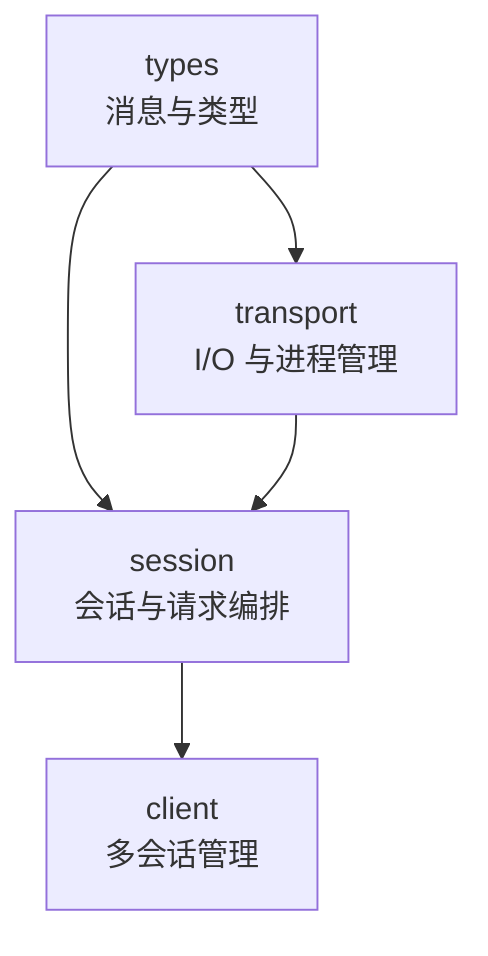
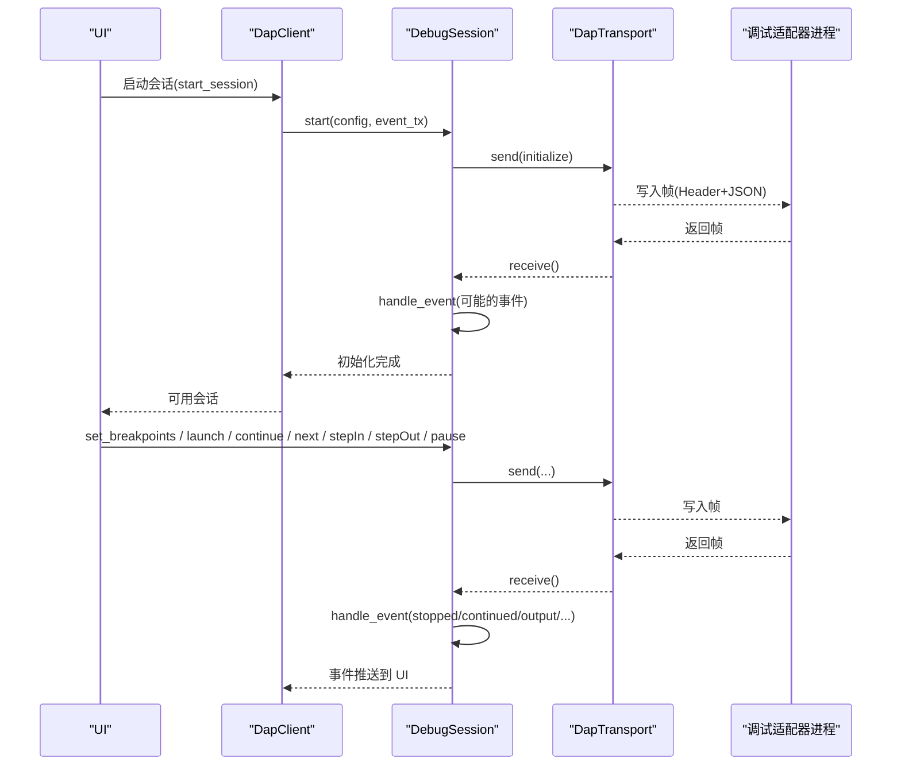
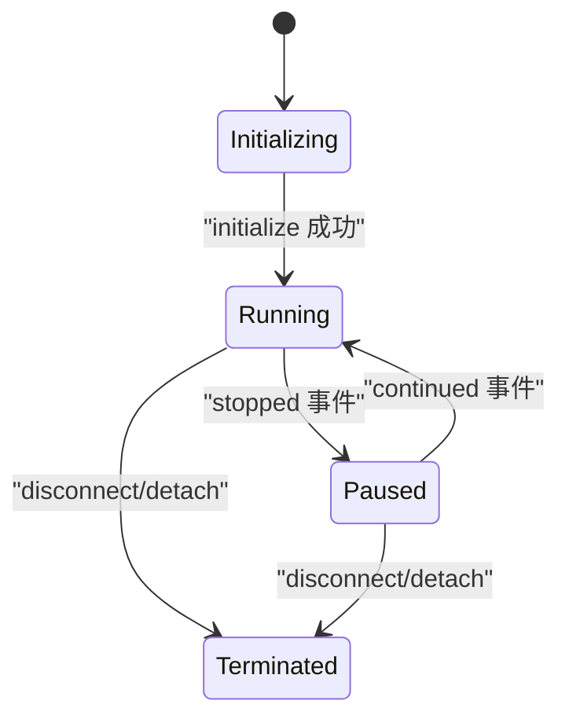
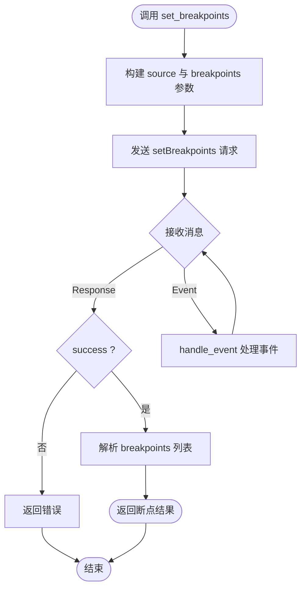
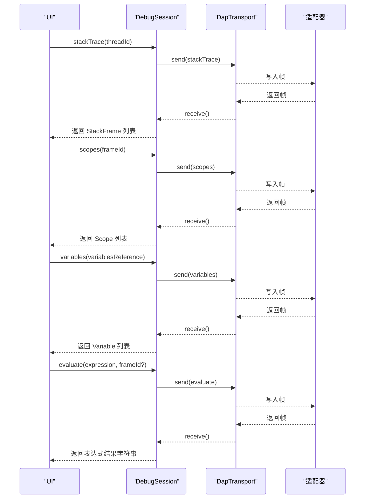
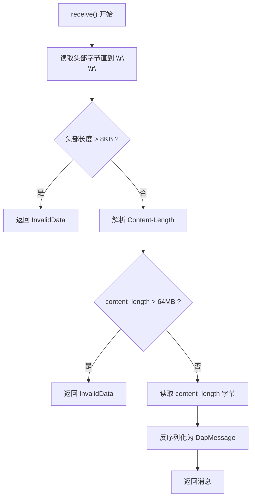
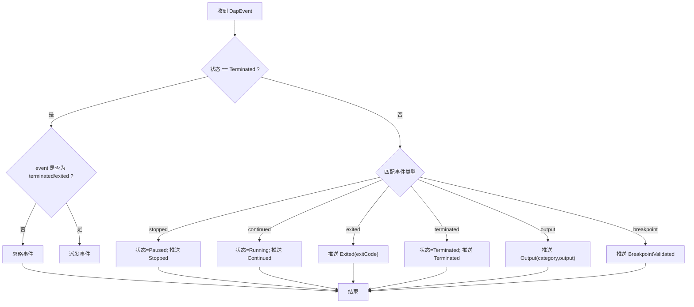
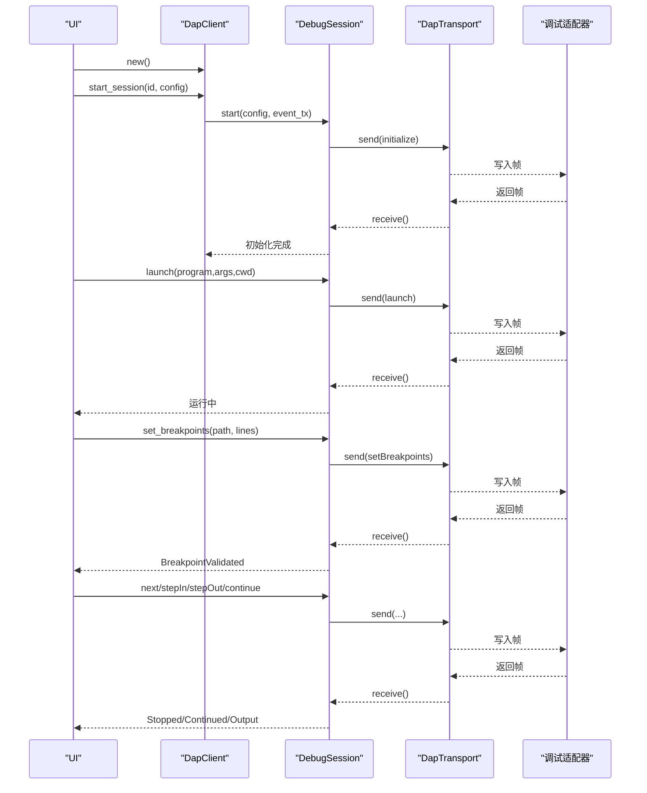
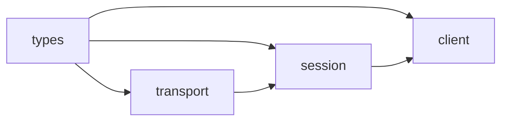

# DAP 调试客户端

<cite>
**本文引用的文件**
- [lib.rs](file://crates/aether-dap/src/lib.rs)
- [client.rs](file://crates/aether-dap/src/client.rs)
- [session.rs](file://crates/aether-dap/src/session.rs)
- [transport.rs](file://crates/aether-dap/src/transport.rs)
- [types.rs](file://crates/aether-dap/src/types.rs)
</cite>

## 目录
1. [简介](#简介)
2. [项目结构](#项目结构)
3. [核心组件](#核心组件)
4. [架构总览](#架构总览)
5. [详细组件分析](#详细组件分析)
6. [依赖关系分析](#依赖关系分析)
7. [性能考量](#性能考量)
8. [故障排查指南](#故障排查指南)
9. [结论](#结论)
10. [附录：配置与使用示例](#附录：配置与使用示例)

## 简介
本仓库中的 aether-dap crate 实现了基于调试适配器协议（DAP）的调试客户端，负责与外部调试适配器进程进行 JSON-RPC 风格通信，管理调试会话生命周期、断点设置与命中处理、变量查看与表达式求值，并通过事件通道将线程事件、日志输出、异常捕获等调试事件推送至 UI 层。传输层支持标准输入/输出通信，并具备安全限制与健壮性保障。

## 项目结构
aether-dap 采用分层设计：
- types：定义 DAP 消息、数据结构与状态枚举
- transport：实现 DAP 帧编解码、Content-Length 头解析、子进程启动与 stderr 后台读取
- session：封装单个调试适配器的完整生命周期与请求-响应流程
- client：多会话管理与默认适配器配置发现

图表来源
- [types.rs:1-177](file://crates/aether-dap/src/types.rs#L1-L177)
- [transport.rs:1-162](file://crates/aether-dap/src/transport.rs#L1-L162)
- [session.rs:1-129](file://crates/aether-dap/src/session.rs#L1-L129)
- [client.rs:1-71](file://crates/aether-dap/src/client.rs#L1-L71)

章节来源
- [lib.rs:1-8](file://crates/aether-dap/src/lib.rs#L1-L8)

## 核心组件
- DapClient：维护多个 DebugSession，提供 start_session/get_session/stop_all 等接口；内置 default_adapter_config 根据语言 ID 返回默认适配器命令与参数。
- DebugSession：封装 initialize/launch/set_breakpoints/continue/next/step_in/step_out/pause/stack_trace/scopes/variables/evaluate/disconnect/detach 等能力；内部维护状态机与超时控制；通过 handle_event 分发 stopped/continued/exited/terminated/output/breakpoint 等事件到 UI。
- DapTransport：实现 DAP 帧发送/接收（Content-Length 头 + JSON 体），限制最大消息大小，防止 OOM；提供 spawn_adapter 启动外部调试适配器进程，spawn_stderr_drain 持续读取 stderr 避免管道阻塞。
- types：定义 DapMessage（Request/Response/Event）、AdapterConfig、Breakpoint/Source/StackFrame/Scope/Variable、DebugSessionState、DapEventUi、RequestIdGenerator 等。

章节来源
- [client.rs:7-71](file://crates/aether-dap/src/client.rs#L7-L71)
- [session.rs:23-129](file://crates/aether-dap/src/session.rs#L23-L129)
- [transport.rs:6-162](file://crates/aether-dap/src/transport.rs#L6-L162)
- [types.rs:4-177](file://crates/aether-dap/src/types.rs#L4-L177)

## 架构总览
DAP 客户端以“会话”为中心组织请求与事件流。每个会话对应一个外部调试适配器进程，通过标准 I/O 进行帧式通信。UI 层通过事件通道消费调试事件，驱动界面更新。

图表来源
- [session.rs:76-129](file://crates/aether-dap/src/session.rs#L76-L129)
- [session.rs:131-194](file://crates/aether-dap/src/session.rs#L131-L194)
- [session.rs:196-253](file://crates/aether-dap/src/session.rs#L196-L253)
- [session.rs:255-593](file://crates/aether-dap/src/session.rs#L255-L593)
- [transport.rs:26-93](file://crates/aether-dap/src/transport.rs#L26-L93)

## 详细组件分析

### 调试会话生命周期管理
- 启动流程：spawn_adapter 启动外部进程，构造 DapTransport，发送 initialize 请求，等待响应或事件，成功后进入 Running 状态。
- 启动程序：launch 携带 program/args/cwd，等待响应或事件，成功后保持 Running。
- 断开/分离：disconnect 终止被调试进程并回收子进程；detach 保留被调试进程但回收适配器进程。两者均调用 finalize_child 确保子进程退出或强制 kill。
- 状态机：Initializing → Running → Paused/Stopped → Terminated；已终止会话忽略非终止事件，防止“复活”。

图表来源
- [session.rs:23-34](file://crates/aether-dap/src/session.rs#L23-L34)
- [session.rs:76-129](file://crates/aether-dap/src/session.rs#L76-L129)
- [session.rs:483-535](file://crates/aether-dap/src/session.rs#L483-L535)

章节来源
- [session.rs:23-129](file://crates/aether-dap/src/session.rs#L23-L129)
- [session.rs:483-535](file://crates/aether-dap/src/session.rs#L483-L535)

### 断点设置与命中处理
- 设置断点：set_breakpoints 向适配器发送 setBreakpoints 请求，解析响应体中的 breakpoints 列表返回。
- 命中处理：收到 stopped 事件时，提取 reason 与 threadId，切换状态为 Paused，并推送 Stopped 事件给 UI。
- 断点验证：收到 breakpoint 事件时，解析 Breakpoint 并推送 BreakpointValidated 事件给 UI。

图表来源
- [session.rs:196-253](file://crates/aether-dap/src/session.rs#L196-L253)
- [session.rs:595-677](file://crates/aether-dap/src/session.rs#L595-L677)

章节来源
- [session.rs:196-253](file://crates/aether-dap/src/session.rs#L196-L253)
- [session.rs:595-677](file://crates/aether-dap/src/session.rs#L595-L677)

### 变量查看与表达式求值
- 变量查看：scopes 获取作用域列表，variables 按 variablesReference 拉取变量树。
- 表达式求值：evaluate 在指定 frameId 上下文执行表达式，返回字符串结果。
- 调用栈：stackTrace 获取当前线程的堆栈帧，用于定位作用域与变量。

图表来源
- [session.rs:285-330](file://crates/aether-dap/src/session.rs#L285-L330)
- [session.rs:332-424](file://crates/aether-dap/src/session.rs#L332-L424)
- [session.rs:426-481](file://crates/aether-dap/src/session.rs#L426-L481)

章节来源
- [session.rs:285-481](file://crates/aether-dap/src/session.rs#L285-L481)

### 传输层设计与安全限制
- 帧格式：Content-Length 头 + 空行 + JSON 体；发送时先写头再写体并 flush。
- 接收流程：循环读取直到遇到 \r\n\r\n，解析 Content-Length，校验长度上限（64MB），读取固定长度字节后反序列化为 DapMessage。
- 进程管理：spawn_adapter 使用 stdio 管道连接外部调试适配器；spawn_stderr_drain 后台读取 stderr，避免缓冲区满导致适配器阻塞。
- 安全：头部长度限制（8KB）、内容长度限制（64MB）、非法 JSON 与缺失头返回 InvalidData。

图表来源
- [transport.rs:40-93](file://crates/aether-dap/src/transport.rs#L40-L93)

章节来源
- [transport.rs:6-162](file://crates/aether-dap/src/transport.rs#L6-L162)

### 调试事件处理机制
- 事件类型：stopped/continued/exited/terminated/output/breakpoint，以及预留的 ThreadStarted/ThreadExited。
- 处理逻辑：handle_event 根据事件名更新会话状态、提取 body 字段、通过 event_tx 推送 DapEventUi 给 UI。
- 终止保护：当会话处于 Terminated 时，仅允许 terminated/exited 事件通过，其他事件被忽略，避免“复活”。

图表来源
- [session.rs:595-677](file://crates/aether-dap/src/session.rs#L595-L677)

章节来源
- [session.rs:595-677](file://crates/aether-dap/src/session.rs#L595-L677)

### 调试工作流程（实际使用场景）
- 启动调试：创建 DapClient，选择语言对应的默认适配器配置，start_session 启动会话，随后 launch 目标程序。
- 设置断点：在代码编辑完成后，调用 set_breakpoints 设置断点，等待 BreakpointValidated 事件确认。
- 单步执行：使用 next/stepIn/stepOut 控制执行粒度；继续执行使用 continue_execution。
- 变量检查：通过 stackTrace 获取帧，scopes 获取作用域，variables 展开变量树；evaluate 执行表达式。
- 事件驱动：UI 订阅事件通道，根据 Stopped/Continued/Output/BreakpointValidated 等事件更新界面。

图表来源
- [client.rs:24-42](file://crates/aether-dap/src/client.rs#L24-L42)
- [session.rs:76-194](file://crates/aether-dap/src/session.rs#L76-L194)
- [session.rs:196-253](file://crates/aether-dap/src/session.rs#L196-L253)
- [session.rs:255-593](file://crates/aether-dap/src/session.rs#L255-L593)

章节来源
- [client.rs:24-42](file://crates/aether-dap/src/client.rs#L24-L42)
- [session.rs:76-593](file://crates/aether-dap/src/session.rs#L76-L593)

## 依赖关系分析
- client 依赖 session 与 types；session 依赖 transport 与 types；transport 依赖 types。
- 无循环依赖；模块职责清晰，耦合度低。

图表来源
- [lib.rs:1-8](file://crates/aether-dap/src/lib.rs#L1-L8)
- [client.rs:1-71](file://crates/aether-dap/src/client.rs#L1-L71)
- [session.rs:1-129](file://crates/aether-dap/src/session.rs#L1-L129)
- [transport.rs:1-162](file://crates/aether-dap/src/transport.rs#L1-L162)

章节来源
- [lib.rs:1-8](file://crates/aether-dap/src/lib.rs#L1-L8)

## 性能考量
- 超时控制：initialize/launch 使用更长超时（60s/120s），其他请求使用默认 30s 超时，避免长时间阻塞。
- 内存保护：Content-Length 最大 64MB，头部最大 8KB，防止恶意或异常适配器导致 OOM。
- 资源清理：finalize_child 在 disconnect/detach 时等待适配器退出，超时则 kill；stderr drain 任务在 finalize 时 abort，避免残留任务持有句柄。
- 事件处理：handle_event 对已终止会话进行过滤，减少无效处理开销。

[本节为通用指导，不直接分析具体文件]

## 故障排查指南
- 初始化失败：检查 initialize 响应 success 与 message；若超时，确认适配器是否可执行且路径正确。
- 启动失败：检查 launch 响应；常见原因包括程序不存在、参数错误或权限不足。
- 断点未生效：确认 setBreakpoints 返回的 breakpoints 列表中 verified 为 true；关注 breakpoint 事件中的 message。
- 事件未到达：检查 UI 是否正确订阅事件通道；确认会话未处于 Terminated 状态。
- 进程卡死：观察 stderr 是否被后台读取；必要时手动 kill 子进程；检查 finalize_child 是否执行。

章节来源
- [session.rs:76-129](file://crates/aether-dap/src/session.rs#L76-L129)
- [session.rs:131-194](file://crates/aether-dap/src/session.rs#L131-L194)
- [session.rs:196-253](file://crates/aether-dap/src/session.rs#L196-L253)
- [session.rs:483-535](file://crates/aether-dap/src/session.rs#L483-L535)
- [transport.rs:40-93](file://crates/aether-dap/src/transport.rs#L40-L93)

## 结论
aether-dap 提供了完整的 DAP 客户端实现，涵盖会话管理、请求编排、事件分发与安全限制。其模块化设计便于扩展新的调试适配器与功能，同时保证了稳定性与可维护性。通过默认适配器配置与丰富的调试操作接口，用户可快速集成 GDB、LLDB、Python、JavaScript/TypeScript 等语言的调试体验。

[本节为总结，不直接分析具体文件]

## 附录：配置与使用示例
- 默认适配器配置：
  - Rust/C/C++：使用 lldb-dap
  - Python：使用 debugpy.adapter
  - JavaScript/TypeScript：使用 node 与 node-debug2-adapter
- 典型流程：
  - 创建 DapClient 并启动会话
  - 调用 launch 启动目标程序
  - 设置断点并等待验证事件
  - 使用 next/stepIn/stepOut/continue 控制执行
  - 通过 stackTrace/scopes/variables/evaluate 检查状态
  - 监听事件通道更新 UI

章节来源
- [client.rs:45-71](file://crates/aether-dap/src/client.rs#L45-L71)
- [session.rs:76-593](file://crates/aether-dap/src/session.rs#L76-L593)