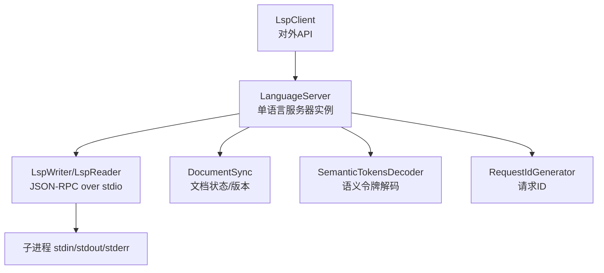
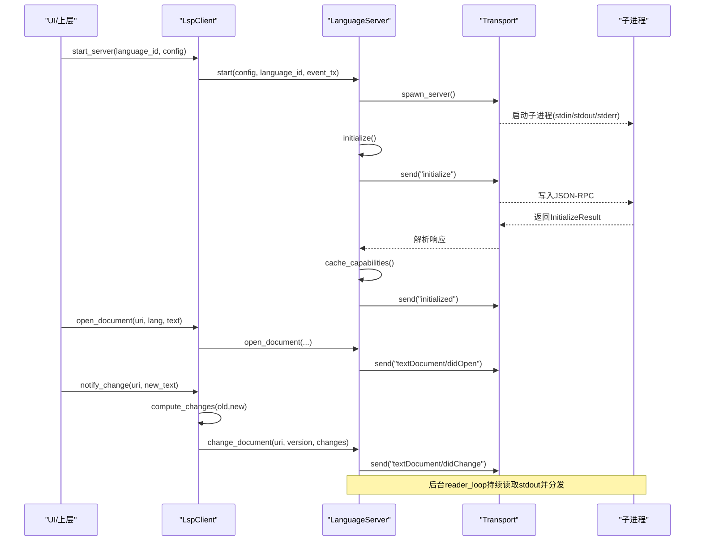
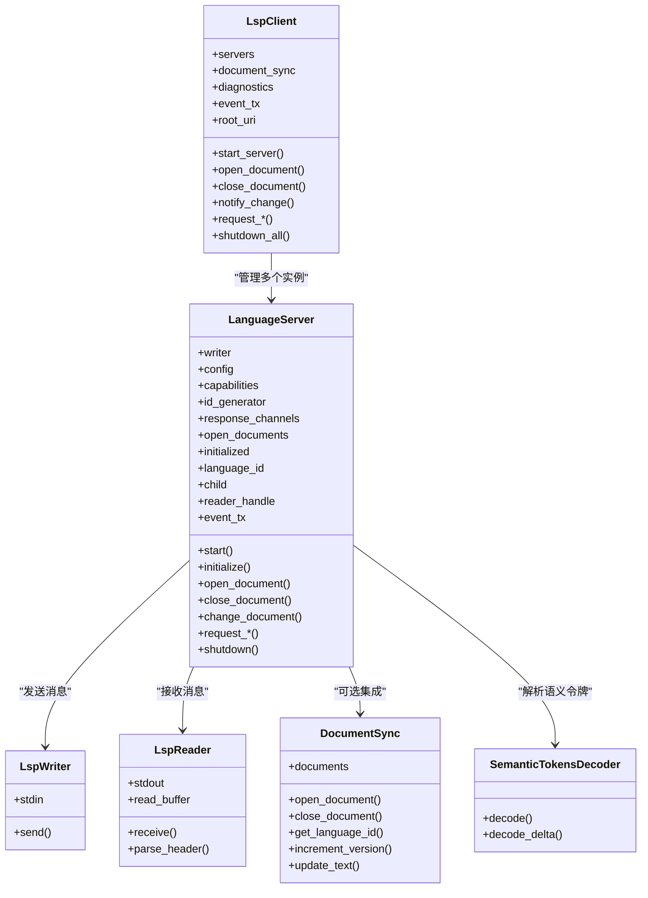

# LSP 客户端实现

<cite>
**本文引用的文件**
- [lib.rs](file://crates/aether-lsp/src/lib.rs)
- [client.rs](file://crates/aether-lsp/src/client.rs)
- [server.rs](file://crates/aether-lsp/src/server.rs)
- [transport.rs](file://crates/aether-lsp/src/transport.rs)
- [types.rs](file://crates/aether-lsp/src/types.rs)
- [sync.rs](file://crates/aether-lsp/src/sync.rs)
- [incremental_sync.rs](file://crates/aether-lsp/src/incremental_sync.rs)
- [semantic_tokens.rs](file://crates/aether-lsp/src/semantic_tokens.rs)
</cite>

## 目录
1. [简介](#简介)
2. [项目结构](#项目结构)
3. [核心组件](#核心组件)
4. [架构总览](#架构总览)
5. [详细组件分析](#详细组件分析)
6. [依赖关系分析](#依赖关系分析)
7. [性能考量](#性能考量)
8. [故障排查指南](#故障排查指南)
9. [结论](#结论)
10. [附录：使用示例与配置](#附录使用示例与配置)

## 简介
本仓库中的 aether-lsp 模块实现了完整的 LSP（Language Server Protocol）客户端，负责：
- 语言服务器进程发现、启动、初始化与生命周期管理
- JSON-RPC over stdio 的消息编解码与请求-响应路由
- 文档同步（增量与全量），包括版本管理与变更计算
- 语义令牌解析与渲染映射
- 诊断、补全、悬停、定义跳转、引用查找、重命名、代码操作、格式化、内联提示等能力调用
- 事件驱动的通知转发（如诊断更新、日志、服务器就绪/退出）

该实现采用异步 I/O（tokio），将读写分离为独立的 reader/writer，避免锁竞争；通过 oneshot channel 配对请求与响应；以能力协商结果决定可用功能。

## 项目结构
aether-lsp 模块按职责划分：
- client.rs：对外 API（LspClient），封装多语言服务器实例、文档同步、诊断缓存、事件通道
- server.rs：单个 LanguageServer 实例，负责进程通信、消息收发、能力缓存、文档状态
- transport.rs：JSON-RPC over stdio 的传输层（编码/解码、进程启动、stderr 清理）
- types.rs：通用类型（消息、错误、配置、能力缓存、ID 生成器）
- sync.rs：文档同步管理器与增量变更计算
- incremental_sync.rs：高性能行索引、编辑合并、批量同步策略
- semantic_tokens.rs：语义令牌解码、类型/修饰符映射

图表来源
- [client.rs:11-25](file://crates/aether-lsp/src/client.rs#L11-L25)
- [server.rs:23-61](file://crates/aether-lsp/src/server.rs#L23-L61)
- [transport.rs:8-14](file://crates/aether-lsp/src/transport.rs#L8-L14)
- [sync.rs:6-10](file://crates/aether-lsp/src/sync.rs#L6-L10)
- [semantic_tokens.rs:3-11](file://crates/aether-lsp/src/semantic_tokens.rs#L3-L11)
- [types.rs:102-118](file://crates/aether-lsp/src/types.rs#L102-L118)

章节来源
- [lib.rs:1-16](file://crates/aether-lsp/src/lib.rs#L1-L16)

## 核心组件
- LspClient：多语言服务器实例管理、文档打开/关闭/变更、各类请求代理、诊断缓存、事件推送
- LanguageServer：单个语言服务器的完整生命周期（启动→initialize→运行→shutdown）、请求-响应、通知处理、能力缓存
- Transport：LspWriter/LspReader 拆分读写，encode/decode JSON-RPC over stdio，进程启动与 stderr 清理
- Types：LspMessage/LspRequest/LspResponse/LspNotification、ServerConfig、ServerCapabilitiesCache、RequestIdGenerator
- Sync：DocumentSync 维护已打开文档及版本；compute_changes 计算增量或回退全文
- Incremental Sync：FastLineIndex 高效 UTF-16 位置转换；编辑合并与批量发送策略
- Semantic Tokens：解码紧凑数组为结构化 token，应用 delta 更新，映射到渲染信息

章节来源
- [client.rs:11-25](file://crates/aether-lsp/src/client.rs#L11-L25)
- [server.rs:23-61](file://crates/aether-lsp/src/server.rs#L23-L61)
- [transport.rs:8-14](file://crates/aether-lsp/src/transport.rs#L8-L14)
- [types.rs:5-47](file://crates/aether-lsp/src/types.rs#L5-L47)
- [sync.rs:6-10](file://crates/aether-lsp/src/sync.rs#L6-L10)
- [incremental_sync.rs:96-130](file://crates/aether-lsp/src/incremental_sync.rs#L96-L130)
- [semantic_tokens.rs:3-11](file://crates/aether-lsp/src/semantic_tokens.rs#L3-L11)

## 架构总览
整体流程：
- 启动：LspClient::start_server 调用 LanguageServer::start，spawn 子进程并启动 reader_loop
- 初始化：发送 initialize 请求，接收 InitializeResult，缓存 capabilities，发送 initialized 通知
- 文档同步：open_document/didOpen；notify_change 计算增量变更并发送 didChange；close_document 发送 didClose
- 请求-响应：所有 textDocument/* 请求通过 send_request + receive_response 完成，超时保护
- 通知：服务器推送的诊断、日志等通过 event_tx 推送到 UI 层
- 关闭：shutdown 发送 shutdown 请求和 exit 通知，等待子进程退出或强制 kill

图表来源
- [server.rs:63-124](file://crates/aether-lsp/src/server.rs#L63-L124)
- [server.rs:304-484](file://crates/aether-lsp/src/server.rs#L304-L484)
- [server.rs:506-590](file://crates/aether-lsp/src/server.rs#L506-L590)
- [transport.rs:255-339](file://crates/aether-lsp/src/transport.rs#L255-L339)

## 详细组件分析

### LspClient：多语言服务器与文档同步入口
- 管理多个 LanguageServer 实例（按 language_id 路由）
- 维护 DocumentSync 跟踪文档状态与版本
- 提供 open/close/notify_change 等文档操作
- 提供 request_completion/hover/definition/references/rename/code_actions/formatting/semantic_tokens/inlay_hints 等能力调用
- 诊断缓存与清理，事件通道推送 UI

关键行为：
- 启动服务器后发送 ServerReady 事件
- 打开文档时记录本地状态并发送 didOpen
- 变更时计算增量变更，发送 didChange；失败不递增版本，避免失步
- 关闭文档时清理本地状态与诊断缓存

章节来源
- [client.rs:11-25](file://crates/aether-lsp/src/client.rs#L11-L25)
- [client.rs:89-114](file://crates/aether-lsp/src/client.rs#L89-L114)
- [client.rs:116-172](file://crates/aether-lsp/src/client.rs#L116-L172)
- [client.rs:215-286](file://crates/aether-lsp/src/client.rs#L215-L286)
- [client.rs:288-567](file://crates/aether-lsp/src/client.rs#L288-L567)
- [client.rs:569-617](file://crates/aether-lsp/src/client.rs#L569-L617)

### LanguageServer：单语言服务器实例
- 生命周期：start → initialize → run → shutdown
- 请求-响应：send_request 生成 ID 并注册 oneshot receiver；receive_response 带超时与错误处理
- 通知处理：handle_notification 转发到 event_tx
- 能力缓存：cache_capabilities 保存服务器能力，供上层判断支持特性
- 文档状态：open_documents 跟踪已打开文档的版本与文本

关键行为：
- initialize 携带丰富的 ClientCapabilities（同步、补全、悬停、定义、引用、重命名、代码操作、格式化、语义令牌、内联提示等）
- didOpen/didClose/didChange 对应 LSP 文档同步通知
- shutdown 发送 shutdown 请求与 exit 通知，等待子进程退出或超时 kill

章节来源
- [server.rs:23-61](file://crates/aether-lsp/src/server.rs#L23-L61)
- [server.rs:140-216](file://crates/aether-lsp/src/server.rs#L140-L216)
- [server.rs:304-484](file://crates/aether-lsp/src/server.rs#L304-L484)
- [server.rs:506-590](file://crates/aether-lsp/src/server.rs#L506-L590)
- [server.rs:661-695](file://crates/aether-lsp/src/server.rs#L661-L695)

### Transport：JSON-RPC over stdio
- LspWriter：仅持有 stdin，发送消息并 flush
- LspReader：仅持有 stdout，循环读取并解析 Header + Body
- encode_message：序列化 JSON 并添加 Content-Length 头
- parse_header_buffer：安全解析头部，限制最大长度，防止 OOM
- spawn_server/build_command：构造命令并设置环境变量，Windows 下隐藏控制台窗口
- spawn_stderr_drain：后台读取 stderr 避免管道阻塞

安全与健壮性：
- Header 最大 8KB，Content-Length 最大 64MB
- 找不到 Content-Length 或非法值时返回错误
- EOF 时返回 UnexpectedEof 错误

章节来源
- [transport.rs:8-28](file://crates/aether-lsp/src/transport.rs#L8-L28)
- [transport.rs:110-209](file://crates/aether-lsp/src/transport.rs#L110-L209)
- [transport.rs:211-253](file://crates/aether-lsp/src/transport.rs#L211-L253)
- [transport.rs:255-339](file://crates/aether-lsp/src/transport.rs#L255-L339)
- [transport.rs:341-359](file://crates/aether-lsp/src/transport.rs#L341-L359)

### 文档同步：增量与全量策略
- DocumentSync：维护 documents 表，记录 uri/language_id/version/text
- compute_changes：基于共同前缀/后缀计算字节级变更范围，使用 FastLineIndex 转换为 LSP Position（UTF-16 码元）
- 大文件或大范围变更回退为全文替换（阈值 100KB，变更超过原文 50%）
- OptimizedDocumentSync：记录编辑历史，支持批量发送与延迟刷新
- FastLineIndex：预计算行起始位置，O(log n) 行查找，正确计算 UTF-16 字符偏移

章节来源
- [sync.rs:6-71](file://crates/aether-lsp/src/sync.rs#L6-L71)
- [sync.rs:82-148](file://crates/aether-lsp/src/sync.rs#L82-L148)
- [incremental_sync.rs:96-190](file://crates/aether-lsp/src/incremental_sync.rs#L96-L190)
- [incremental_sync.rs:192-305](file://crates/aether-lsp/src/incremental_sync.rs#L192-L305)

### 语义令牌：从服务器到渲染
- 解码：SemanticTokensDecoder::decode 将紧凑 uinteger 数组解码为结构化 SemanticToken
- Delta 更新：decode_delta 应用 edits 到现有 token 列表
- 类型/修饰符映射：SemanticTokenTypeKind/SemanticTokenModifierKind 提供标准 22 种类型与 10 位修饰符
- 渲染映射：map_tokens 将 token 转为渲染可用的 SemanticTokenMapping

章节来源
- [semantic_tokens.rs:3-11](file://crates/aether-lsp/src/semantic_tokens.rs#L3-L11)
- [semantic_tokens.rs:13-86](file://crates/aether-lsp/src/semantic_tokens.rs#L13-L86)
- [semantic_tokens.rs:88-264](file://crates/aether-lsp/src/semantic_tokens.rs#L88-L264)

### 类图：核心对象关系

图表来源
- [client.rs:11-25](file://crates/aether-lsp/src/client.rs#L11-L25)
- [server.rs:23-61](file://crates/aether-lsp/src/server.rs#L23-L61)
- [transport.rs:8-28](file://crates/aether-lsp/src/transport.rs#L8-L28)
- [transport.rs:110-209](file://crates/aether-lsp/src/transport.rs#L110-L209)
- [sync.rs:6-10](file://crates/aether-lsp/src/sync.rs#L6-L10)
- [semantic_tokens.rs:13-86](file://crates/aether-lsp/src/semantic_tokens.rs#L13-L86)

## 依赖关系分析
- LspClient 依赖 LanguageServer、DocumentSync、types（ServerConfig、ServerCapabilitiesCache）
- LanguageServer 依赖 transport（LspWriter/LspReader）、types（RequestIdGenerator、LspMessage）
- transport 依赖 types（LspMessage）与 tokio 进程/IO
- sync 依赖 incremental_sync（FastLineIndex）
- semantic_tokens 独立，被上层用于渲染

潜在耦合点：
- 能力协商结果影响上层功能可用性（如 semantic_tokens_provider）
- 文档同步版本一致性由 DocumentSync 与 LanguageServer 协同保证
- 事件通道 event_tx 是 UI 与 LSP 层的解耦点

章节来源
- [client.rs:11-25](file://crates/aether-lsp/src/client.rs#L11-L25)
- [server.rs:23-61](file://crates/aether-lsp/src/server.rs#L23-L61)
- [transport.rs:211-253](file://crates/aether-lsp/src/transport.rs#L211-L253)
- [sync.rs:82-148](file://crates/aether-lsp/src/sync.rs#L82-L148)
- [semantic_tokens.rs:88-264](file://crates/aether-lsp/src/semantic_tokens.rs#L88-L264)

## 性能考量
- 读写分离：LspWriter/LspReader 拆分避免锁竞争，提升并发吞吐
- 请求超时：默认 30 秒，initialize 60 秒，避免长时间阻塞
- 增量同步：小文件/小变更使用精确范围；大文件/大范围回退全文，减少 diff 成本
- 行索引优化：FastLineIndex 预计算行起始，O(log n) 查找，UTF-16 字符计数准确
- 批量合并：IncrementalChangeCalculator::merge_edits 合并相邻编辑，减少消息数量
- 内存保护：Header 最大 8KB，Content-Length 最大 64MB，防止恶意消息导致 OOM
- 后台 stderr 清理：避免子进程因 stderr 缓冲区满而阻塞

[本节为通用指导，无需特定文件来源]

## 故障排查指南
常见问题与定位：
- 服务器无法启动：检查 command/args/env，使用 probe_server_command 验证二进制可用性
- 请求超时：检查 receive_response 超时配置，确认服务器是否卡死或网络问题
- 诊断未显示：确认 handle_notification 是否正确转发到 event_tx，UI 是否订阅 Diagnostics 事件
- 文档不同步：检查 DocumentSync 版本递增逻辑与 notify_change_raw 的成功回调
- 语义令牌异常：检查 decode/decode_delta 逻辑，确认 result_id 与 edits 顺序

章节来源
- [transport.rs:261-306](file://crates/aether-lsp/src/transport.rs#L261-L306)
- [server.rs:164-216](file://crates/aether-lsp/src/server.rs#L164-L216)
- [server.rs:295-302](file://crates/aether-lsp/src/server.rs#L295-L302)
- [client.rs:215-286](file://crates/aether-lsp/src/client.rs#L215-L286)
- [semantic_tokens.rs:52-86](file://crates/aether-lsp/src/semantic_tokens.rs#L52-L86)

## 结论
aether-lsp 提供了稳定、可扩展的 LSP 客户端实现，具备：
- 健壮的进程管理与错误恢复
- 高效的文档同步与增量计算
- 完整的语义令牌处理链路
- 清晰的能力协商与功能开关
- 事件驱动的 UI 集成

建议在生产环境中结合具体语言服务器配置进行调优，并根据实际需求扩展能力集与错误处理策略。

[本节为总结，无需特定文件来源]

## 附录：使用示例与配置

### 启动与管理语言服务器
- 创建客户端并获取事件通道
- 启动指定语言的服务器（如 rust-analyzer、pylsp、typescript-language-server、clangd）
- 监听事件（ServerReady、Diagnostics、Log、ServerExited）
- 关闭时调用 shutdown_all

参考路径
- [client.rs:73-114](file://crates/aether-lsp/src/client.rs#L73-L114)
- [client.rs:569-617](file://crates/aether-lsp/src/client.rs#L569-L617)
- [client.rs:620-653](file://crates/aether-lsp/src/client.rs#L620-L653)

### 初始化请求
- LanguageServer::initialize 发送 initialize 参数，包含 root_uri、workspace_folders、capabilities、trace、client_info
- 接收 InitializeResult 并缓存 capabilities
- 发送 initialized 通知

参考路径
- [server.rs:304-484](file://crates/aether-lsp/src/server.rs#L304-L484)

### 文档打开/关闭
- open_document：记录本地状态，发送 textDocument/didOpen
- close_document：发送 textDocument/didClose，清理本地状态

参考路径
- [server.rs:506-560](file://crates/aether-lsp/src/server.rs#L506-L560)
- [client.rs:116-172](file://crates/aether-lsp/src/client.rs#L116-L172)

### 文本变更通知
- notify_change：计算增量变更，发送 textDocument/didChange
- notify_change_raw：高级用法，直接发送预计算变更，成功后递增版本

参考路径
- [client.rs:215-286](file://crates/aether-lsp/src/client.rs#L215-L286)
- [sync.rs:82-148](file://crates/aether-lsp/src/sync.rs#L82-L148)

### 常见请求模式
- 补全：request_completion
- 悬停：request_hover
- 定义跳转：request_definition
- 引用查找：request_references
- 重命名：request_rename
- 代码操作：request_code_actions
- 格式化：request_formatting
- 语义令牌：request_semantic_tokens_full/range/delta
- 内联提示：request_inlay_hints

参考路径
- [client.rs:288-567](file://crates/aether-lsp/src/client.rs#L288-L567)
- [server.rs:592-800](file://crates/aether-lsp/src/server.rs#L592-L800)

### 错误处理与重连机制
- 请求超时：receive_response 超时清理 pending sender
- 服务器退出：ServerExited 事件触发 remove_server，清空诊断缓存
- 进程终止：shutdown 等待子进程退出，超时则 kill
- 传输错误：EOF/InvalidData/TimedOut 等错误向上抛出

参考路径
- [server.rs:164-216](file://crates/aether-lsp/src/server.rs#L164-L216)
- [client.rs:592-603](file://crates/aether-lsp/src/client.rs#L592-L603)
- [transport.rs:127-209](file://crates/aether-lsp/src/transport.rs#L127-L209)