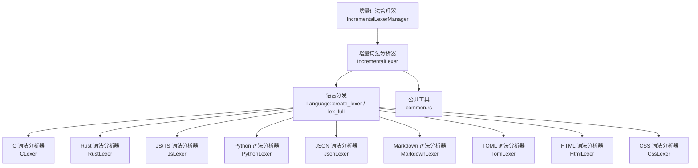
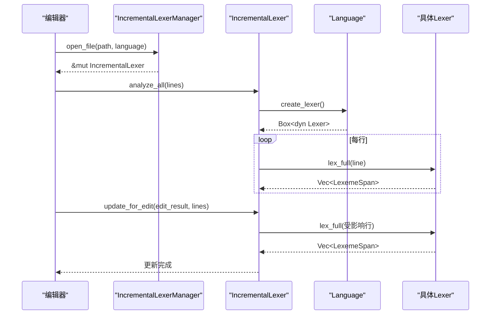
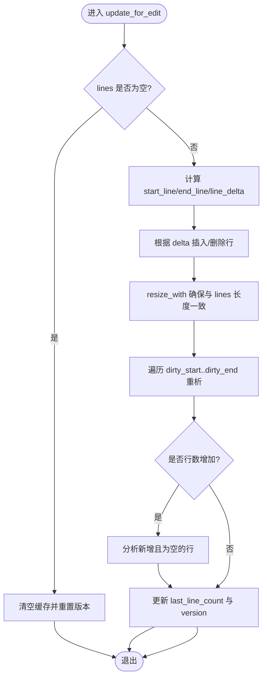
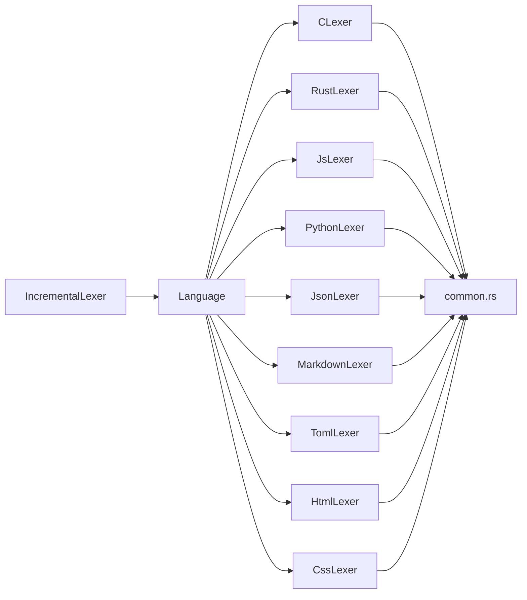

# 词法分析器

<cite>
**本文引用的文件**
- [incremental_lexer.rs](file://crates/aether-core/src/incremental_lexer.rs)
- [mod.rs](file://crates/aether-core/src/lexer/mod.rs)
- [common.rs](file://crates/aether-core/src/lexer/common.rs)
- [c_lexer.rs](file://crates/aether-core/src/lexer/c_lexer.rs)
- [rust_lexer.rs](file://crates/aether-core/src/lexer/rust_lexer.rs)
- [js_lexer.rs](file://crates/aether-core/src/lexer/js_lexer.rs)
- [python_lexer.rs](file://crates/aether-core/src/lexer/python_lexer.rs)
- [json_lexer.rs](file://crates/aether-core/src/lexer/json_lexer.rs)
- [markdown_lexer.rs](file://crates/aether-core/src/lexer/markdown_lexer.rs)
- [toml_lexer.rs](file://crates/aether-core/src/lexer/toml_lexer.rs)
- [html_lexer.rs](file://crates/aether-core/src/lexer/html_lexer.rs)
- [css_lexer.rs](file://crates/aether-core/src/lexer/css_lexer.rs)
- [lib.rs](file://crates/aether-core/src/lib.rs)
</cite>

## 目录
1. [简介](#简介)
2. [项目结构](#项目结构)
3. [核心组件](#核心组件)
4. [架构总览](#架构总览)
5. [详细组件分析](#详细组件分析)
6. [依赖关系分析](#依赖关系分析)
7. [性能考量](#性能考量)
8. [故障排查指南](#故障排查指南)
9. [结论](#结论)
10. [附录：扩展新语言支持指南](#附录：扩展新语言支持指南)

## 简介
本仓库实现了一个面向编辑器的增量词法分析系统，提供多语言（C、Rust、JavaScript/TypeScript、Python、JSON、Markdown、TOML、HTML、CSS 等）的轻量级行级高亮能力。其设计目标是在编辑器高频编辑场景下，以极低的开销完成“只重新分析受影响行”的增量更新，并通过统一的 Token 分类与压缩表示，支撑上层渲染与语法高亮。

## 项目结构
- 增量词法层
  - 维护每行 token 缓存，基于编辑结果定位脏行并仅重析受影响的行，避免全量重算。
- 语言抽象层
  - 统一 Lexer trait、TokenKind、LexemeSpan、Language 枚举，屏蔽各语言差异。
- 多语言实现
  - 每种语言一个独立 lexer 模块，复用通用跳过/扫描工具函数。
- 公共工具
  - 空白、注释、字符串、标识符、数字等通用跳过函数，保证一致性与可复用性。

图表来源
- [incremental_lexer.rs:1-187](file://crates/aether-core/src/incremental_lexer.rs#L1-L187)
- [mod.rs:94-196](file://crates/aether-core/src/lexer/mod.rs#L94-L196)

章节来源
- [lib.rs:1-12](file://crates/aether-core/src/lib.rs#L1-L12)
- [mod.rs:1-306](file://crates/aether-core/src/lexer/mod.rs#L1-L306)
- [incremental_lexer.rs:1-187](file://crates/aether-core/src/incremental_lexer.rs#L1-L187)

## 核心组件
- 增量词法分析器 IncrementalLexer
  - 按行缓存 LexemeSpan，使用 Vec 直接索引，O(1) 访问；通过版本号和脏行范围进行增量更新。
- 增量词法管理器 IncrementalLexerManager
  - 管理多个文件的增量 lexer，限制最大缓存文件数，防止内存无界增长。
- 语言抽象 Language
  - 根据扩展名或路径推断语言，并提供 create_lexer 与静态分发的 lex_full。
- 通用 Token 模型
  - TokenKind 覆盖关键字、标识符、字面量、操作符、注释、属性、类型名、函数名、宏、生命周期、正则、格式化字符串、Markdown 标题/链接/代码/强调、JSON 键、TOML 表头等。
  - LexemeSpan 压缩存储 start、len、kind、flags，单行内偏移与长度均用 u32，降低内存占用。

章节来源
- [incremental_lexer.rs:1-187](file://crates/aether-core/src/incremental_lexer.rs#L1-L187)
- [mod.rs:7-111](file://crates/aether-core/src/lexer/mod.rs#L7-L111)
- [mod.rs:113-196](file://crates/aether-core/src/lexer/mod.rs#L113-L196)

## 架构总览
增量词法分析流程：
- 打开文件时，创建对应语言的 lexer，对全部行执行全量分析并缓存。
- 编辑发生时，根据 EditResult 计算受影响行区间，仅对该区间及新增行进行增量重析。
- 渲染或查询时，直接从缓存读取指定行的 token 列表。

图表来源
- [incremental_lexer.rs:28-101](file://crates/aether-core/src/incremental_lexer.rs#L28-L101)
- [mod.rs:159-196](file://crates/aether-core/src/lexer/mod.rs#L159-L196)

## 详细组件分析

### 增量词法分析器 IncrementalLexer
- 数据结构
  - line_tokens: Vec<Vec<LexemeSpan>>，行号即索引，连续内存布局，便于快速访问与批量处理。
  - version: u64，用于失效检测与外部缓存一致性。
  - last_line_count: usize，记录上次分析时的行数，辅助判断是否需要扩容或收缩。
- 关键方法
  - analyze_all: 首次打开文件时全量分析所有行。
  - update_for_edit: 根据编辑结果调整 Vec 长度（插入/删除行），并对脏行区间与新增行进行增量重析。
  - get_line_tokens/get_all_tokens: O(1) 获取行级 token 或整体切片。
  - clear/version/cache_stats: 清理、版本查询与调试统计。
- 复杂度与特性
  - 行调整采用 splice/drain/resize_with，避免 HashMap 重建开销。
  - 增量更新仅针对受影响行，显著减少 CPU 消耗。

图表来源
- [incremental_lexer.rs:43-101](file://crates/aether-core/src/incremental_lexer.rs#L43-L101)

章节来源
- [incremental_lexer.rs:1-187](file://crates/aether-core/src/incremental_lexer.rs#L1-L187)

### 语言抽象与 Token 模型
- TokenKind
  - 统一跨语言的 token 分类，涵盖关键字、标识符、字面量、注释、操作符、分隔符、预处理指令、属性、类型名、函数名、宏、生命周期、泛型、正则、格式化字符串、Markdown 标题/链接/代码/强调、JSON 键、TOML 表头、空白、换行、未知、EOF。
- LexemeSpan
  - 紧凑表示：start、len 均为 u32，kind 为枚举，flags 保留位（如 Markdown 标题级别、强调强度）。
- Language
  - from_extension/from_path：根据扩展名或路径推断语言，未知扩展名回退到 PlainText。
  - create_lexer/lex_full：动态与静态两种分发方式，后者避免 Box 分配与虚调用开销。

章节来源
- [mod.rs:7-111](file://crates/aether-core/src/lexer/mod.rs#L7-L111)
- [mod.rs:113-196](file://crates/aether-core/src/lexer/mod.rs#L113-L196)

### 公共工具 common.rs
- skip_whitespace/skip_line_comment/skip_block_comment/skip_quoted
  - 高效跳过空白、行注释、块注释、带转义的引号字符串，避免越界。
- skip_identifier_ascii/skip_identifier_with
  - 识别 ASCII 字母数字与下划线，或额外允许字符（如 JS 的 $）。
- skip_number_generic
  - 通用数字扫描框架，通过 is_valid 回调适配不同语言数字规则。

章节来源
- [common.rs:1-151](file://crates/aether-core/src/lexer/common.rs#L1-L151)

### C 词法分析器 CLexer
- 支持：空白、换行、行/块注释（含文档注释）、预处理指令、字符串/字符字面量、数字（含进制前缀与后缀）、标识符与关键字、运算符、标点、UTF-8 未知字符。
- 关键点
  - 数字解析阻止 1..2 被合并为一个数字。
  - 预处理指令支持续行。
  - 注释区分普通块注释与文档注释。

章节来源
- [c_lexer.rs:1-425](file://crates/aether-core/src/lexer/c_lexer.rs#L1-L425)

### Rust 词法分析器 RustLexer
- 支持：空白、换行、行/块注释（含文档注释）、属性、字符串/字符字面量、生命周期、数字（含进制前缀与下划线分隔）、标识符/关键字/内置类型/宏、运算符、标点、UTF-8 未知字符。
- 关键点
  - 生命周期与字符字面量的歧义处理（反斜杠后必为转义字符字面量）。
  - 块注释支持嵌套深度计数，未闭合时安全推进至末尾。
  - 属性 #!/#[...] 完整跳过。

章节来源
- [rust_lexer.rs:1-583](file://crates/aether-core/src/lexer/rust_lexer.rs#L1-L583)

### JavaScript/TypeScript 词法分析器 JsLexer
- 支持：空白、换行、行/块注释、模板字符串、字符串字面量、数字（含 BigInt 后缀 n）、标识符/关键字/内置类型、正则表达式、运算符、标点、UTF-8 未知字符。
- 关键点
  - 上下文敏感的正则识别：向前查找最近非空白字符，匹配特定分隔符集合判定为正则。
  - 模板字符串中 ${...} 内容跳过，支持嵌套。
  - 数字解析支持十六进制、八进制、二进制、小数、指数与下划线分隔。

章节来源
- [js_lexer.rs:1-662](file://crates/aether-core/src/lexer/js_lexer.rs#L1-L662)

### Python 词法分析器 PythonLexer
- 支持：空白、换行、行注释、字符串字面量（含三引号与 f-string）、数字（含复数 j）、标识符/关键字/内置类型、运算符、标点、UTF-8 未知字符。
- 关键点
  - f-string 前缀在引号之前，正确识别格式化字符串。
  - 三引号字符串支持任意内容直到闭合。

章节来源
- [python_lexer.rs:1-450](file://crates/aether-core/src/lexer/python_lexer.rs#L1-L450)

### JSON 词法分析器 JsonLexer
- 支持：空白、字符串（键值区分）、数字、布尔/空字面量、标点、UTF-8 未知字符。
- 关键点
  - 通过向后检查冒号判断是否为 JSON 键，从而赋予 JsonKey 类别。

章节来源
- [json_lexer.rs:1-227](file://crates/aether-core/src/lexer/json_lexer.rs#L1-L227)

### Markdown 词法分析器 MarkdownLexer
- 支持：标题、代码块/行内代码、链接、强调（*、_、**、__）、无序/有序列表、HTML 标签、普通文本、换行。
- 关键点
  - 标题级别通过 flags 字段传递。
  - 强调标记在未闭合时仅消耗开放标记，避免整行误标。

章节来源
- [markdown_lexer.rs:1-398](file://crates/aether-core/src/lexer/markdown_lexer.rs#L1-L398)

### TOML 词法分析器 TomlLexer
- 支持：空白、换行、行注释、表头（[table] 与 [[array]]）、字符串（双/单引号）、数字/日期、布尔、标识符、标点、UTF-8 未知字符。
- 关键点
  - +/- 仅在后续跟随数字时作为数字起始，否则视为标点。
  - 键统一使用 Identifier 而非 JsonKey。

章节来源
- [toml_lexer.rs:1-266](file://crates/aether-core/src/lexer/toml_lexer.rs#L1-L266)

### HTML 词法分析器 HtmlLexer
- 支持：注释、标签（含结束标签/自闭合）、属性名/值、实体引用、普通文本。
- 关键点
  - 标签名、属性名、属性值分别归类为 Keyword/Attribute/StringLiteral。
  - 实体引用 &...; 识别为 Identifier。

章节来源
- [html_lexer.rs:1-287](file://crates/aether-core/src/lexer/html_lexer.rs#L1-L287)

### CSS 词法分析器 CssLexer
- 支持：空白、换行、块注释、@规则、字符串、颜色/数字/单位、变量、!important、选择器、属性名/值、函数调用、组合选择器、通配符、括号、百分比、标点、UTF-8 未知字符。
- 关键点
  - 状态机 in_block 跟踪选择器区与声明区，同一标识符在不同区域映射为不同 TokenKind。
  - 数值解析支持负数、小数、百分比与单位。
  - 常见 CSS 值关键字识别为 Keyword。

章节来源
- [css_lexer.rs:1-557](file://crates/aether-core/src/lexer/css_lexer.rs#L1-L557)

## 依赖关系分析
- 增量层依赖语言抽象层：IncrementalLexer 通过 Language 创建具体 Lexer，并调用 lex_full。
- 语言抽象层依赖公共工具：各语言 lexer 复用 common.rs 中的跳过/扫描函数，保证行为一致。
- 语言抽象层内部解耦：每种语言独立实现 Lexer trait，通过 match 分发，便于扩展与维护。

图表来源
- [incremental_lexer.rs:1-187](file://crates/aether-core/src/incremental_lexer.rs#L1-L187)
- [mod.rs:94-196](file://crates/aether-core/src/lexer/mod.rs#L94-L196)
- [common.rs:1-151](file://crates/aether-core/src/lexer/common.rs#L1-L151)

章节来源
- [mod.rs:198-207](file://crates/aether-core/src/lexer/mod.rs#L198-L207)

## 性能考量
- 增量更新
  - 仅重析受影响行，避免全量重算；Vec 的 splice/drain/resize_with 比 HashMap 重建更高效。
- 内存布局
  - LexemeSpan 压缩为 12B（start、len、kind、flags），单行 token 向量连续存储，利于缓存命中。
- 静态分发
  - Language::lex_full 提供静态分发，避免 Box 分配与虚调用开销。
- UTF-8 安全
  - utf8_char_len 保证非法字节至少前进 1，避免死循环与错位。
- 缓存上限
  - IncrementalLexerManager 限制最大缓存文件数，防止长时间运行后内存无界增长。

章节来源
- [incremental_lexer.rs:139-187](file://crates/aether-core/src/incremental_lexer.rs#L139-L187)
- [mod.rs:233-243](file://crates/aether-core/src/lexer/mod.rs#L233-L243)
- [mod.rs:179-196](file://crates/aether-core/src/lexer/mod.rs#L179-L196)

## 故障排查指南
- 注释未闭合
  - Rust 块注释未闭合时会推进到末尾，避免残余 token；若出现异常，检查 skip_block_comment 逻辑。
- 数字解析边界
  - 多种语言均阻止 1..2 被合并为一个数字；若发现误判，检查 dot_count 与范围语法处理。
- 正则上下文误判
  - JS 中正则识别依赖前一个非空白字符；若误判，检查 is_regex_context 的前向查找逻辑。
- Markdown 强调未闭合
  - 未闭合强调仅消耗开放标记，避免整行误标；若整行被错误标记，检查 skip_emphasis 的换行分支。
- JSON 键识别
  - 通过向后检查冒号判断键；若误判，检查 is_json_key 的空格跳过与冒号检测。
- TOML 键/表头
  - 键统一为 Identifier；若期望 JsonKey，需调整分类逻辑。表头支持数组表头与普通表头。

章节来源
- [rust_lexer.rs:275-295](file://crates/aether-core/src/lexer/rust_lexer.rs#L275-L295)
- [c_lexer.rs:185-233](file://crates/aether-core/src/lexer/c_lexer.rs#L185-L233)
- [js_lexer.rs:40-82](file://crates/aether-core/src/lexer/js_lexer.rs#L40-L82)
- [markdown_lexer.rs:187-209](file://crates/aether-core/src/lexer/markdown_lexer.rs#L187-L209)
- [json_lexer.rs:84-92](file://crates/aether-core/src/lexer/json_lexer.rs#L84-L92)
- [toml_lexer.rs:91-95](file://crates/aether-core/src/lexer/toml_lexer.rs#L91-L95)

## 结论
该词法分析系统以增量更新为核心，结合紧凑的 Token 表示与多语言统一抽象，实现了高性能、可扩展的编辑器高亮能力。通过清晰的职责划分与丰富的测试覆盖，系统在准确性与性能之间取得良好平衡，并为扩展新语言提供了明确的路径。

## 附录：扩展新语言支持指南
- 步骤概览
  - 定义语言枚举项：在 Language 中添加新语言。
  - 实现 Lexer trait：新建 lexer 模块，实现 lex_full，返回 Vec<LexemeSpan>。
  - 注册分发：在 Language::create_lexer 与 lex_full 中添加分支。
  - 复用工具：优先使用 common.rs 中的跳过/扫描函数，减少重复实现。
  - 编写测试：覆盖关键字、字面量、注释、操作符、边界情况与 UTF-8。
- 词法规则定义建议
  - 明确标识符、数字、字符串、注释、操作符、分隔符的边界规则。
  - 处理上下文敏感语法（如 JS 的正则、CSS 的选择器/声明区）。
  - 注意范围语法与点号冲突（如 1..2）。
- 语法高亮规则配置
  - 利用 TokenKind 与 LexemeSpan.flags 传递语义信息（如 Markdown 标题级别、强调强度）。
  - 在渲染层根据 TokenKind 映射到主题样式。
- 性能优化技巧
  - 使用静态分发 lex_full 避免 Box 分配。
  - 合理预估 Vec 容量（text.len()/4+1）减少扩容。
  - 增量更新最小化脏行范围，避免不必要重析。
- 与编辑器核心集成示例（概念性）
  - 打开文件：manager.open_file(path, language)，然后 analyze_all(lines)。
  - 编辑更新：update_for_edit(&edit_result, &new_lines)。
  - 渲染查询：get_line_tokens(line_idx) 获取该行 token 列表，逐 token 应用高亮。

章节来源
- [mod.rs:94-196](file://crates/aether-core/src/lexer/mod.rs#L94-L196)
- [incremental_lexer.rs:151-187](file://crates/aether-core/src/incremental_lexer.rs#L151-L187)