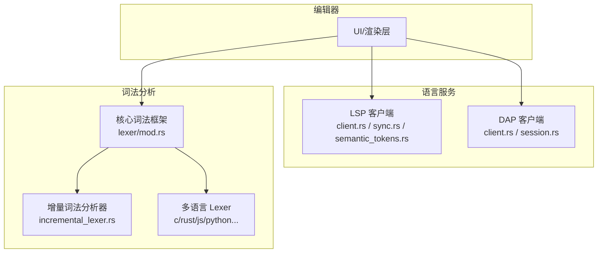
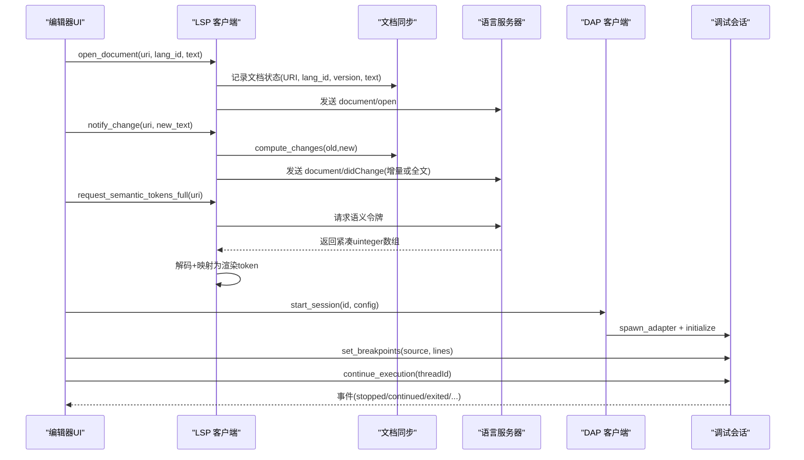
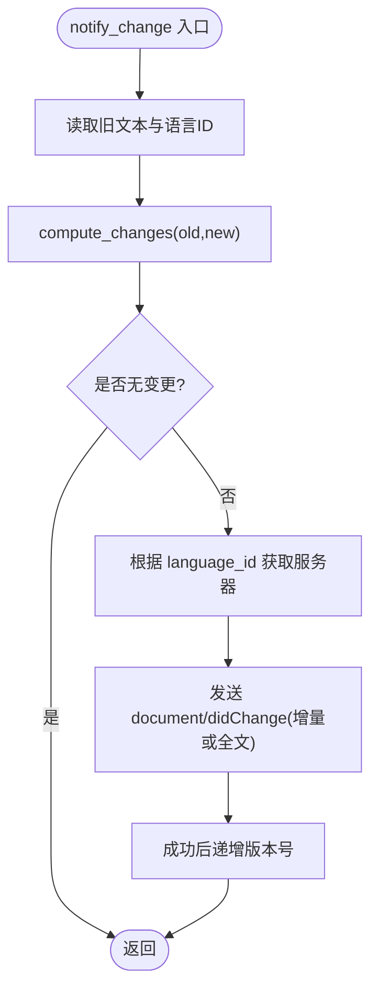
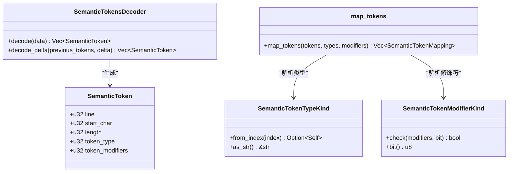
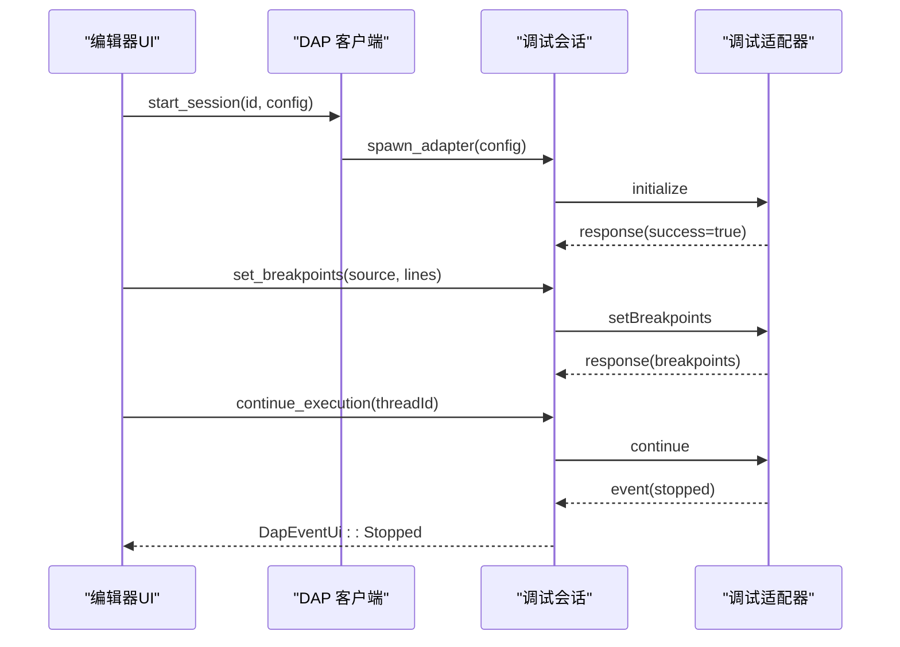
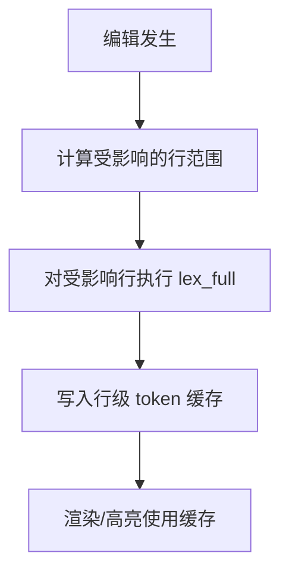
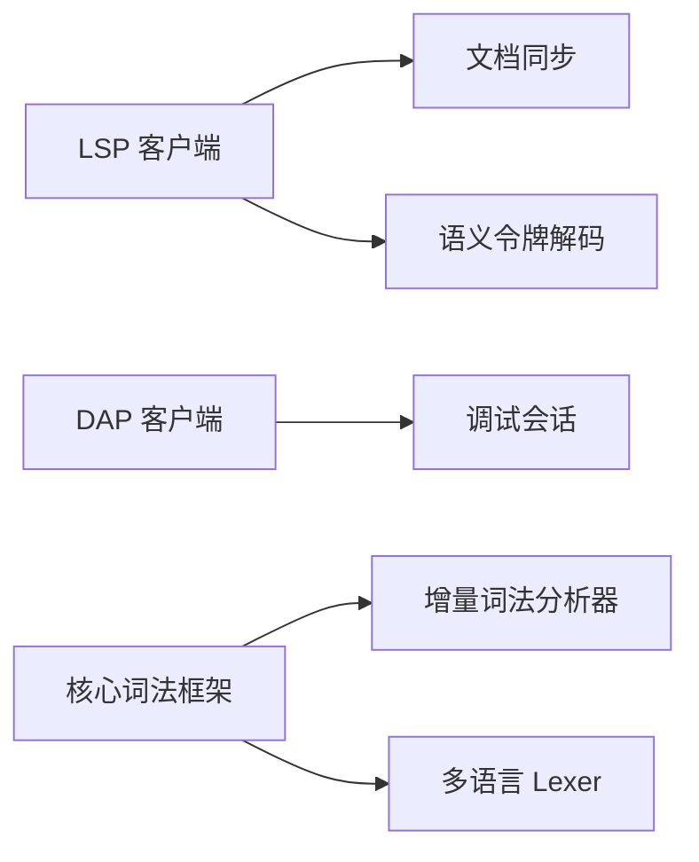

# 语言服务支持

<cite>
**本文引用的文件**
- [aether-lsp/src/lib.rs](file://crates/aether-lsp/src/lib.rs)
- [aether-lsp/src/client.rs](file://crates/aether-lsp/src/client.rs)
- [aether-lsp/src/sync.rs](file://crates/aether-lsp/src/sync.rs)
- [aether-lsp/src/semantic_tokens.rs](file://crates/aether-lsp/src/semantic_tokens.rs)
- [aether-dap/src/lib.rs](file://crates/aether-dap/src/lib.rs)
- [aether-dap/src/client.rs](file://crates/aether-dap/src/client.rs)
- [aether-dap/src/session.rs](file://crates/aether-dap/src/session.rs)
- [aether-core/src/lexer/mod.rs](file://crates/aether-core/src/lexer/mod.rs)
- [aether-core/src/incremental_lexer.rs](file://crates/aether-core/src/incremental_lexer.rs)
- [aether-core/src/lexer/c_lexer.rs](file://crates/aether-core/src/lexer/c_lexer.rs)
- [aether-core/src/lexer/rust_lexer.rs](file://crates/aether-core/src/lexer/rust_lexer.rs)
- [aether-core/src/lexer/js_lexer.rs](file://crates/aether-core/src/lexer/js_lexer.rs)
</cite>

## 目录
1. [简介](#简介)
2. [项目结构](#项目结构)
3. [核心组件](#核心组件)
4. [架构总览](#架构总览)
5. [详细组件分析](#详细组件分析)
6. [依赖关系分析](#依赖关系分析)
7. [性能考量](#性能考量)
8. [故障排查指南](#故障排查指南)
9. [结论](#结论)
10. [附录：配置与扩展示例](#附录：配置与扩展示例)

## 简介
本文件为牧羊人编辑器的“语言服务支持”提供系统化文档，覆盖以下能力：
- LSP（Language Server Protocol）客户端实现：文档同步、语义令牌处理、增量同步机制。
- DAP（Debug Adapter Protocol）客户端基础架构：调试会话管理、断点处理等。
- 内置词法分析器多语言支持：C、Rust、JavaScript、Python 等语言的语法解析。
- 如何集成不同语言服务器并扩展新语言支持的实践指引。

## 项目结构
本项目将语言服务相关能力拆分为多个 crate：
- aether-lsp：LSP 客户端、文档同步、语义令牌解码与映射。
- aether-dap：DAP 客户端、调试会话生命周期、事件与请求封装。
- aether-core：通用词法分析框架与多语言 lexer，以及增量词法分析器。
- UI/渲染层通过上述 crate 提供的接口驱动编辑器高亮、补全、诊断与调试体验。

图表来源
- [aether-lsp/src/lib.rs:1-16](file://crates/aether-lsp/src/lib.rs#L1-L16)
- [aether-dap/src/lib.rs:1-8](file://crates/aether-dap/src/lib.rs#L1-L8)
- [aether-core/src/lexer/mod.rs:1-208](file://crates/aether-core/src/lexer/mod.rs#L1-L208)
- [aether-core/src/incremental_lexer.rs:1-193](file://crates/aether-core/src/incremental_lexer.rs#L1-L193)

章节来源
- [aether-lsp/src/lib.rs:1-16](file://crates/aether-lsp/src/lib.rs#L1-L16)
- [aether-dap/src/lib.rs:1-8](file://crates/aether-dap/src/lib.rs#L1-L8)
- [aether-core/src/lexer/mod.rs:1-208](file://crates/aether-core/src/lexer/mod.rs#L1-L208)
- [aether-core/src/incremental_lexer.rs:1-193](file://crates/aether-core/src/incremental_lexer.rs#L1-L193)

## 核心组件
- LSP 客户端（LspClient）：管理多语言服务器实例、文档状态、诊断缓存、事件通道；提供打开/关闭文档、变更通知、补全/悬停/定义/引用/重命名/格式化/语义令牌/内联提示等请求方法。
- 文档同步（DocumentSync + compute_changes）：维护已打开文档的 URI、语言ID、版本和全文；计算精确到字节级的增量变更，并在大文件或大范围变更时回退为全文替换。
- 语义令牌（SemanticTokensDecoder/map_tokens）：解码 LSP 返回的紧凑 uinteger 数组为结构化 token，并映射为类型与修饰符信息供渲染使用；支持完整令牌与 delta 更新。
- DAP 客户端（DapClient + DebugSession）：启动/停止调试适配器进程，发送 initialize/launch/setBreakpoints/continue/next/stepIn/stepOut/pause/stackTrace/scopes/variables/evaluate 等请求；处理 stopped/continued/exited/terminated/output/breakpoint 等事件。
- 词法分析器（Lexer trait + Language 分发）：统一 TokenKind/LexemeSpan，按语言创建具体 lexer；支持 C/Rust/Python/JS/TS/JSON/Markdown/TOML/HTML/CSS/PlainText 等。
- 增量词法分析器（IncrementalLexer/Manager）：按行缓存 token，编辑后仅重新分析受影响行，提升交互性能；管理器支持多文件切换与缓存上限保护。

章节来源
- [aether-lsp/src/client.rs:11-618](file://crates/aether-lsp/src/client.rs#L11-L618)
- [aether-lsp/src/sync.rs:6-148](file://crates/aether-lsp/src/sync.rs#L6-L148)
- [aether-lsp/src/semantic_tokens.rs:3-264](file://crates/aether-lsp/src/semantic_tokens.rs#L3-L264)
- [aether-dap/src/client.rs:7-71](file://crates/aether-dap/src/client.rs#L7-L71)
- [aether-dap/src/session.rs:23-678](file://crates/aether-dap/src/session.rs#L23-L678)
- [aether-core/src/lexer/mod.rs:1-208](file://crates/aether-core/src/lexer/mod.rs#L1-L208)
- [aether-core/src/incremental_lexer.rs:4-193](file://crates/aether-core/src/incremental_lexer.rs#L4-L193)

## 架构总览
下图展示编辑器与 LSP/DAP 及词法分析器的交互关系。

图表来源
- [aether-lsp/src/client.rs:116-251](file://crates/aether-lsp/src/client.rs#L116-L251)
- [aether-lsp/src/sync.rs:82-148](file://crates/aether-lsp/src/sync.rs#L82-L148)
- [aether-lsp/src/semantic_tokens.rs:17-86](file://crates/aether-lsp/src/semantic_tokens.rs#L17-L86)
- [aether-dap/src/session.rs:36-129](file://crates/aether-dap/src/session.rs#L36-L129)
- [aether-dap/src/session.rs:196-253](file://crates/aether-dap/src/session.rs#L196-L253)

## 详细组件分析

### LSP 客户端与文档同步
- 多服务器管理：按 language_id 路由请求，每个服务器独立锁避免跨 await 持有全局写锁。
- 文档状态：维护 URI -> DocumentState 映射，包含语言ID、版本、文本；提供 open/close/version increment/text update。
- 增量同步策略：compute_changes 基于共同前缀/后缀计算字节级变更范围，并使用 FastLineIndex 转换为 UTF-16 码元位置；当文件过大或变更超过阈值时回退为全文替换。
- 事件通道：向 UI 推送 Diagnostics/Completion/Hover/References/Rename/Formatting/SemanticTokens/SemanticTokensDelta/InlayHints/ServerReady/ServerExited/Log 等事件。
- 诊断缓存：按 URI 聚合诊断，支持快照读取与清理。

图表来源
- [aether-lsp/src/client.rs:215-286](file://crates/aether-lsp/src/client.rs#L215-L286)
- [aether-lsp/src/sync.rs:82-148](file://crates/aether-lsp/src/sync.rs#L82-L148)

章节来源
- [aether-lsp/src/client.rs:11-618](file://crates/aether-lsp/src/client.rs#L11-L618)
- [aether-lsp/src/sync.rs:6-148](file://crates/aether-lsp/src/sync.rs#L6-L148)

### 语义令牌处理
- 解码：将 LSP 紧凑 uinteger 数组解码为结构化 SemanticToken（line、start_char、length、type、modifiers）。
- Delta 应用：按 edits 反向顺序删除/插入 token，合并到现有列表。
- 类型与修饰符映射：将索引映射为 LSP 标准类型（namespace/type/class/enum/interface/struct/...），解析修饰符位掩码（declaration/definition/readonly/static/...）。
- 渲染映射：输出 SemanticTokenMapping，供 UI 着色。

图表来源
- [aether-lsp/src/semantic_tokens.rs:3-264](file://crates/aether-lsp/src/semantic_tokens.rs#L3-L264)

章节来源
- [aether-lsp/src/semantic_tokens.rs:3-558](file://crates/aether-lsp/src/semantic_tokens.rs#L3-L558)

### DAP 客户端与会话管理
- 会话生命周期：spawn_adapter -> initialize -> launch -> 运行控制（continue/next/stepIn/stepOut/pause）-> disconnect/detach -> finalize_child（超时 kill 防止僵尸进程）。
- 断点处理：setBreakpoints 发送源路径与行号列表，解析响应体中的 Breakpoint 列表。
- 调用栈与变量：stackTrace/scopes/variables/evaluate 支持查看上下文与表达式求值。
- 事件处理：stopped/continued/exited/terminated/output/breakpoint 等事件转发至 UI，并维护会话状态机（Initializing/Running/Paused/Terminated）。

图表来源
- [aether-dap/src/session.rs:36-129](file://crates/aether-dap/src/session.rs#L36-L129)
- [aether-dap/src/session.rs:196-253](file://crates/aether-dap/src/session.rs#L196-L253)
- [aether-dap/src/session.rs:255-330](file://crates/aether-dap/src/session.rs#L255-L330)
- [aether-dap/src/session.rs:595-678](file://crates/aether-dap/src/session.rs#L595-L678)

章节来源
- [aether-dap/src/client.rs:7-71](file://crates/aether-dap/src/client.rs#L7-L71)
- [aether-dap/src/session.rs:23-678](file://crates/aether-dap/src/session.rs#L23-L678)

### 内置词法分析器与增量分析
- 语言分发：Language::create_lexer/lex_full 静态分发，避免动态分发开销；未知扩展名归为 PlainText。
- 多语言支持：C/Rust/Python/JS/TS/JSON/Markdown/TOML/HTML/CSS/PlainText；Go/Java 复用 C 家族作为 fallback。
- 增量分析：IncrementalLexer 按行缓存 token，编辑后仅重新分析受影响行；IncrementalLexerManager 管理多文件切换与缓存上限（默认 32 个文件）。

图表来源
- [aether-core/src/incremental_lexer.rs:36-101](file://crates/aether-core/src/incremental_lexer.rs#L36-L101)
- [aether-core/src/lexer/mod.rs:159-195](file://crates/aether-core/src/lexer/mod.rs#L159-L195)

章节来源
- [aether-core/src/lexer/mod.rs:1-208](file://crates/aether-core/src/lexer/mod.rs#L1-L208)
- [aether-core/src/incremental_lexer.rs:4-193](file://crates/aether-core/src/incremental_lexer.rs#L4-L193)
- [aether-core/src/lexer/c_lexer.rs:1-200](file://crates/aether-core/src/lexer/c_lexer.rs#L1-L200)
- [aether-core/src/lexer/rust_lexer.rs:1-200](file://crates/aether-core/src/lexer/rust_lexer.rs#L1-L200)
- [aether-core/src/lexer/js_lexer.rs:1-200](file://crates/aether-core/src/lexer/js_lexer.rs#L1-L200)

## 依赖关系分析
- LSP 客户端依赖文档同步模块计算增量变更，并通过事件通道向 UI 推送结果。
- DAP 客户端依赖调试会话进行进程管理与消息收发，事件经 mpsc 通道传递给 UI。
- 词法分析器由 Language 枚举统一调度，增量词法分析器依赖具体语言 lexer。

图表来源
- [aether-lsp/src/client.rs:11-618](file://crates/aether-lsp/src/client.rs#L11-L618)
- [aether-lsp/src/sync.rs:6-148](file://crates/aether-lsp/src/sync.rs#L6-L148)
- [aether-lsp/src/semantic_tokens.rs:3-264](file://crates/aether-lsp/src/semantic_tokens.rs#L3-L264)
- [aether-dap/src/client.rs:7-71](file://crates/aether-dap/src/client.rs#L7-L71)
- [aether-dap/src/session.rs:23-678](file://crates/aether-dap/src/session.rs#L23-L678)
- [aether-core/src/lexer/mod.rs:1-208](file://crates/aether-core/src/lexer/mod.rs#L1-L208)
- [aether-core/src/incremental_lexer.rs:4-193](file://crates/aether-core/src/incremental_lexer.rs#L4-L193)

章节来源
- [aether-lsp/src/client.rs:11-618](file://crates/aether-lsp/src/client.rs#L11-L618)
- [aether-dap/src/session.rs:23-678](file://crates/aether-dap/src/session.rs#L23-L678)
- [aether-core/src/lexer/mod.rs:1-208](file://crates/aether-core/src/lexer/mod.rs#L1-L208)

## 性能考量
- 增量同步：compute_changes 在文件大于阈值或变更比例过大时回退为全文替换，避免昂贵的 diff 计算。
- 增量词法分析：按行缓存 token，编辑后仅重算受影响行，显著降低大文件编辑时的 CPU 占用。
- 静态分发：Language::lex_full 直接调用具体 lexer，避免 Box 分配与虚函数开销。
- 会话资源管理：DAP 会话断开后等待子进程退出，超时强制 kill，防止僵尸进程；stderr 单独 drain 避免阻塞。

[本节为通用性能讨论，不直接分析具体文件]

## 故障排查指南
- LSP 文档同步失败：检查 compute_changes 是否返回空变更；确认语言服务器已启动且支持相应能力；关注 ServerExited 事件后移除服务器实例。
- 语义令牌异常：核对 LSP 返回的 uinteger 数组是否为 5 的倍数；校验类型索引是否在 0..=21 范围内；delta edits 边界需做安全裁剪。
- DAP 初始化/启动超时：initialize/launch 分别设置较长超时；若适配器未响应，检查命令与参数是否正确；disconnect 后若适配器未退出，将被强制 kill。
- 词法高亮错位：确保增量词法分析器正确识别受影响的行范围；注意 UTF-8 字符长度推断以避免多字节字符被拆分。

章节来源
- [aether-lsp/src/client.rs:569-618](file://crates/aether-lsp/src/client.rs#L569-L618)
- [aether-lsp/src/sync.rs:82-148](file://crates/aether-lsp/src/sync.rs#L82-L148)
- [aether-lsp/src/semantic_tokens.rs:266-558](file://crates/aether-lsp/src/semantic_tokens.rs#L266-L558)
- [aether-dap/src/session.rs:483-535](file://crates/aether-dap/src/session.rs#L483-L535)
- [aether-core/src/incremental_lexer.rs:36-101](file://crates/aether-core/src/incremental_lexer.rs#L36-L101)

## 结论
牧羊人编辑器的语言服务支持以模块化方式实现了 LSP 与 DAP 的客户端能力，结合高效的增量同步与增量词法分析，提供了流畅的编码与调试体验。通过统一的词法框架与语言分发机制，可便捷扩展新语言支持；通过默认服务器/适配器配置发现，简化了集成流程。

[本节为总结性内容，不直接分析具体文件]

## 附录：配置与扩展示例

### 集成不同语言服务器（LSP）
- Rust：默认使用 rust-analyzer。
- Python：默认使用 pylsp。
- TypeScript/JavaScript：默认使用 typescript-language-server（带 --stdio 参数）。
- C/C++：默认使用 clangd。

章节来源
- [aether-lsp/src/client.rs:620-653](file://crates/aether-lsp/src/client.rs#L620-L653)

### 集成不同调试适配器（DAP）
- Rust/C/C++：默认使用 lldb-dap。
- Python：默认使用 debugpy.adapter。
- JavaScript/TypeScript：默认使用 node 执行 node-debug2-adapter。

章节来源
- [aether-dap/src/client.rs:45-71](file://crates/aether-dap/src/client.rs#L45-L71)

### 扩展新语言支持（词法分析器）
- 新增语言枚举项：在 Language 中添加新语言标识。
- 实现 Lexer trait：为新语言编写 lex_full 与 lex_next 逻辑，识别关键字、字符串、注释、数字、运算符等。
- 注册到 Language::create_lexer/lex_full：将新语言映射到对应 lexer。
- 可选：为增量词法分析器提供行级优化（如跳过空白行、快速定位变更行）。

章节来源
- [aether-core/src/lexer/mod.rs:94-195](file://crates/aether-core/src/lexer/mod.rs#L94-L195)