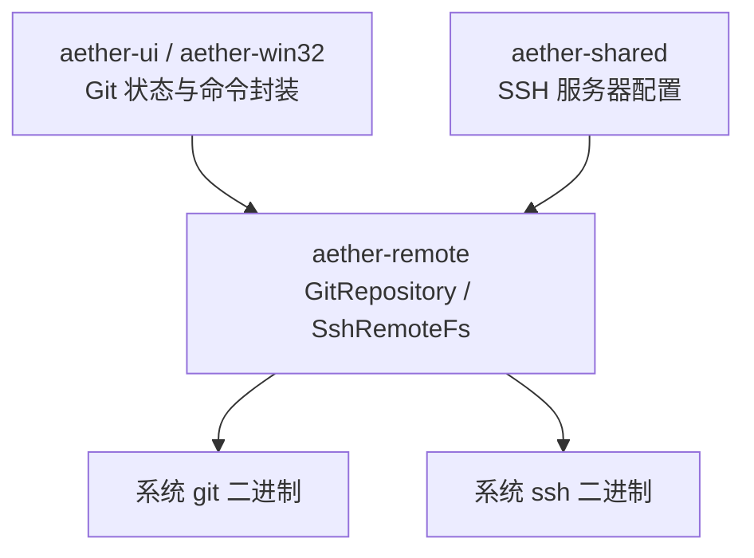
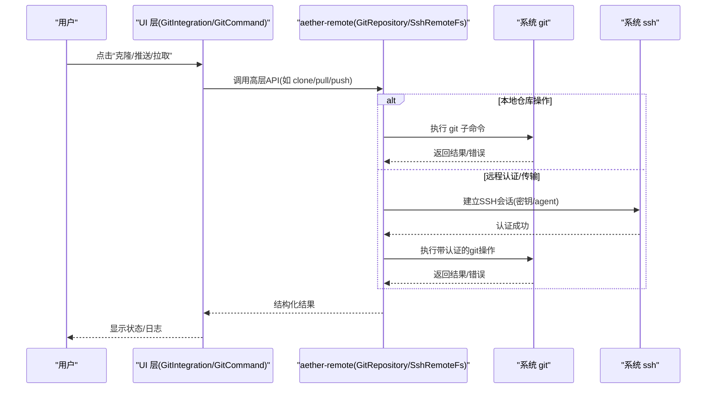
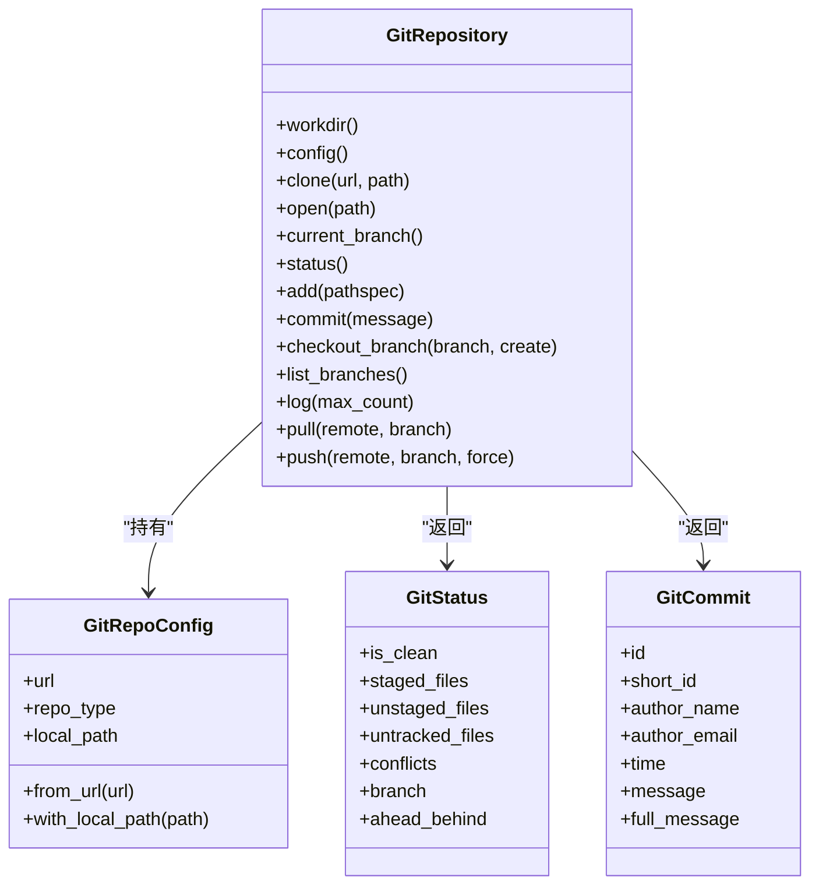
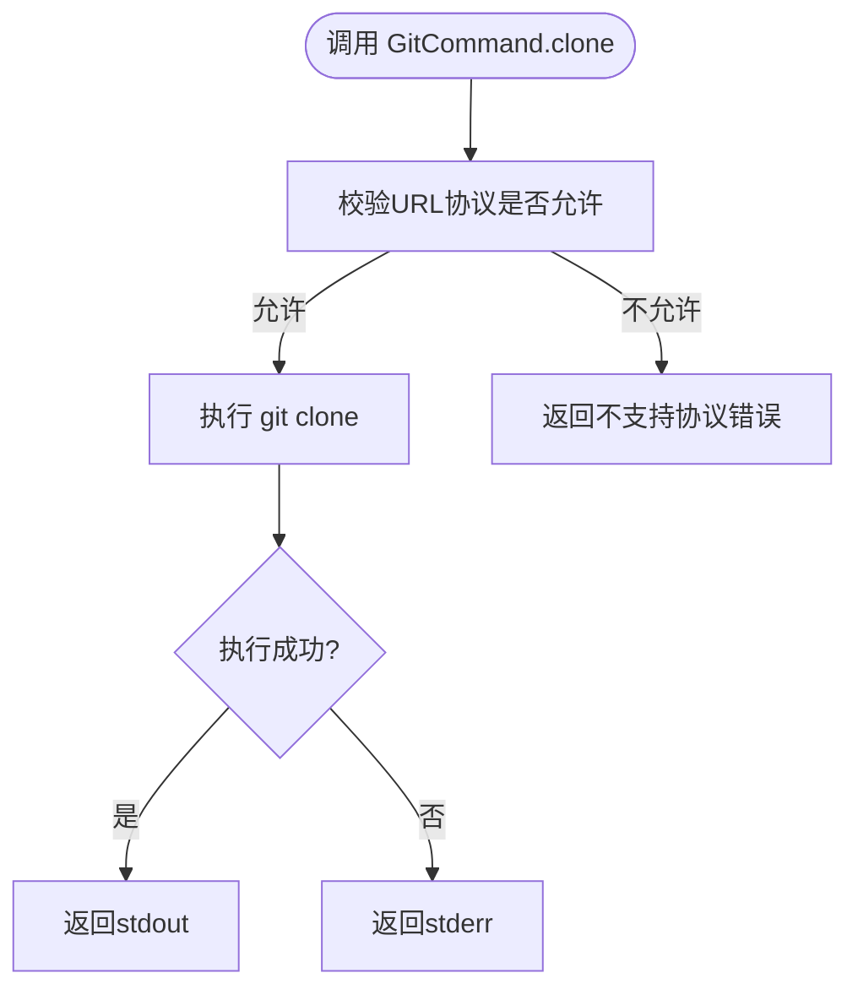
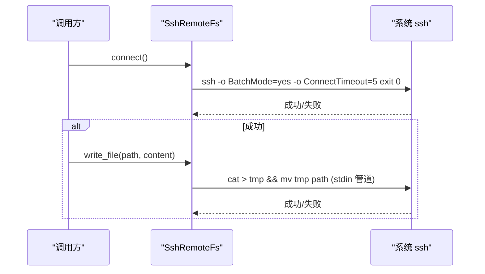
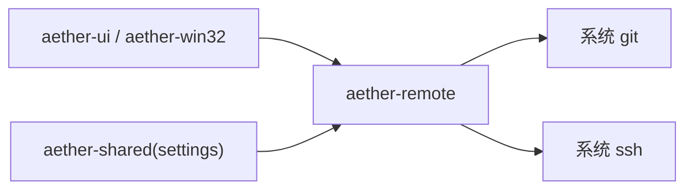

# Git 集成

<cite>
**本文引用的文件**
- [crates/aether-remote/src/git.rs](file://crates/aether-remote/src/git.rs)
- [crates/aether-remote/src/ssh.rs](file://crates/aether-remote/src/ssh.rs)
- [crates/aether-ui/src/git.rs](file://crates/aether-ui/src/git.rs)
- [crates/aether-win32/src/git.rs](file://crates/aether-win32/src/git.rs)
- [crates/aether-shared/src/settings.rs](file://crates/aether-shared/src/settings.rs)
- [crates/aether-remote/src/lib.rs](file://crates/aether-remote/src/lib.rs)
</cite>

## 目录
1. [简介](#简介)
2. [项目结构](#项目结构)
3. [核心组件](#核心组件)
4. [架构总览](#架构总览)
5. [详细组件分析](#详细组件分析)
6. [依赖关系分析](#依赖关系分析)
7. [性能考量](#性能考量)
8. [故障排查指南](#故障排查指南)
9. [结论](#结论)
10. [附录：使用示例与最佳实践](#附录使用示例与最佳实践)

## 简介
本文件系统性说明牧羊人编辑器的 Git 集成功能，覆盖远程仓库操作（克隆、推送、拉取、分支管理）、与远程服务器的交互机制（SSH 密钥认证、HTTPS 协议、代理配置思路）、Git 工作流集成（状态监控、冲突识别、提交历史查看）以及与本地 Git 客户端的协作和数据同步方式。文档基于代码实现进行解读，并提供可操作的配置与排错指引。

## 项目结构
Git 相关能力主要分布在以下模块：
- aether-remote：通过系统 git/ssh 二进制执行命令，提供仓库管理与 SSH 远程文件系统能力
- aether-ui / aether-win32：UI 层对 Git 状态的检测、展示与基础命令封装
- aether-shared：持久化 SSH 服务器配置（含认证类型、密钥路径等）

图表来源
- [crates/aether-remote/src/git.rs:1-120](file://crates/aether-remote/src/git.rs#L1-L120)
- [crates/aether-remote/src/ssh.rs:1-120](file://crates/aether-remote/src/ssh.rs#L1-L120)
- [crates/aether-ui/src/git.rs:1-120](file://crates/aether-ui/src/git.rs#L1-L120)
- [crates/aether-win32/src/git.rs:1-120](file://crates/aether-win32/src/git.rs#L1-L120)
- [crates/aether-shared/src/settings.rs:269-327](file://crates/aether-shared/src/settings.rs#L269-L327)

章节来源
- [crates/aether-remote/src/git.rs:1-120](file://crates/aether-remote/src/git.rs#L1-L120)
- [crates/aether-remote/src/ssh.rs:1-120](file://crates/aether-remote/src/ssh.rs#L1-L120)
- [crates/aether-ui/src/git.rs:1-120](file://crates/aether-ui/src/git.rs#L1-L120)
- [crates/aether-win32/src/git.rs:1-120](file://crates/aether-win32/src/git.rs#L1-L120)
- [crates/aether-shared/src/settings.rs:269-327](file://crates/aether-shared/src/settings.rs#L269-L327)

## 核心组件
- GitRepository（aether-remote）：面向仓库的高级 API，封装 clone/open/status/log/pull/push/branch 等操作，统一错误类型与输出解析
- GitCommand（aether-ui / aether-win32）：轻量级命令执行器，供 UI 直接调用常用 git 子命令
- SshRemoteFs（aether-remote）：通过系统 ssh 二进制实现远程文件系统读写、目录列举与命令执行
- 配置模型（aether-shared）：SSH 服务器配置与认证类型持久化

章节来源
- [crates/aether-remote/src/git.rs:115-531](file://crates/aether-remote/src/git.rs#L115-L531)
- [crates/aether-ui/src/git.rs:186-340](file://crates/aether-ui/src/git.rs#L186-L340)
- [crates/aether-win32/src/git.rs:186-340](file://crates/aether-win32/src/git.rs#L186-L340)
- [crates/aether-remote/src/ssh.rs:101-403](file://crates/aether-remote/src/ssh.rs#L101-L403)
- [crates/aether-shared/src/settings.rs:269-327](file://crates/aether-shared/src/settings.rs#L269-L327)

## 架构总览
编辑器通过 UI 层触发 Git 操作，底层由 aether-remote 调用系统 git/ssh 完成实际任务；SSH 连接采用系统 OpenSSH，支持密钥或 agent 认证；HTTPS 通过 git 自身处理。

图表来源
- [crates/aether-remote/src/git.rs:123-146](file://crates/aether-remote/src/git.rs#L123-L146)
- [crates/aether-remote/src/ssh.rs:130-154](file://crates/aether-remote/src/ssh.rs#L130-L154)
- [crates/aether-ui/src/git.rs:316-339](file://crates/aether-ui/src/git.rs#L316-L339)

## 详细组件分析

### Git 仓库管理器（aether-remote）
- 设计要点
  - 通过 shell out 调用系统 git 二进制，零 C 依赖，运行期依赖 PATH 中的 git
  - 统一的 GitError 枚举，涵盖克隆、拉取、推送、检出、提交、分支、合并、获取、状态、无效仓库、配置、认证失败、未安装 git 等场景
  - 安全加固：参数校验防止以“-”开头的 remote/branch 被误解析为 flag；clone URL 协议白名单（在 UI 层也做了校验）
- 关键能力
  - 克隆：从 URL 克隆到目标路径，自动推断仓库类型（SSH/HTTPS/Local）
  - 打开现有仓库：校验 .git 存在，读取 origin URL 推断类型
  - 当前分支：symbolic-ref 获取，detached HEAD 时返回特定标识
  - 状态：porcelain v1 -z 格式解析，区分暂存/未暂存/未跟踪/冲突
  - 提交：commit + rev-parse 获取新 commit 哈希
  - 分支：创建/切换/列出本地分支
  - 历史：log 自定义格式，解析作者、时间、消息等
  - 拉取：默认 --ff-only，非快进时返回错误，便于手动处理
  - 推送：支持 force 标志，参数校验同拉取
- 数据模型
  - GitStatus：clean 标记、暂存/未暂存/未跟踪/冲突列表、分支、ahead/behind（预留）
  - GitCommit：id、short_id、author_name/email、time、message/full_message

图表来源
- [crates/aether-remote/src/git.rs:115-531](file://crates/aether-remote/src/git.rs#L115-L531)

章节来源
- [crates/aether-remote/src/git.rs:115-531](file://crates/aether-remote/src/git.rs#L115-L531)

### 命令执行器（aether-ui / aether-win32）
- 职责
  - 提供 GitCommand.exec 统一执行 git 子命令并返回 stdout/stderr/成功标志
  - 封装 add/commit/push/pull/fetch/branch/log/clone 等常用操作
  - 检测仓库状态：通过 git status --porcelain 解析文件状态映射
- 安全
  - clone 前校验协议白名单（https/http/ssh/git），拒绝危险协议
- UI 集成
  - GitIntegration 聚合仓库状态、分支、提交消息、选中文件、diff 缓存等，提供 stage/unstage/commit/push/pull/switch/create/clone 等方法

图表来源
- [crates/aether-ui/src/git.rs:316-339](file://crates/aether-ui/src/git.rs#L316-L339)
- [crates/aether-win32/src/git.rs:316-339](file://crates/aether-win32/src/git.rs#L316-L339)

章节来源
- [crates/aether-ui/src/git.rs:186-340](file://crates/aether-ui/src/git.rs#L186-L340)
- [crates/aether-win32/src/git.rs:186-340](file://crates/aether-win32/src/git.rs#L186-L340)

### SSH 远程文件系统（aether-remote）
- 设计要点
  - 通过系统 ssh 二进制执行命令，无需内置 SSH 库
  - 认证方式：密钥文件或 ssh-agent；密码认证在 shell out 模式下不可用（无 tty）
  - 连接测试：BatchMode=yes + ConnectTimeout=5，避免阻塞
  - 写入原子性：先写临时文件再 mv 替换，避免断连导致损坏
  - 安全：用户名/主机名不以“-”开头，防止注入；known_hosts 严格模式
- 能力
  - 读/写/列举目录/执行远程命令
  - 监听变更：SSH 后端不支持 watch

图表来源
- [crates/aether-remote/src/ssh.rs:130-154](file://crates/aether-remote/src/ssh.rs#L130-L154)
- [crates/aether-remote/src/ssh.rs:285-321](file://crates/aether-remote/src/ssh.rs#L285-L321)

章节来源
- [crates/aether-remote/src/ssh.rs:1-403](file://crates/aether-remote/src/ssh.rs#L1-L403)

### 配置与设置（aether-shared）
- SSH 服务器配置持久化：名称、主机、端口、用户名、认证类型（Agent/Key/Password/Fallback）、密钥路径
- 密码/passphrase 不持久化，连接时由用户输入；未知认证类型回退为 Agent 语义
- 应用设置路径与加载逻辑（settings.json）

章节来源
- [crates/aether-shared/src/settings.rs:269-327](file://crates/aether-shared/src/settings.rs#L269-L327)

## 依赖关系分析
- aether-remote 暴露 GitRepository、SshRemoteFs 等能力，供上层使用
- aether-ui / aether-win32 提供 UI 友好的命令封装和状态检测
- 所有网络与版本控制操作最终依赖系统 git/ssh 二进制

图表来源
- [crates/aether-remote/src/lib.rs:1-18](file://crates/aether-remote/src/lib.rs#L1-L18)
- [crates/aether-ui/src/git.rs:186-340](file://crates/aether-ui/src/git.rs#L186-L340)
- [crates/aether-win32/src/git.rs:186-340](file://crates/aether-win32/src/git.rs#L186-L340)
- [crates/aether-shared/src/settings.rs:269-327](file://crates/aether-shared/src/settings.rs#L269-L327)

章节来源
- [crates/aether-remote/src/lib.rs:1-18](file://crates/aether-remote/src/lib.rs#L1-L18)

## 性能考量
- 命令开销：每次操作均 fork 外部进程，频繁刷新状态可能带来性能开销，建议批量操作后统一刷新
- 大仓库历史：log 查询应限制条数，避免一次性拉取过多记录
- SSH 连接：使用 BatchMode 与短超时减少等待；写入采用原子替换降低重试成本
- 状态解析：porcelain v1 -z 格式高效稳定，适合大量文件扫描

[本节为通用指导，不直接分析具体文件]

## 故障排查指南
- 系统未安装 git/ssh
  - 现象：git_available/ssh_available 检测失败
  - 处理：根据提示下载安装对应工具（git-scm.com/downloads、OpenSSH）
- 认证失败
  - 现象：SSH 连接失败或 git push/pull 鉴权错误
  - 处理：确认密钥路径正确、ssh-agent 已加载私钥；检查 known_hosts 与 StrictHostKeyChecking
- 非快进拉取
  - 现象：pull 返回错误（--ff-only）
  - 处理：手动合并或 rebase 后再拉取
- 参数注入防护
  - 现象：remote/branch 以“-”开头被当作选项
  - 处理：确保传入参数合法，内部已做前置校验
- 协议限制
  - 现象：clone 不支持的协议
  - 处理：仅允许 https/http/ssh/git 协议

章节来源
- [crates/aether-remote/src/git.rs:15-25](file://crates/aether-remote/src/git.rs#L15-L25)
- [crates/aether-remote/src/ssh.rs:30-40](file://crates/aether-remote/src/ssh.rs#L30-L40)
- [crates/aether-remote/src/git.rs:401-436](file://crates/aether-remote/src/git.rs#L401-L436)
- [crates/aether-ui/src/git.rs:316-339](file://crates/aether-ui/src/git.rs#L316-L339)

## 结论
牧羊人编辑器的 Git 集成以“最小依赖、最大兼容”为原则，通过系统 git/ssh 二进制实现完整的远程仓库操作与工作流支持。其优势在于零编译期依赖、跨平台一致行为；同时通过严格的参数校验与安全策略保障稳定性。结合 UI 层的状态监控与命令封装，开发者可在编辑器内高效完成克隆、提交、分支管理与远程同步。

[本节为总结性内容，不直接分析具体文件]

## 附录：使用示例与最佳实践

### 配置远程仓库
- 准备 SSH 密钥或启用 ssh-agent
  - 将私钥加入 ssh-agent，或在设置中指定密钥路径
  - 首次连接会校验 known_hosts，按提示接受指纹
- 使用 HTTPS
  - 直接使用 https:// 仓库地址，git 会自动处理凭据（可配合凭据管理器）

章节来源
- [crates/aether-shared/src/settings.rs:269-327](file://crates/aether-shared/src/settings.rs#L269-L327)
- [crates/aether-remote/src/ssh.rs:130-154](file://crates/aether-remote/src/ssh.rs#L130-L154)

### 执行版本控制操作
- 克隆仓库
  - 调用高层 API 或 UI 层 clone_repo，传入 https/ssh 地址与目标路径
- 提交与推送
  - 先 add 文件，再 commit 提交，最后 push 到远端
  - 若需要强制推送，可使用 force 标志（谨慎使用）
- 拉取更新
  - 使用 pull（默认 --ff-only），遇到非快进需手动合并

章节来源
- [crates/aether-remote/src/git.rs:123-146](file://crates/aether-remote/src/git.rs#L123-L146)
- [crates/aether-remote/src/git.rs:273-296](file://crates/aether-remote/src/git.rs#L273-L296)
- [crates/aether-remote/src/git.rs:438-482](file://crates/aether-remote/src/git.rs#L438-L482)
- [crates/aether-ui/src/git.rs:447-516](file://crates/aether-ui/src/git.rs#L447-L516)

### 处理网络异常
- 超时与重试
  - SSH 连接使用短超时，失败时提示用户检查网络与凭据
- 认证问题
  - 确认密钥可用、权限正确；必要时重新添加至 ssh-agent
- 非快进冲突
  - 拉取失败时，进入手动合并流程，解决冲突后再提交

章节来源
- [crates/aether-remote/src/ssh.rs:130-154](file://crates/aether-remote/src/ssh.rs#L130-L154)
- [crates/aether-remote/src/git.rs:401-436](file://crates/aether-remote/src/git.rs#L401-L436)

### 与本地 Git 客户端协作与数据同步
- 编辑器与命令行 git 共享同一工作区与 .git 目录，任何一方的修改都会反映到另一方
- 建议在编辑器中进行日常提交与分支操作，复杂合并可通过命令行完成后再在编辑器中刷新状态

章节来源
- [crates/aether-remote/src/git.rs:148-184](file://crates/aether-remote/src/git.rs#L148-L184)
- [crates/aether-ui/src/git.rs:38-58](file://crates/aether-ui/src/git.rs#L38-L58)