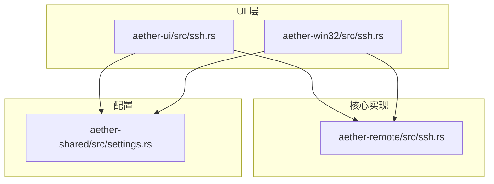
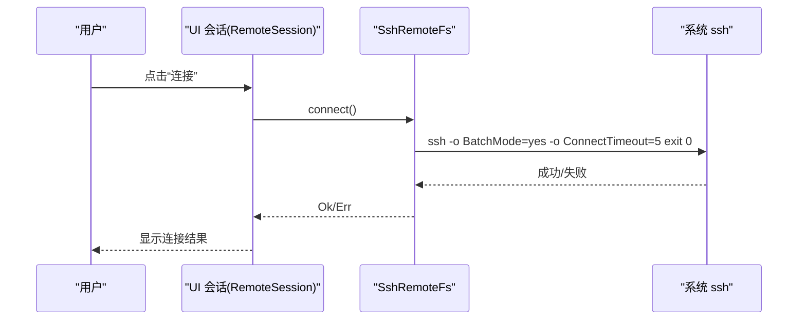
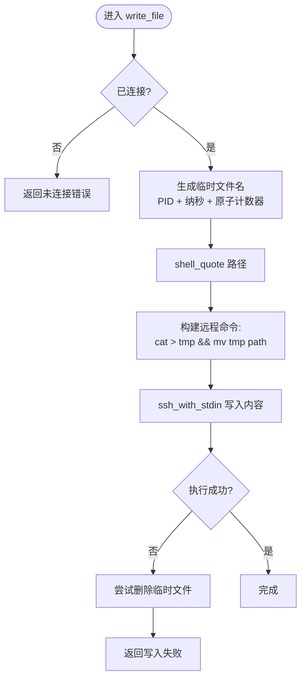
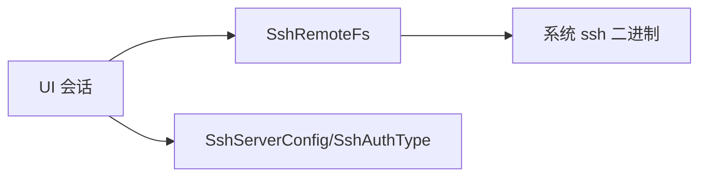

# SSH 连接管理

<cite>
**本文引用的文件**
- [aether-remote/src/ssh.rs](file://crates/aether-remote/src/ssh.rs)
- [aether-ui/src/ssh.rs](file://crates/aether-ui/src/ssh.rs)
- [aether-win32/src/ssh.rs](file://crates/aether-win32/src/ssh.rs)
- [aether-shared/src/settings.rs](file://crates/aether-shared/src/settings.rs)
</cite>

## 目录
1. [简介](#简介)
2. [项目结构](#项目结构)
3. [核心组件](#核心组件)
4. [架构总览](#架构总览)
5. [详细组件分析](#详细组件分析)
6. [依赖关系分析](#依赖关系分析)
7. [性能考量](#性能考量)
8. [故障排查指南](#故障排查指南)
9. [结论](#结论)
10. [附录：使用示例与最佳实践](#附录使用示例与最佳实践)

## 简介
本文件面向牧羊人编辑器的 SSH 连接管理功能，聚焦“基于系统 OpenSSH 客户端的 shell out 模式”实现。该模式在运行期调用操作系统自带的 ssh 二进制（Windows 10+ 自带 OpenSSH），无需内置 SSH 库，编译期零依赖、运行期依赖系统 ssh。文档涵盖：
- 连接建立、认证处理（密钥认证与 Agent 模式）、连接状态管理
- SshConfig 配置结构设计（主机、端口、用户名、认证方式）
- 安全性机制（命令注入防护、known_hosts 验证等）
- 密码认证的限制原因与替代方案
- 实际使用示例（配置认证、建立连接、执行远程命令）

## 项目结构
SSH 相关代码分布在以下 crate：
- aether-remote：底层 SSH 远程文件系统实现，封装对系统 ssh 的调用
- aether-ui / aether-win32：UI 层会话管理与对话框状态（跨平台 UI 抽象）
- aether-shared：持久化设置模型（SshServerConfig、SshAuthType）

图表来源
- [aether-remote/src/ssh.rs:1-403](file://crates/aether-remote/src/ssh.rs#L1-L403)
- [aether-ui/src/ssh.rs:1-616](file://crates/aether-ui/src/ssh.rs#L1-L616)
- [aether-win32/src/ssh.rs:1-606](file://crates/aether-win32/src/ssh.rs#L1-L606)
- [aether-shared/src/settings.rs:269-327](file://crates/aether-shared/src/settings.rs#L269-L327)

章节来源
- [aether-remote/src/ssh.rs:1-403](file://crates/aether-remote/src/ssh.rs#L1-L403)
- [aether-ui/src/ssh.rs:1-616](file://crates/aether-ui/src/ssh.rs#L1-L616)
- [aether-win32/src/ssh.rs:1-606](file://crates/aether-win32/src/ssh.rs#L1-L606)
- [aether-shared/src/settings.rs:269-327](file://crates/aether-shared/src/settings.rs#L269-L327)

## 核心组件
- SshRemoteFs：基于系统 ssh 的远程文件系统实现，提供 read_file、write_file、list_dir、exec 等方法；维护软连接状态 connected
- SshConfig：运行时连接配置（host、port、username、auth）
- SshAuth：认证方式枚举（Password、Key{path, passphrase}、Agent）
- RemoteSession：UI 层会话封装，统一 connect/disconnect/list/exec 等接口
- SshServerConfig/SshAuthType：持久化到 settings.json 的配置结构与认证类型

章节来源
- [aether-remote/src/ssh.rs:42-106](file://crates/aether-remote/src/ssh.rs#L42-L106)
- [aether-ui/src/ssh.rs:119-182](file://crates/aether-ui/src/ssh.rs#L119-L182)
- [aether-shared/src/settings.rs:269-327](file://crates/aether-shared/src/settings.rs#L269-L327)

## 架构总览
整体采用“UI 层 + 核心实现 + 配置”的分层设计：
- UI 层负责用户输入、表单校验、会话状态管理
- 核心实现通过 shell out 调用系统 ssh，完成认证、文件操作与命令执行
- 配置层负责持久化服务器信息与认证类型

图表来源
- [aether-ui/src/ssh.rs:140-145](file://crates/aether-ui/src/ssh.rs#L140-L145)
- [aether-remote/src/ssh.rs:130-154](file://crates/aether-remote/src/ssh.rs#L130-L154)

章节来源
- [aether-ui/src/ssh.rs:119-182](file://crates/aether-ui/src/ssh.rs#L119-L182)
- [aether-remote/src/ssh.rs:101-164](file://crates/aether-remote/src/ssh.rs#L101-L164)

## 详细组件分析

### SshRemoteFs：shell out 模式的核心实现
- 设计目标：面向 Windows 开发者，利用系统 OpenSSH，零编译期依赖
- 限制：
  - 密码认证不支持（无 tty，无法交互输入密码）
  - known_hosts 由 ssh.exe 自动校验，默认严格模式
  - 调用前需先检查 ssh_available()

关键能力：
- 连接测试：connect() 使用 BatchMode=yes 与 ConnectTimeout=5，避免阻塞与交互提示
- 基础参数构造：base_args() 组装 BatchMode、StrictHostKeyChecking、端口、密钥、目标 user@host
- 命令执行：ssh()/ssh_with_stdin() 封装进程调用，支持带 stdin 写入
- 文件操作：read_file/write_file/list_dir/exec
  - write_file 使用临时文件 + mv 原子替换，避免断连损坏
  - list_dir 使用 find + stat 一次性获取属性，空目录安全处理
  - exec 直接转发远程 stdout/stderr

安全要点：
- 路径与参数转义：shell_quote() 单引号包裹并转义内部单引号，防止注入
- 选项注入防护：用户名和主机名若以“-”开头则拒绝生成参数，防止被解释为 ssh 选项（如 -oProxyCommand=calc.exe）
- known_hosts：StrictHostKeyChecking=accept-new，首次连接接受并记录，后续严格校验

图表来源
- [aether-remote/src/ssh.rs:285-321](file://crates/aether-remote/src/ssh.rs#L285-L321)

章节来源
- [aether-remote/src/ssh.rs:1-403](file://crates/aether-remote/src/ssh.rs#L1-L403)

### SshConfig 与 SshAuth：配置与认证
- SshConfig：包含 host、port、username、auth；默认 port=22，默认 auth=Agent
- SshAuth：
  - Password：当前 shell out 模式不支持（connect 层拦截）
  - Key：指定私钥路径与可选 passphrase
  - Agent：使用 ssh-agent 进行认证（推荐）

注意：
- 密码认证在 UI 层与核心层双重禁用，确保不会生成 Password 变体
- 密钥认证必须提供 key_path（UI 层校验）

章节来源
- [aether-remote/src/ssh.rs:42-99](file://crates/aether-remote/src/ssh.rs#L42-L99)
- [aether-ui/src/ssh.rs:80-106](file://crates/aether-ui/src/ssh.rs#L80-L106)
- [aether-shared/src/settings.rs:269-327](file://crates/aether-shared/src/settings.rs#L269-L327)

### RemoteSession：UI 层会话封装
- 职责：封装 SshRemoteFs，提供 connect/disconnect/is_connected/list_current_dir/read_remote_file/write_remote_file/exec 等便捷方法
- 状态：connected、current_path、error_message
- 行为：所有操作均委托给底层 fs，统一错误转换

章节来源
- [aether-ui/src/ssh.rs:119-182](file://crates/aether-ui/src/ssh.rs#L119-L182)

### 持久化配置：SshServerConfig 与 SshAuthType
- SshServerConfig：name、host、port、username、auth_type、key_path
- SshAuthType：Password（仅兼容旧配置）、Key、Agent（默认）、Fallback（未知值回退为 Agent）
- 安全：密码/passphrase 不持久化，连接时由用户输入或通过 Agent 处理

章节来源
- [aether-shared/src/settings.rs:269-327](file://crates/aether-shared/src/settings.rs#L269-L327)

## 依赖关系分析
- UI 层依赖 aether_remote::ssh 提供的 SshConfig、SshAuth、SshRemoteFs
- UI 层依赖 aether_shared::settings 中的 SshServerConfig、SshAuthType 用于持久化
- 核心实现依赖系统 ssh 二进制，通过 std::process::Command 调用

图表来源
- [aether-ui/src/ssh.rs:1-5](file://crates/aether-ui/src/ssh.rs#L1-L5)
- [aether-remote/src/ssh.rs:12-17](file://crates/aether-remote/src/ssh.rs#L12-L17)
- [aether-shared/src/settings.rs:269-327](file://crates/aether-shared/src/settings.rs#L269-L327)

章节来源
- [aether-ui/src/ssh.rs:1-616](file://crates/aether-ui/src/ssh.rs#L1-L616)
- [aether-remote/src/ssh.rs:1-403](file://crates/aether-remote/src/ssh.rs#L1-L403)
- [aether-shared/src/settings.rs:269-327](file://crates/aether-shared/src/settings.rs#L269-L327)

## 性能考量
- 每次操作独立调用 ssh，无持久连接；适合低频、短任务场景
- 目录列表使用 find + stat 一次性获取属性，减少往返
- 写入使用临时文件 + mv 原子替换，避免中断导致的数据不一致
- 连接测试使用 ConnectTimeout=5，快速失败

[本节为通用指导，不直接分析具体文件]

## 故障排查指南
常见问题与定位：
- 未安装 ssh：调用 ssh_available() 检测，缺失时引导安装 OpenSSH
- 连接失败：connect() 返回错误信息包含 stderr/stdout，检查网络、认证、known_hosts
- 密码认证不可用：connect() 会明确拒绝 Password，改用 Key 或 Agent
- 命令注入风险：用户名/主机名以“-”开头会被拒绝；路径使用 shell_quote 转义
- 写入失败：检查临时文件清理逻辑与远程权限

章节来源
- [aether-remote/src/ssh.rs:30-40](file://crates/aether-remote/src/ssh.rs#L30-L40)
- [aether-remote/src/ssh.rs:130-154](file://crates/aether-remote/src/ssh.rs#L130-L154)
- [aether-remote/src/ssh.rs:186-202](file://crates/aether-remote/src/ssh.rs#L186-L202)
- [aether-remote/src/ssh.rs:285-321](file://crates/aether-remote/src/ssh.rs#L285-L321)

## 结论
本实现通过 shell out 模式复用系统 OpenSSH，具备零编译期依赖、易于部署的优势。通过严格的参数转义与选项注入防护、known_hosts 校验、原子写入等机制，保障连接与文件操作的安全性。密码认证因无 tty 而受限，推荐使用密钥认证或 ssh-agent。UI 层提供清晰的会话管理与配置持久化，便于用户集成与维护。

[本节为总结性内容，不直接分析具体文件]

## 附录：使用示例与最佳实践

### 配置不同类型的认证方式
- Agent 认证（推荐）：
  - 在 UI 层选择 Agent，无需额外配置
  - 确保本地 ssh-agent 已加载私钥
- 密钥认证：
  - 在 UI 层选择 Key，填写私钥路径
  - 若私钥有口令，可在连接时输入（当前实现中 passphrase 字段存在但 UI 层未持久化）

章节来源
- [aether-ui/src/ssh.rs:80-106](file://crates/aether-ui/src/ssh.rs#L80-L106)
- [aether-shared/src/settings.rs:269-327](file://crates/aether-shared/src/settings.rs#L269-L327)

### 建立 SSH 连接
- 步骤：
  - 准备 SshConfig（host、port、username、auth）
  - 创建 RemoteSession 并调用 connect()
  - 检查 is_connected() 确认状态

章节来源
- [aether-ui/src/ssh.rs:128-154](file://crates/aether-ui/src/ssh.rs#L128-L154)
- [aether-remote/src/ssh.rs:130-154](file://crates/aether-remote/src/ssh.rs#L130-L154)

### 执行远程命令
- 使用 RemoteSession.exec(command) 或底层 SshRemoteFs.exec
- 注意：command 将作为 ssh 的参数传递，建议由可信来源生成

章节来源
- [aether-ui/src/ssh.rs:173-176](file://crates/aether-ui/src/ssh.rs#L173-L176)
- [aether-remote/src/ssh.rs:381-401](file://crates/aether-remote/src/ssh.rs#L381-L401)

### 密码认证的限制与替代方案
- 限制原因：shell out 模式无 tty，无法交互式输入密码
- 替代方案：
  - 使用密钥认证（SshAuth::Key）
  - 使用 ssh-agent（SshAuth::Agent）
- UI 层与核心层双重禁用 Password，确保不会误用

章节来源
- [aether-remote/src/ssh.rs:130-141](file://crates/aether-remote/src/ssh.rs#L130-L141)
- [aether-ui/src/ssh.rs:80-106](file://crates/aether-ui/src/ssh.rs#L80-L106)

### 安全性机制说明
- 命令注入防护：
  - shell_quote() 单引号包裹并转义内部单引号
  - 用户名/主机名不以“-”开头才允许拼接为目标
- known_hosts 验证：
  - StrictHostKeyChecking=accept-new，首次连接接受并记录，后续严格校验
- 原子写入：
  - 临时文件 + mv，避免断连损坏远程文件

章节来源
- [aether-remote/src/ssh.rs:25-28](file://crates/aether-remote/src/ssh.rs#L25-L28)
- [aether-remote/src/ssh.rs:166-202](file://crates/aether-remote/src/ssh.rs#L166-L202)
- [aether-remote/src/ssh.rs:285-321](file://crates/aether-remote/src/ssh.rs#L285-L321)