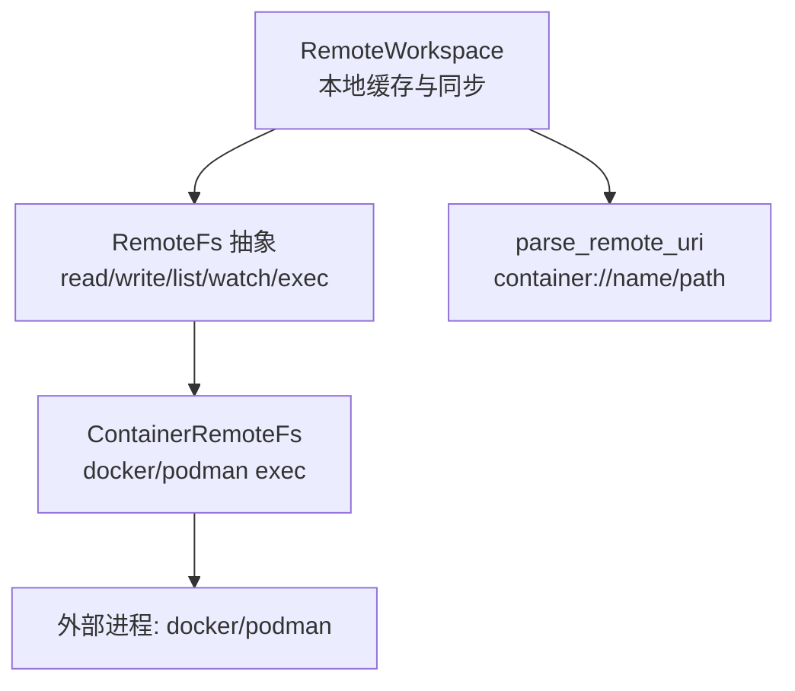
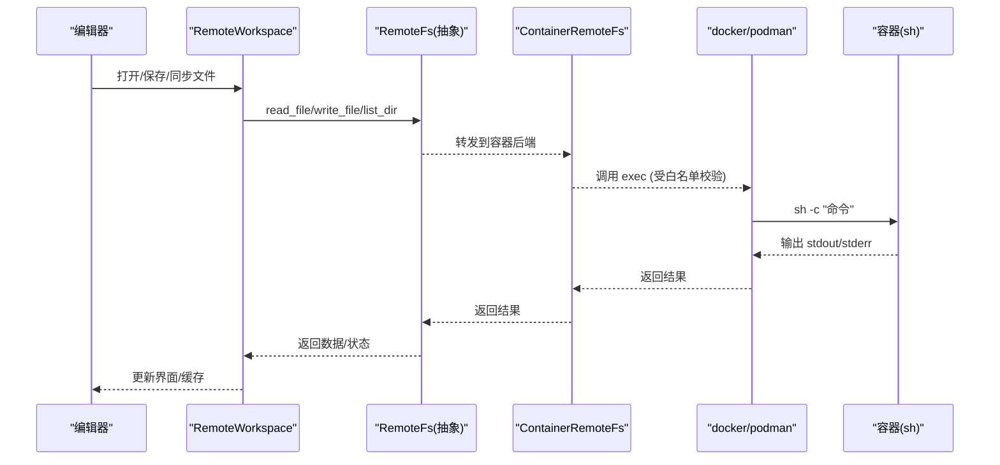
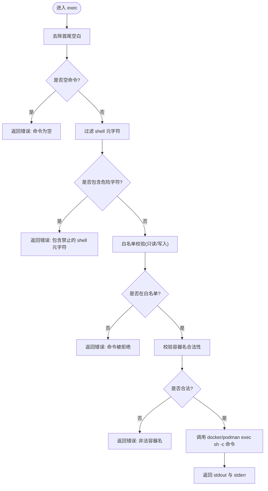
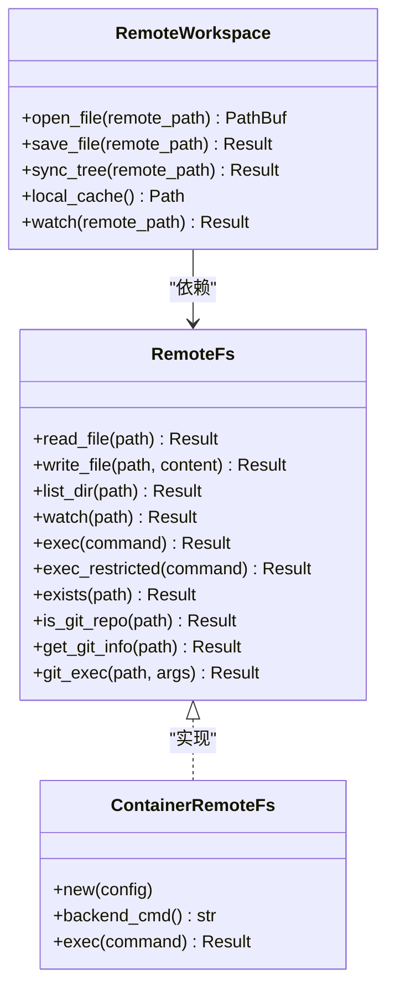

# 容器支持

<cite>
**本文引用的文件**
- [container.rs](file://crates/aether-remote/src/container.rs)
- [remote_fs.rs](file://crates/aether-remote/src/remote_fs.rs)
- [workspace.rs](file://crates/aether-remote/src/workspace.rs)
- [lib.rs](file://crates/aether-remote/src/lib.rs)
- [tests.rs](file://crates/aether-remote/src/tests.rs)
</cite>

## 目录
1. [简介](#简介)
2. [项目结构](#项目结构)
3. [核心组件](#核心组件)
4. [架构总览](#架构总览)
5. [详细组件分析](#详细组件分析)
6. [依赖关系分析](#依赖关系分析)
7. [性能与资源管理](#性能与资源管理)
8. [故障排查指南](#故障排查指南)
9. [结论](#结论)
10. [附录：使用示例与最佳实践](#附录使用示例与最佳实践)

## 简介
本章节面向“牧羊人编辑器”的容器集成功能，聚焦于容器远程工作区的能力边界、安全策略与扩展点。当前实现提供了基于 Docker/Podman 的命令执行通道（exec），并定义了统一的远程文件系统抽象 RemoteFs，以及远程工作区的本地缓存与同步机制。文档将围绕以下目标展开：
- 容器生命周期管理：说明当前可支持的启动/停止/重启能力与扩展建议
- 容器环境配置：镜像选择、端口映射、卷挂载、环境变量等配置的接入点与注意事项
- 开发环境搭建流程：依赖安装、服务启动、调试配置的落地步骤与限制
- 使用示例：创建开发容器、执行命令、访问服务的场景化指引
- 资源管理与性能优化：缓存策略、命令白名单、审计日志与错误处理

## 项目结构
容器相关代码集中在 aether-remote 模块中，采用分层设计：
- 抽象层：RemoteFs trait 定义统一的文件系统接口与受限命令执行入口
- 后端实现：ContainerRemoteFs 提供基于 docker/podman exec 的命令执行能力
- 工作区层：RemoteWorkspace 负责远程到本地的缓存、同步与大小控制
- 解析与集成：parse_remote_uri 支持 container:// 协议，便于上层以统一方式接入

图表来源
- [remote_fs.rs:26-94](file://crates/aether-remote/src/remote_fs.rs#L26-L94)
- [container.rs:21-123](file://crates/aether-remote/src/container.rs#L21-L123)
- [workspace.rs:19-147](file://crates/aether-remote/src/workspace.rs#L19-L147)
- [workspace.rs:235-250](file://crates/aether-remote/src/workspace.rs#L235-L250)

章节来源
- [lib.rs:1-17](file://crates/aether-remote/src/lib.rs#L1-L17)
- [remote_fs.rs:26-94](file://crates/aether-remote/src/remote_fs.rs#L26-L94)
- [container.rs:21-123](file://crates/aether-remote/src/container.rs#L21-L123)
- [workspace.rs:19-147](file://crates/aether-remote/src/workspace.rs#L19-L147)
- [workspace.rs:235-250](file://crates/aether-remote/src/workspace.rs#L235-L250)

## 核心组件
- ContainerBackend：枚举表示容器运行时后端（Docker/Podman）
- ContainerConfig：容器连接配置，包含后端类型、容器名、镜像、工作区挂载路径
- ContainerRemoteFs：实现 RemoteFs 的容器后端，目前实现了受限命令执行 exec，其他文件操作为占位
- RemoteFs：统一远程文件系统抽象，提供 read_file、write_file、list_dir、watch、exec、exec_restricted 等接口
- RemoteWorkspace：远程工作区，负责本地缓存、版本跟踪、目录同步与容量清理
- parse_remote_uri：解析 container:// 协议，返回容器名与路径

章节来源
- [container.rs:5-19](file://crates/aether-remote/src/container.rs#L5-L19)
- [container.rs:21-123](file://crates/aether-remote/src/container.rs#L21-L123)
- [remote_fs.rs:26-94](file://crates/aether-remote/src/remote_fs.rs#L26-L94)
- [workspace.rs:6-26](file://crates/aether-remote/src/workspace.rs#L6-L26)
- [workspace.rs:235-250](file://crates/aether-remote/src/workspace.rs#L235-L250)

## 架构总览
下图展示了从编辑器到容器的调用链：RemoteWorkspace 通过 RemoteFs 抽象与 ContainerRemoteFs 交互；ContainerRemoteFs 通过外部进程调用 docker/podman exec 在容器内执行命令；所有命令均经过严格的白名单与元字符过滤，确保安全性。

图表来源
- [remote_fs.rs:26-94](file://crates/aether-remote/src/remote_fs.rs#L26-L94)
- [container.rs:58-123](file://crates/aether-remote/src/container.rs#L58-L123)
- [workspace.rs:58-147](file://crates/aether-remote/src/workspace.rs#L58-L147)

## 详细组件分析

### 容器后端与配置
- ContainerBackend：区分 Docker 与 Podman，决定底层命令为 docker 或 podman
- ContainerConfig：包含 backend、container_name、image、workspace_mount
- ContainerRemoteFs::backend_cmd：根据后端返回对应命令名
- 注意：当前 ContainerRemoteFs 仅实现 exec；read_file、write_file、list_dir、watch 均为未实现占位

章节来源
- [container.rs:5-19](file://crates/aether-remote/src/container.rs#L5-L19)
- [container.rs:27-37](file://crates/aether-remote/src/container.rs#L27-L37)
- [container.rs:40-56](file://crates/aether-remote/src/container.rs#L40-L56)

### 受限命令执行与安全策略
- exec_restricted（RemoteFs 默认实现）：
  - 拒绝空命令
  - 严格过滤 shell 元字符（如 ; | & ` $ > < \ ' " * ? [ ] { } ~ # !）
  - 最小化命令白名单（只读、系统信息、必要文件操作、git/tar/gzip/gunzip）
  - 记录审计日志
  - 调用 exec 实际执行
- ContainerRemoteFs::exec：
  - 审计日志
  - 空命令检查
  - 再次过滤 shell 元字符
  - 白名单校验（读写分离，写入额外审计）
  - 容器名校验（仅字母数字、连字符、下划线、点）
  - 使用参数列表调用 docker/podman exec sh -c "命令"，避免拼接注入
  - 返回 stdout 与 stderr

图表来源
- [remote_fs.rs:51-94](file://crates/aether-remote/src/remote_fs.rs#L51-L94)
- [container.rs:58-123](file://crates/aether-remote/src/container.rs#L58-L123)

章节来源
- [remote_fs.rs:51-94](file://crates/aether-remote/src/remote_fs.rs#L51-L94)
- [container.rs:58-123](file://crates/aether-remote/src/container.rs#L58-L123)

### 远程工作区与本地缓存
- RemoteWorkspace：
  - open_file：读取远程文件到本地缓存，校验路径防遍历，写入后二次 canonicalize 验证
  - save_file：将本地修改写回远程
  - sync_tree：同步远程目录结构到本地缓存，过滤非法条目名
  - check_cache_size / trim_cache：当缓存超过阈值时自动清理旧文件
  - watch：委托给后端（容器后端不支持 watch，返回错误）
- parse_remote_uri：支持 container://name/path 格式，便于上层以统一方式接入容器工作区

章节来源
- [workspace.rs:19-147](file://crates/aether-remote/src/workspace.rs#L19-L147)
- [workspace.rs:154-226](file://crates/aether-remote/src/workspace.rs#L154-L226)
- [workspace.rs:235-250](file://crates/aether-remote/src/workspace.rs#L235-L250)

### Git 集成与受限执行
- get_git_info：通过 exec_restricted 获取远程仓库信息（远程 URL、当前分支、是否有未提交变更）
- git_exec：对 git 参数进行严格校验（不以 - 开头、不含 ..、非绝对路径、不含 ./~/ 前缀），再调用 exec_restricted
- validate_git_path：提前校验路径安全性，提供更清晰的错误信息

章节来源
- [remote_fs.rs:117-185](file://crates/aether-remote/src/remote_fs.rs#L117-L185)
- [remote_fs.rs:196-216](file://crates/aether-remote/src/remote_fs.rs#L196-L216)

## 依赖关系分析
- RemoteFs 抽象解耦了不同后端（SSH、容器），使 RemoteWorkspace 可以通用化地管理本地缓存与同步
- ContainerRemoteFs 依赖外部进程 docker/podman，并通过严格的白名单与元字符过滤保障安全
- RemoteWorkspace 依赖 RemoteFs 提供的文件与命令能力，同时维护本地缓存与版本信息
- parse_remote_uri 为上层提供统一的容器 URI 解析能力

图表来源
- [remote_fs.rs:26-185](file://crates/aether-remote/src/remote_fs.rs#L26-L185)
- [container.rs:21-123](file://crates/aether-remote/src/container.rs#L21-L123)
- [workspace.rs:6-147](file://crates/aether-remote/src/workspace.rs#L6-L147)

章节来源
- [lib.rs:1-17](file://crates/aether-remote/src/lib.rs#L1-L17)
- [remote_fs.rs:26-185](file://crates/aether-remote/src/remote_fs.rs#L26-L185)
- [container.rs:21-123](file://crates/aether-remote/src/container.rs#L21-L123)
- [workspace.rs:6-147](file://crates/aether-remote/src/workspace.rs#L6-L147)

## 性能与资源管理
- 命令执行安全与开销：
  - 每次 exec 都会触发外部进程调用，存在进程创建与通信开销
  - 白名单与元字符过滤在用户态完成，开销较小但必须严格执行
- 本地缓存策略：
  - 最大缓存大小限制（500MB），超过阈值自动清理至目标的 80%
  - 按修改时间排序删除最旧文件，减少 I/O 与磁盘占用
- 路径安全：
  - 打开/保存文件时对本地路径进行 canonicalize 校验，防止符号链接 TOCTOU 攻击
  - 远程路径校验阻止路径遍历（..、\）
- 审计日志：
  - 所有 exec 与写入操作均记录审计日志，便于问题追踪与安全审计

章节来源
- [workspace.rs:14-17](file://crates/aether-remote/src/workspace.rs#L14-L17)
- [workspace.rs:58-100](file://crates/aether-remote/src/workspace.rs#L58-L100)
- [workspace.rs:154-226](file://crates/aether-remote/src/workspace.rs#L154-L226)
- [container.rs:58-97](file://crates/aether-remote/src/container.rs#L58-L97)

## 故障排查指南
- 常见错误与原因：
  - 命令为空：传入空字符串或未去除空白
  - 包含禁止的 shell 元字符：命令中包含 ; | & ` $ > < \ ' " * ? [ ] { } ~ # !
  - 命令不在白名单：尝试执行未在允许列表中的命令
  - 非法容器名：容器名包含不允许的字符
  - 容器后端不支持的功能：read_file、write_file、list_dir、watch 在当前容器后端未实现
- 定位方法：
  - 查看审计日志（exec 与写入操作会输出日志）
  - 检查命令白名单与元字符过滤逻辑
  - 确认容器名与后端命令（docker/podman）可用
- 测试覆盖：
  - 单元测试覆盖了后端命令选择、错误路径、无效容器名、URI 解析等场景

章节来源
- [container.rs:58-123](file://crates/aether-remote/src/container.rs#L58-L123)
- [remote_fs.rs:51-94](file://crates/aether-remote/src/remote_fs.rs#L51-L94)
- [tests.rs:562-642](file://crates/aether-remote/src/tests.rs#L562-L642)

## 结论
当前容器支持以“受限命令执行”为核心，结合 RemoteFs 抽象与 RemoteWorkspace 的本地缓存机制，为容器内开发提供了安全可控的基础能力。后续可扩展：
- 完整文件操作（read/write/list/cp）以实现更完整的容器文件系统访问
- 容器生命周期管理（启动/停止/重启）与 .devcontainer.json 解析
- 端口映射与环境变量注入，以便运行 Web 服务或调试器
- 文件监视（watch）以提升实时同步体验

## 附录：使用示例与最佳实践

### 容器生命周期管理
- 当前状态：
  - 未实现容器启动/停止/重启；仅提供 exec 通道
- 建议实现：
  - 在 ContainerRemoteFs 中增加 start/stop/restart 方法，封装 docker/podman 对应子命令
  - 结合 workspace 配置（镜像、挂载、端口、环境变量）统一管理
  - 提供健康检查与重试机制，提升稳定性

### 容器环境配置
- 配置项（ContainerConfig）：
  - backend：Docker 或 Podman
  - container_name：容器名称（需符合命名规范）
  - image：镜像名称（用于启动新容器）
  - workspace_mount：工作区挂载路径（用于文件共享）
- 扩展建议：
  - 增加端口映射、环境变量、网络模式、资源限制等字段
  - 实现 parse_devcontainer_json 以解析标准 devcontainer 配置

### 开发环境搭建流程
- 依赖安装：
  - 在容器镜像中预装语言运行时与工具链（如 Node、Python、Rust）
  - 通过 exec 执行安装脚本（需在白名单内或通过扩展机制）
- 服务启动：
  - 使用 exec 启动后台服务（如 LSP、调试器）
  - 通过端口映射暴露服务供编辑器访问
- 调试配置：
  - 配置 DAP/LSP 客户端指向容器内服务地址
  - 利用 exec 执行调试命令并收集输出

### 使用示例
- 创建开发容器：
  - 使用镜像与工作区挂载路径启动容器（待实现）
  - 通过 parse_remote_uri 解析 container://name/path 以接入工作区
- 执行容器内命令：
  - 调用 exec_restricted 执行白名单内的命令（如 ls、cat、pwd、git 等）
  - 审计日志记录所有执行行为
- 访问容器内服务：
  - 通过端口映射将容器服务暴露到宿主机
  - 编辑器通过本地地址访问服务（如 LSP/DAP）

### 最佳实践
- 安全优先：
  - 始终使用 exec_restricted，避免直接 exec
  - 严格校验容器名与路径，防止注入与遍历
- 性能优化：
  - 合理使用本地缓存，避免频繁下载大文件
  - 批量操作合并以减少 exec 调用次数
- 可观测性：
  - 启用审计日志，记录关键操作
  - 完善错误信息，便于快速定位问题

章节来源
- [container.rs:12-19](file://crates/aether-remote/src/container.rs#L12-L19)
- [container.rs:126-129](file://crates/aether-remote/src/container.rs#L126-L129)
- [workspace.rs:235-250](file://crates/aether-remote/src/workspace.rs#L235-L250)
- [remote_fs.rs:51-94](file://crates/aether-remote/src/remote_fs.rs#L51-L94)
- [tests.rs:562-642](file://crates/aether-remote/src/tests.rs#L562-L642)