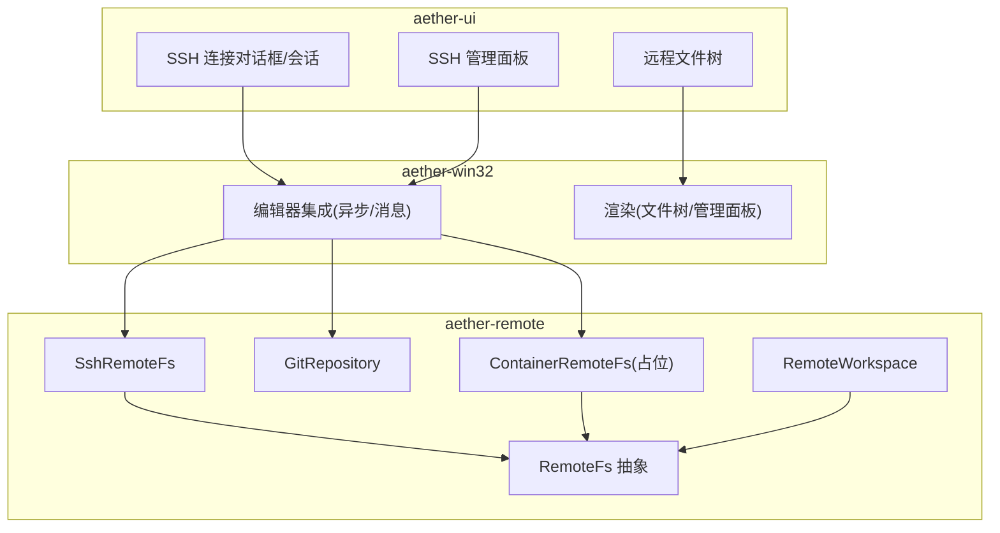
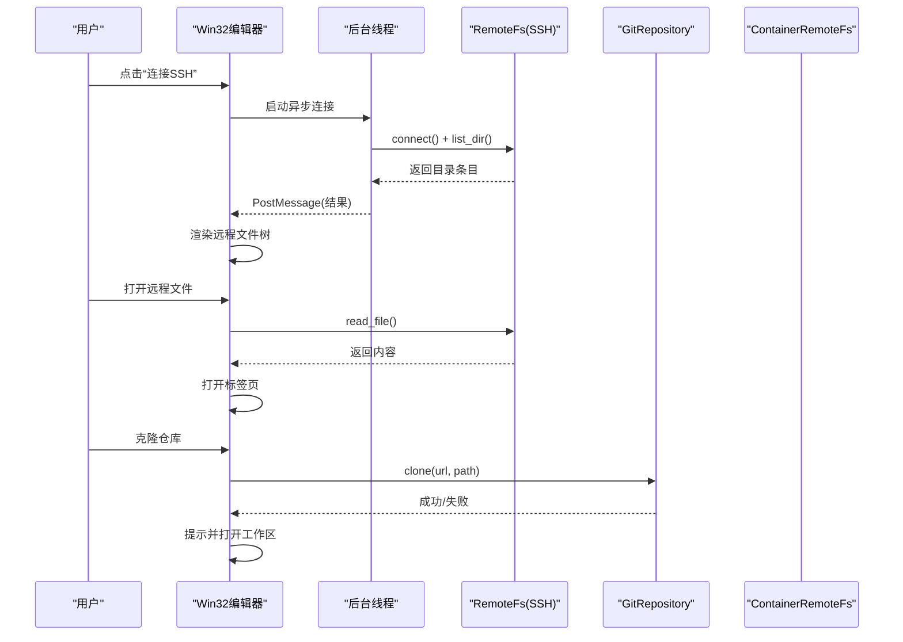
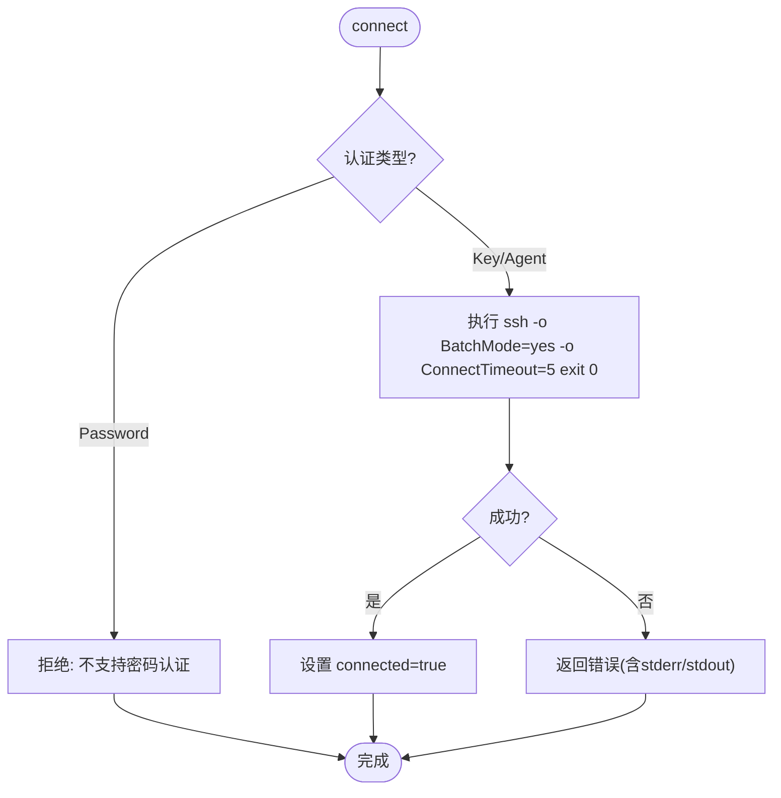
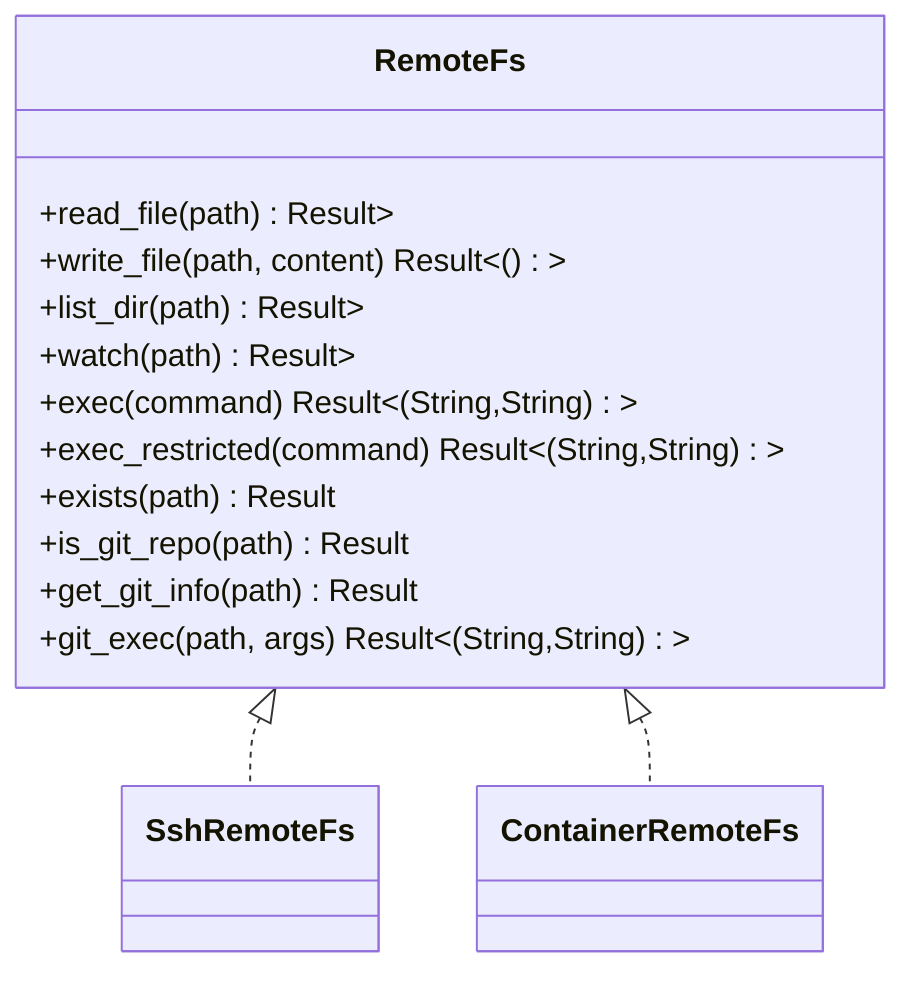
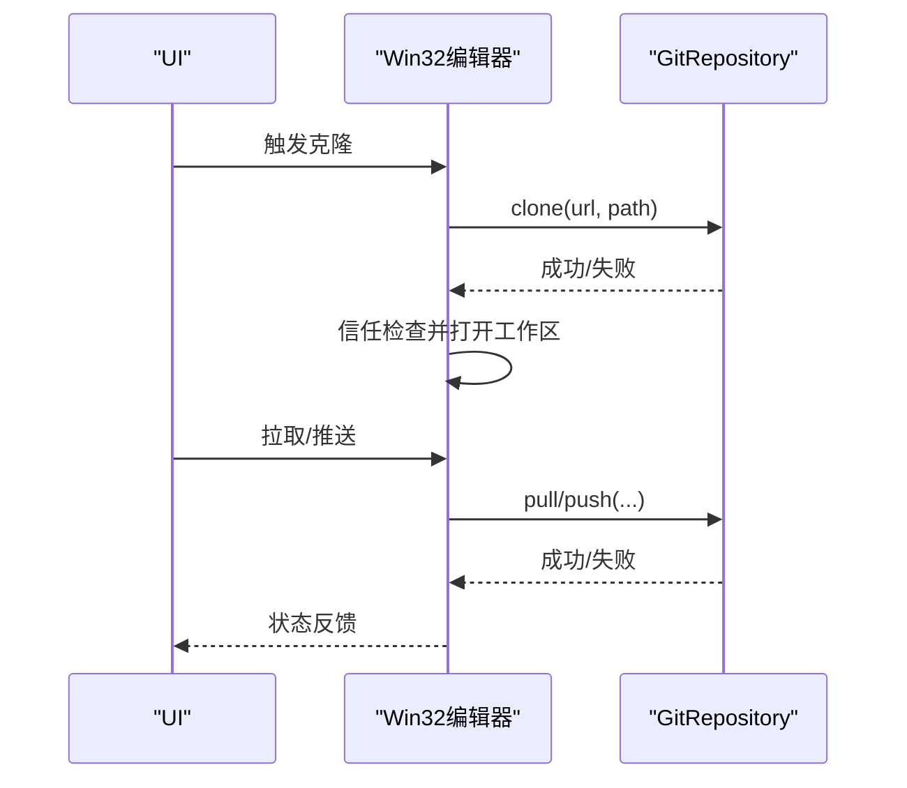
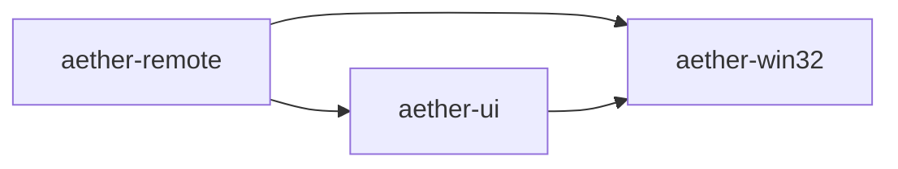

# 远程开发功能

<cite>
**本文引用的文件**
- [crates/aether-remote/src/lib.rs](file://crates/aether-remote/src/lib.rs)
- [crates/aether-remote/src/ssh.rs](file://crates/aether-remote/src/ssh.rs)
- [crates/aether-remote/src/remote_fs.rs](file://crates/aether-remote/src/remote_fs.rs)
- [crates/aether-remote/src/git.rs](file://crates/aether-remote/src/git.rs)
- [crates/aether-remote/src/container.rs](file://crates/aether-remote/src/container.rs)
- [crates/aether-remote/src/workspace.rs](file://crates/aether-remote/src/workspace.rs)
- [crates/aether-ui/src/ssh.rs](file://crates/aether-ui/src/ssh.rs)
- [crates/aether-win32/src/editor/remote.rs](file://crates/aether-win32/src/editor/remote.rs)
- [crates/aether-win32/src/render/remote.rs](file://crates/aether-win32/src/render/remote.rs)
</cite>

## 目录
1. [简介](#简介)
2. [项目结构](#项目结构)
3. [核心组件](#核心组件)
4. [架构总览](#架构总览)
5. [详细组件分析](#详细组件分析)
6. [依赖关系分析](#依赖关系分析)
7. [性能考虑](#性能考虑)
8. [故障排查指南](#故障排查指南)
9. [结论](#结论)
10. [附录：使用示例](#附录使用示例)

## 简介
本章节面向牧羊人编辑器的“远程开发”能力，系统性说明以下方面：
- SSH 连接管理：连接建立、认证处理、连接状态与生命周期。
- 远程文件系统抽象层：统一接口、文件读写、目录浏览、权限与安全控制。
- Git 集成：本地仓库的克隆、拉取、推送等操作的实现方式。
- Docker/Podman 容器集成：后端选择、命令执行白名单、资源隔离思路。
- 工作区缓存与同步：本地缓存策略、容量限制、TOCTOU 防护。
- UI 交互流程：SSH 连接对话框、服务器管理面板、远程文件树渲染与懒加载。

## 项目结构
远程开发相关代码主要分布在 aether-remote（核心能力）、aether-ui（UI 状态与交互）、aether-win32（Windows 平台编辑器集成与渲染）三个 crate 中：
- aether-remote：提供 RemoteFs 抽象、SSH 实现、Git 封装、容器后端占位、远程工作区缓存。
- aether-ui：定义 SSH 连接对话框、会话、文件树节点、服务器管理面板等 UI 状态。
- aether-win32：将 UI 状态与底层能力结合，负责异步任务调度、消息回传、渲染远程文件树与管理面板。

图表来源
- [crates/aether-remote/src/lib.rs:1-18](file://crates/aether-remote/src/lib.rs#L1-L18)
- [crates/aether-remote/src/ssh.rs:101-164](file://crates/aether-remote/src/ssh.rs#L101-L164)
- [crates/aether-remote/src/remote_fs.rs:26-186](file://crates/aether-remote/src/remote_fs.rs#L26-L186)
- [crates/aether-remote/src/git.rs:115-184](file://crates/aether-remote/src/git.rs#L115-L184)
- [crates/aether-remote/src/container.rs:21-38](file://crates/aether-remote/src/container.rs#L21-L38)
- [crates/aether-remote/src/workspace.rs:6-26](file://crates/aether-remote/src/workspace.rs#L6-L26)
- [crates/aether-ui/src/ssh.rs:119-182](file://crates/aether-ui/src/ssh.rs#L119-L182)
- [crates/aether-win32/src/editor/remote.rs:3-64](file://crates/aether-win32/src/editor/remote.rs#L3-L64)
- [crates/aether-win32/src/render/remote.rs:3-126](file://crates/aether-win32/src/render/remote.rs#L3-L126)

章节来源
- [crates/aether-remote/src/lib.rs:1-18](file://crates/aether-remote/src/lib.rs#L1-L18)
- [crates/aether-ui/src/ssh.rs:119-182](file://crates/aether-ui/src/ssh.rs#L119-L182)
- [crates/aether-win32/src/editor/remote.rs:3-64](file://crates/aether-win32/src/editor/remote.rs#L3-L64)
- [crates/aether-win32/src/render/remote.rs:3-126](file://crates/aether-win32/src/render/remote.rs#L3-L126)

## 核心组件
- RemoteFs 抽象：统一文件读取、写入、目录列举、事件监听、受限命令执行、Git 操作入口。
- SshRemoteFs：基于系统 ssh 二进制进行远程文件访问与命令执行，支持密钥与 Agent 认证。
- GitRepository：通过系统 git 二进制完成仓库克隆、分支切换、提交、日志、拉取、推送等。
- ContainerRemoteFs：容器后端占位，当前仅实现 exec 白名单校验与审计日志。
- RemoteWorkspace：远程工作区的本地缓存、路径校验、容量清理、版本跟踪。
- UI 层：SSH 连接对话框、会话、文件树、服务器管理面板；Win32 层负责异步任务与渲染。

章节来源
- [crates/aether-remote/src/remote_fs.rs:26-186](file://crates/aether-remote/src/remote_fs.rs#L26-L186)
- [crates/aether-remote/src/ssh.rs:101-164](file://crates/aether-remote/src/ssh.rs#L101-L164)
- [crates/aether-remote/src/git.rs:115-184](file://crates/aether-remote/src/git.rs#L115-L184)
- [crates/aether-remote/src/container.rs:21-38](file://crates/aether-remote/src/container.rs#L21-L38)
- [crates/aether-remote/src/workspace.rs:6-26](file://crates/aether-remote/src/workspace.rs#L6-L26)
- [crates/aether-ui/src/ssh.rs:119-182](file://crates/aether-ui/src/ssh.rs#L119-L182)

## 架构总览
远程开发的整体调用链如下：
- 用户在 UI 层配置并发起 SSH 连接或打开远程文件。
- Win32 编辑器层在后台线程执行连接与目录枚举，通过 PostMessage 回调更新 UI。
- 底层通过 aether-remote 提供的 RemoteFs 抽象与具体实现（SSH/Git/容器）完成实际 I/O。
- 工作区模块对远程内容进行本地缓存与同步，并提供安全的路径校验与容量管理。

图表来源
- [crates/aether-win32/src/editor/remote.rs:3-64](file://crates/aether-win32/src/editor/remote.rs#L3-L64)
- [crates/aether-remote/src/ssh.rs:130-164](file://crates/aether-remote/src/ssh.rs#L130-L164)
- [crates/aether-remote/src/git.rs:123-146](file://crates/aether-remote/src/git.rs#L123-L146)
- [crates/aether-remote/src/container.rs:58-123](file://crates/aether-remote/src/container.rs#L58-L123)

## 详细组件分析

### SSH 连接管理与认证
- 设计要点
  - 通过系统 ssh 二进制执行命令，编译期零依赖，运行期依赖 OpenSSH。
  - 密码认证不支持（无 tty），默认使用 Agent 或密钥认证。
  - 连接测试使用 BatchMode 与超时参数，避免阻塞与交互。
  - base_args 构建基础参数，包含 StrictHostKeyChecking=accept-new，防止已知主机冲突。
  - 用户名与主机名以“-”开头会被拒绝，防止选项注入。
- 关键流程
  - connect：验证认证方式、执行 exit 0 探测连通性、设置软状态 connected。
  - read/write/list/exec：每次操作独立调用 ssh，带管道输入与错误输出收集。
  - write_file：原子写入——先写临时文件再 mv，避免断连导致损坏。
- 安全加固
  - shell_quote 单引号包裹路径并转义内部单引号。
  - 禁止以“-”开头的用户名和主机名。
  - exec 记录审计日志。

图表来源
- [crates/aether-remote/src/ssh.rs:130-164](file://crates/aether-remote/src/ssh.rs#L130-L164)
- [crates/aether-remote/src/ssh.rs:166-202](file://crates/aether-remote/src/ssh.rs#L166-L202)
- [crates/aether-remote/src/ssh.rs:204-262](file://crates/aether-remote/src/ssh.rs#L204-L262)

章节来源
- [crates/aether-remote/src/ssh.rs:19-40](file://crates/aether-remote/src/ssh.rs#L19-L40)
- [crates/aether-remote/src/ssh.rs:42-99](file://crates/aether-remote/src/ssh.rs#L42-L99)
- [crates/aether-remote/src/ssh.rs:101-164](file://crates/aether-remote/src/ssh.rs#L101-L164)
- [crates/aether-remote/src/ssh.rs:265-402](file://crates/aether-remote/src/ssh.rs#L265-L402)

### 远程文件系统抽象层
- 抽象接口
  - read_file/write_file/list_dir/watch/exec/exec_restricted/exists/is_git_repo/get_git_info/git_exec。
  - exec_restricted 内置严格白名单与 shell 元字符过滤，防止命令注入。
  - git_exec 对路径与参数做严格校验，阻止路径遍历与标志注入。
- 实现差异
  - SSH：通过系统 ssh 执行 cat/find/stat 等命令，list_dir 解析 stat 输出。
  - 容器：exec 仅允许只读/写入白名单命令，并对容器名做字符集校验。
- 安全与健壮性
  - 路径校验：validate_git_path 拒绝绝对路径、相对前缀、路径穿越。
  - 元字符过滤：拒绝 ; | & ` $ > < \ ' " * ? [ ] { } ~ # ! 等危险字符。
  - 审计日志：exec 与 exec_restricted 均记录审计信息。

图表来源
- [crates/aether-remote/src/remote_fs.rs:26-186](file://crates/aether-remote/src/remote_fs.rs#L26-L186)
- [crates/aether-remote/src/ssh.rs:265-402](file://crates/aether-remote/src/ssh.rs#L265-L402)
- [crates/aether-remote/src/container.rs:40-123](file://crates/aether-remote/src/container.rs#L40-L123)

章节来源
- [crates/aether-remote/src/remote_fs.rs:26-186](file://crates/aether-remote/src/remote_fs.rs#L26-L186)
- [crates/aether-remote/src/remote_fs.rs:188-268](file://crates/aether-remote/src/remote_fs.rs#L188-L268)

### Git 集成的远程操作支持
- 设计要点
  - 通过系统 git 二进制执行命令，编译期零依赖，运行期依赖 Git for Windows。
  - 支持 SSH/HTTPS/本地仓库 URL 识别与配置。
  - 提供 clone/open/current_branch/status/add/commit/checkout_branch/list_branches/log/pull/push 等方法。
- 安全与健壮性
  - pull/push/checkout_branch 对 remote_name/branch_name 进行“-”前缀检查，防止标志注入。
  - log 使用自定义格式分隔符，空仓库返回空列表而非错误。
  - status 使用 porcelain v1 -z 格式解析，区分 staged/unstaged/untracked/conflicts。
- 典型流程
  - clone：执行 git clone，成功后 open 构造仓库对象。
  - pull：仅 fast-forward 模式，非 ff 时返回错误以便手动处理。
  - push：可选 force 标志，支持指定 remote/branch。

图表来源
- [crates/aether-remote/src/git.rs:123-146](file://crates/aether-remote/src/git.rs#L123-L146)
- [crates/aether-remote/src/git.rs:398-482](file://crates/aether-remote/src/git.rs#L398-L482)
- [crates/aether-win32/src/editor/remote.rs:92-151](file://crates/aether-win32/src/editor/remote.rs#L92-L151)

章节来源
- [crates/aether-remote/src/git.rs:15-25](file://crates/aether-remote/src/git.rs#L15-L25)
- [crates/aether-remote/src/git.rs:27-68](file://crates/aether-remote/src/git.rs#L27-L68)
- [crates/aether-remote/src/git.rs:115-184](file://crates/aether-remote/src/git.rs#L115-L184)
- [crates/aether-remote/src/git.rs:186-257](file://crates/aether-remote/src/git.rs#L186-L257)
- [crates/aether-remote/src/git.rs:259-396](file://crates/aether-remote/src/git.rs#L259-L396)
- [crates/aether-remote/src/git.rs:398-531](file://crates/aether-remote/src/git.rs#L398-L531)

### Docker 容器集成方案
- 现状
  - ContainerBackend 支持 Docker/Podman。
  - ContainerRemoteFs 目前为占位实现，read/write/list 未实现，watch 返回不支持。
  - exec 已实现白名单校验与审计日志，对容器名进行字符集校验，使用参数列表避免注入。
- 技术细节
  - 只读命令白名单：ls/cat/pwd/echo/find/grep/head/tail/wc/stat/file/which/diff/sort/uniq/tr/less/more/uname/whoami/id/ps/df/du。
  - 写入命令白名单：mkdir/touch/cp/mv/rm/chmod/chown。
  - 移除 git/tar/gzip/gunzip 从只读白名单，降低沙箱逃逸风险。
  - 使用 backend_cmd() 动态选择 docker 或 podman，并通过 exec sh -c 执行命令。
- 未来扩展
  - 实现 read/write/list 通过 docker exec 与 docker cp。
  - 解析 .devcontainer.json 配置生成 ContainerConfig。

章节来源
- [crates/aether-remote/src/container.rs:5-38](file://crates/aether-remote/src/container.rs#L5-L38)
- [crates/aether-remote/src/container.rs:40-123](file://crates/aether-remote/src/container.rs#L40-L123)
- [crates/aether-remote/src/container.rs:126-130](file://crates/aether-remote/src/container.rs#L126-L130)

### 工作区缓存与同步
- 功能
  - open_file：按需下载远程文件到本地缓存，校验路径防穿越，写入后二次 canonicalize 防 TOCTOU。
  - save_file：将本地修改上传至远程，递增版本计数。
  - sync_tree：同步远程目录结构到本地缓存，校验目录条目名。
  - 缓存大小限制：超过阈值自动清理最旧文件至目标比例。
- 安全与健壮性
  - validate_local_path：规范路径并在父目录不存在时尝试解析，防止符号链接绕过。
  - post-canonicalize：写入后再次校验路径仍在缓存目录内，越界则删除并报错。
  - 版本跟踪：HashMap 维护 remote_path -> version。

章节来源
- [crates/aether-remote/src/workspace.rs:6-26](file://crates/aether-remote/src/workspace.rs#L6-L26)
- [crates/aether-remote/src/workspace.rs:28-100](file://crates/aether-remote/src/workspace.rs#L28-L100)
- [crates/aether-remote/src/workspace.rs:102-147](file://crates/aether-remote/src/workspace.rs#L102-L147)
- [crates/aether-remote/src/workspace.rs:154-226](file://crates/aether-remote/src/workspace.rs#L154-L226)
- [crates/aether-remote/src/workspace.rs:234-251](file://crates/aether-remote/src/workspace.rs#L234-L251)

### UI 交互与渲染
- SSH 连接对话框与会话
  - 支持 Host/Port/Username/认证方式（默认 Agent，禁用 Password）。
  - to_config 将表单转换为 SshConfig，to_ssh_config 将持久化配置转换为可连接配置。
  - RemoteSession 封装 connect/disconnect/list/read/write/exec。
- 服务器管理面板
  - 添加/编辑/删除服务器配置，保存/取消按钮区域计算与悬停状态。
  - 显示连接状态指示灯（绿色/黄色/灰色），支持多服务器列表。
- 远程文件树
  - 懒加载子目录：首次展开异步加载，标记 loading 防止重复触发。
  - 渲染：递归绘制节点，支持悬停/选中高亮，省略长文件名。
  - 点击处理：目录展开/折叠，文件打开新标签页。

章节来源
- [crates/aether-ui/src/ssh.rs:6-117](file://crates/aether-ui/src/ssh.rs#L6-L117)
- [crates/aether-ui/src/ssh.rs:119-182](file://crates/aether-ui/src/ssh.rs#L119-L182)
- [crates/aether-ui/src/ssh.rs:184-386](file://crates/aether-ui/src/ssh.rs#L184-L386)
- [crates/aether-ui/src/ssh.rs:388-616](file://crates/aether-ui/src/ssh.rs#L388-L616)
- [crates/aether-win32/src/render/remote.rs:3-126](file://crates/aether-win32/src/render/remote.rs#L3-L126)
- [crates/aether-win32/src/render/remote.rs:128-246](file://crates/aether-win32/src/render/remote.rs#L128-L246)
- [crates/aether-win32/src/render/remote.rs:248-800](file://crates/aether-win32/src/render/remote.rs#L248-L800)

## 依赖关系分析
- aether-remote 暴露 RemoteFs、SshRemoteFs、GitRepository、ContainerRemoteFs、RemoteWorkspace 等核心类型。
- aether-ui 依赖 aether_remote::ssh 与 RemoteFs 抽象，定义 UI 状态与交互逻辑。
- aether-win32 依赖 aether_remote 与 aether_ui，负责异步任务调度、消息回传与渲染。

图表来源
- [crates/aether-remote/src/lib.rs:1-18](file://crates/aether-remote/src/lib.rs#L1-L18)
- [crates/aether-ui/src/ssh.rs:1-5](file://crates/aether-ui/src/ssh.rs#L1-L5)
- [crates/aether-win32/src/editor/remote.rs:1-5](file://crates/aether-win32/src/editor/remote.rs#L1-L5)

章节来源
- [crates/aether-remote/src/lib.rs:1-18](file://crates/aether-remote/src/lib.rs#L1-L18)
- [crates/aether-ui/src/ssh.rs:1-5](file://crates/aether-ui/src/ssh.rs#L1-L5)
- [crates/aether-win32/src/editor/remote.rs:1-5](file://crates/aether-win32/src/editor/remote.rs#L1-L5)

## 性能考虑
- SSH 每次操作独立调用 ssh 进程，适合轻量级远程访问；高频场景建议复用连接或引入持久通道。
- 目录列举使用 find + stat 一次性获取属性，减少多次往返。
- 写入采用原子替换（临时文件 + mv），避免中断导致数据损坏。
- 工作区缓存限制最大 500MB，超限时按最旧文件清理至目标的 80%。
- 异步任务与消息机制避免阻塞 UI，提升响应性。

[本节为通用指导，不直接分析具体文件]

## 故障排查指南
- 未安装 ssh/git
  - 现象：连接/克隆失败，提示未检测到工具。
  - 处理：安装 OpenSSH/Git，参考下载页引导。
- 密码认证失败
  - 现象：连接被拒绝，提示不支持密码认证。
  - 处理：改用密钥或 Agent 认证。
- 目录为空或不存在
  - 现象：列出目录失败或返回空列表。
  - 处理：检查路径是否存在，确认权限；空目录会返回空列表。
- 命令执行被拒绝
  - 现象：exec/exec_restricted 返回不在白名单。
  - 处理：调整命令为白名单内命令，避免 shell 元字符。
- 容器命令执行异常
  - 现象：容器名非法或命令不在白名单。
  - 处理：校验容器名字符集，使用允许的只读/写入命令。

章节来源
- [crates/aether-remote/src/ssh.rs:19-40](file://crates/aether-remote/src/ssh.rs#L19-L40)
- [crates/aether-remote/src/ssh.rs:130-164](file://crates/aether-remote/src/ssh.rs#L130-L164)
- [crates/aether-remote/src/remote_fs.rs:51-94](file://crates/aether-remote/src/remote_fs.rs#L51-L94)
- [crates/aether-remote/src/container.rs:58-123](file://crates/aether-remote/src/container.rs#L58-L123)
- [crates/aether-win32/src/editor/remote.rs:3-64](file://crates/aether-win32/src/editor/remote.rs#L3-L64)

## 结论
牧羊人编辑器的远程开发功能通过统一的 RemoteFs 抽象屏蔽了 SSH、容器等后端差异，结合严格的命令白名单与路径校验保障安全性。SSH 实现基于系统 ssh 二进制，具备零编译期依赖与良好兼容性；Git 集成通过系统 git 提供完整的仓库管理能力；容器后端当前提供 exec 白名单与审计日志，后续可扩展完整文件操作。工作区缓存与异步 UI 机制提升了用户体验与性能。

[本节为总结，不直接分析具体文件]

## 附录：使用示例
以下为常见使用场景的步骤说明（不涉及具体代码片段）：
- 配置远程连接
  - 在 SSH 管理面板中添加服务器：填写名称、主机、端口、用户名，选择认证方式（密钥或 Agent），保存配置。
  - 若系统未安装 ssh，根据提示安装 OpenSSH。
- 连接远程服务器
  - 在管理面板中选择服务器并点击连接；后台线程执行连接测试与目录枚举，完成后渲染远程文件树。
- 进行远程文件编辑
  - 在远程文件树中点击文件，编辑器读取远程内容并打开新标签页；保存时将本地修改上传至远程。
- 执行远程命令
  - 通过 exec_restricted 执行白名单内的只读/写入命令；避免使用 shell 元字符与不受支持的命令。
- 克隆远程仓库
  - 在克隆对话框中输入仓库 URL（支持 ssh:// 或 https://），选择目标路径；后台线程执行克隆，成功后提示并打开工作区。
- 拉取/推送更改
  - 在工作区内使用 Git 功能进行拉取（fast-forward only）或推送；如遇到非快进合并，需手动处理。
- 容器内操作（占位）
  - 当前容器后端仅支持受限命令执行；后续将支持文件读写与目录浏览。

[本节为使用指导，不直接分析具体文件]