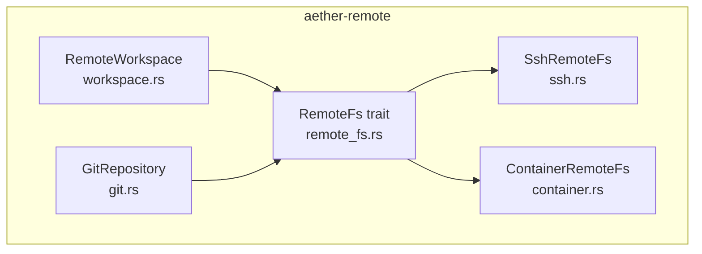
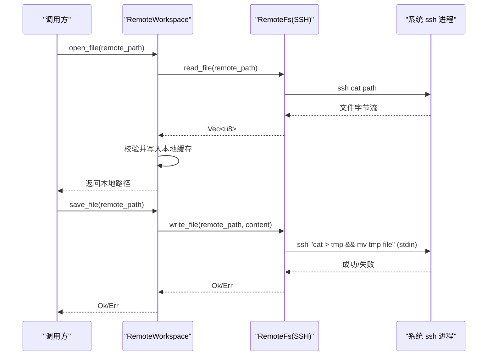
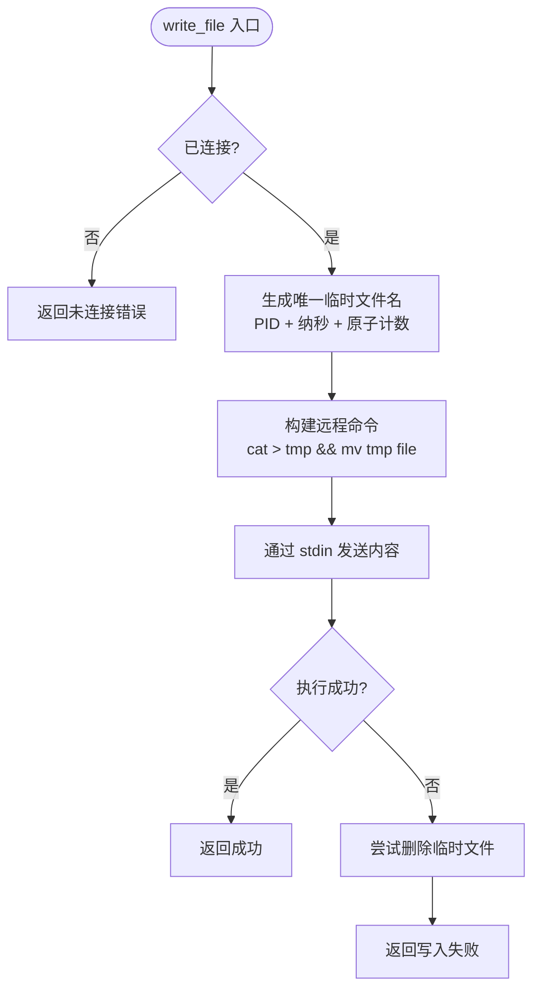
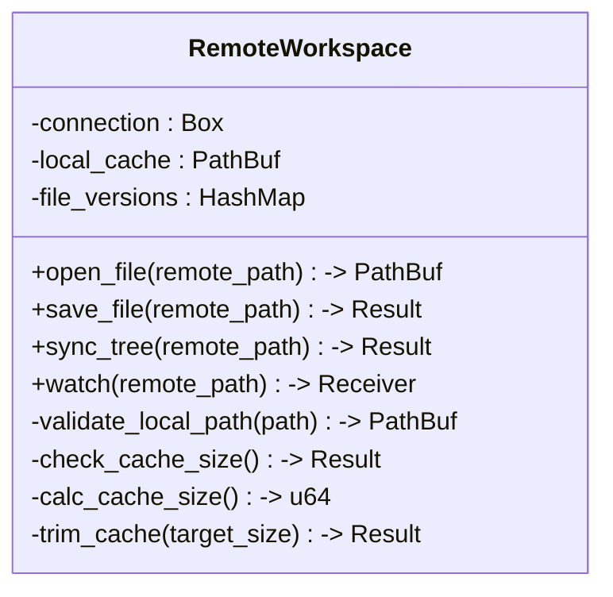
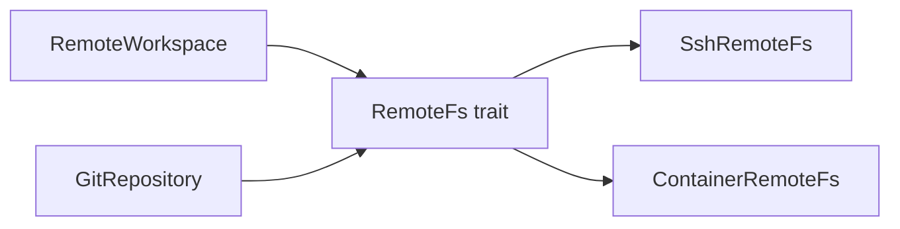

# 远程文件系统

<cite>
**本文引用的文件**
- [remote_fs.rs](file://crates/aether-remote/src/remote_fs.rs)
- [ssh.rs](file://crates/aether-remote/src/ssh.rs)
- [container.rs](file://crates/aether-remote/src/container.rs)
- [workspace.rs](file://crates/aether-remote/src/workspace.rs)
- [git.rs](file://crates/aether-remote/src/git.rs)
- [lib.rs](file://crates/aether-remote/src/lib.rs)
- [Cargo.toml](file://crates/aether-remote/Cargo.toml)
</cite>

## 目录
1. [简介](#简介)
2. [项目结构](#项目结构)
3. [核心组件](#核心组件)
4. [架构总览](#架构总览)
5. [详细组件分析](#详细组件分析)
6. [依赖关系分析](#依赖关系分析)
7. [性能考量](#性能考量)
8. [故障排查指南](#故障排查指南)
9. [结论](#结论)
10. [附录：使用示例与最佳实践](#附录使用示例与最佳实践)

## 简介
本文件为牧羊人编辑器的“远程文件系统抽象层”提供系统化文档，聚焦 RemoteFs trait 接口设计、SSH 后端实现细节（原子写入、二进制安全传输、错误处理）、文件监视限制及替代方案、跨平台路径处理策略，以及性能优化与最佳实践。该抽象层统一了 SSH、容器等远程环境的文件访问方式，使上层编辑器无需关心底层差异即可进行远程文件读写、目录浏览、Git 操作与工作区同步。

## 项目结构
aether-remote 模块以 trait + 多后端的方式组织：
- remote_fs.rs：定义 RemoteFs trait、通用数据结构（RemoteDirEntry、FsEvent）与 Git 相关辅助方法。
- ssh.rs：基于系统 ssh 二进制的远程文件系统实现，支持读、写、目录浏览、命令执行。
- container.rs：容器后端的占位实现（Docker/Podman），部分能力待完善。
- workspace.rs：远程工作区封装，负责本地缓存、路径校验、大小清理与变更监听转发。
- git.rs：通过系统 git 二进制实现的仓库管理（克隆、状态、提交、分支、日志等）。
- lib.rs：对外暴露的公共类型与函数。
- Cargo.toml：声明依赖（serde、shell-escape 等）。

图表来源
- [remote_fs.rs:26-186](file://crates/aether-remote/src/remote_fs.rs#L26-L186)
- [ssh.rs:101-403](file://crates/aether-remote/src/ssh.rs#L101-L403)
- [container.rs:21-124](file://crates/aether-remote/src/container.rs#L21-L124)
- [workspace.rs:6-232](file://crates/aether-remote/src/workspace.rs#L6-L232)
- [git.rs:115-505](file://crates/aether-remote/src/git.rs#L115-L505)

章节来源
- [lib.rs:1-18](file://crates/aether-remote/src/lib.rs#L1-L18)
- [Cargo.toml:1-13](file://crates/aether-remote/Cargo.toml#L1-L13)

## 核心组件
- RemoteFs trait：定义统一的远程文件访问接口，包括 read_file、write_file、list_dir、watch、exec/exec_restricted、exists、is_git_repo、get_git_info、git_exec 等。默认实现提供安全的 exec_restricted（白名单+元字符过滤）和 exists/is_git_repo 的通用逻辑。
- SshRemoteFs：通过系统 ssh 二进制执行远程命令，实现二进制安全的读取（cat）、原子写入（临时文件 + mv）、目录浏览（find + stat）、命令执行（exec）。
- ContainerRemoteFs：容器后端占位实现，提供 exec 白名单与审计，其他方法待实现。
- RemoteWorkspace：对 RemoteFs 的包装，提供本地缓存、路径校验、缓存大小控制、变更监听转发。
- GitRepository：通过系统 git 二进制完成仓库级操作（clone/open/status/log/pull/push 等）。

章节来源
- [remote_fs.rs:26-186](file://crates/aether-remote/src/remote_fs.rs#L26-L186)
- [ssh.rs:101-403](file://crates/aether-remote/src/ssh.rs#L101-L403)
- [container.rs:21-124](file://crates/aether-remote/src/container.rs#L21-L124)
- [workspace.rs:6-232](file://crates/aether-remote/src/workspace.rs#L6-L232)
- [git.rs:115-505](file://crates/aether-remote/src/git.rs#L115-L505)

## 架构总览
RemoteFs 作为统一抽象，屏蔽 SSH/容器等后端差异；上层通过 RemoteWorkspace 获得带缓存与校验的工作区能力；Git 操作通过独立的 GitRepository 或 RemoteFs 的 git_exec 组合完成。

图表来源
- [workspace.rs:58-123](file://crates/aether-remote/src/workspace.rs#L58-L123)
- [ssh.rs:265-321](file://crates/aether-remote/src/ssh.rs#L265-L321)

## 详细组件分析

### RemoteFs trait 与通用逻辑
- 接口职责
  - 文件操作：read_file、write_file、list_dir、exists
  - 事件监听：watch（由具体后端决定是否支持）
  - 命令执行：exec（默认拒绝）、exec_restricted（白名单+元字符过滤）
  - Git 集成：is_git_repo、get_git_info、git_exec（参数与路径严格校验）
- 安全要点
  - exec_restricted：拒绝 shell 元字符，仅允许最小化命令白名单，记录审计日志。
  - git_exec：禁止以“-”开头的参数，禁止包含“..”、绝对路径、相对前缀等，防止路径遍历与标志注入。
  - validate_git_path：提前校验路径安全性，提供更清晰的错误信息。
- 复杂度与性能
  - exists：优先 list_dir，若失败再尝试父目录枚举，避免读取整个文件。
  - is_git_repo：通过 list_dir 检查 .git 是否存在，避免 shell 注入。

章节来源
- [remote_fs.rs:26-186](file://crates/aether-remote/src/remote_fs.rs#L26-L186)
- [remote_fs.rs:196-216](file://crates/aether-remote/src/remote_fs.rs#L196-L216)

### SSH 后端（SshRemoteFs）
- 连接与认证
  - connect：使用 BatchMode=yes 与 ConnectTimeout=5 测试连通性；不支持密码认证（无 TTY），需密钥或 agent。
  - base_args：构造基础参数，严格校验用户名与主机名不以“-”开头，防止被解释为配置选项。
- 文件读取
  - read_file：通过 ssh cat 获取原始字节，二进制安全。
- 文件写入（原子机制）
  - write_file：先写入同目录临时文件（PID+纳秒时间戳+原子计数器），成功后 mv 原子替换目标文件；失败时尽力清理临时文件。
  - 临时文件名唯一性：进程内 AtomicU64 计数器确保同纳秒多次写入不冲突。
- 目录浏览
  - list_dir：使用 find + stat 一次性获取条目名称、大小、修改时间与类型；空目录返回空列表。
- 命令执行
  - exec：直接执行远程命令并记录审计日志；exec_restricted 继承 trait 的安全白名单。
- 文件监视
  - watch：当前 SSH 后端不支持，返回错误。

图表来源
- [ssh.rs:285-321](file://crates/aether-remote/src/ssh.rs#L285-L321)

章节来源
- [ssh.rs:30-40](file://crates/aether-remote/src/ssh.rs#L30-L40)
- [ssh.rs:101-263](file://crates/aether-remote/src/ssh.rs#L101-L263)
- [ssh.rs:265-403](file://crates/aether-remote/src/ssh.rs#L265-L403)

### 容器后端（ContainerRemoteFs）
- 现状：read_file/write_file/list_dir 尚未实现；exec 已实现白名单与审计。
- 安全：exec 拒绝 shell 元字符，区分只读与写入命令白名单，并对写入操作额外审计；容器名严格校验，防止注入 Docker 标志。
- 文件监视：明确返回不支持。

章节来源
- [container.rs:21-124](file://crates/aether-remote/src/container.rs#L21-L124)

### 远程工作区（RemoteWorkspace）
- 功能
  - open_file：按需从远程拉取到本地缓存，校验路径规范与 TOCTOU 防护。
  - save_file：将本地缓存内容写回远程。
  - sync_tree：同步远程目录结构到本地缓存。
  - watch：转发至底层 RemoteFs。
- 安全
  - validate_local_path：规范化路径并校验在缓存目录内，防止路径遍历。
  - 写入后再次 canonicalize 验证，防范符号链接替换导致的越界写入。
- 缓存管理
  - 最大缓存大小限制与自动清理（按最旧文件删除至目标大小以下）。

图表来源
- [workspace.rs:6-232](file://crates/aether-remote/src/workspace.rs#L6-L232)

章节来源
- [workspace.rs:6-232](file://crates/aether-remote/src/workspace.rs#L6-L232)

### Git 集成
- RemoteFs.git_exec：通过 exec_restricted 执行受限 git 命令，参数与路径严格校验。
- GitRepository：通过系统 git 二进制完成 clone/open/status/log/pull/push 等操作，并提供下载引导 URL。

章节来源
- [remote_fs.rs:127-186](file://crates/aether-remote/src/remote_fs.rs#L127-L186)
- [git.rs:115-505](file://crates/aether-remote/src/git.rs#L115-L505)

## 依赖关系分析
- 编译期依赖
  - serde/serde_json：用于序列化/反序列化（如 Git 状态等）。
  - shell-escape：用于安全转义（尽管 SSH 实现中主要使用单引号包裹与手动转义）。
- 运行期依赖
  - 系统 ssh 与 git 二进制：SSH 与 Git 操作均通过 shell out 调用系统工具，零库依赖但要求环境可用。
- 模块耦合
  - RemoteFs 为松耦合抽象，SSH/容器后端可独立演进。
  - RemoteWorkspace 依赖 RemoteFs，提供缓存与校验，降低上层复杂度。
  - GitRepository 与 RemoteFs 解耦，分别负责本地仓库与远程文件。

图表来源
- [remote_fs.rs:26-186](file://crates/aether-remote/src/remote_fs.rs#L26-L186)
- [ssh.rs:101-403](file://crates/aether-remote/src/ssh.rs#L101-L403)
- [container.rs:21-124](file://crates/aether-remote/src/container.rs#L21-L124)
- [workspace.rs:6-232](file://crates/aether-remote/src/workspace.rs#L6-L232)
- [git.rs:115-505](file://crates/aether-remote/src/git.rs#L115-L505)

章节来源
- [Cargo.toml:6-10](file://crates/aether-remote/Cargo.toml#L6-L10)

## 性能考量
- 批量目录扫描
  - list_dir 使用 find + stat 一次性获取属性，减少多次往返。
- 原子写入
  - 临时文件 + mv 保证一致性，避免断连导致的部分写入损坏。
- 缓存与去重
  - RemoteWorkspace 维护本地缓存，避免重复下载；超过阈值自动清理旧文件。
- 连接探测
  - connect 使用短超时与批处理模式，快速失败，减少阻塞。
- 命令执行
  - exec_restricted 白名单与元字符过滤减少不必要执行与安全风险。

[本节为通用指导，不直接分析具体文件]

## 故障排查指南
- SSH 未安装或未在 PATH
  - 现象：connect 失败或 ssh_available 返回 false。
  - 处理：引导用户安装 OpenSSH，参考 SSH_DOWNLOAD_URL。
- 认证失败
  - 现象：connect 报错，stderr 包含认证错误。
  - 处理：确认密钥路径、权限与 ssh-agent；避免密码认证（shell out 模式不支持）。
- 写入失败
  - 现象：write_file 返回错误，可能伴随临时文件残留。
  - 处理：检查远程磁盘空间与权限；代码会尽力清理临时文件。
- 目录不存在或为空
  - 现象：list_dir 返回错误或空列表。
  - 处理：确认路径存在且具备读权限；空目录正常返回空列表。
- 命令执行被拒绝
  - 现象：exec_restricted 返回“不在白名单”或“包含禁止字符”。
  - 处理：调整命令为白名单内命令，或移除危险字符。

章节来源
- [ssh.rs:30-40](file://crates/aether-remote/src/ssh.rs#L30-L40)
- [ssh.rs:130-154](file://crates/aether-remote/src/ssh.rs#L130-L154)
- [ssh.rs:285-321](file://crates/aether-remote/src/ssh.rs#L285-L321)
- [ssh.rs:327-379](file://crates/aether-remote/src/ssh.rs#L327-L379)
- [remote_fs.rs:51-94](file://crates/aether-remote/src/remote_fs.rs#L51-L94)

## 结论
RemoteFs 抽象层以简洁而安全的接口统一了远程文件访问，SSH 后端通过原子写入与二进制安全传输保障数据一致性，配合 RemoteWorkspace 的缓存与校验机制，为编辑器提供了稳定可靠的远程工作体验。虽然 SSH 场景下不支持文件监视，但可通过轮询或结合 Git 状态变化实现替代方案。整体设计强调安全（白名单、元字符过滤、路径校验）与性能（批量统计、原子操作、缓存清理），适合在生产环境中使用。

[本节为总结性内容，不直接分析具体文件]

## 附录：使用示例与最佳实践

- 远程文件读取与保存
  - 打开远程文件：调用 RemoteWorkspace::open_file，内部通过 RemoteFs::read_file 拉取到本地缓存，并进行路径校验与 TOCTOU 防护。
  - 保存修改：调用 RemoteWorkspace::save_file，内部通过 RemoteFs::write_file 原子写入远程。
  - 参考路径
    - [workspace.rs:58-123](file://crates/aether-remote/src/workspace.rs#L58-L123)
    - [ssh.rs:265-321](file://crates/aether-remote/src/ssh.rs#L265-L321)

- 目录浏览与同步
  - 列出目录：RemoteFs::list_dir 返回 RemoteDirEntry 列表，包含名称、是否目录、大小与修改时间。
  - 同步结构：RemoteWorkspace::sync_tree 将远程目录结构复制到本地缓存。
  - 参考路径
    - [ssh.rs:327-374](file://crates/aether-remote/src/ssh.rs#L327-L374)
    - [workspace.rs:125-147](file://crates/aether-remote/src/workspace.rs#L125-L147)

- 文件监视与替代方案
  - 限制：SSH 后端 watch 返回不支持。
  - 替代方案：
    - 轮询：定时调用 list_dir 比较 mtime 或 size 变化。
    - Git 状态：结合 RemoteFs::get_git_info 或 GitRepository::status 检测变更。
  - 参考路径
    - [ssh.rs:376-379](file://crates/aether-remote/src/ssh.rs#L376-L379)
    - [remote_fs.rs:127-160](file://crates/aether-remote/src/remote_fs.rs#L127-L160)
    - [git.rs:199-257](file://crates/aether-remote/src/git.rs#L199-L257)

- 跨平台路径处理
  - 远程路径：避免“..”与反斜杠，统一使用正斜杠。
  - 本地路径：使用 canonicalize 规范化，校验在缓存目录内，防范符号链接绕过。
  - 参考路径
    - [workspace.rs:28-56](file://crates/aether-remote/src/workspace.rs#L28-L56)
    - [workspace.rs:74-99](file://crates/aether-remote/src/workspace.rs#L74-L99)

- 安全与最佳实践
  - 始终通过 exec_restricted 执行命令，避免任意命令注入。
  - 使用 git_exec 进行 Git 操作，确保参数与路径合法。
  - 连接前先调用 connect 或 ssh_available 检查环境可用性。
  - 写入大文件时利用原子机制，避免部分写入。
  - 定期清理缓存，避免磁盘占用过高。
  - 参考路径
    - [remote_fs.rs:51-94](file://crates/aether-remote/src/remote_fs.rs#L51-L94)
    - [remote_fs.rs:162-186](file://crates/aether-remote/src/remote_fs.rs#L162-L186)
    - [ssh.rs:130-154](file://crates/aether-remote/src/ssh.rs#L130-L154)
    - [workspace.rs:154-206](file://crates/aether-remote/src/workspace.rs#L154-L206)