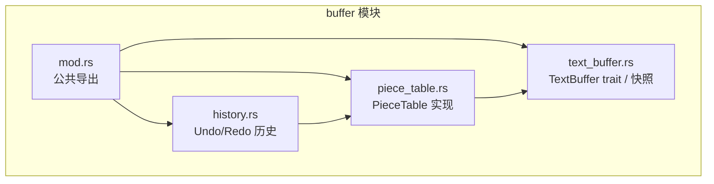
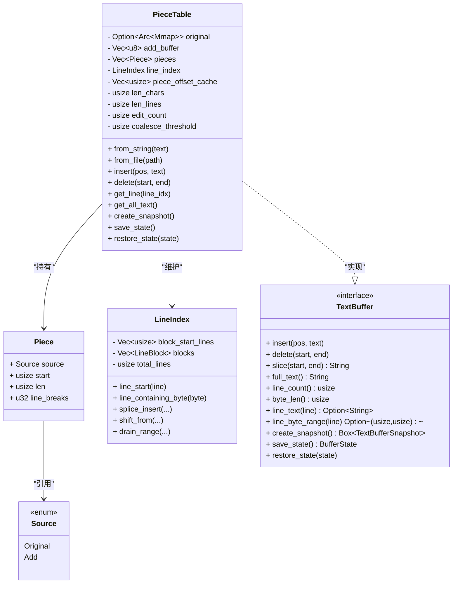
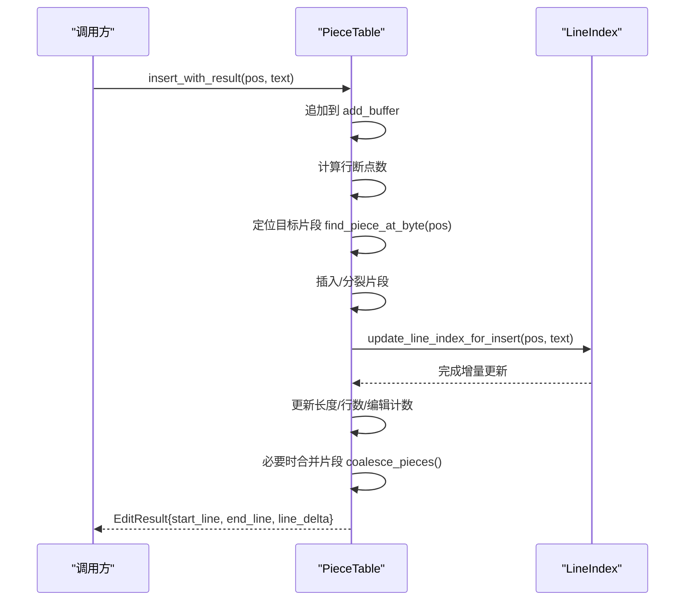
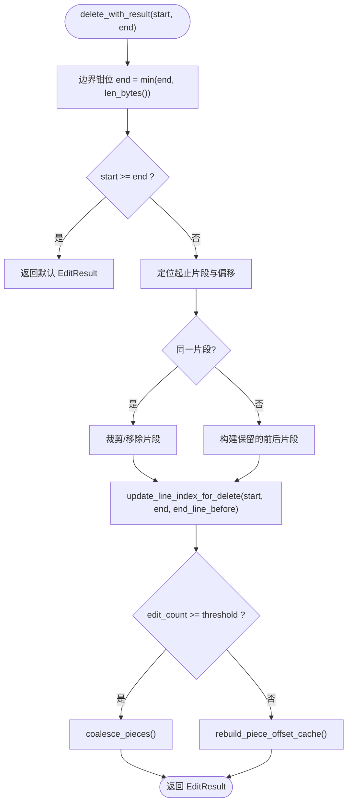
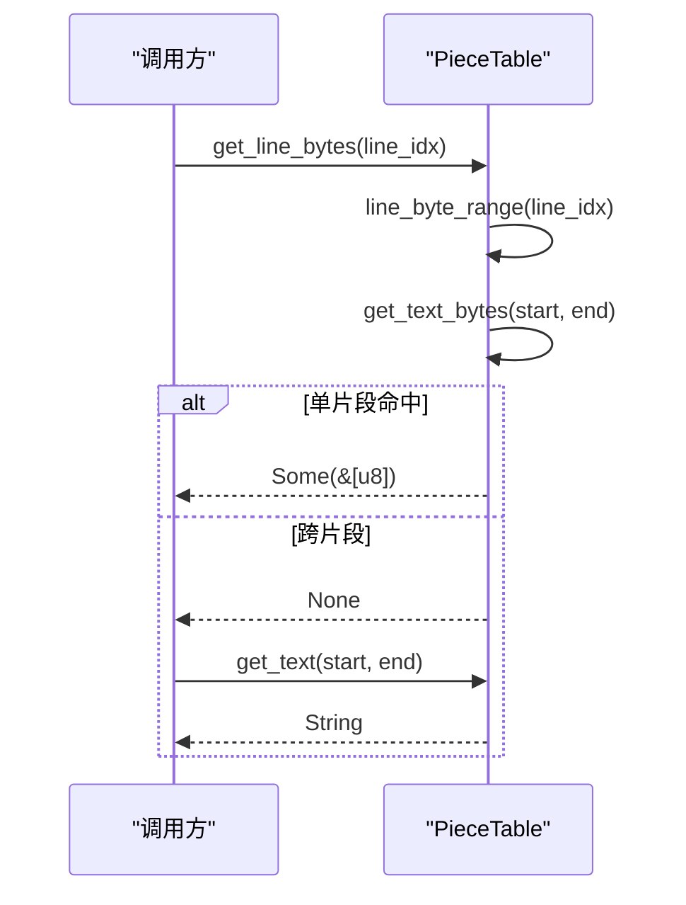
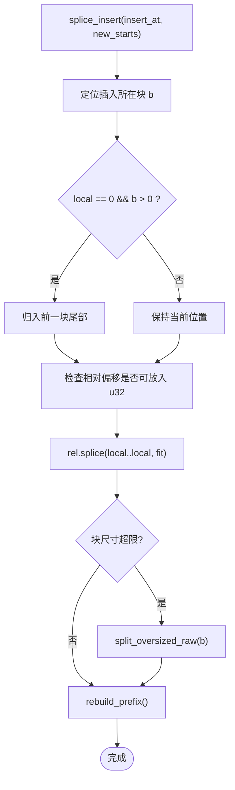
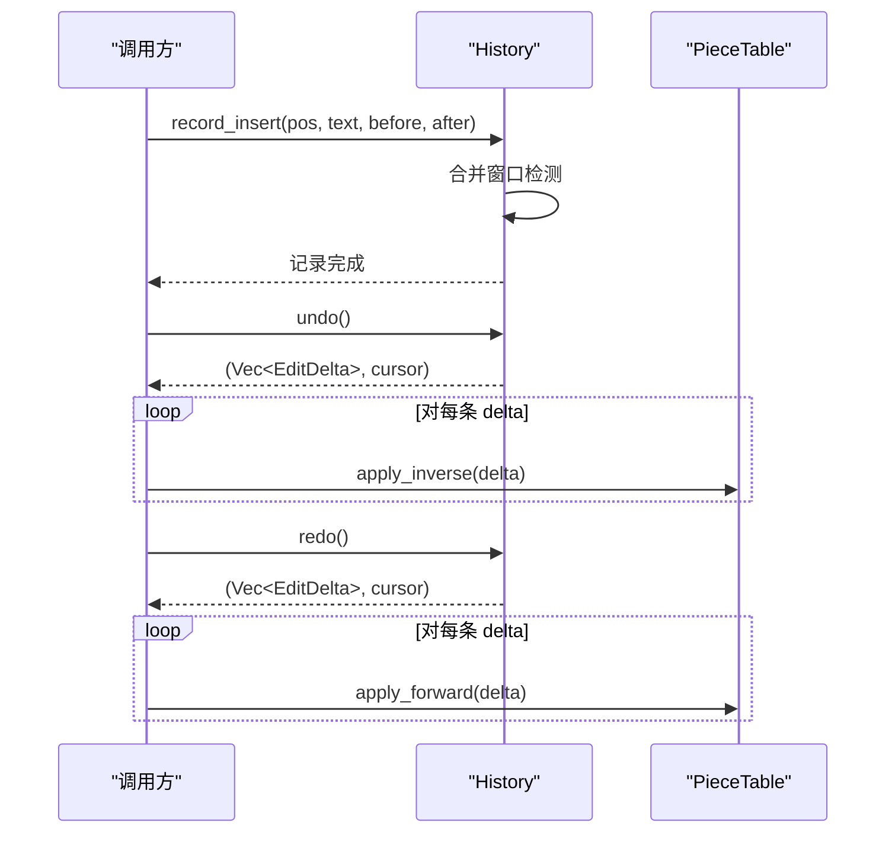
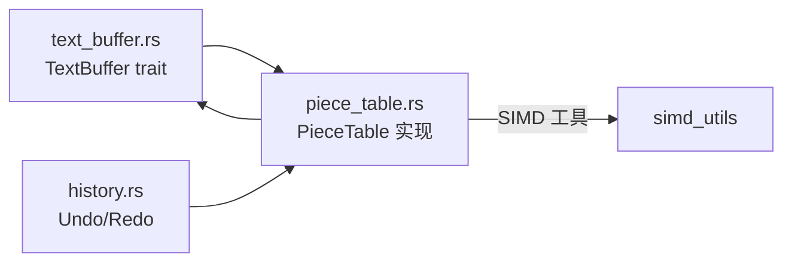

# Piece Table 算法实现

<cite>
**本文引用的文件**
- [crates/aether-core/src/buffer/piece_table.rs](file://crates/aether-core/src/buffer/piece_table.rs)
- [crates/aether-core/src/buffer/text_buffer.rs](file://crates/aether-core/src/buffer/text_buffer.rs)
- [crates/aether-core/src/buffer/history.rs](file://crates/aether-core/src/buffer/history.rs)
- [crates/aether-core/src/buffer/mod.rs](file://crates/aether-core/src/buffer/mod.rs)
</cite>

## 目录
1. [简介](#简介)
2. [项目结构](#项目结构)
3. [核心组件](#核心组件)
4. [架构总览](#架构总览)
5. [详细组件分析](#详细组件分析)
6. [依赖关系分析](#依赖关系分析)
7. [性能考量](#性能考量)
8. [故障排查指南](#故障排查指南)
9. [结论](#结论)
10. [附录：API 参考与示例](#附录api-参考与示例)

## 简介
本技术文档围绕 Piece Table 文本缓冲算法的实现展开，重点解释其核心数据结构设计（原始内容与插入内容的两段式管理）、关键操作的时间复杂度、内存管理与优化策略，并给出常用 API 的使用说明与示例路径。该实现通过“只追加”的增量缓冲区与不可变的原始内容映射，结合行索引与偏移前缀缓存，实现了高性能的文本编辑体验。

## 项目结构
本项目中 Piece Table 相关代码位于 aether-core 的 buffer 模块下，包含以下关键文件：
- piece_table.rs：PieceTable 主实现，包含数据结构、插入/删除/查找、行索引维护、快照与状态恢复等。
- text_buffer.rs：定义统一的 TextBuffer trait 与快照接口，使上层对具体实现解耦。
- history.rs：基于差分的 Undo/Redo 历史管理，记录 EditDelta 并支持撤销/重做。
- mod.rs：模块导出公共类型。

图表来源
- [crates/aether-core/src/buffer/piece_table.rs:1-35](file://crates/aether-core/src/buffer/piece_table.rs#L1-L35)
- [crates/aether-core/src/buffer/text_buffer.rs:1-49](file://crates/aether-core/src/buffer/text_buffer.rs#L1-L49)
- [crates/aether-core/src/buffer/history.rs:1-28](file://crates/aether-core/src/buffer/history.rs#L1-L28)
- [crates/aether-core/src/buffer/mod.rs:1-9](file://crates/aether-core/src/buffer/mod.rs#L1-L9)

章节来源
- [crates/aether-core/src/buffer/mod.rs:1-9](file://crates/aether-core/src/buffer/mod.rs#L1-L9)

## 核心组件
- PieceTable：核心数据结构，维护 original（可选的内存映射原始内容）、add_buffer（只追加的新增内容）、pieces（有序片段表）、line_index（行索引）、piece_offset_cache（偏移前缀缓存）以及长度与行数缓存等。
- Piece：表示一个连续字节片段，指向 Source::Original 或 Source::Add，并缓存该片段中的换行符数量。
- LineIndex：两级分块的行起始位置索引，支持高效插入、删除、平移与查询。
- TextBuffer trait：抽象文本缓冲区接口，统一 insert/delete/slice/full_text/line_* 等方法。
- History：基于 EditDelta 的轻量级撤销/重做机制，支持合并窗口与撤销组。

章节来源
- [crates/aether-core/src/buffer/piece_table.rs:11-35](file://crates/aether-core/src/buffer/piece_table.rs#L11-L35)
- [crates/aether-core/src/buffer/piece_table.rs:53-66](file://crates/aether-core/src/buffer/piece_table.rs#L53-L66)
- [crates/aether-core/src/buffer/piece_table.rs:107-114](file://crates/aether-core/src/buffer/piece_table.rs#L107-L114)
- [crates/aether-core/src/buffer/text_buffer.rs:1-49](file://crates/aether-core/src/buffer/text_buffer.rs#L1-L49)
- [crates/aether-core/src/buffer/history.rs:14-28](file://crates/aether-core/src/buffer/history.rs#L14-L28)

## 架构总览
Piece Table 采用“双缓冲区 + 片段表”的设计：
- 原始内容以内存映射方式只读引用，避免大文件拷贝。
- 新增内容仅追加到 add_buffer，永不删除，从而保证插入操作的 O(1) 摊销成本。
- pieces 列表按逻辑顺序描述当前文本由哪些片段组成；每次编辑可能分裂/合并片段。
- line_index 维护每行的起始字节位置，支持增量更新与块内平移，避免全量重建。
- piece_offset_cache 提供片段的起始字节偏移前缀和，加速二分定位。

图表来源
- [crates/aether-core/src/buffer/piece_table.rs:11-35](file://crates/aether-core/src/buffer/piece_table.rs#L11-L35)
- [crates/aether-core/src/buffer/piece_table.rs:53-66](file://crates/aether-core/src/buffer/piece_table.rs#L53-L66)
- [crates/aether-core/src/buffer/piece_table.rs:107-114](file://crates/aether-core/src/buffer/piece_table.rs#L107-L114)
- [crates/aether-core/src/buffer/text_buffer.rs:1-49](file://crates/aether-core/src/buffer/text_buffer.rs#L1-L49)

## 详细组件分析

### 数据结构与内存布局
- 原始内容 original：使用 Arc<Mmap> 共享内存映射，零拷贝打开大文件，降低启动与读取开销。
- 新增内容 add_buffer：Vec<u8>，只追加不删除，避免移动数据带来的 O(n) 成本。
- 片段表 pieces：按逻辑顺序存储每个连续片段，支持插入时分裂、删除时裁剪或移除。
- 行索引 line_index：两级分块结构，块内相对偏移使用 u32，块间绝对基址使用 usize，支持批量平移与分裂，避免整表重建。
- 偏移前缀缓存 piece_offset_cache：用于 O(log n) 定位片段与 O(1) 获取总字节数。

章节来源
- [crates/aether-core/src/buffer/piece_table.rs:11-35](file://crates/aether-core/src/buffer/piece_table.rs#L11-L35)
- [crates/aether-core/src/buffer/piece_table.rs:107-114](file://crates/aether-core/src/buffer/piece_table.rs#L107-L114)
- [crates/aether-core/src/buffer/piece_table.rs:700-708](file://crates/aether-core/src/buffer/piece_table.rs#L700-L708)
- [crates/aether-core/src/buffer/piece_table.rs:881-932](file://crates/aether-core/src/buffer/piece_table.rs#L881-L932)

### 插入流程与时间复杂度
- 插入文本时，先将内容追加到 add_buffer，再根据插入位置在 pieces 中插入新片段或分裂现有片段。
- 行索引增量更新：计算插入产生的新行起始位置，并对后续行进行平移与插入。
- 当编辑次数达到阈值时，合并相邻同源的片段以减少碎片。

图表来源
- [crates/aether-core/src/buffer/piece_table.rs:450-562](file://crates/aether-core/src/buffer/piece_table.rs#L450-L562)
- [crates/aether-core/src/buffer/piece_table.rs:991-1023](file://crates/aether-core/src/buffer/piece_table.rs#L991-L1023)
- [crates/aether-core/src/buffer/piece_table.rs:1843-1876](file://crates/aether-core/src/buffer/piece_table.rs#L1843-L1876)

时间复杂度分析
- 插入：O(1) 追加到 add_buffer；片段插入/分裂为 O(k)（k 为片段表移动代价），通常很小；行索引增量更新为 O(K + B)，K 为新行数量，B 为涉及块大小；总体近似 O(1) 摊销。
- 查找：find_piece_at_byte 使用偏移前缀缓存二分查找 O(log n)。
- 行查询：line_start/line_end 通过两级分块索引 O(log n)。

章节来源
- [crates/aether-core/src/buffer/piece_table.rs:450-562](file://crates/aether-core/src/buffer/piece_table.rs#L450-L562)
- [crates/aether-core/src/buffer/piece_table.rs:881-932](file://crates/aether-core/src/buffer/piece_table.rs#L881-L932)
- [crates/aether-core/src/buffer/piece_table.rs:934-944](file://crates/aether-core/src/buffer/piece_table.rs#L934-L944)

### 删除流程与时间复杂度
- 删除指定字节范围 [start, end)，定位起止片段并进行裁剪或移除。
- 行索引增量更新：删除区间内的行起始被移除，后续行整体平移。
- 同样受阈值触发合并片段。

图表来源
- [crates/aether-core/src/buffer/piece_table.rs:569-688](file://crates/aether-core/src/buffer/piece_table.rs#L569-L688)
- [crates/aether-core/src/buffer/piece_table.rs:1025-1059](file://crates/aether-core/src/buffer/piece_table.rs#L1025-L1059)
- [crates/aether-core/src/buffer/piece_table.rs:1843-1876](file://crates/aether-core/src/buffer/piece_table.rs#L1843-L1876)

时间复杂度分析
- 删除：片段裁剪/移除 O(k)；行索引删除与平移 O(K + B)；总体近似 O(1) 摊销。
- 查找：同插入路径。

章节来源
- [crates/aether-core/src/buffer/piece_table.rs:569-688](file://crates/aether-core/src/buffer/piece_table.rs#L569-L688)
- [crates/aether-core/src/buffer/piece_table.rs:1025-1059](file://crates/aether-core/src/buffer/piece_table.rs#L1025-L1059)

### 查找与读取
- get_text_bytes：优先尝试单片段命中以实现零拷贝；跨片段则回退拼接。
- get_line：优先零拷贝路径，失败时拼接并去除换行符。
- byte_at：获取单个字节，无堆分配，适合逐字节扫描场景。

图表来源
- [crates/aether-core/src/buffer/piece_table.rs:710-741](file://crates/aether-core/src/buffer/piece_table.rs#L710-L741)
- [crates/aether-core/src/buffer/piece_table.rs:743-769](file://crates/aether-core/src/buffer/piece_table.rs#L743-L769)
- [crates/aether-core/src/buffer/piece_table.rs:827-843](file://crates/aether-core/src/buffer/piece_table.rs#L827-L843)
- [crates/aether-core/src/buffer/piece_table.rs:857-879](file://crates/aether-core/src/buffer/piece_table.rs#L857-L879)

时间复杂度分析
- 单片段命中：O(1) 切片访问。
- 跨片段：O(m) 拼接 m 个片段。
- 字节查找：O(log n) 二分定位片段。

章节来源
- [crates/aether-core/src/buffer/piece_table.rs:710-741](file://crates/aether-core/src/buffer/piece_table.rs#L710-L741)
- [crates/aether-core/src/buffer/piece_table.rs:827-843](file://crates/aether-core/src/buffer/piece_table.rs#L827-L843)
- [crates/aether-core/src/buffer/piece_table.rs:857-879](file://crates/aether-core/src/buffer/piece_table.rs#L857-L879)

### 行索引与块管理
- LineIndex 使用两级分块：块级保存全局行号前缀，块内保存相对偏移（u32）。
- 支持 splice_insert、shift_from、drain_range 等操作，避免全量重建。
- 超大粘贴或大范围删除会触发块分裂，控制单次 memmove 上界。

图表来源
- [crates/aether-core/src/buffer/piece_table.rs:229-276](file://crates/aether-core/src/buffer/piece_table.rs#L229-L276)
- [crates/aether-core/src/buffer/piece_table.rs:278-341](file://crates/aether-core/src/buffer/piece_table.rs#L278-L341)
- [crates/aether-core/src/buffer/piece_table.rs:343-368](file://crates/aether-core/src/buffer/piece_table.rs#L343-L368)

章节来源
- [crates/aether-core/src/buffer/piece_table.rs:229-368](file://crates/aether-core/src/buffer/piece_table.rs#L229-L368)

### 撤销/重做历史
- History 记录 EditDelta（Insert/Delete/Replace），支持合并窗口与撤销组。
- 撤销时应用逆操作，重做时正向应用。
- 通过最小化记录体积（差分而非完整快照）降低内存占用。

图表来源
- [crates/aether-core/src/buffer/history.rs:30-77](file://crates/aether-core/src/buffer/history.rs#L30-L77)
- [crates/aether-core/src/buffer/history.rs:140-196](file://crates/aether-core/src/buffer/history.rs#L140-L196)
- [crates/aether-core/src/buffer/history.rs:200-252](file://crates/aether-core/src/buffer/history.rs#L200-L252)
- [crates/aether-core/src/buffer/history.rs:305-323](file://crates/aether-core/src/buffer/history.rs#L305-L323)

章节来源
- [crates/aether-core/src/buffer/history.rs:14-28](file://crates/aether-core/src/buffer/history.rs#L14-L28)
- [crates/aether-core/src/buffer/history.rs:30-77](file://crates/aether-core/src/buffer/history.rs#L30-L77)
- [crates/aether-core/src/buffer/history.rs:140-196](file://crates/aether-core/src/buffer/history.rs#L140-L196)
- [crates/aether-core/src/buffer/history.rs:200-252](file://crates/aether-core/src/buffer/history.rs#L200-L252)
- [crates/aether-core/src/buffer/history.rs:305-323](file://crates/aether-core/src/buffer/history.rs#L305-L323)

## 依赖关系分析
- PieceTable 依赖 TextBuffer trait 暴露统一接口，便于上层替换底层实现。
- History 依赖 PieceTable 的 insert/delete 进行撤销/重做。
- 行索引与 SIMD 工具协同提升性能（换行符查找与计数）。

图表来源
- [crates/aether-core/src/buffer/text_buffer.rs:1-49](file://crates/aether-core/src/buffer/text_buffer.rs#L1-L49)
- [crates/aether-core/src/buffer/piece_table.rs:1-9](file://crates/aether-core/src/buffer/piece_table.rs#L1-L9)
- [crates/aether-core/src/buffer/history.rs:1-5](file://crates/aether-core/src/buffer/history.rs#L1-L5)

章节来源
- [crates/aether-core/src/buffer/text_buffer.rs:1-49](file://crates/aether-core/src/buffer/text_buffer.rs#L1-L49)
- [crates/aether-core/src/buffer/piece_table.rs:1-9](file://crates/aether-core/src/buffer/piece_table.rs#L1-L9)
- [crates/aether-core/src/buffer/history.rs:1-5](file://crates/aether-core/src/buffer/history.rs#L1-L5)

## 性能考量
- 插入/删除：摊销 O(1) 追加与片段操作，行索引增量更新避免全量重建。
- 查找：偏移前缀缓存将片段定位降至 O(log n)；行查询通过两级分块索引 O(log n)。
- 零拷贝：原始内容使用内存映射，读取时尽量单片段命中以避免分配。
- 合并策略：达到阈值后合并相邻同源片段，减少碎片与缓存失效。
- 大文件处理：从文件创建时一次性扫描构建行索引，避免双重遍历。

[本节为通用性能讨论，不直接分析具体文件]

## 故障排查指南
- 越界保护：删除时 end 会被钳位至缓冲区长度，防止数据损坏。
- 行索引一致性：删除后行索引增量更新需考虑边界情况（如 end 恰好位于某行起点前的换行符）。
- 状态恢复校验：restore_state_checked 对反序列化数据进行严格校验，任何字段越界或损坏均放弃恢复，避免后续访问 panic。
- 跨片段读取：get_line_bytes 返回 None 时回退到 get_text 拼接，避免静默空数据。

章节来源
- [crates/aether-core/src/buffer/piece_table.rs:569-578](file://crates/aether-core/src/buffer/piece_table.rs#L569-L578)
- [crates/aether-core/src/buffer/piece_table.rs:1025-1059](file://crates/aether-core/src/buffer/piece_table.rs#L1025-L1059)
- [crates/aether-core/src/buffer/piece_table.rs:1662-1671](file://crates/aether-core/src/buffer/piece_table.rs#L1662-L1671)
- [crates/aether-core/src/buffer/piece_table.rs:1674-1831](file://crates/aether-core/src/buffer/piece_table.rs#L1674-L1831)

## 结论
Piece Table 通过“只追加”的增量缓冲区与不可变原始内容映射，结合行索引与偏移前缀缓存，实现了高效的文本编辑能力。插入/删除接近 O(1) 摊销，查找与行查询具备对数复杂度，且在大文件场景下通过内存映射与零拷贝显著降低开销。配合轻量级历史管理，提供了良好的用户体验与可扩展性。

[本节为总结性内容，不直接分析具体文件]

## 附录：API 参考与示例

### 核心 API 概览
- insert(pos, text)：在指定字节位置插入文本。
- delete(start, end)：删除指定字节范围。
- get_char_at()/byte_at(pos)：获取指定位置的字符/字节。
- get_line(line_idx)：获取指定行文本（不含换行符）。
- get_all_text()：获取全部文本。
- create_snapshot()：创建不可变快照，供后台线程安全读取。
- save_state()/restore_state(state)：保存/恢复缓冲区状态（用于 Undo/Redo）。

章节来源
- [crates/aether-core/src/buffer/text_buffer.rs:8-49](file://crates/aether-core/src/buffer/text_buffer.rs#L8-L49)
- [crates/aether-core/src/buffer/piece_table.rs:450-562](file://crates/aether-core/src/buffer/piece_table.rs#L450-L562)
- [crates/aether-core/src/buffer/piece_table.rs:569-688](file://crates/aether-core/src/buffer/piece_table.rs#L569-L688)
- [crates/aether-core/src/buffer/piece_table.rs:710-769](file://crates/aether-core/src/buffer/piece_table.rs#L710-L769)
- [crates/aether-core/src/buffer/piece_table.rs:771-794](file://crates/aether-core/src/buffer/piece_table.rs#L771-L794)
- [crates/aether-core/src/buffer/piece_table.rs:827-843](file://crates/aether-core/src/buffer/piece_table.rs#L827-L843)
- [crates/aether-core/src/buffer/piece_table.rs:857-879](file://crates/aether-core/src/buffer/piece_table.rs#L857-L879)
- [crates/aether-core/src/buffer/piece_table.rs:1632-1671](file://crates/aether-core/src/buffer/piece_table.rs#L1632-L1671)

### 常见操作示例（路径指引）
- 批量插入：多次调用 insert 或在一次操作中插入多行文本，观察行索引增量更新与片段合并行为。
  - 参考测试用例路径：[批量插入测试:1112-1119](file://crates/aether-core/src/buffer/piece_table.rs#L1112-L1119)
- 范围删除：调用 delete(start, end) 删除跨片段区域，验证行索引一致性与结果。
  - 参考测试用例路径：[跨片段删除测试:1184-1192](file://crates/aether-core/src/buffer/piece_table.rs#L1184-L1192)
- 字符查找：使用 byte_at(pos) 获取单个字节，避免字符串分配。
  - 参考测试用例路径：[byte_at 测试:1218-1228](file://crates/aether-core/src/buffer/piece_table.rs#L1218-L1228)
- 行读取：get_line(line_idx) 优先零拷贝路径，跨片段时回退拼接。
  - 参考测试用例路径：[行读取与跨片段回退:1230-1238](file://crates/aether-core/src/buffer/piece_table.rs#L1230-L1238)
- 撤销/重做：通过 History 记录 EditDelta，执行 undo/redo 并验证缓冲区状态。
  - 参考测试用例路径：[撤销/重做往返测试:374-428](file://crates/aether-core/src/buffer/history.rs#L374-L428)

章节来源
- [crates/aether-core/src/buffer/piece_table.rs:1112-1119](file://crates/aether-core/src/buffer/piece_table.rs#L1112-L1119)
- [crates/aether-core/src/buffer/piece_table.rs:1184-1192](file://crates/aether-core/src/buffer/piece_table.rs#L1184-L1192)
- [crates/aether-core/src/buffer/piece_table.rs:1218-1228](file://crates/aether-core/src/buffer/piece_table.rs#L1218-L1228)
- [crates/aether-core/src/buffer/piece_table.rs:1230-1238](file://crates/aether-core/src/buffer/piece_table.rs#L1230-L1238)
- [crates/aether-core/src/buffer/history.rs:374-428](file://crates/aether-core/src/buffer/history.rs#L374-L428)