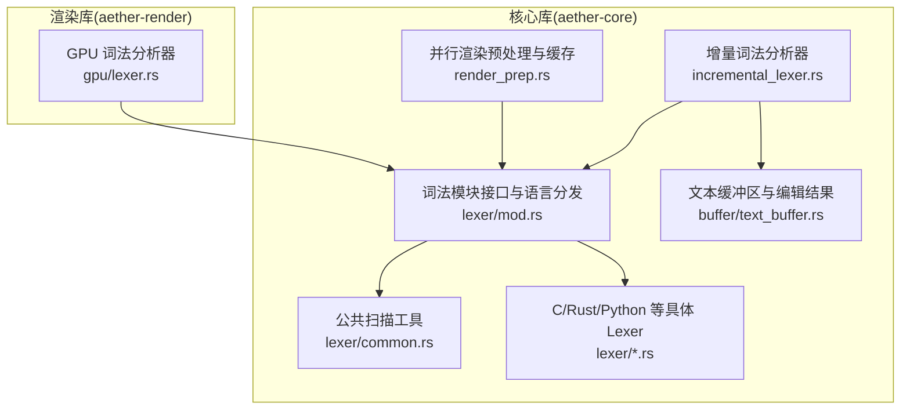
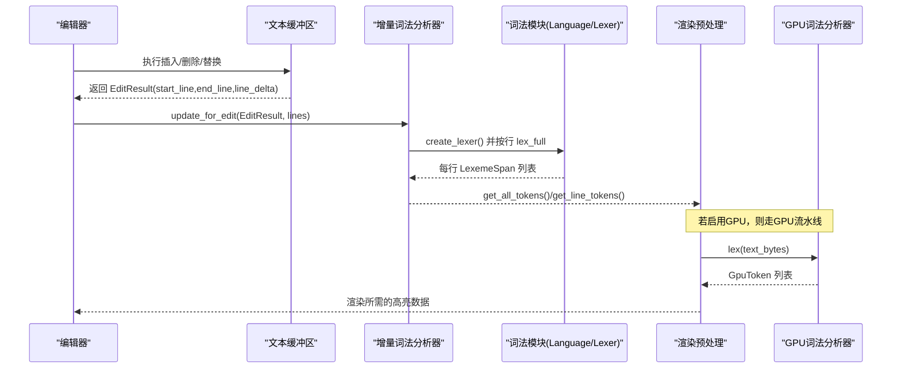
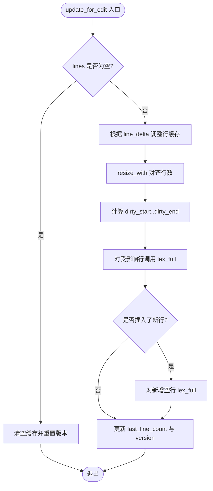
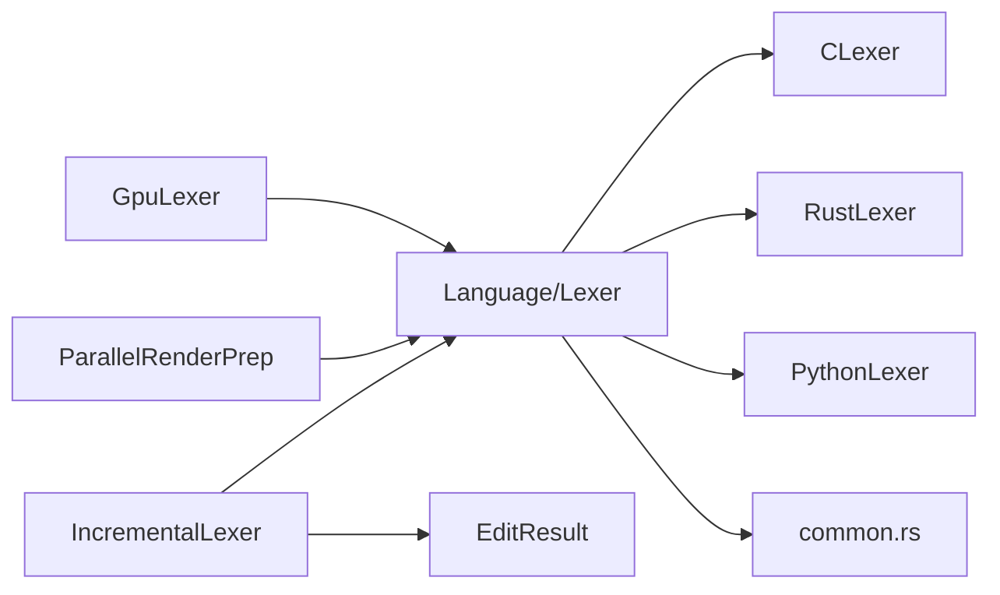

# 增量词法分析器

<cite>
**本文引用的文件**
- [incremental_lexer.rs](file://crates/aether-core/src/incremental_lexer.rs)
- [mod.rs（词法模块）](file://crates/aether-core/src/lexer/mod.rs)
- [common.rs（公共工具）](file://crates/aether-core/src/lexer/common.rs)
- [c_lexer.rs](file://crates/aether-core/src/lexer/c_lexer.rs)
- [rust_lexer.rs](file://crates/aether-core/src/lexer/rust_lexer.rs)
- [python_lexer.rs](file://crates/aether-core/src/lexer/python_lexer.rs)
- [text_buffer.rs](file://crates/aether-core/src/buffer/text_buffer.rs)
- [render_prep.rs](file://crates/aether-core/src/render_prep.rs)
- [gpu/lexer.rs](file://crates/aether-render/src/gpu/lexer.rs)
</cite>

## 目录
1. [简介](#简介)
2. [项目结构](#项目结构)
3. [核心组件](#核心组件)
4. [架构总览](#架构总览)
5. [详细组件分析](#详细组件分析)
6. [依赖关系分析](#依赖关系分析)
7. [性能考量](#性能考量)
8. [故障排查指南](#故障排查指南)
9. [结论](#结论)
10. [附录](#附录)

## 简介
本技术文档围绕“增量词法分析器”展开，解释其工作原理与实现细节：如何在编辑发生时仅对受影响的行进行重新词法分析，而不是全量重析；如何管理词法分析状态（上下文保持、状态恢复、错误恢复）；不同语言（C、Rust、Python等）的特定语法处理模式；以及如何将增量词法分析集成到编辑器中，实现大文件的实时语法高亮与流畅渲染。同时说明与渲染引擎的协作机制，确保高亮更新及时且稳定。

## 项目结构
本项目采用模块化设计，词法分析相关代码集中在 aether-core 的 lexer 子模块，并通过 buffer 层提供文本编辑能力；增量词法分析器位于 incremental_lexer.rs；渲染准备与缓存位于 render_prep.rs；GPU 加速的词法分析在 aether-render 中实现。

图表来源
- [incremental_lexer.rs:1-129](file://crates/aether-core/src/incremental_lexer.rs#L1-L129)
- [mod.rs（词法模块）:1-196](file://crates/aether-core/src/lexer/mod.rs#L1-L196)
- [common.rs:1-151](file://crates/aether-core/src/lexer/common.rs#L1-L151)
- [text_buffer.rs:124-171](file://crates/aether-core/src/buffer/text_buffer.rs#L124-L171)
- [render_prep.rs:13-67](file://crates/aether-core/src/render_prep.rs#L13-L67)
- [gpu/lexer.rs:48-221](file://crates/aether-render/src/gpu/lexer.rs#L48-L221)

章节来源
- [incremental_lexer.rs:1-129](file://crates/aether-core/src/incremental_lexer.rs#L1-L129)
- [mod.rs（词法模块）:1-196](file://crates/aether-core/src/lexer/mod.rs#L1-L196)
- [text_buffer.rs:124-171](file://crates/aether-core/src/buffer/text_buffer.rs#L124-L171)
- [render_prep.rs:13-67](file://crates/aether-core/src/render_prep.rs#L13-L67)
- [gpu/lexer.rs:48-221](file://crates/aether-render/src/gpu/lexer.rs#L48-L221)

## 核心组件
- 增量词法分析器（IncrementalLexer）：按行缓存 token，编辑时仅对受影响行重新分析，使用 Vec 存储行级 token，支持 O(1) 访问与连续内存布局。
- 增量词法管理器（IncrementalLexerManager）：多文件场景下的增量 lexer 生命周期管理，含最大缓存数量保护。
- 词法模块接口（Lexer trait）与语言分发（Language）：统一抽象单行全量词法分析，按扩展名或路径选择具体语言 lexer。
- 公共工具（common.rs）：跨语言的空白、注释、字符串、标识符、数字等通用跳过函数。
- 文本缓冲区与编辑结果（TextBuffer/EditResult）：抽象文本编辑操作，计算受影响的行范围与行数变化，驱动增量更新。
- 渲染预处理与缓存（ParallelRenderPrep/RenderCache）：并行预处理可见行的 token，并缓存以避免重复计算。
- GPU 词法分析器（GpuLexer）：基于 Direct3D11 Compute Shader 的三阶段并行词法分析（字符分类、Token 扫描、关键字查找）。

章节来源
- [incremental_lexer.rs:1-129](file://crates/aether-core/src/incremental_lexer.rs#L1-L129)
- [mod.rs（词法模块）:1-196](file://crates/aether-core/src/lexer/mod.rs#L1-L196)
- [common.rs:1-151](file://crates/aether-core/src/lexer/common.rs#L1-L151)
- [text_buffer.rs:124-171](file://crates/aether-core/src/buffer/text_buffer.rs#L124-L171)
- [render_prep.rs:13-67](file://crates/aether-core/src/render_prep.rs#L13-L67)
- [gpu/lexer.rs:48-221](file://crates/aether-render/src/gpu/lexer.rs#L48-L221)

## 架构总览
增量词法分析的整体流程如下：
- 编辑器触发编辑事件，文本缓冲区返回 EditResult（起始行、结束行、行数变化）。
- 增量词法分析器根据 EditResult 调整行缓存（插入/删除空行），并对受影响行调用对应语言的 Lexer 进行 lex_full。
- 渲染层通过 RenderCache 获取可见行的 token，必要时使用 ParallelRenderPrep 并行预处理。
- 对于超大文件或高性能需求，可切换到 GPU 词法分析器进行三阶段并行分析。

图表来源
- [incremental_lexer.rs:36-101](file://crates/aether-core/src/incremental_lexer.rs#L36-L101)
- [mod.rs（词法模块）:159-196](file://crates/aether-core/src/lexer/mod.rs#L159-L196)
- [render_prep.rs:32-60](file://crates/aether-core/src/render_prep.rs#L32-L60)
- [gpu/lexer.rs:187-221](file://crates/aether-render/src/gpu/lexer.rs#L187-L221)

## 详细组件分析

### 增量词法分析器（IncrementalLexer）
- 行级缓存：以 Vec<Vec<LexemeSpan>> 存储每行 token，行号即索引，O(1) 访问。
- 版本控制：version 字段用于失效检测，每次编辑后递增。
- 编辑处理：
  - 调整行数：根据 line_delta 在 start_line+1 处插入或删除空行，保证 line_tokens 长度与 lines 一致。
  - 受影响行重析：从 dirty_start 到 dirty_end 逐行调用 lexer.lex_full。
  - 新增行补析：当插入多行时，对新增的空行进行 lex_full。
- 查询接口：get_line_tokens、get_all_tokens、clear、cache_stats。

图表来源
- [incremental_lexer.rs:36-101](file://crates/aether-core/src/incremental_lexer.rs#L36-L101)

章节来源
- [incremental_lexer.rs:1-129](file://crates/aether-core/src/incremental_lexer.rs#L1-L129)

### 增量词法管理器（IncrementalLexerManager）
- 多文件管理：HashMap<String, IncrementalLexer> 维护每个文件的增量 lexer。
- 当前文件切换：switch_file 更新 current_file。
- 缓存上限保护：MAX_INCREMENTAL_LEXER_FILES=32，超过上限且未命中时清空缓存，避免长时间运行无界增长。
- 生命周期：open_file/close_file/current_lexer/clear_all。

章节来源
- [incremental_lexer.rs:131-187](file://crates/aether-core/src/incremental_lexer.rs#L131-L187)

### 词法模块接口与语言分发
- Lexer trait：定义 lex_full(text) -> Vec<LexemeSpan>，统一单行全量分析接口。
- Language：按扩展名或路径映射到具体语言，create_lexer 动态创建对应 lexer；lex_full 静态分发避免 Box 分配与动态分发开销。
- TokenKind：跨语言统一的 token 类型枚举，涵盖关键字、标识符、字符串、注释、运算符、分隔符、预处理指令、属性、类型名、函数名、宏、生命周期、泛型、正则、格式化字符串、Markdown 元素、JSON 键、TOML 表头、空白、换行、未知、EOF。
- PlainTextLexer：无高亮的 fallback，返回 Unknown 类型。

章节来源
- [mod.rs（词法模块）:1-196](file://crates/aether-core/src/lexer/mod.rs#L1-L196)

### 公共工具（common.rs）
- skip_whitespace：跳过空格、制表符、回车。
- skip_line_comment：跳过 // 行注释。
- skip_block_comment：跳过 /* */ 块注释。
- skip_quoted：跳过由引号包围的字符串/字符字面量，正确处理转义与不匹配情况。
- skip_identifier_ascii / skip_identifier_with：跳过 ASCII 标识符及允许额外字符（如 JS 的 $）。
- skip_number_generic：通用数字扫描框架，回调判断有效字节。

章节来源
- [common.rs:1-151](file://crates/aether-core/src/lexer/common.rs#L1-L151)

### 具体语言词法分析器

#### C 语言词法分析器（CLexer）
- DFA 风格逐字符识别：空白、换行、注释（行/块/文档）、预处理指令、字符串/字符、数字（含进制前缀、指数、后缀）、标识符与关键字、运算符、标点、未知 UTF-8。
- 数字解析：十六进制/二进制前缀、浮点小数点、指数符号、整数/浮点后缀；防止 1..2 被合并为数字。
- 运算符合并：++、--、->、==、!=、<=、>=、<<、>>、&&、|| 等。
- 文档注释：/** ... */ 且非 /**/ 空注释。

章节来源
- [c_lexer.rs:1-425](file://crates/aether-core/src/lexer/c_lexer.rs#L1-L425)

#### Rust 语言词法分析器（RustLexer）
- 特性：生命周期 'a、'static；属性 #[...] 与 #![...]；宏调用 ident!；内置类型识别；嵌套块注释深度计数；范围语法 1..2 防合并；数字下划线分隔；f-string 不在 Rust 中但兼容其他语言。
- 注释：/// 文档注释、//! 模块文档、/** */ 块注释（空注释排除）。
- 标识符分类：关键字、内置类型、宏名、普通标识符。

章节来源
- [rust_lexer.rs:1-583](file://crates/aether-core/src/lexer/rust_lexer.rs#L1-L583)

#### Python 语言词法分析器（PythonLexer）
- 特性：三引号字符串 """...""" 与 f-string 前缀 f"..."/f'...'；装饰器 @；数字支持虚数 j/J、科学计数法、下划线分隔；阻止 1..2 合并。
- 注释：# 行注释。
- 标识符分类：关键字、内置类型、普通标识符。

章节来源
- [python_lexer.rs:1-450](file://crates/aether-core/src/lexer/python_lexer.rs#L1-L450)

### 文本缓冲区与编辑结果（TextBuffer/EditResult）
- TextBuffer：抽象插入、删除、切片、全文、行计数、字节长度、行文本、行字节范围、行列转换、快照、保存/恢复状态。
- EditResult：记录受影响的起始行、结束行、行数变化，用于精确计算增量分析范围。
- MultiCursorState：多光标与列选择模式支持，内部钳位主光标索引避免越界。

章节来源
- [text_buffer.rs:1-171](file://crates/aether-core/src/buffer/text_buffer.rs#L1-L171)
- [text_buffer.rs:173-258](file://crates/aether-core/src/buffer/text_buffer.rs#L173-L258)

### 渲染预处理与缓存（ParallelRenderPrep/RenderCache）
- ParallelRenderPrep：对可见行并行预处理 token，行数少于阈值或线程数不足时回退到单线程；rayon 复用线程池减少开销。
- RenderCache：缓存可见行文本与 token 列表，配合版本号进行失效检测，避免每帧重复计算。

章节来源
- [render_prep.rs:13-67](file://crates/aether-core/src/render_prep.rs#L13-L67)
- [render_prep.rs:69-131](file://crates/aether-core/src/render_prep.rs#L69-L131)

### GPU 词法分析器（GpuLexer）
- 三阶段流水线：
  1) 字符分类：按字符类别生成分类数组。
  2) Token 扫描：基于分类数组扫描 token。
  3) 关键字查找：使用完美哈希表识别关键字。
- 资源管理：DFA 表、关键字表、工作缓冲区（字符分类、token 列表、计数）按需分配与复用。
- 输入输出：输入为 UTF-8 字节切片，输出为 GpuToken 列表（start、len、token_type、keyword_id、syntax_class）。

章节来源
- [gpu/lexer.rs:11-77](file://crates/aether-render/src/gpu/lexer.rs#L11-L77)
- [gpu/lexer.rs:187-221](file://crates/aether-render/src/gpu/lexer.rs#L187-L221)
- [gpu/lexer.rs:258-314](file://crates/aether-render/src/gpu/lexer.rs#L258-L314)
- [gpu/lexer.rs:321-401](file://crates/aether-render/src/gpu/lexer.rs#L321-L401)

## 依赖关系分析
- 增量词法分析器依赖词法模块的语言分发与具体 lexer 实现，以及文本缓冲区的编辑结果。
- 渲染预处理依赖词法模块进行并行 token 预处理，并可切换到 GPU 词法分析器。
- 各语言 lexer 共享 common.rs 中的通用扫描工具，降低重复实现与维护成本。

图表来源
- [incremental_lexer.rs:1-129](file://crates/aether-core/src/incremental_lexer.rs#L1-L129)
- [mod.rs（词法模块）:159-196](file://crates/aether-core/src/lexer/mod.rs#L159-L196)
- [common.rs:1-151](file://crates/aether-core/src/lexer/common.rs#L1-L151)
- [render_prep.rs:32-60](file://crates/aether-core/src/render_prep.rs#L32-L60)
- [gpu/lexer.rs:187-221](file://crates/aether-render/src/gpu/lexer.rs#L187-L221)

章节来源
- [incremental_lexer.rs:1-129](file://crates/aether-core/src/incremental_lexer.rs#L1-L129)
- [mod.rs（词法模块）:159-196](file://crates/aether-core/src/lexer/mod.rs#L159-L196)
- [common.rs:1-151](file://crates/aether-core/src/lexer/common.rs#L1-L151)
- [render_prep.rs:32-60](file://crates/aether-core/src/render_prep.rs#L32-L60)
- [gpu/lexer.rs:187-221](file://crates/aether-render/src/gpu/lexer.rs#L187-L221)

## 性能考量
- 行级缓存与增量更新：避免全量重析，仅对受影响行 lex_full，显著降低编辑时的 CPU 开销。
- Vec 连续内存布局：O(1) 行访问与 splice/drain 高效调整行数。
- 版本失效检测：version 字段快速判断缓存有效性，减少不必要重算。
- 并行预处理：ParallelRenderPrep 使用 rayon 并行 map-reduce，适合大文件可见行批量处理。
- GPU 加速：GpuLexer 三阶段并行流水线，适合超大文件或高频更新场景。
- 缓存上限保护：IncrementalLexerManager 限制最大文件数，避免内存无界增长。

[本节为一般性指导，无需具体文件引用]

## 故障排查指南
- 编辑后高亮不正确：
  - 检查 EditResult 的 start_line、end_line、line_delta 是否正确计算。
  - 确认增量词法分析器的 dirty_start..dirty_end 范围覆盖所有受影响行。
- 行数不一致导致 panic：
  - 确保 line_tokens.resize_with 与 lines.len() 保持一致。
  - 插入/删除空行时使用 splice/drain 正确调整位置。
- 注释/字符串未正确识别：
  - 检查 common.rs 的 skip_line_comment/skip_block_comment/skip_quoted 是否处理了边界情况（如末尾反斜杠、未闭合引号）。
- 数字/范围语法误判：
  - 确认数字解析逻辑阻止 1..2 被合并为单个数字。
- GPU 词法分析失败：
  - 检查工作缓冲区大小是否足够（max_tokens = text_len/2 + 1）。
  - 确认 DFA 表与关键字表已上传至 GPU 并持有有效引用。

章节来源
- [text_buffer.rs:124-171](file://crates/aether-core/src/buffer/text_buffer.rs#L124-L171)
- [incremental_lexer.rs:36-101](file://crates/aether-core/src/incremental_lexer.rs#L36-L101)
- [common.rs:1-151](file://crates/aether-core/src/lexer/common.rs#L1-L151)
- [c_lexer.rs:185-233](file://crates/aether-core/src/lexer/c_lexer.rs#L185-L233)
- [rust_lexer.rs:327-374](file://crates/aether-core/src/lexer/rust_lexer.rs#L327-L374)
- [python_lexer.rs:229-260](file://crates/aether-core/src/lexer/python_lexer.rs#L229-L260)
- [gpu/lexer.rs:258-314](file://crates/aether-render/src/gpu/lexer.rs#L258-L314)

## 结论
增量词法分析器通过行级缓存与精确的受影响行重析，实现了高效的编辑响应与低开销的语法高亮。结合并行预处理与 GPU 加速，能够在大文件与高频编辑场景下保持流畅体验。不同语言的具体 lexer 实现了各自语法的精细识别，并通过公共工具提升复用性与一致性。与渲染引擎的协作通过 RenderCache 与版本失效检测确保高亮更新的及时性与稳定性。

[本节为总结性内容，无需具体文件引用]

## 附录

### 集成示例：编辑器中的增量词法分析
- 打开文件：
  - 使用 IncrementalLexerManager::open_file 获取或创建增量 lexer。
  - 调用 analyze_all 对初始行进行全量分析。
- 编辑处理：
  - 文本缓冲区返回 EditResult。
  - 调用 update_for_edit 进行增量更新。
- 渲染：
  - 使用 get_all_tokens 或 get_line_tokens 获取 token。
  - 可选：使用 ParallelRenderPrep 并行预处理可见行。
  - 可选：切换到 GpuLexer 进行 GPU 加速。

章节来源
- [incremental_lexer.rs:151-187](file://crates/aether-core/src/incremental_lexer.rs#L151-L187)
- [render_prep.rs:32-60](file://crates/aether-core/src/render_prep.rs#L32-L60)
- [gpu/lexer.rs:187-221](file://crates/aether-render/src/gpu/lexer.rs#L187-L221)

### 大文件实时高亮优化建议
- 分块渲染：仅对可见行进行 token 预处理，减少 CPU 占用。
- 批处理编辑：合并多次编辑的 EditResult，减少增量更新次数。
- 缓存策略：使用 RenderCache 与版本失效检测，避免重复计算。
- GPU 优先：对超大文件或高频更新场景启用 GpuLexer。

[本节为一般性指导，无需具体文件引用]

### 与渲染引擎的协作机制
- 增量词法分析器提供行级 token 数据，渲染层据此生成高亮样式。
- RenderCache 缓存可见行文本与 token，配合版本号确保一致性。
- GPU 词法分析器输出 GpuToken，供渲染管线进行着色与绘制。

章节来源
- [render_prep.rs:69-131](file://crates/aether-core/src/render_prep.rs#L69-L131)
- [gpu/lexer.rs:11-77](file://crates/aether-render/src/gpu/lexer.rs#L11-L77)