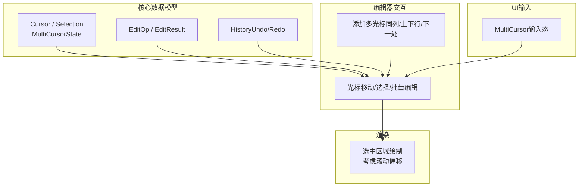
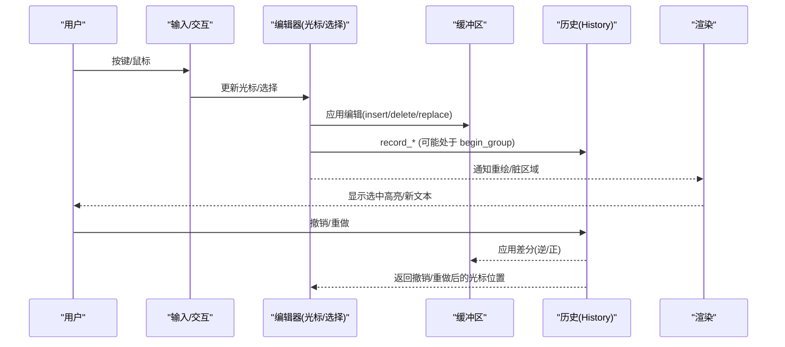
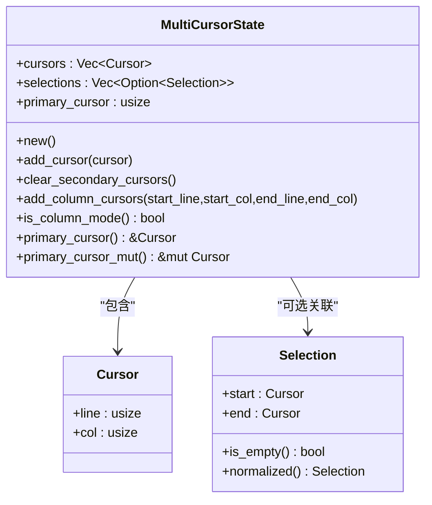
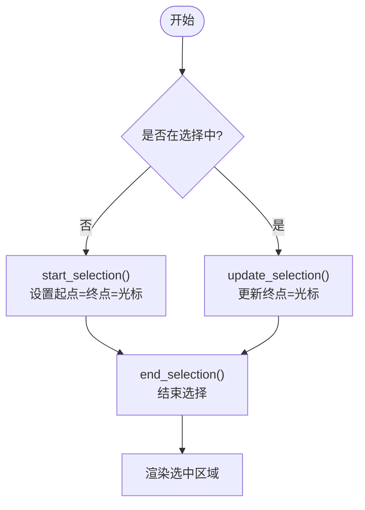
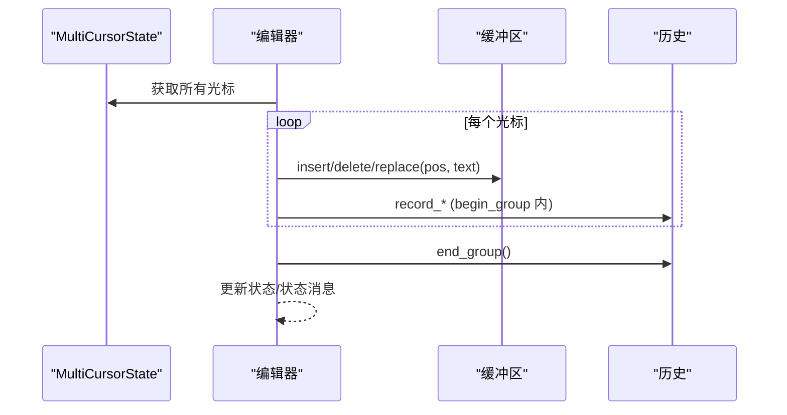
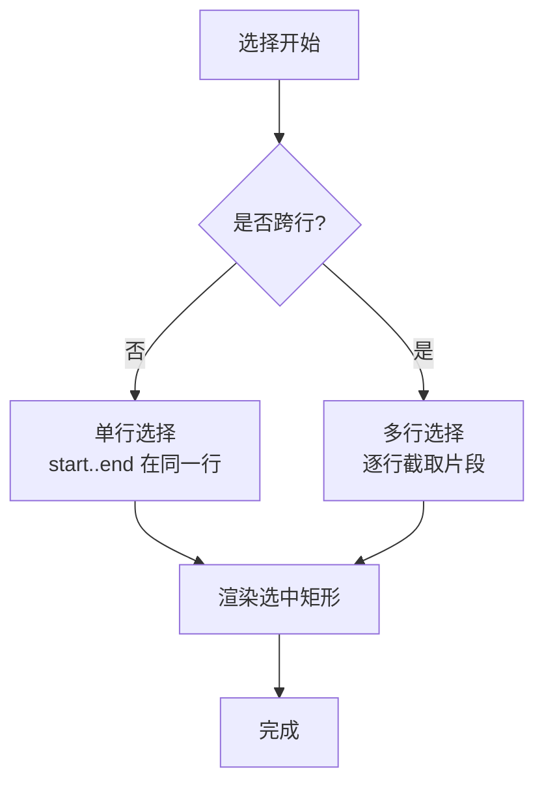
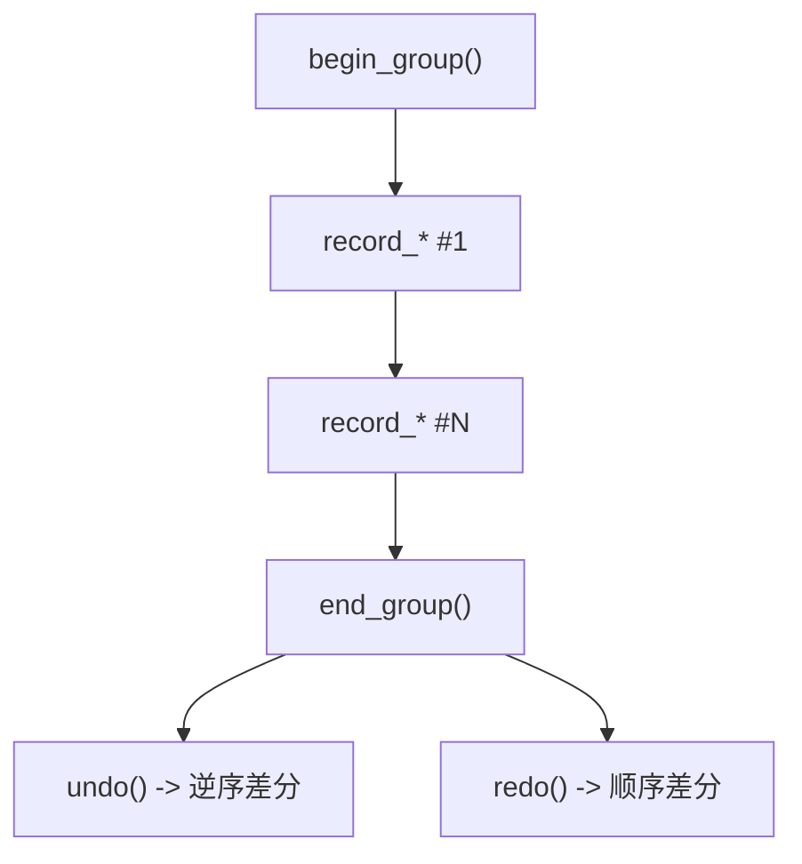
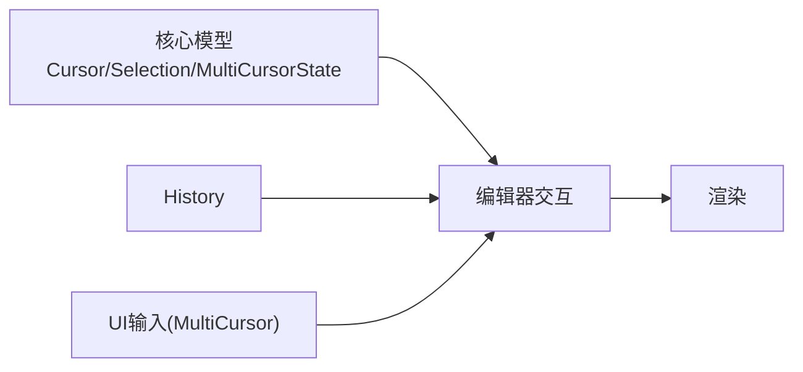

# 多光标支持系统

<cite>
**本文引用的文件**
- [text_buffer.rs](file://crates/aether-core/src/buffer/text_buffer.rs)
- [history.rs](file://crates/aether-core/src/buffer/history.rs)
- [cursor.rs（编辑器）](file://crates/aether-win32/src/editor/cursor.rs)
- [editing.rs（编辑器）](file://crates/aether-win32/src/editor/editing.rs)
- [editor_view.rs（渲染）](file://crates/aether-win32/src/render/editor_view.rs)
- [input.rs（UI层）](file://crates/aether-ui/src/input.rs)
</cite>

## 目录
1. [简介](#简介)
2. [项目结构](#项目结构)
3. [核心组件](#核心组件)
4. [架构总览](#架构总览)
5. [详细组件分析](#详细组件分析)
6. [依赖关系分析](#依赖关系分析)
7. [性能考量](#性能考量)
8. [故障排查指南](#故障排查指南)
9. [结论](#结论)
10. [附录](#附录)

## 简介
本文件系统化说明“多光标支持”的设计与实现，覆盖 MultiCursorState 的架构、光标位置管理、选择区处理、光标同步机制；详解光标移动、选择扩展、批量编辑等操作的原理；文档化 Selection 的使用方式（单行/多行/矩形选择）；给出创建与管理多个光标的示例流程；说明与撤销/重做系统的集成，确保多光标操作的历史记录正确。

## 项目结构
多光标能力由核心数据模型（aether-core）、编辑器交互逻辑（aether-win32/editor）、渲染高亮（aether-win32/render）以及 UI 输入层（aether-ui）共同构成：
- 核心数据模型：定义 Cursor、Selection、MultiCursorState、EditOp、EditResult 等基础类型，提供列模式光标生成与主光标钳位访问。
- 编辑器交互：实现光标移动、选词、添加同列/相邻行/下一处相同单词的光标、鼠标点击定位、选择开始/更新/结束等。
- 渲染：根据 selection_start/end 计算并绘制选中区域，考虑水平滚动偏移。
- UI 输入：维护一个轻量的多光标容器（用于输入阶段），提供 add_cursor/remove_secondary 等方法。

图表来源
- [text_buffer.rs:83-180](file://crates/aether-core/src/buffer/text_buffer.rs#L83-L180)
- [history.rs:14-122](file://crates/aether-core/src/buffer/history.rs#L14-L122)
- [cursor.rs（编辑器）:283-759](file://crates/aether-win32/src/editor/cursor.rs#L283-L759)
- [editor_view.rs（渲染）:182-233](file://crates/aether-win32/src/render/editor_view.rs#L182-L233)
- [input.rs（UI层）:310-354](file://crates/aether-ui/src/input.rs#L310-L354)

章节来源
- [text_buffer.rs:83-180](file://crates/aether-core/src/buffer/text_buffer.rs#L83-L180)
- [history.rs:14-122](file://crates/aether-core/src/buffer/history.rs#L14-L122)
- [cursor.rs（编辑器）:283-759](file://crates/aether-win32/src/editor/cursor.rs#L283-L759)
- [editor_view.rs（渲染）:182-233](file://crates/aether-win32/src/render/editor_view.rs#L182-L233)
- [input.rs（UI层）:310-354](file://crates/aether-ui/src/input.rs#L310-L354)

## 核心组件
- Cursor：以（行号，字节列）表示光标位置，所有编辑基于字节偏移，避免 UTF-8 边界问题。
- Selection：由 start 与 end 两个 Cursor 组成，提供 is_empty 与 normalized（规范化起点<=终点）。
- MultiCursorState：维护多光标集合、每个光标对应的可选选择区、主光标索引；提供主光标安全访问、添加光标、清除次要光标、列模式（矩形选择）生成等。
- History：基于差分的撤销/重做栈，支持插入/删除/替换三类差分，具备合并窗口与撤销组能力，保证多步编辑可原子回滚。

章节来源
- [text_buffer.rs:83-180](file://crates/aether-core/src/buffer/text_buffer.rs#L83-L180)
- [text_buffer.rs:173-258](file://crates/aether-core/src/buffer/text_buffer.rs#L173-L258)
- [history.rs:14-122](file://crates/aether-core/src/buffer/history.rs#L14-L122)

## 架构总览
多光标系统的关键路径如下：
- 输入事件触发光标移动或选择，更新当前编辑器状态（包括 selection_start/end 与 multi_cursor）。
- 批量编辑时，遍历 multi_cursor.cursors，按各光标位置对缓冲区执行 insert/delete/replace，并通过 History.begin_group/end_group 将多次编辑归并为一次撤销步骤。
- 渲染阶段依据 selection_start/end 计算选中矩形，考虑水平滚动偏移后绘制高亮。
- 撤销/重做通过 History 提供的差分列表对缓冲区进行逆/正操作，并恢复对应的光标位置。

图表来源
- [cursor.rs（编辑器）:545-686](file://crates/aether-win32/src/editor/cursor.rs#L545-L686)
- [editing.rs（编辑器）:699-731](file://crates/aether-win32/src/editor/editing.rs#L699-L731)
- [history.rs:140-323](file://crates/aether-core/src/buffer/history.rs#L140-L323)
- [editor_view.rs（渲染）:182-233](file://crates/aether-win32/src/render/editor_view.rs#L182-L233)

## 详细组件分析

### MultiCursorState 设计
- 数据结构
  - cursors：多光标位置列表（行号+字节列）。
  - selections：与光标一一对应的可选选择区（None 表示无选择）。
  - primary_cursor：主光标索引，内部通过 primary_idx() 钳位到有效范围，避免越界 panic。
- 关键方法
  - add_cursor：追加光标并初始化其选择为 None。
  - clear_secondary_cursors：仅保留主光标及其选择，重置主索引为 0。
  - add_column_cursors：在指定行列范围内生成每行一个光标，形成矩形选区（列模式）。
  - is_column_mode：当存在多个光标且均无选择时判定为列模式。
- 复杂度
  - 添加/删除光标：O(1)/O(n)。
  - 列模式生成：O(k)，k 为行数跨度。

图表来源
- [text_buffer.rs:83-180](file://crates/aether-core/src/buffer/text_buffer.rs#L83-L180)
- [text_buffer.rs:173-258](file://crates/aether-core/src/buffer/text_buffer.rs#L173-L258)

章节来源
- [text_buffer.rs:173-258](file://crates/aether-core/src/buffer/text_buffer.rs#L173-L258)

### 光标移动与选择扩展
- 光标移动：提供左右/上下/首尾/单词边界/智能 Home 等移动函数，并在移动后确保垂直/水平可见性。
- 选择扩展：start_selection/update_selection/end_selection 控制选择生命周期；双击选词基于字符类别（字母数字下划线）确定词边界。
- 鼠标定位：根据像素坐标与可视宽度折算字符列，考虑 scroll_x 偏移，精确映射到字节列。

图表来源
- [cursor.rs（编辑器）:736-759](file://crates/aether-win32/src/editor/cursor.rs#L736-L759)
- [cursor.rs（编辑器）:766-829](file://crates/aether-win32/src/editor/cursor.rs#L766-L829)
- [editor_view.rs（渲染）:182-233](file://crates/aether-win32/src/render/editor_view.rs#L182-L233)

章节来源
- [cursor.rs（编辑器）:283-406](file://crates/aether-win32/src/editor/cursor.rs#L283-L406)
- [cursor.rs（编辑器）:688-759](file://crates/aether-win32/src/editor/cursor.rs#L688-L759)
- [cursor.rs（编辑器）:766-829](file://crates/aether-win32/src/editor/cursor.rs#L766-L829)
- [editor_view.rs（渲染）:182-233](file://crates/aether-win32/src/render/editor_view.rs#L182-L233)

### 多光标协作与批量编辑
- 添加多光标
  - 同列上下行：add_cursor_line_above/add_cursor_line_below，在当前列向相邻行添加光标，自动钳制到新行长度。
  - 下一处相同单词：add_cursor_at_next_occurrence，优先使用当前选中文本，否则取光标所在单词，向后查找并添加光标。
- 批量编辑
  - 广播插入/删除：遍历 multi_cursor.cursors，收集待编辑位置与原始列，依次对缓冲区执行操作，并使用 History.begin_group/end_group 包裹，使多次编辑成为单一撤销步骤。
  - 位置修正：删除后需根据已删除长度调整后续光标列，避免错位。

图表来源
- [cursor.rs（编辑器）:545-686](file://crates/aether-win32/src/editor/cursor.rs#L545-L686)
- [editing.rs（编辑器）:699-731](file://crates/aether-win32/src/editor/editing.rs#L699-L731)
- [history.rs:124-138](file://crates/aether-core/src/buffer/history.rs#L124-L138)

章节来源
- [cursor.rs（编辑器）:545-686](file://crates/aether-win32/src/editor/cursor.rs#L545-L686)
- [editing.rs（编辑器）:699-731](file://crates/aether-win32/src/editor/editing.rs#L699-L731)

### 选择模式与可视化
- 单行选择：start_selection 与 update_selection 在同行内移动光标即可形成。
- 多行选择：跨行拖动或键盘扩展，selection_start/end 分别记录起止点，渲染时按行区间计算选中矩形。
- 矩形选择（列模式）：通过 MultiCursorState.add_column_cursors 生成每行一个光标，is_column_mode 可用于判断当前是否为列模式；渲染时可根据该模式决定高亮策略。
- 渲染细节：选中区域 x 坐标需减去水平滚动偏移，确保视觉一致。

图表来源
- [editor_view.rs（渲染）:182-233](file://crates/aether-win32/src/render/editor_view.rs#L182-L233)
- [text_buffer.rs:173-258](file://crates/aether-core/src/buffer/text_buffer.rs#L173-L258)

章节来源
- [editor_view.rs（渲染）:182-233](file://crates/aether-win32/src/render/editor_view.rs#L182-L233)
- [text_buffer.rs:173-258](file://crates/aether-core/src/buffer/text_buffer.rs#L173-L258)

### 与撤销/重做系统的集成
- 记录策略
  - 插入：record_insert，支持连续同位置快速输入合并（时间窗口内）。
  - 删除：record_delete，支持连续前向删除合并。
  - 替换：record_replace，作为原子操作不参与合并。
- 撤销组：begin_group/end_group 将多条记录归为一个撤销步骤，适合批量多光标编辑。
- 撤销/重做：undo/redo 返回差分列表与目标光标位置，调用方按序应用到缓冲区并恢复光标。

图表来源
- [history.rs:124-138](file://crates/aether-core/src/buffer/history.rs#L124-L138)
- [history.rs:140-323](file://crates/aether-core/src/buffer/history.rs#L140-L323)

章节来源
- [history.rs:140-323](file://crates/aether-core/src/buffer/history.rs#L140-L323)

## 依赖关系分析
- 编辑器交互依赖核心数据模型（Cursor/Selection/MultiCursorState）与 History。
- 渲染依赖编辑器状态中的 selection_start/end 与滚动参数。
- UI 输入层维护独立的 MultiCursor 容器，用于输入阶段的临时多光标管理。

图表来源
- [text_buffer.rs:83-180](file://crates/aether-core/src/buffer/text_buffer.rs#L83-L180)
- [history.rs:14-122](file://crates/aether-core/src/buffer/history.rs#L14-L122)
- [cursor.rs（编辑器）:283-759](file://crates/aether-win32/src/editor/cursor.rs#L283-L759)
- [editor_view.rs（渲染）:182-233](file://crates/aether-win32/src/render/editor_view.rs#L182-L233)
- [input.rs（UI层）:310-354](file://crates/aether-ui/src/input.rs#L310-L354)

章节来源
- [text_buffer.rs:83-180](file://crates/aether-core/src/buffer/text_buffer.rs#L83-L180)
- [history.rs:14-122](file://crates/aether-core/src/buffer/history.rs#L14-L122)
- [cursor.rs（编辑器）:283-759](file://crates/aether-win32/src/editor/cursor.rs#L283-L759)
- [editor_view.rs（渲染）:182-233](file://crates/aether-win32/src/render/editor_view.rs#L182-L233)
- [input.rs（UI层）:310-354](file://crates/aether-ui/src/input.rs#L310-L354)

## 性能考量
- 字节偏移与字符边界：光标与选择均以字节偏移为基础，配合 floor_char_boundary 避免 UTF-8 分割错误。
- 可见性优化：ensure_cursor_visible_vertical/horizontal 仅在必要时滚动，减少重排。
- 历史合并：连续同位置输入/删除在 500ms 窗口内合并，降低撤销栈压力。
- 渲染裁剪：选中区域计算考虑水平滚动偏移，避免多余绘制。

[本节为通用指导，不直接分析具体文件]

## 故障排查指南
- 光标不可见
  - 检查 ensure_cursor_visible_vertical/horizontal 是否在光标移动后调用。
  - 确认 scroll_x/scroll_y 更新与渲染一致。
- 多选高亮异常
  - 核对 selection_start/end 是否正确设置，渲染时是否减去 scroll_x。
- 撤销/重做错乱
  - 确认批量编辑使用 begin_group/end_group 包裹。
  - 检查 record_* 传入的 pos 与文本长度是否匹配（尤其多字节字符）。
- 列模式误判
  - 确认 is_column_mode 条件：多光标且 selections 均为 None。

章节来源
- [cursor.rs（编辑器）:146-159](file://crates/aether-win32/src/editor/cursor.rs#L146-L159)
- [editor_view.rs（渲染）:182-233](file://crates/aether-win32/src/render/editor_view.rs#L182-L233)
- [history.rs:140-323](file://crates/aether-core/src/buffer/history.rs#L140-L323)
- [text_buffer.rs:254-258](file://crates/aether-core/src/buffer/text_buffer.rs#L254-L258)

## 结论
多光标系统通过清晰的数据模型（Cursor/Selection/MultiCursorState）、健壮的编辑器交互（移动/选择/批量编辑）、一致的渲染策略（考虑滚动偏移）以及高效的撤销/重做（差分+合并+撤销组），实现了高效、可靠的多光标编辑体验。遵循本文档的模式与实践，可进一步扩展更多智能光标定位与协作编辑功能。

## 附录
- 使用示例（流程描述）
  - 创建多光标：在主光标基础上，调用 add_cursor_line_above/below 或 add_cursor_at_next_occurrence 增加光标。
  - 批量编辑：使用 History.begin_group 开始，遍历 multi_cursor.cursors 执行编辑并 record_*，最后 end_group 提交。
  - 列模式：调用 add_column_cursors 生成矩形选区，is_column_mode 可用于分支逻辑。
  - 撤销/重做：调用 undo/redo 获取差分与目标光标位置，应用到缓冲区并恢复光标。
- 参考路径
  - 光标移动与选择：[cursor.rs（编辑器）:283-759](file://crates/aether-win32/src/editor/cursor.rs#L283-L759)
  - 批量编辑与撤销组：[editing.rs（编辑器）:699-731](file://crates/aether-win32/src/editor/editing.rs#L699-L731), [history.rs:124-138](file://crates/aether-core/src/buffer/history.rs#L124-L138)
  - 渲染选中区域：[editor_view.rs（渲染）:182-233](file://crates/aether-win32/src/render/editor_view.rs#L182-L233)
  - UI 输入多光标容器：[input.rs（UI层）:310-354](file://crates/aether-ui/src/input.rs#L310-L354)