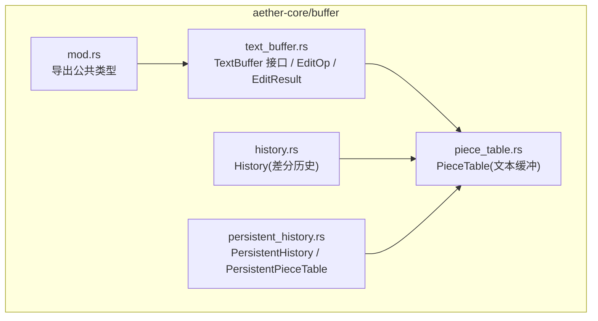
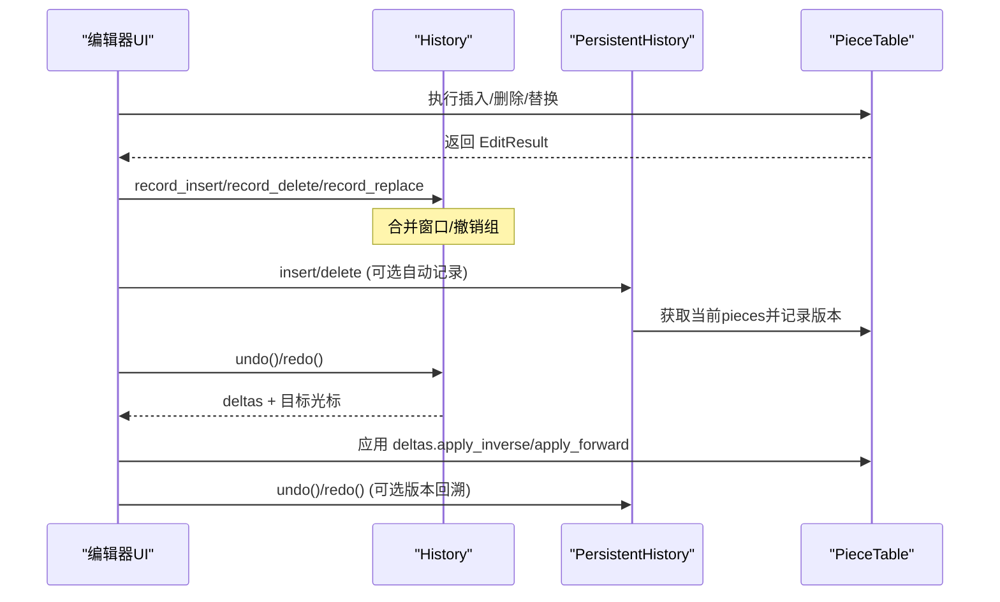
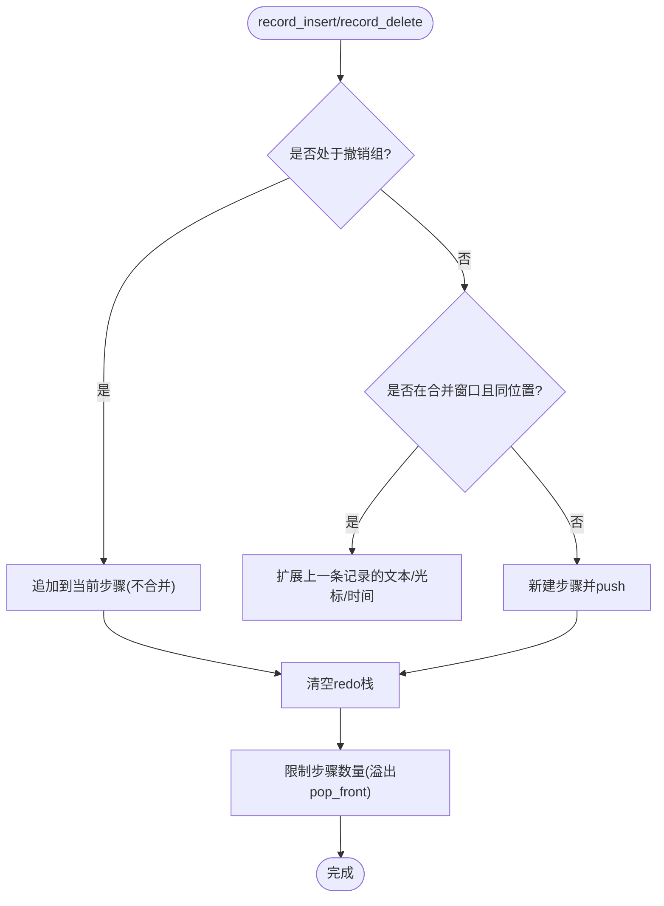
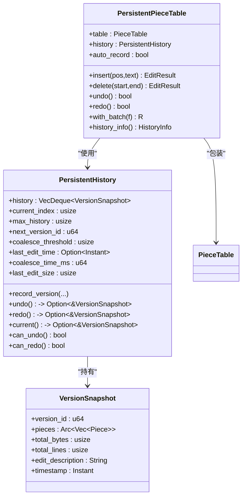
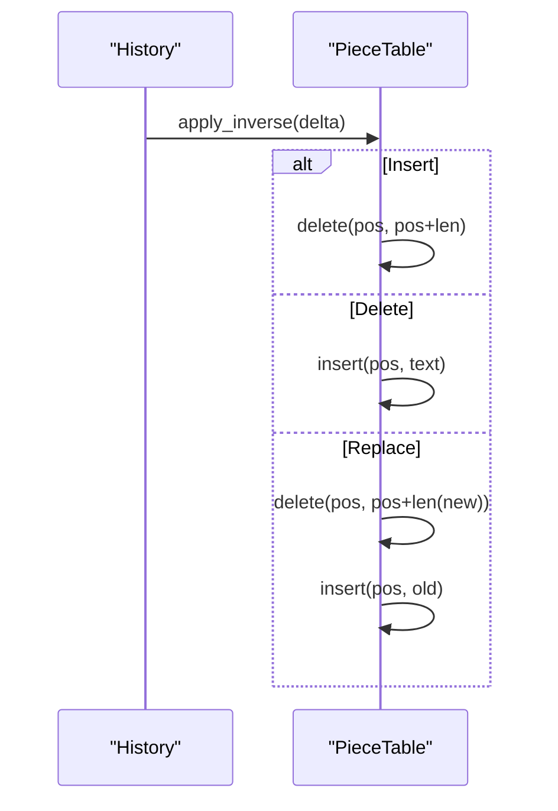
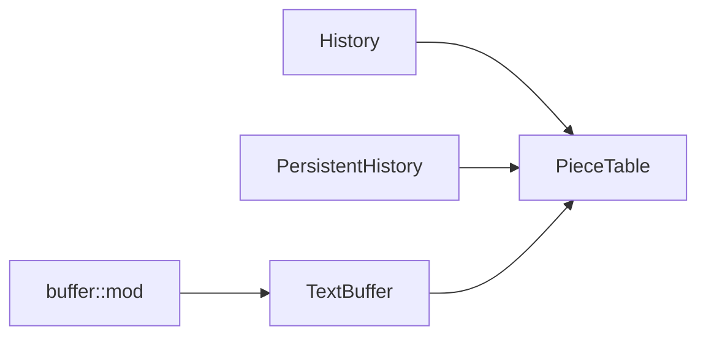

# 撤销重做历史栈

<cite>
**本文引用的文件**
- [history.rs](file://crates/aether-core/src/buffer/history.rs)
- [persistent_history.rs](file://crates/aether-core/src/persistent_history.rs)
- [text_buffer.rs](file://crates/aether-core/src/buffer/text_buffer.rs)
- [piece_table.rs](file://crates/aether-core/src/buffer/piece_table.rs)
- [mod.rs](file://crates/aether-core/src/buffer/mod.rs)
</cite>

## 目录
1. [简介](#简介)
2. [项目结构](#项目结构)
3. [核心组件](#核心组件)
4. [架构总览](#架构总览)
5. [详细组件分析](#详细组件分析)
6. [依赖关系分析](#依赖关系分析)
7. [性能考量](#性能考量)
8. [故障排查指南](#故障排查指南)
9. [结论](#结论)
10. [附录：API 参考与使用示例](#附录api-参考与使用示例)

## 简介
本文件系统性地文档化了“撤销/重做历史栈”的设计与实现，覆盖以下要点：
- EditOp 与 EditResult 的设计模式及其在可逆编辑中的作用
- 基于操作日志（EditDelta/EditRecord）的差分解耦与可逆性
- 历史栈数据结构设计：步骤分组、合并策略、内存优化
- 核心 API 的使用方式与调用时序
- 复杂编辑组合、嵌套操作与跨文件历史记录管理
- 与文本缓冲（PieceTable）的集成机制，确保一致性与高性能

## 项目结构
该功能位于 aether-core 的 buffer 模块中，围绕文本缓冲区提供两种互补的历史方案：
- 轻量级差分历史：History（基于 EditDelta/EditRecord），适合高频输入、低开销撤销/重做
- 持久化版本历史：PersistentHistory + PersistentPieceTable，基于 PieceTable 的版本快照，适合需要版本回溯的场景



图表来源
- [history.rs:1-30](file://crates/aether-core/src/buffer/history.rs#L1-L30)
- [persistent_history.rs:1-50](file://crates/aether-core/src/persistent_history.rs#L1-L50)
- [text_buffer.rs:1-50](file://crates/aether-core/src/buffer/text_buffer.rs#L1-L50)
- [piece_table.rs:1-35](file://crates/aether-core/src/buffer/piece_table.rs#L1-L35)
- [mod.rs:1-9](file://crates/aether-core/src/buffer/mod.rs#L1-L9)

章节来源
- [mod.rs:1-9](file://crates/aether-core/src/buffer/mod.rs#L1-L9)

## 核心组件
- History（差分历史）
  - 记录最小化的 EditDelta（插入/删除/替换），并维护光标位置变化
  - 支持连续输入的合并窗口（同位置快速输入/删除合并为一条记录）
  - 支持撤销组（begin_group/end_group），将多个原子操作归为一个撤销步
- PersistentHistory（版本历史）
  - 以 Arc<Vec<Piece>> 共享片段表，低成本保存版本快照
  - 提供版本合并策略（时间窗口+大小阈值）减少历史膨胀
  - 通过 with_batch 批量操作只记录一次历史
- TextBuffer 接口与 EditOp/EditResult
  - 抽象文本编辑操作，统一 insert/delete/slice 等能力
  - EditOp 描述编辑意图；EditResult 描述受影响行范围，用于缓存失效

章节来源
- [history.rs:14-122](file://crates/aether-core/src/buffer/history.rs#L14-L122)
- [persistent_history.rs:7-50](file://crates/aether-core/src/persistent_history.rs#L7-L50)
- [text_buffer.rs:1-171](file://crates/aether-core/src/buffer/text_buffer.rs#L1-L171)

## 架构总览
系统采用“操作日志 + 版本快照”双轨制：
- 高频编辑路径：History 记录 EditDelta，应用时按逆序/顺序对 PieceTable 执行 delete/insert，保持 O(1) 级别增量更新
- 版本回溯路径：PersistentHistory 保存 Arc 包装的 pieces 列表，undo/redo 直接恢复引用计数，避免完整拷贝



图表来源
- [history.rs:140-323](file://crates/aether-core/src/buffer/history.rs#L140-L323)
- [persistent_history.rs:66-175](file://crates/aether-core/src/persistent_history.rs#L66-L175)
- [piece_table.rs:11-35](file://crates/aether-core/src/buffer/piece_table.rs#L11-L35)

## 详细组件分析

### 差分历史：History（EditDelta/EditRecord）
- 数据模型
  - EditDelta：Insert/Delete/Replace，携带位置与文本信息
  - EditRecord：包含 delta、编辑前后光标位置、时间戳
  - History：维护 undos/redos（VecDeque 步骤队列）、合并状态、最大步骤数、撤销组标记
- 合并策略
  - 连续同位置插入/删除在 500ms 内合并为一条记录，降低历史膨胀
  - 替换操作不参与合并，保证原子语义
- 撤销/重做
  - undo() 弹出一步（可能包含多条记录），返回逆序 deltas 与撤销后光标
  - redo() 弹出一部重做，返回顺序 deltas 与重做后光标
  - 新记录会清空 redo 栈，符合常规撤销重做行为
- 撤销组
  - begin_group/end_group 将一组操作封装为单一撤销步，组内不合并
  - 撤销组回到首记录的 cursor_before，重做组到末记录的 cursor_after



图表来源
- [history.rs:140-301](file://crates/aether-core/src/buffer/history.rs#L140-L301)

章节来源
- [history.rs:30-110](file://crates/aether-core/src/buffer/history.rs#L30-L110)
- [history.rs:124-301](file://crates/aether-core/src/buffer/history.rs#L124-L301)
- [history.rs:303-340](file://crates/aether-core/src/buffer/history.rs#L303-L340)

### 版本历史：PersistentHistory + PersistentPieceTable
- 数据模型
  - VersionSnapshot：版本ID、Arc<Vec<Piece>>、字节/行数、编辑描述、时间戳
  - PersistentHistory：环形历史、当前索引、最大历史、合并阈值、时间窗口
  - PersistentPieceTable：包装 PieceTable 与 PersistentHistory，提供 insert/delete/undo/redo/with_batch
- 合并策略
  - should_coalesce：当编辑较小且距离上次编辑较近时，合并到当前版本
  - 溢出处理：优先删除中间旧版本，保留当前所在版本，避免索引跳变
- 撤销/重做
  - undo/redo 返回 VersionSnapshot，通过 restore(pieces, add_buffer_len) 恢复 PieceTable
  - with_batch 关闭自动记录，批量结束后记录一次历史



图表来源
- [persistent_history.rs:7-50](file://crates/aether-core/src/persistent_history.rs#L7-L50)
- [persistent_history.rs:66-175](file://crates/aether-core/src/persistent_history.rs#L66-L175)
- [persistent_history.rs:240-376](file://crates/aether-core/src/persistent_history.rs#L240-L376)

章节来源
- [persistent_history.rs:66-175](file://crates/aether-core/src/persistent_history.rs#L66-L175)
- [persistent_history.rs:240-376](file://crates/aether-core/src/persistent_history.rs#L240-L376)

### 文本缓冲接口：TextBuffer、EditOp、EditResult
- TextBuffer 抽象了 insert/delete/slice/full_text/line_* 等操作，屏蔽底层实现差异
- EditOp 表示编辑意图（Insert/Delete/Replace），便于上层逻辑与具体数据结构解耦
- EditResult 描述受影响的行范围与行数变化，用于精确行缓存失效

```mermaid
classDiagram
class TextBuffer {
+insert(pos,text) void
+delete(start,end) void
+slice(start,end) String
+full_text() String
+line_count() usize
+byte_len() usize
+line_text(line_idx) Option~String~
+line_byte_range(line_idx) Option~(usize,usize)~
+line_col_to_byte(line,col) usize
+byte_to_line_col(byte) (usize,usize)
+create_snapshot() Box~TextBufferSnapshot~
+save_state() BufferState
+restore_state(state) void
}
class EditOp {
<<enum>>
Insert{pos,text}
Delete{start,end}
Replace{start,end,text}
}
class EditResult {
+start_line : usize
+end_line : usize
+line_delta : isize
+merge(other) EditResult
}
TextBuffer <.. EditResult : "返回"
```

图表来源
- [text_buffer.rs:1-171](file://crates/aether-core/src/buffer/text_buffer.rs#L1-L171)

章节来源
- [text_buffer.rs:1-171](file://crates/aether-core/src/buffer/text_buffer.rs#L1-L171)

### 与 PieceTable 的集成
- History 通过 EditDelta.apply_inverse/apply_forward 调用 PieceTable.delete/insert，实现可逆编辑
- PersistentPieceTable 通过 Arc<Vec<Piece>> 共享片段表，undo/redo 时 restore(pieces, add_buffer_len) 高效恢复状态
- PieceTable 内部维护 add_buffer（只追加不删除）与 pieces（有序片段），天然支持不可变快照与零拷贝大文件打开



图表来源
- [history.rs:45-77](file://crates/aether-core/src/buffer/history.rs#L45-L77)
- [piece_table.rs:11-35](file://crates/aether-core/src/buffer/piece_table.rs#L11-L35)

章节来源
- [history.rs:45-77](file://crates/aether-core/src/buffer/history.rs#L45-L77)
- [piece_table.rs:11-35](file://crates/aether-core/src/buffer/piece_table.rs#L11-L35)

## 依赖关系分析
- History 依赖 PieceTable 进行实际文本修改，并通过 EditDelta 的逆/正操作实现可逆性
- PersistentHistory 依赖 PieceTable 的 get_pieces/len_bytes/len_lines 以及 restore 能力
- TextBuffer 作为抽象层，使上层代码与具体实现解耦，便于测试与替换
- mod.rs 统一导出公共类型，简化外部依赖



图表来源
- [history.rs:1-5](file://crates/aether-core/src/buffer/history.rs#L1-L5)
- [persistent_history.rs:1-6](file://crates/aether-core/src/persistent_history.rs#L1-L6)
- [text_buffer.rs:1-10](file://crates/aether-core/src/buffer/text_buffer.rs#L1-L10)
- [mod.rs:1-9](file://crates/aether-core/src/buffer/mod.rs#L1-L9)

章节来源
- [mod.rs:1-9](file://crates/aether-core/src/buffer/mod.rs#L1-L9)

## 性能考量
- 差分历史（History）
  - 每条记录仅存储 EditDelta 与光标位置，内存占用极小
  - 连续输入合并窗口减少历史条目数量，降低 undo/redo 成本
  - 使用 VecDeque 实现 O(1) 淘汰，控制最大步骤数
- 版本历史（PersistentHistory）
  - 通过 Arc<Vec<Piece>> 共享片段表，版本间零拷贝
  - 合并策略（时间窗口+大小阈值）减少历史膨胀
  - 溢出时优先删除中间旧版本，避免当前版本索引跳变
- 与 PieceTable 的集成
  - add_buffer 只追加不删除，天然支持不可变快照
  - 行索引分块与偏移缓存提升查询与编辑效率

[本节为通用性能讨论，不直接分析具体文件]

## 故障排查指南
- 撤销/重做不一致
  - 检查 record_insert/record_delete/record_replace 是否正确传入被删文本或新旧文本
  - 确认撤销组 begin_group/end_group 成对出现，避免组状态泄漏
- 历史膨胀
  - 调整合并窗口（MERGE_WINDOW_MS）或 PersistentHistory 的 coalesce_threshold/coalesce_time_ms
  - 合理设置 max_records，避免长期运行导致内存增长
- 版本回溯异常
  - 确认 with_batch 正确关闭自动记录，批量结束后记录一次
  - 检查溢出时的 current_index 调整逻辑，确保不会越界

章节来源
- [history.rs:124-138](file://crates/aether-core/src/buffer/history.rs#L124-L138)
- [history.rs:140-301](file://crates/aether-core/src/buffer/history.rs#L140-L301)
- [persistent_history.rs:66-175](file://crates/aether-core/src/persistent_history.rs#L66-L175)
- [persistent_history.rs:323-376](file://crates/aether-core/src/persistent_history.rs#L323-L376)

## 结论
本系统通过“差分历史 + 版本快照”的双轨设计，兼顾了高频编辑的低开销与版本回溯的可信度。History 提供轻量、可合并、可分组的撤销/重做；PersistentHistory 利用 PieceTable 的持久化特性，实现高效的版本管理与恢复。配合 TextBuffer 抽象与 EditOp/EditResult，系统在一致性、可扩展性与性能之间取得良好平衡。

[本节为总结性内容，不直接分析具体文件]

## 附录：API 参考与使用示例

### 核心 API 概览
- History（差分历史）
  - record_insert(pos, text, cursor_before, cursor_after)
  - record_delete(pos, deleted_text, cursor_before, cursor_after)
  - record_replace(pos, old_text, new_text, cursor_before, cursor_after)
  - begin_group() / end_group()
  - undo() -> Option<(Vec<EditDelta>, CursorPosition)>
  - redo() -> Option<(Vec<EditDelta>, CursorPosition)>
  - can_undo() / can_redo() / clear()
- PersistentHistory / PersistentPieceTable
  - record_version(pieces, total_bytes, total_lines, edit_description, edit_size)
  - undo() -> Option<&VersionSnapshot>
  - redo() -> Option<&VersionSnapshot>
  - insert/delete（自动记录历史）
  - with_batch(f) 批量操作（关闭自动记录，结束后记录一次）
  - history_info() 返回可撤销/重做状态与深度

章节来源
- [history.rs:124-340](file://crates/aether-core/src/buffer/history.rs#L124-L340)
- [persistent_history.rs:66-175](file://crates/aether-core/src/persistent_history.rs#L66-L175)
- [persistent_history.rs:240-376](file://crates/aether-core/src/persistent_history.rs#L240-L376)

### 使用示例（概念流程）
- 简单插入与撤销
  - 调用 insert 后记录 record_insert，随后调用 undo 获取 deltas 并应用 apply_inverse
- 连续输入合并
  - 快速在同位置输入多次，History 自动合并为一条记录，一次 undo 即可全部撤销
- 撤销组（复杂操作组合）
  - 使用 begin_group 包裹多个 replace/insert/delete，end_group 后一次性撤销整个组
- 版本回溯
  - 使用 PersistentPieceTable.insert/delete 自动记录版本，调用 undo/redo 恢复历史版本
- 批量操作
  - 使用 with_batch 包裹多次编辑，结束后仅记录一次历史，减少历史膨胀

[本节为概念性示例，不直接展示代码内容]

### 与文本缓冲的一致性保障
- 所有编辑基于字节偏移，避免字符编码带来的歧义
- EditResult 精确描述受影响行范围，便于行级缓存失效
- History 的 delta 与 PieceTable 的操作严格对应，确保撤销/重做的幂等性

章节来源
- [text_buffer.rs:1-50](file://crates/aether-core/src/buffer/text_buffer.rs#L1-L50)
- [text_buffer.rs:124-171](file://crates/aether-core/src/buffer/text_buffer.rs#L124-L171)
- [history.rs:45-77](file://crates/aether-core/src/buffer/history.rs#L45-L77)