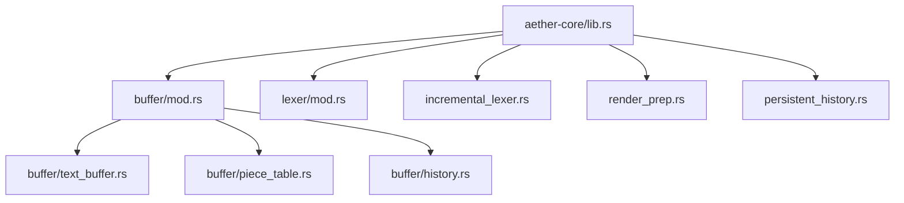
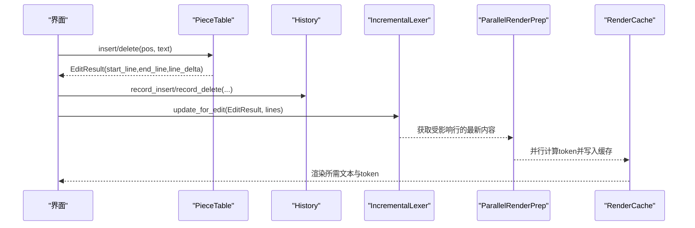
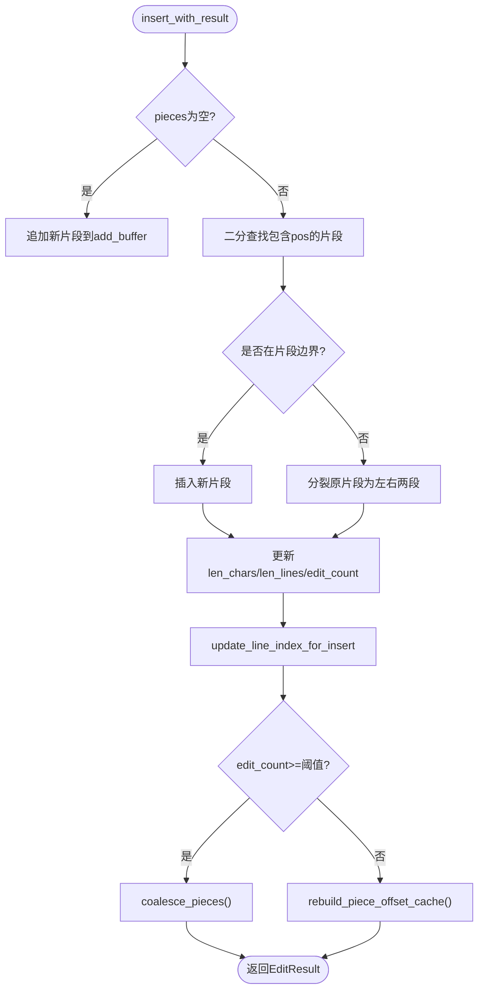
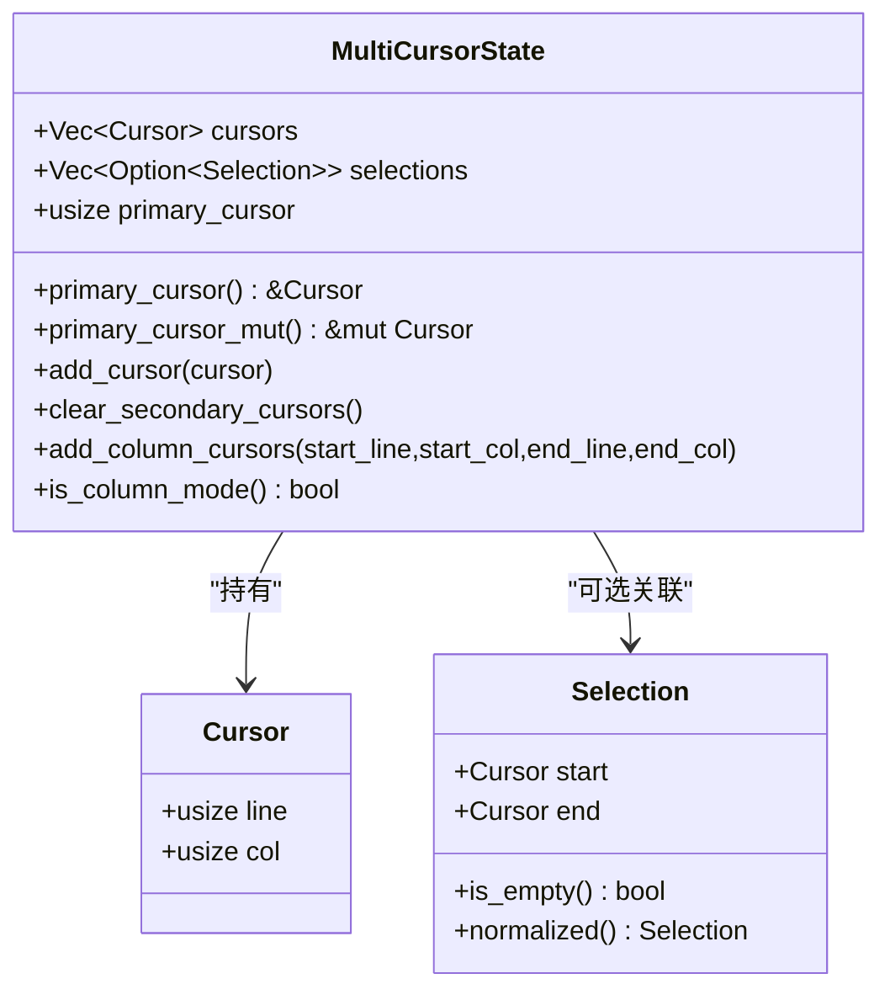
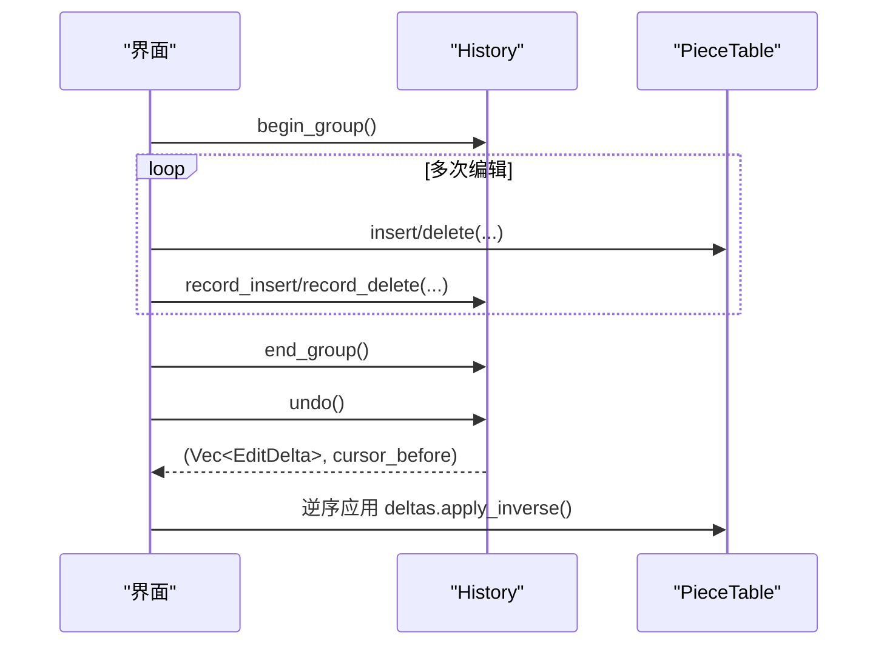
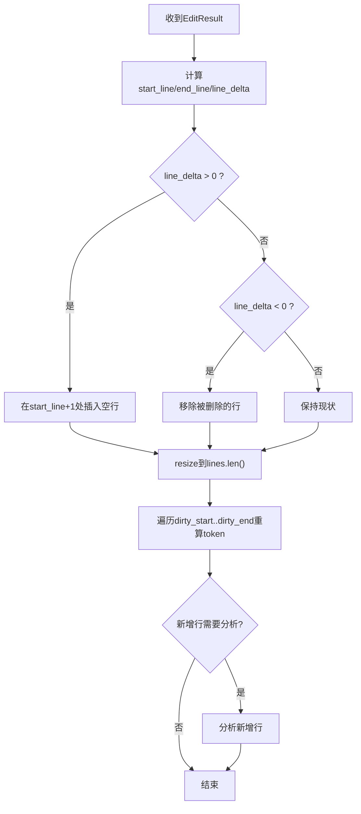
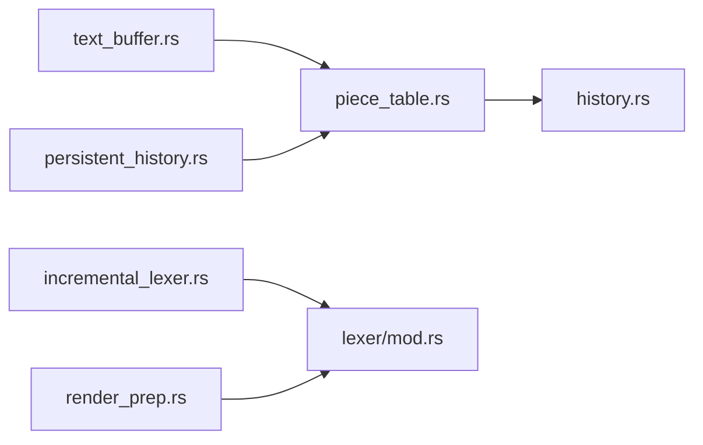

# 高性能文本编辑

<cite>
**本文引用的文件**
- [piece_table.rs](file://crates/aether-core/src/buffer/piece_table.rs)
- [text_buffer.rs](file://crates/aether-core/src/buffer/text_buffer.rs)
- [history.rs](file://crates/aether-core/src/buffer/history.rs)
- [incremental_lexer.rs](file://crates/aether-core/src/incremental_lexer.rs)
- [mod.rs（词法模块）](file://crates/aether-core/src/lexer/mod.rs)
- [persistent_history.rs](file://crates/aether-core/src/persistent_history.rs)
- [render_prep.rs](file://crates/aether-core/src/render_prep.rs)
- [lib.rs（核心库导出）](file://crates/aether-core/src/lib.rs)
</cite>

## 目录
1. [简介](#简介)
2. [项目结构](#项目结构)
3. [核心组件](#核心组件)
4. [架构总览](#架构总览)
5. [详细组件分析](#详细组件分析)
6. [依赖关系分析](#依赖关系分析)
7. [性能考量](#性能考量)
8. [故障排查指南](#故障排查指南)
9. [结论](#结论)
10. [附录：使用示例与API参考](#附录：使用示例与api参考)

## 简介
本文件面向牧羊人编辑器的高性能文本编辑能力，围绕 Piece Table 文本缓冲、多光标与选择区、撤销/重做历史栈、增量词法分析与语法高亮等关键主题，提供从数据结构设计、内存管理策略到实时计算流程的系统化说明，并给出可操作的使用示例路径，帮助读者快速掌握文本操作 API、光标控制与历史记录管理等核心功能。

## 项目结构
本项目将文本编辑核心能力集中在 aether-core 中，采用分层与模块化组织：
- buffer：文本缓冲区抽象与实现（TextBuffer trait、PieceTable、History）
- lexer：通用词法分析接口与各语言实现
- incremental_lexer：基于编辑结果的增量词法缓存与更新
- render_prep：渲染前的并行 token 预处理与可见行缓存
- persistent_history：基于 Arc 共享的持久化版本快照与合并策略

图表来源
- [lib.rs:1-12](file://crates/aether-core/src/lib.rs#L1-L12)
- [mod.rs（buffer）:1-9](file://crates/aether-core/src/buffer/mod.rs#L1-L9)

章节来源
- [lib.rs:1-12](file://crates/aether-core/src/lib.rs#L1-L12)
- [mod.rs（buffer）:1-9](file://crates/aether-core/src/buffer/mod.rs#L1-L9)

## 核心组件
- 文本缓冲抽象与实现
  - TextBuffer trait：统一插入、删除、切片、行号转换、快照创建、状态保存/恢复等接口
  - PieceTable：高性能 Piece Table 实现，支持 O(1) 追加、零拷贝大文件打开、高效行索引与碎片合并
  - MultiCursorState/Selection/Cursor：多光标与选择区模型
- 历史与撤销/重做
  - History：基于差分（Insert/Delete/Replace）的高效撤销/重做，支持连续输入合并与撤销组
  - PersistentHistory/PersistentPieceTable：基于 Arc<Vec<Piece>> 的版本快照，支持时间/大小合并与批量操作
- 增量词法与语法高亮
  - IncrementalLexer/IncrementalLexerManager：按行缓存 token，仅对受影响的行重新分析
  - ParallelRenderPrep/RenderCache：并行预处理可见行 token，减少重复计算
  - Lexer trait 与各语言实现：统一 TokenKind/LexemeSpan 与 Language 分发

章节来源
- [text_buffer.rs:1-171](file://crates/aether-core/src/buffer/text_buffer.rs#L1-L171)
- [piece_table.rs:11-35](file://crates/aether-core/src/buffer/piece_table.rs#L11-L35)
- [history.rs:6-28](file://crates/aether-core/src/buffer/history.rs#L6-L28)
- [persistent_history.rs:7-50](file://crates/aether-core/src/persistent_history.rs#L7-L50)
- [incremental_lexer.rs:1-16](file://crates/aether-core/src/incremental_lexer.rs#L1-L16)
- [render_prep.rs:5-20](file://crates/aether-core/src/render_prep.rs#L5-L20)
- [mod.rs（词法）:1-111](file://crates/aether-core/src/lexer/mod.rs#L1-L111)

## 架构总览
整体数据流：用户输入触发 PieceTable 的 insert/delete，返回 EditResult；History 记录 EditDelta；IncrementalLexer 根据 EditResult 增量更新行级 token；ParallelRenderPrep 并行生成可见行 token；UI 读取 RenderCache 进行绘制。

图表来源
- [piece_table.rs:450-562](file://crates/aether-core/src/buffer/piece_table.rs#L450-L562)
- [history.rs:140-280](file://crates/aether-core/src/buffer/history.rs#L140-L280)
- [incremental_lexer.rs:36-101](file://crates/aether-core/src/incremental_lexer.rs#L36-L101)
- [render_prep.rs:32-60](file://crates/aether-core/src/render_prep.rs#L32-L60)

## 详细组件分析

### Piece Table 文本缓冲
- 数据结构
  - original：Arc<Mmap> 只读原始文件映射，避免大文件加载开销
  - add_buffer：只追加不删除的新增内容缓冲区
  - pieces：有序片段表，每个片段指向 original 或 add_buffer 的字节范围
  - line_index：两级分块行索引，支持 O(块数+块大小) 的平移与插入，降低全量重建成本
  - piece_offset_cache：前缀和缓存，O(1) 获取总字节长度
  - len_chars/len_lines/edit_count/coalesce_threshold：元数据与自动合并阈值
- 内存管理策略
  - 大文件通过内存映射零拷贝打开，is_pristine() 判断是否未编辑，可直接写出
  - add_buffer 预分配容量，减少扩容次数
  - 碎片合并：edit_count 达到阈值后 coalesce_pieces()，减少碎片数量
  - 行索引分块：LineBlock 以 u32 相对偏移存储，基址平移替代全量移动
- 插入/删除性能特点
  - 插入：在末尾追加时 O(1)，中间插入需分裂片段与更新行索引，总体接近 O(log n + k)
  - 删除：跨片段删除会重组片段，行索引平移为局部操作，避免 O(n) 全量移动
  - get_text_bytes：优先零拷贝单片段命中，否则回退拼接

图表来源
- [piece_table.rs:450-562](file://crates/aether-core/src/buffer/piece_table.rs#L450-L562)
- [piece_table.rs:700-741](file://crates/aether-core/src/buffer/piece_table.rs#L700-L741)

章节来源
- [piece_table.rs:11-35](file://crates/aether-core/src/buffer/piece_table.rs#L11-L35)
- [piece_table.rs:73-114](file://crates/aether-core/src/buffer/piece_table.rs#L73-L114)
- [piece_table.rs:174-380](file://crates/aether-core/src/buffer/piece_table.rs#L174-L380)
- [piece_table.rs:450-562](file://crates/aether-core/src/buffer/piece_table.rs#L450-L562)
- [piece_table.rs:700-741](file://crates/aether-core/src/buffer/piece_table.rs#L700-L741)

### 多光标与选择区
- Cursor/Selection：行号与列号表示光标位置，Selection 规范化确保 start <= end
- MultiCursorState：维护多个光标与对应选择区，支持主光标钳位、列选择模式（矩形选区）
- 行为特性
  - add_column_cursors：按行范围生成多个光标，用于列编辑
  - clear_secondary_cursors：清理次要光标，保留主光标及其选择区
  - is_column_mode：检测当前是否处于列选择模式

图表来源
- [text_buffer.rs:83-122](file://crates/aether-core/src/buffer/text_buffer.rs#L83-L122)
- [text_buffer.rs:173-258](file://crates/aether-core/src/buffer/text_buffer.rs#L173-L258)

章节来源
- [text_buffer.rs:83-122](file://crates/aether-core/src/buffer/text_buffer.rs#L83-L122)
- [text_buffer.rs:173-258](file://crates/aether-core/src/buffer/text_buffer.rs#L173-L258)

### 撤销/重做历史栈
- EditDelta：Insert/Delete/Replace 三种操作的差分描述，支持正向与逆向应用
- History：
  - 记录插入/删除/替换，支持连续同位置输入/删除的时间窗口合并（默认 500ms）
  - 撤销组：begin_group/end_group 将多条记录归为一个步骤，undo/redo 原子执行
  - 最大记录数限制，避免无界增长
- PersistentHistory/PersistentPieceTable：
  - 基于 Arc<Vec<Piece>> 的版本快照，不同版本共享 add_buffer 与片段引用
  - 时间/大小合并策略，小编辑在短时间内可合并到当前版本
  - with_batch 批量操作，仅记录一次历史

图表来源
- [history.rs:124-138](file://crates/aether-core/src/buffer/history.rs#L124-L138)
- [history.rs:140-280](file://crates/aether-core/src/buffer/history.rs#L140-L280)
- [history.rs:303-323](file://crates/aether-core/src/buffer/history.rs#L303-L323)
- [persistent_history.rs:240-363](file://crates/aether-core/src/persistent_history.rs#L240-L363)

章节来源
- [history.rs:6-28](file://crates/aether-core/src/buffer/history.rs#L6-L28)
- [history.rs:140-280](file://crates/aether-core/src/buffer/history.rs#L140-L280)
- [history.rs:303-323](file://crates/aether-core/src/buffer/history.rs#L303-L323)
- [persistent_history.rs:7-50](file://crates/aether-core/src/persistent_history.rs#L7-L50)
- [persistent_history.rs:240-363](file://crates/aether-core/src/persistent_history.rs#L240-L363)

### 增量词法分析与语法高亮
- IncrementalLexer：
  - 首次全量 analyze_all(lines) 构建每行 token 缓存
  - update_for_edit(edit_result, lines) 根据 EditResult 调整行数并仅重算受影响行
  - 使用 Vec<Vec<LexemeSpan>> 存储，O(1) 访问行级 token
- IncrementalLexerManager：
  - 管理多文件的增量 lexer，支持 open/close/switch/clear
  - 缓存上限保护，避免长时间运行后无界增长
- ParallelRenderPrep/RenderCache：
  - 并行预处理可见行 token，小行数回退单线程
  - 缓存可见行文本与 token，版本号失效检测

图表来源
- [incremental_lexer.rs:36-101](file://crates/aether-core/src/incremental_lexer.rs#L36-L101)
- [render_prep.rs:32-60](file://crates/aether-core/src/render_prep.rs#L32-L60)

章节来源
- [incremental_lexer.rs:1-16](file://crates/aether-core/src/incremental_lexer.rs#L1-L16)
- [incremental_lexer.rs:36-101](file://crates/aether-core/src/incremental_lexer.rs#L36-L101)
- [render_prep.rs:5-20](file://crates/aether-core/src/render_prep.rs#L5-L20)
- [render_prep.rs:32-60](file://crates/aether-core/src/render_prep.rs#L32-L60)
- [mod.rs（词法）:1-111](file://crates/aether-core/src/lexer/mod.rs#L1-L111)

## 依赖关系分析
- buffer 层依赖：
  - text_buffer.rs 定义抽象与数据结构
  - piece_table.rs 实现具体缓冲，依赖 simd_utils 进行换行符查找
  - history.rs 依赖 piece_table 与 text_buffer 的 EditResult
- 词法层依赖：
  - incremental_lexer.rs 依赖 lexer 模块的语言分发与 LexemeSpan
  - render_prep.rs 依赖 lexer 与 rayon 并行处理
- 持久化历史：
  - persistent_history.rs 依赖 piece_table 的 Piece 与 Arc 共享机制

图表来源
- [text_buffer.rs:1-171](file://crates/aether-core/src/buffer/text_buffer.rs#L1-L171)
- [piece_table.rs:1-35](file://crates/aether-core/src/buffer/piece_table.rs#L1-L35)
- [history.rs:1-28](file://crates/aether-core/src/buffer/history.rs#L1-L28)
- [incremental_lexer.rs:1-16](file://crates/aether-core/src/incremental_lexer.rs#L1-L16)
- [render_prep.rs:1-20](file://crates/aether-core/src/render_prep.rs#L1-L20)
- [persistent_history.rs:1-50](file://crates/aether-core/src/persistent_history.rs#L1-L50)

章节来源
- [text_buffer.rs:1-171](file://crates/aether-core/src/buffer/text_buffer.rs#L1-L171)
- [piece_table.rs:1-35](file://crates/aether-core/src/buffer/piece_table.rs#L1-L35)
- [history.rs:1-28](file://crates/aether-core/src/buffer/history.rs#L1-L28)
- [incremental_lexer.rs:1-16](file://crates/aether-core/src/incremental_lexer.rs#L1-L16)
- [render_prep.rs:1-20](file://crates/aether-core/src/render_prep.rs#L1-L20)
- [persistent_history.rs:1-50](file://crates/aether-core/src/persistent_history.rs#L1-L50)

## 性能考量
- 大文件打开：内存映射零拷贝，避免全量加载
- 插入/删除：碎片化存储减少移动，行索引分块降低平移成本
- 碎片合并：阈值触发合并，平衡碎片数量与编辑性能
- 行索引：u32 相对偏移与基址平移，避免全量重建
- 增量词法：仅重算受影响行，Vec 连续内存布局提升缓存命中率
- 并行渲染：rayon 线程池复用，小行数回退单线程，避免线程创建开销
- 历史合并：时间窗口与大小阈值合并，减少冗余步骤

[本节为通用性能讨论，无需特定文件分析]

## 故障排查指南
- 行索引越界或偏移异常
  - 检查 split_block_at_raw/rebuild_prefix 调用时机
  - 确认 shift_from/shift_from_sub 的 delta 符号与范围正确
- 碎片合并未触发
  - 检查 edit_count 与 coalesce_threshold 配置
  - 确认 insert/delete 后是否调用 rebuild_piece_offset_cache
- 撤销/重做错位
  - 核对 record_insert/record_delete 的 pos 与 deleted_text 一致性
  - 使用 begin_group/end_group 包裹复杂操作，保证原子性
- 增量词法缓存不一致
  - 确认 update_for_edit 的 EditResult 与 lines 同步更新
  - 检查 version 递增与缓存失效逻辑

章节来源
- [piece_table.rs:205-380](file://crates/aether-core/src/buffer/piece_table.rs#L205-L380)
- [history.rs:140-280](file://crates/aether-core/src/buffer/history.rs#L140-L280)
- [incremental_lexer.rs:36-101](file://crates/aether-core/src/incremental_lexer.rs#L36-L101)

## 结论
Piece Table 结合分块行索引与碎片合并，为大文件与高频编辑提供了稳定高效的底层支撑；History 的差分记录与合并策略显著降低了撤销/重做的内存与时间开销；增量词法与并行渲染确保了语法高亮的实时性与可扩展性。通过合理的 API 组合与参数调优，可在大规模代码库中保持流畅的编辑体验。

[本节为总结性内容，无需特定文件分析]

## 附录：使用示例与API参考
- 文本操作 API
  - 插入文本：调用 PieceTable::insert_with_result 或 insert，传入字节位置与文本
  - 删除文本：调用 delete_with_result 或 delete，传入起始与结束字节范围
  - 获取行文本：get_line/get_line_bytes，优先零拷贝路径
  - 获取全部文本：get_all_text 或 write_to（避免中间 String 分配）
- 光标控制
  - 创建/添加光标：MultiCursorState::add_cursor
  - 列选择模式：MultiCursorState::add_column_cursors
  - 主光标访问：primary_cursor/primary_cursor_mut
- 历史记录管理
  - 记录插入/删除：History::record_insert/record_delete
  - 撤销/重做：History::undo/redo，应用 EditDelta 的正向/逆向
  - 撤销组：begin_group/end_group 包裹批量操作
  - 持久化历史：PersistentPieceTable::with_batch 批量操作，自动记录一次历史
- 增量词法与高亮
  - 全量分析：IncrementalLexer::analyze_all
  - 增量更新：IncrementalLexer::update_for_edit，传入 EditResult 与最新 lines
  - 并行预处理：ParallelRenderPrep::prepare_tokens_parallel，获取可见行 token
  - 渲染缓存：RenderCache::update/is_valid，配合版本号失效

章节来源
- [piece_table.rs:450-562](file://crates/aether-core/src/buffer/piece_table.rs#L450-L562)
- [piece_table.rs:710-794](file://crates/aether-core/src/buffer/piece_table.rs#L710-L794)
- [text_buffer.rs:173-258](file://crates/aether-core/src/buffer/text_buffer.rs#L173-L258)
- [history.rs:140-280](file://crates/aether-core/src/buffer/history.rs#L140-L280)
- [persistent_history.rs:240-363](file://crates/aether-core/src/persistent_history.rs#L240-L363)
- [incremental_lexer.rs:28-101](file://crates/aether-core/src/incremental_lexer.rs#L28-L101)
- [render_prep.rs:32-60](file://crates/aether-core/src/render_prep.rs#L32-L60)