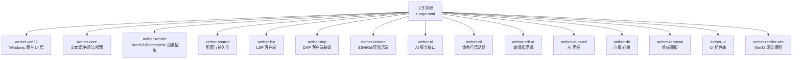
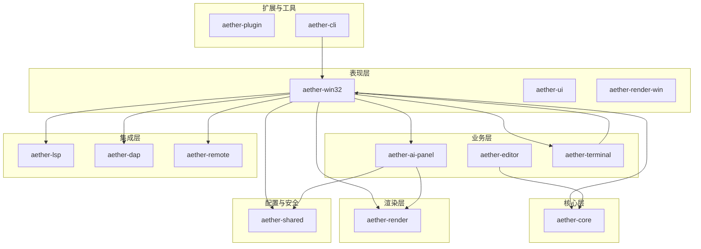
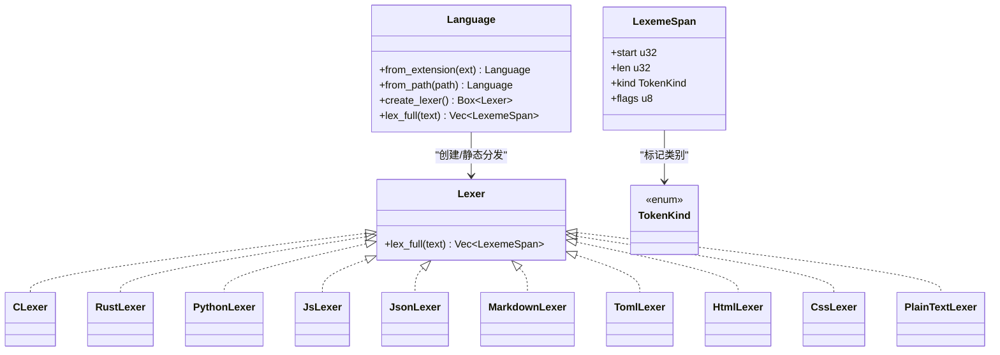
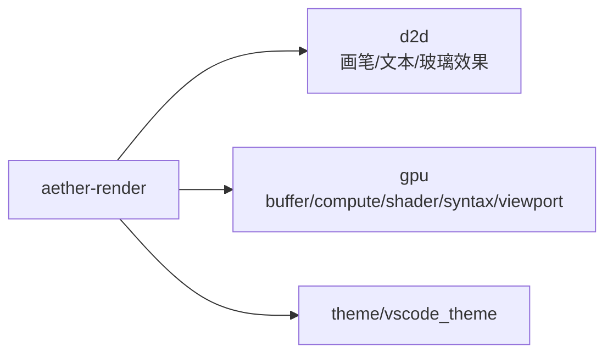
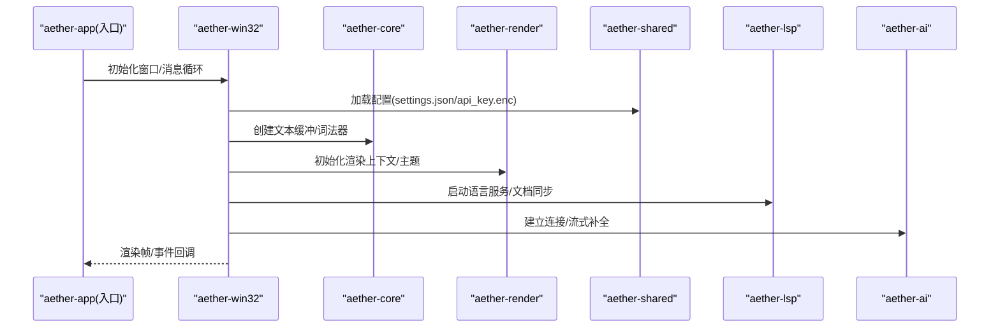
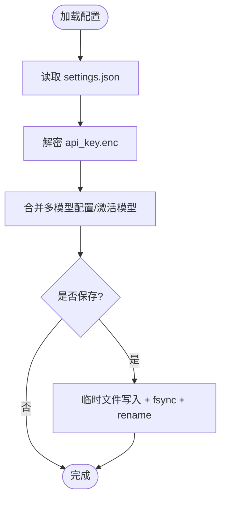
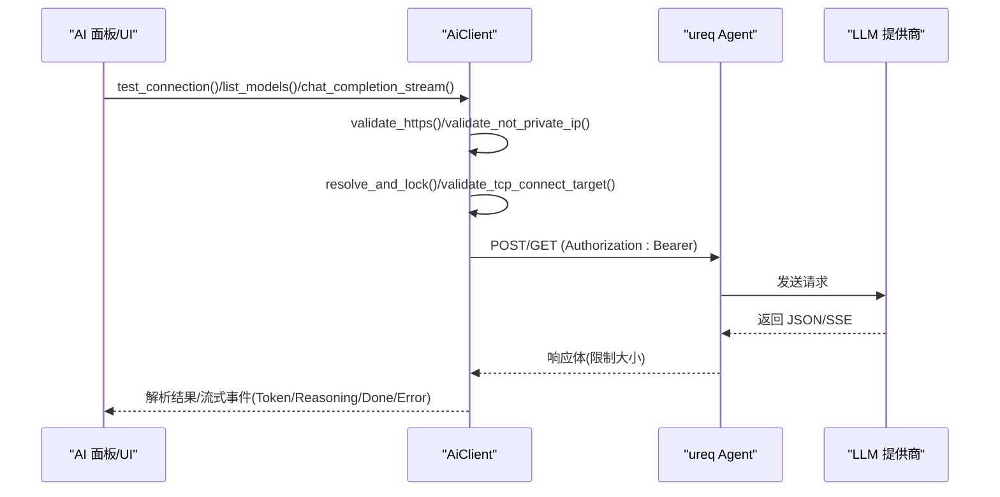
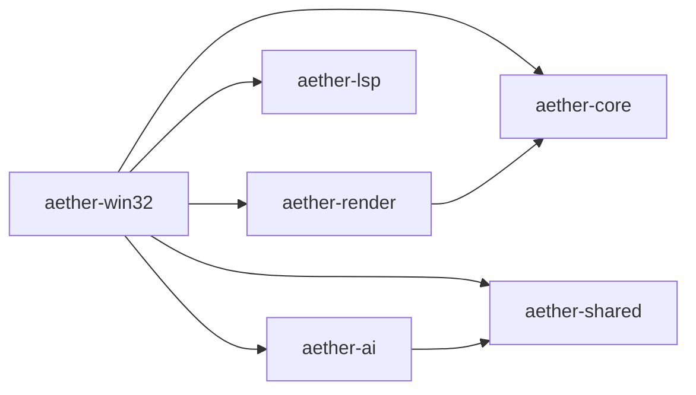

# 项目概述

<cite>
**本文引用的文件**
- [README.md](file://README.md)
- [Cargo.toml](file://Cargo.toml)
- [aether-win32/Cargo.toml](file://crates/aether-win32/Cargo.toml)
- [aether-core/src/lib.rs](file://crates/aether-core/src/lib.rs)
- [aether-core/src/lexer/mod.rs](file://crates/aether-core/src/lexer/mod.rs)
- [aether-core/src/buffer/mod.rs](file://crates/aether-core/src/buffer/mod.rs)
- [aether-render/src/lib.rs](file://crates/aether-render/src/lib.rs)
- [aether-render/src/gpu/mod.rs](file://crates/aether-render/src/gpu/mod.rs)
- [aether-shared/src/lib.rs](file://crates/aether-shared/src/lib.rs)
- [aether-shared/src/settings.rs](file://crates/aether-shared/src/settings.rs)
- [aether-ai/src/lib.rs](file://crates/aether-ai/src/lib.rs)
</cite>

## 目录
1. [简介](#简介)
2. [项目结构](#项目结构)
3. [核心组件](#核心组件)
4. [架构总览](#架构总览)
5. [详细组件分析](#详细组件分析)
6. [依赖关系分析](#依赖关系分析)
7. [性能考量](#性能考量)
8. [故障排查指南](#故障排查指南)
9. [结论](#结论)
10. [附录：快速开始与使用示例](#附录快速开始与使用示例)

## 简介
Aether Studio（牧羊人编辑器）是一款基于 Rust 与 Win32 API 构建的现代化代码编辑器，面向 Windows 平台提供原生体验。项目以高性能文本编辑、AI 辅助编程、自绘渲染引擎、LSP/DAP 集成、远程开发与插件体系为核心目标，致力于在“轻量简洁”和“强大能力”之间取得平衡，覆盖编辑-构建-调试的核心工作流。

- 产品定位：原生 Windows 的高性能代码编辑器，强调低延迟、高吞吐与可扩展性。
- 关键特性：
  - 原生 Windows 体验：Win32 窗口 + DWM 沉浸式深色模式、高 DPI 与系统高对比度支持。
  - 自绘渲染：Direct2D / DirectWrite 渲染管线，主题、半透明背景、阴影、动画与脏矩形优化。
  - 高性能文本编辑：Piece Table 缓冲、多光标、撤销/重做历史栈、语法高亮、查找替换、自动缩进。
  - AI 集成：HTTP 大模型交互（DeepSeek/Kimi/自定义），内联建议、代码解释与改写、Agent 工具结果回喂。
  - 语言服务：LSP 客户端（文档同步、语义 token、增量同步）、DAP 客户端基础。
  - 其他：Markdown 预览、图片预览、多语言词法分析器、文件树与工作区、终端面板（ConPTY）、插件系统、输入法支持、命令行工具。

**章节来源**
- [README.md:40-66](file://README.md#L40-L66)
- [README.md:213-238](file://README.md#L213-L238)

## 项目结构
仓库采用 Cargo Workspace 组织，按职责拆分为多个 Crate，形成清晰的模块化架构。顶层工作区定义了成员 crate 与发布配置；各子 crate 通过相对路径相互依赖，边界清晰。

**图表来源**
- [Cargo.toml:1-19](file://Cargo.toml#L1-L19)

**章节来源**
- [Cargo.toml:1-19](file://Cargo.toml#L1-L19)
- [README.md:162-178](file://README.md#L162-L178)

## 核心组件
- aether-core：编辑器内核，包含文本缓冲（Piece Table）、历史栈、词法分析器框架、工作区数据结构与搜索。
- aether-render：渲染抽象层，封装 Direct2D/DirectWrite 绘制、主题系统与画笔缓存，并提供 GPU 加速相关模块。
- aether-win32：Windows 原生 UI 层，负责窗口、消息循环、菜单、布局、事件处理与应用入口。
- aether-shared：共享配置与持久化，包括 UI/AI/远程/自动保存等设置，以及安全加密的 API Key 管理。
- aether-lsp：语言服务器协议客户端，实现文档同步、语义 token、增量同步等。
- aether-dap：调试适配器协议客户端基础，提供类型、传输、会话与客户端抽象。
- aether-remote：远程开发抽象，涵盖 SSH、Git、容器与远程文件系统。
- aether-ai：AI 服务接口与请求处理，支持 OpenAI 兼容接口、流式响应与安全校验。
- aether-cli：命令行工具，用于启动 GUI、打开文件或定位行列。
- aether-editor/aether-ui/aether-ai-panel/aether-terminal/aether-render-win：分别承载编辑器逻辑、通用 UI 组件、AI 面板、终端与 Win32 渲染适配。

**章节来源**
- [README.md:162-178](file://README.md#L162-L178)
- [aether-core/src/lib.rs:1-12](file://crates/aether-core/src/lib.rs#L1-L12)
- [aether-render/src/lib.rs:1-5](file://crates/aether-render/src/lib.rs#L1-L5)
- [aether-win32/src/lib.rs:1-58](file://crates/aether-win32/src/lib.rs#L1-L58)
- [aether-shared/src/lib.rs:1-3](file://crates/aether-shared/src/lib.rs#L1-L3)

## 架构总览
整体架构遵循“分层+模块化”的设计：
- 表现层（aether-win32/aether-ui/aether-render-win）：窗口、消息、布局、渲染适配。
- 业务层（aether-editor/aether-ai-panel/aether-terminal）：编辑器状态、AI 面板、终端交互。
- 核心层（aether-core）：文本缓冲、词法分析、搜索、工作区数据。
- 渲染层（aether-render）：Direct2D/DirectWrite 抽象与 GPU 加速。
- 集成层（aether-lsp/aether-dap/aether-remote）：语言服务、调试、远程开发。
- 配置与安全（aether-shared）：设置加载、持久化、API Key 加密。
- 扩展与工具（aether-plugin/aether-cli）：插件运行时与命令行入口。

**图表来源**
- [aether-win32/Cargo.toml:14-23](file://crates/aether-win32/Cargo.toml#L14-L23)
- [aether-render/src/lib.rs:1-5](file://crates/aether-render/src/lib.rs#L1-L5)
- [aether-core/src/lib.rs:1-12](file://crates/aether-core/src/lib.rs#L1-L12)
- [aether-shared/src/lib.rs:1-3](file://crates/aether-shared/src/lib.rs#L1-L3)

## 详细组件分析

### aether-core：文本缓冲与词法分析
- 文本缓冲：基于 Piece Table 的高效可编辑缓冲区，支持多光标、选择区与撤销/重做历史栈。
- 词法分析：统一 Lexer trait 与 TokenKind，内置多种语言词法器（C/Rust/Python/JS/JSON/TOML/HTML/Markdown/CSS），并支持按扩展名或路径检测语言。
- 搜索与预处理：提供全文搜索与渲染前准备工具。

**图表来源**
- [aether-core/src/lexer/mod.rs:1-68](file://crates/aether-core/src/lexer/mod.rs#L1-L68)
- [aether-core/src/lexer/mod.rs:94-196](file://crates/aether-core/src/lexer/mod.rs#L94-L196)

**章节来源**
- [aether-core/src/lib.rs:1-12](file://crates/aether-core/src/lib.rs#L1-L12)
- [aether-core/src/lexer/mod.rs:1-68](file://crates/aether-core/src/lexer/mod.rs#L1-L68)
- [aether-core/src/lexer/mod.rs:94-196](file://crates/aether-core/src/lexer/mod.rs#L94-L196)
- [aether-core/src/buffer/mod.rs:1-9](file://crates/aether-core/src/buffer/mod.rs#L1-L9)

### aether-render：渲染抽象与 GPU 加速
- 渲染抽象：封装 Direct2D/DirectWrite 绘制、主题系统与画笔缓存，提供跨平台的渲染接口。
- GPU 模块：包含 buffer、compute_context、shader、syntax、viewport 等，用于高性能文本渲染与着色器计算。

**图表来源**
- [aether-render/src/lib.rs:1-5](file://crates/aether-render/src/lib.rs#L1-L5)
- [aether-render/src/gpu/mod.rs:1-10](file://crates/aether-render/src/gpu/mod.rs#L1-L10)

**章节来源**
- [aether-render/src/lib.rs:1-5](file://crates/aether-render/src/lib.rs#L1-L5)
- [aether-render/src/gpu/mod.rs:1-10](file://crates/aether-render/src/gpu/mod.rs#L1-L10)

### aether-win32：Windows 原生 UI 层
- 职责：窗口创建、消息循环、菜单、布局、事件处理、应用入口；集成终端、AI 面板、文件树、标签页、设置等。
- 依赖：aether-core、aether-render、aether-ai、aether-shared、aether-lsp、aether-ai-panel、aether-terminal、aether-ui 等。

**图表来源**
- [aether-win32/Cargo.toml:14-23](file://crates/aether-win32/Cargo.toml#L14-L23)
- [aether-shared/src/settings.rs:368-559](file://crates/aether-shared/src/settings.rs#L368-L559)
- [aether-ai/src/lib.rs:259-320](file://crates/aether-ai/src/lib.rs#L259-L320)

**章节来源**
- [aether-win32/src/lib.rs:1-58](file://crates/aether-win32/src/lib.rs#L1-L58)
- [aether-win32/Cargo.toml:14-23](file://crates/aether-win32/Cargo.toml#L14-L23)

### aether-shared：配置与持久化
- 配置项：UI、AI、远程、自动保存、更新策略等。
- 安全：API Key 不写入 settings.json，使用 DPAPI 加密单独存储；支持多模型档案与激活模型切换。
- 原子写入：临时文件 + fsync + rename 保证配置完整性。

**图表来源**
- [aether-shared/src/settings.rs:368-559](file://crates/aether-shared/src/settings.rs#L368-L559)

**章节来源**
- [aether-shared/src/lib.rs:1-3](file://crates/aether-shared/src/lib.rs#L1-L3)
- [aether-shared/src/settings.rs:368-559](file://crates/aether-shared/src/settings.rs#L368-L559)

### aether-ai：AI 服务与安全
- 功能：OpenAI 兼容接口（chat/completions）、流式响应、模型列表获取、连接测试。
- 安全：HTTPS 强制、私有 IP/云元数据黑名单、DNS TOCTOU 二次校验、响应体大小限制、错误信息脱敏。
- 配置：支持 DeepSeek/Kimi/自定义，thinking 模式与采样参数控制。

**图表来源**
- [aether-ai/src/lib.rs:259-320](file://crates/aether-ai/src/lib.rs#L259-L320)
- [aether-ai/src/lib.rs:322-392](file://crates/aether-ai/src/lib.rs#L322-L392)
- [aether-ai/src/lib.rs:572-710](file://crates/aether-ai/src/lib.rs#L572-L710)
- [aether-ai/src/lib.rs:712-800](file://crates/aether-ai/src/lib.rs#L712-L800)

**章节来源**
- [aether-ai/src/lib.rs:259-320](file://crates/aether-ai/src/lib.rs#L259-L320)
- [aether-ai/src/lib.rs:322-392](file://crates/aether-ai/src/lib.rs#L322-L392)
- [aether-ai/src/lib.rs:572-710](file://crates/aether-ai/src/lib.rs#L572-L710)
- [aether-ai/src/lib.rs:712-800](file://crates/aether-ai/src/lib.rs#L712-L800)

## 依赖关系分析
- 工作区成员：通过 workspace members 声明所有 crate，统一版本与发行配置。
- 主要依赖：
  - aether-win32 依赖 core/render/ai/shared/lsp/ai-panel/terminal/ui 等，承担集成与编排职责。
  - aether-render 依赖 core 与 Windows Graphics API，提供渲染抽象。
  - aether-core 依赖内存映射、正则、并行计算等，保障高性能。
  - aether-shared 提供配置与持久化，被上层广泛使用。
  - aether-ai 依赖 ureq、serde_json、url 等，实现网络与安全校验。

**图表来源**
- [Cargo.toml:1-19](file://Cargo.toml#L1-L19)
- [aether-win32/Cargo.toml:14-23](file://crates/aether-win32/Cargo.toml#L14-L23)
- [aether-render/Cargo.toml:6-11](file://crates/aether-render/Cargo.toml#L6-L11)
- [aether-core/Cargo.toml:6-13](file://crates/aether-core/Cargo.toml#L6-L13)
- [aether-ai/src/lib.rs:1-6](file://crates/aether-ai/src/lib.rs#L1-L6)

**章节来源**
- [Cargo.toml:1-19](file://Cargo.toml#L1-L19)
- [aether-win32/Cargo.toml:14-23](file://crates/aether-win32/Cargo.toml#L14-L23)
- [aether-render/Cargo.toml:6-11](file://crates/aether-render/Cargo.toml#L6-L11)
- [aether-core/Cargo.toml:6-13](file://crates/aether-core/Cargo.toml#L6-L13)

## 性能考量
- 文本编辑：Piece Table 缓冲减少复制与重排开销，支持大规模文本高效编辑。
- 词法分析：静态分发与紧凑数据结构（LexemeSpan 压缩至 12B），提升扫描速度；基准显示 ~500–650 MiB/s。
- 渲染优化：Direct2D/DirectWrite 结合 GPU 加速、脏矩形与主题缓存，降低重绘成本。
- 配置持久化：原子写入避免损坏，减少 IO 风险。
- 网络请求：限制响应体大小、禁用自动重定向、严格 DNS/IP 校验，防止资源滥用与 SSRF。

[本节为通用性能讨论，不直接分析具体文件]

## 故障排查指南
- 配置损坏：settings.json 解析失败会记录警告并备份原文件，避免丢失用户设置。
- API Key 问题：若为空或未正确解密，AI 请求将返回配置错误；检查 api_key.enc 与多模型配置。
- 网络连接：HTTPS 强制、私有 IP/云元数据黑名单拦截；如出现 429/503，可启用指数退避重试。
- 渲染异常：确认 Direct2D/DirectWrite 可用，检查主题与 DPI 缩放设置。
- 终端问题：ConPTY 子进程需确保权限与环境变量正确。

**章节来源**
- [aether-shared/src/settings.rs:389-453](file://crates/aether-shared/src/settings.rs#L389-L453)
- [aether-ai/src/lib.rs:110-163](file://crates/aether-ai/src/lib.rs#L110-L163)
- [aether-ai/src/lib.rs:394-456](file://crates/aether-ai/src/lib.rs#L394-L456)

## 结论
Aether Studio 通过模块化 Crate 架构与分层设计，实现了高性能文本编辑、AI 辅助编程与原生 Windows 体验的统一。core 层保障编辑与词法的极致性能，render 层提供高效的可视化能力，win32 层整合 UI 与事件，shared 层确保配置安全与持久化，ai/lsp/dap/remote 层拓展了现代开发所需的能力。项目兼顾初学者友好与专家级定制，适合在 Windows 平台上进行高效编码与智能协作。

[本节为总结性内容，不直接分析具体文件]

## 附录：快速开始与使用示例
- 环境要求：
  - Windows 10 1809+（推荐 Windows 11）
  - Rust stable 工具链（见 rust-toolchain.toml）
  - Visual Studio 2022（或 Windows SDK 构建工具）
  - 目标平台：x86_64-pc-windows-msvc
- 构建步骤：
  - 调试构建：cargo build -p aether-win32 --bin aether-app
  - 发布构建：cargo build -p aether-win32 --bin aether-app --release
  - 命令行工具：cargo build -p aether-cli --bin aether
- 运行方式：
  - 启动 GUI：cargo run -p aether-win32 --bin aether-app
  - 打开文件：cargo run -p aether-cli --bin aether -- path/to/file.rs
  - 定位行列：cargo run -p aether-cli --bin aether -- file.txt:10:5
- 测试与质量：
  - 单元测试：cargo test --workspace --no-fail-fast
  - 静态分析：cargo clippy --workspace --all-targets -- -D warnings
  - 格式化检查：cargo fmt --all -- --check
  - GUI 冒烟测试：cargo build --release -p aether-win32 && python tests/gui_smoke.py
  - 覆盖率收集：powershell -File tests/tools/coverage.ps1

**章节来源**
- [README.md:85-125](file://README.md#L85-L125)
- [README.md:258-298](file://README.md#L258-L298)
- [README.md:127-159](file://README.md#L127-L159)
- [README.md:300-333](file://README.md#L300-L333)